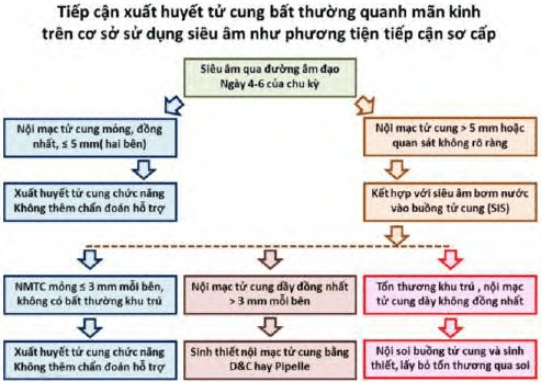
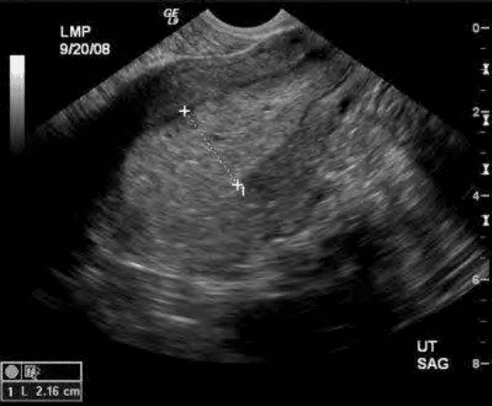
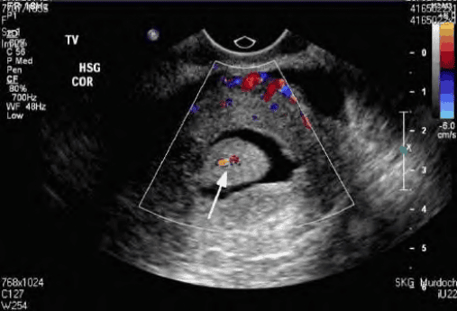

Xuất huyết tử cung bất thường ở độ tuổi quanh mãn kinh có thể là xuất huyết cơ năng nhưng cũng có thể xuất phát từ các nguyên nhân thực thể hoặc biểu hiện của tình trạng ác tính. Việc đánh giá kịp thời và chính xác giúp loại trừ ung thư hoặc tăng sinh nội mạc tử cung, đồng thời giảm lo lắng cho người bệnh và có hướng điều trị phù hợp.

## Hệ trục hạ đồi-yên-buồng trứng

Giai đoạn quanh mãn kinh (perimenopause) thường kéo dài từ cuối 40 đến đầu 50 tuổi, là thời điểm chuyển tiếp giữa giai đoạn sinh sản và mãn kinh. Đặc trưng chính của hệ trục HPG (hạ đồi–tuyến yên–buồng trứng) lúc này là suy giảm trữ lượng nang noãn và mất dần sự ức chế tầng trên.

1. **Suy giảm dự trữ buồng trứng**

   - Số lượng noãn nang giảm, thể hiện qua AMH (anti-Müllerian hormone) và Inhibin B thấp.
   - AMH thấp dẫn đến giảm số nang noãn thứ cấp được chiêu mộ, Inhibin B giảm làm mất ức chế âm tính lên tuyến yên.

2. **Tăng tiết FSH**

   - Không còn ức chế bởi Inhibin B, tuyến yên tăng sản xuất FSH.
   - Tuy nhiên, FSH vẫn còn chịu phần nào phản hồi âm tính từ estrogen còn sót lại.

3. **Rút ngắn chu kỳ kinh sớm (Early Perimenopause)**

   - FSH cao thúc đẩy nang thứ cấp phát triển sớm, làm rút ngắn pha noãn.
   - Phóng noãn và hoàng thể vẫn còn bảo tồn, nên vẫn có kinh định kỳ nhưng chu kỳ ngày càng ngắn hơn.

4. **Mất đỉnh LH và chu kỳ không phóng noãn (Late Perimenopause)**

   - LH căn bản tăng dần, biên độ đỉnh LH thu hẹp, cuối cùng đỉnh LH mất khả năng kích phóng noãn.
   - Xuất hiện chu kỳ không phóng noãn với estrogen đơn độc và vắng mặt progesterone → nội mạc phát triển nhưng không phân tiết, bong tróc không đều, gây chảy máu bất thường.
   - Khoảng cách giữa hai lần hành kinh giãn dài khi nội mạc không bị sụp đổ hoàn toàn, hoặc xuất hiện dưới dạng spotting, rong kinh, rong huyết.

5. **Nguy cơ tăng sinh/nội mạc và ung thư**

   - Estrogen đơn độc kéo dài mà không có progesterone đối kháng làm tăng nguy cơ tăng sinh nội mạc (hyperplasia) và quá sản (atrophic endometrium có thay đổi kèm).
   - Ở giai đoạn sau, rong huyết khó kiểm soát có thể báo hiệu tăng sinh nội mạc điển hình, loạn sản hoặc ung thư nội mạc.

## Biểu hiện

- **Chu kỳ ngắn hơn**: Giai đoạn đầu của perimenopause, chu kỳ rút ngắn nhưng vẫn đều, không thay đổi tính chất máu.
- **Spotting/Rong kinh nhẹ**: Giai đoạn giữa, khi nội mạc không bong tróc hoàn toàn. Xuất huyết ít, thường thoáng qua giữa các chu kỳ.
- **Chu kỳ thưa thớt, có lúc vô kinh**: Khi nang noãn phát triển ngay đầu chu kỳ mới, estrogen duy trì lớp nội mạc, không có giảm đột ngột → không hành kinh dù vẫn có phóng noãn. Khi nào có pha tụt steroid mới xuất huyết, nhưng không định kỳ.
- **Rong huyết nặng**: Giai đoạn muộn, chu kỳ không phóng noãn hoàn toàn, nội mạc tiếp xúc estrogen đơn độc → bong tróc rời rạc hoặc ồ ạt, gây rong huyết liên tục.
- **Xuất huyết không tự giới hạn**: Cần lưu ý nguy cơ tăng sinh nội mạc, loạn sản hoặc ung thư, thường gặp rong huyết kéo dài, kèm đau bụng dưới, rối loạn đại tiểu tiện.

:::caution
Xuất huyết bất thường ở phụ nữ quanh mãn kinh không chỉ do rối loạn phóng noãn. U xơ tử cung, polyp, viêm nội mạc, ung thư là các nguyên nhân thực thể cần được loại trừ. Các yếu tố toàn thân (tăng huyết áp, đái tháo đường, béo phì) làm tăng chuyển hóa estrogen ngoại sinh và nội sinh, góp phần vào cơ chế tăng sinh nội mạc.
:::

## Nguyên nhân

1. **Nguyên nhân cơ năng do rối loạn nội tiết (đồng bộ estrogen–progesterone)**

   - Giai đoạn trung gian: Chu kỳ chồng lấn, bong tróc nội mạc không hoàn toàn → spotting hoặc rong kinh nhẹ.
   - Giai đoạn muộn: Mất hoàn toàn progesterone trong chu kỳ không phóng noãn → bong tróc rời rạc, rong huyết.

2. **Nguyên nhân thực thể liên quan đến tình trạng nội tiết mất cân bằng**

   - Tăng sinh nội mạc (simple/complex hyperplasia, không có hoặc có loạn sản).
   - U leiomyoma (u xơ tử cung) hoặc polyp tử cung được kích thích bởi estrogen tăng.
   - U nang buồng trứng sản xuất estrogen (hiếm ở tuổi này nhưng có thể xảy ra).

3. **Nguyên nhân thực thể không liên quan trực tiếp đến chu kỳ buồng trứng**

   - Polyp nội mạc tử cung, u xơ trong lòng tử cung, viêm mạn nội mạc tử cung.
   - Ung thư cổ tử cung hoặc ung thư âm đạo (ít gặp ở nhóm tuổi này nhưng vẫn cần loại trừ).
   - Bệnh lý cổ tử cung lành tính (vết loét, viêm cổ tử cung chảy máu).

4. **Yếu tố toàn thân góp phần**

   - Tăng huyết áp, đái tháo đường, béo phì: Tác động gián tiếp lên chuyển hóa estrogen (estrone từ mô mỡ ngoại vi) và độ nhạy của nội mạc.
   - Thuốc (tamoxifen, hormone trị liệu thay thế không phối hợp đúng liều progesterone...) có thể làm tăng nguy cơ xuất huyết.

## Tiếp cận

_Lưu đồ tiếp cận xuất huyết tử cung bất thường quanh mãn kinh._

### Bệnh sử

- Tuổi mãn kinh dự kiến, tiền sử chu kỳ trước đó (độ dài, tính chất, lượng máu).
- Triệu chứng đi kèm: đau bụng dưới, rối loạn tiểu tiện, thay đổi cân nặng, bứt rứt, khó ngủ (các dấu hiệu tiền mãn kinh).
- Tiền sử bệnh lý: Tăng huyết áp, đái tháo đường, béo phì, rối loạn đông máu, dùng tamoxifen hoặc liệu pháp hormone thay thế.
- Khám tổng quát: đánh giá tình trạng mất máu (da niêm nhợt, mệt, choáng váng), dấu hiệu tăng sản androgen (nếu nghi PCOS muộn).
- Khám phụ khoa: Kiểm tra lâm sàng tử cung (kích thước, hình dạng), buồng trứng qua siêu âm (nếu cần). Khám cổ tử cung (Pap smear/nội soi cổ tử cung nếu chỉ định).

### Lâm sàng

Trước khi chẩn đoán xuất huyết tử cung cơ năng, cần loại trừ:

- **Thai kỳ**: Luôn xét nghiệm β-hCG cho phụ nữ độ tuổi sinh sản, dù khả năng có thai quanh mãn kinh thấp (< 1%).
- **Nguyên nhân tại tử cung**:

  - U xơ tử cung, polyp nội mạc, viêm nội mạc tử cung, dính buồng tử cung.
  - Dị dạng bẩm sinh hiếm gặp (hội chứng Asherman...).

- **Nguyên nhân tại cổ tử cung–âm đạo**:

  - Viêm cổ tử cung mạn, loạn sản hay ung thư biểu mô cổ tử cung, lạc nội mạc cổ tử cung.

- **Nguyên nhân từ các cơ quan lận cận**:

  - Xuất huyết đường tiết niệu (thận, bàng quang), tiêu hóa (trực tràng) chảy xuống âm đạo giả.
  - Chấn thương vùng chậu, sa tạng, tổn thương âm hộ.

### Cận lâm sàng

#### Chẩn đoán hình ảnh

- Thời điểm tối ưu: Ngay sau sạch kinh để đo độ dày nội mạc mỏng nhất (thông thường < 4–5 mm).
- Đặc điểm cần ghi nhận:

  - Độ dày nội mạc: ≥ 5 mm ở phụ nữ quanh mãn kinh cần đánh giá thêm.
  - Hình thái nội mạc: đều mỏng, lòng tử cung không có khối, không có kẽ tăng tín hiệu nhấp nhô.
  - Tổn thương khu trú: Polyp (có cuống), u xơ dưới niêm mạc, nang buồng trứng sản xuất estrogen.

    

    _Tăng sinh nội mạc tử cung: Nội mạc dày 21.6 mm đầu chu kỳ là bất thường. Không thể chẩn đoán cơ năng khi có hình ảnh này._

  - **Siêu âm bơm nước (SIS)** nếu nghi polyp hoặc dính buồng tử cung: Bơm nước làm nổi bật khối, giúp xác định vị trí và kích thước tổn thương.

    

    _Siêu âm bơm nước buồng tử cung (SIS): Phát hiện polyp lòng tử cung. Khi có tổn thương khu trú như này, không thể chẩn đoán xuất huyết cơ năng._

  :::caution
  Hình ảnh siêu âm phụ thuộc vào pha chu kỳ. Thực hiện sau sạch kinh giúp tránh nhầm tăng sinh nội mạc giả do nội mạc phát triển dưới estrogen giai đoạn giữa chu kỳ.
  :::

#### Sinh thiết nội mạc tử cung

- **Chỉ định**:

  - Phụ nữ ≥ 35 tuổi có xuất huyết bất thường.
  - Bất kỳ phụ nữ nào có yếu tố nguy cơ ung thư nội mạc (tăng huyết áp, đái tháo đường, béo phì, tiền sử tăng sinh nội mạc).
  - Nội mạc dày ≥ 5 mm trên siêu âm (hoặc ≥ 4 mm nếu có tamoxifen).

- **Phương pháp**:

  - **Pipelle® biopsy** (tiêu chuẩn): Nhanh, không cần gây mê, thực hiện tại phòng khám.
  - **Nong và nạo (D&C)**: Khi Pipelle không lấy đủ mẫu, hoặc nghi ngờ nốt tăng sinh khu trú.

- **Hạn chế**:

  - Khả năng bỏ sót tổn thương khu trú lên đến 30% nếu diện tích bất thường < 5% buồng tử cung.
  - Kết quả âm tính giả có thể xảy ra, cần nội soi nếu vẫn có nghi ngờ.

#### Nội soi buồng tử cung

- **Chỉ định**:

  - Kết quả sinh thiết mù không phù hợp với cận lâm sàng/ lâm sàng.
  - Nghi ngờ polyp, u xơ dưới niêm mạc, dính buồng tử cung mà siêu âm không rõ ràng.

- **Ưu điểm**: Quan sát trực tiếp nội mạc, lấy mẫu tổn thương khu trú hoặc cắt bỏ polyp/u xơ dưới nội soi.
- **Nhược điểm**: Cần trang thiết bị chuyên dụng, bác sĩ có kinh nghiệm và thường phải thực hiện trong phòng mổ hoặc phòng thủ thuật có gây mê/ gây tê.

## Điều trị

### Nguyên tắc

Việc quyết định điều trị phụ thuộc vào:

- **Mức độ nặng của xuất huyết** (mất máu cấp hay mạn, ảnh hưởng sinh hoạt).
- **Kết quả loại trừ nguyên nhân thực thể/ ác tính**.
- **Tình trạng buồng trứng** (còn hoạt động hay đã chuyển sang chu kỳ hoàn toàn không phóng noãn).
- **Yêu cầu sinh đẻ** (ở giai đoạn này đa phần đã không có nhu cầu hoặc đã hoàn thành).

### Xuất huyết nặng cấp tính

- **Nạo buồng tử cung (D&C)**: Cầm máu nhanh, lấy mẫu mô để làm giải phẫu bệnh.
- Đồng thời bù dịch, truyền máu/các chế phẩm máu nếu cần thiết (Hb < 7–8 g/dL hoặc mất máu cấp).
- Sau khi ổn định, xem xét kết quả sinh thiết để hướng điều trị tiếp theo.

### Xuất huyết vừa phải–nhẹ, đã loại trừ ác tính

- **Liệu pháp progestogen**:

  - Ưu tiên progestin có hoạt tính kháng estrogen mạnh, ít ức chế trục HPG (ví dụ: Medroxyprogesterone acetate, Dydrogesterone, hoặc Levonorgestrel IUD).
  - Liều tham khảo:

    - Medroxyprogesterone acetate 10–20 mg/ngày (ngày 5–25 chu kỳ), hoặc
    - Dydrogesterone 10 mg × 2/ngày trong 10–14 ngày.
    - Levonorgestrel intrauterine device (LNG-IUD) phóng thích 20 µg/ngày có thể dùng để điều trị dài hạn, vừa cầm máu vừa ngừa tăng sinh nội mạc.

- **Liệu pháp phối hợp estrogen–progestogen (COC)**:

  - Dùng 21 ngày liên tục (Ethinyl estradiol 30 µg + Levonorgestrel 150 µg), sau đó nghỉ 7 ngày.
  - Ưu tiên ngắn hạn, không khuyến cáo dùng lâu dài ở quanh mãn kinh vì ức chế trục mạnh.

- **Theo dõi sau điều trị**:

  - Lịch kinh (menstrual calendar), cân nặng, huyết áp, xét nghiệm định kỳ (nếu dùng IUD cần khám siêu âm kiểm tra vị trí).
  - Đánh giá lại độ dày nội mạc sau 3–6 tháng, nếu vẫn > 5 mm hoặc tái xuất huyết, cần làm lại sinh thiết.

### Ngoại khoa (xâm lấn tối thiểu)

- **Cắt đốt nội mạc tử cung (Endometrial ablation)**:

  - Thực hiện qua soi buồng tử cung, làm tiêu hủy lớp nội mạc tận gốc.
  - Giải pháp hiệu quả cho bệnh nhân không có nhu cầu sinh thêm, muốn tránh phẫu thuật kéo dài.
  - Hạn chế: Không áp dụng cho người nghi ngờ tăng sinh nội mạc hoặc ung thư.

- **Cắt tử cung (Hysterectomy)**:

  - Điều trị bảo tồn thất bại (tái xuất huyết, tăng sinh/loạn sản nội mạc).
  - Có kèm bệnh lý thực thể nặng (u xơ lớn, polyp tái phát, lạc nội mạc tử cung nặng...).

- Phương pháp: Mổ mở, mổ nội soi hoặc mổ robotic tùy tình trạng và kỹ thuật của cơ sở.

### Theo dõi sau điều trị

- Sau điều trị, kiểm tra độ dày nội mạc 6–12 tháng/lần nếu còn dùng progestogen/chưa phẫu thuật.
- Ngưng hẳn liệu pháp nội tiết khi chuyển sang giai đoạn mãn kinh hoàn toàn (> 12 tháng vô kinh) và nội mạc mỏng (< 4 mm).
- Tiếp tục tầm soát ung thư cổ tử cung theo hướng dẫn chuẩn (Pap smear/HPV test).

## Nguồn tham khảo

- Trường ĐH Y Dược TP. HCM (2020) – _Team-based learning_
- UpToDate (2024) – _Abnormal uterine bleeding in perimenopausal women (truy cập tháng 5/2025)_
- ACOG Practice Bulletin No. 128 (2021) – _Diagnosis of Abnormal Uterine Bleeding in Reproductive-Aged Women_
- WHO (2018) – _Abnormal uterine bleeding: Malta consensus on short-term medical management_
