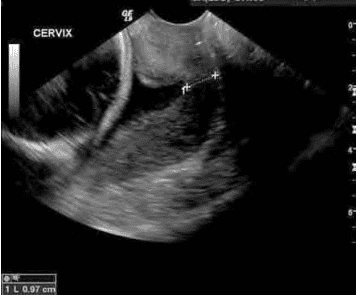
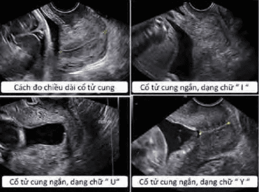
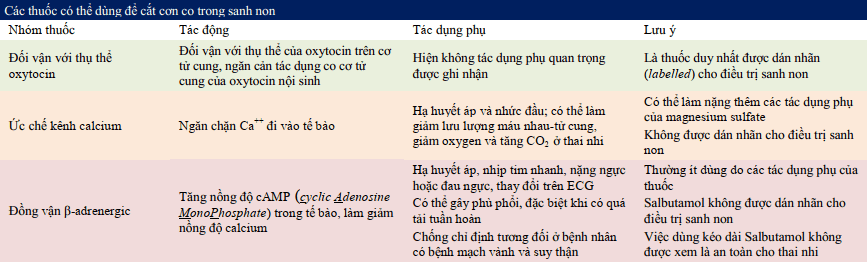
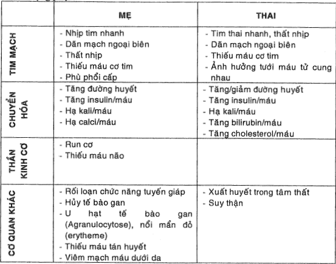
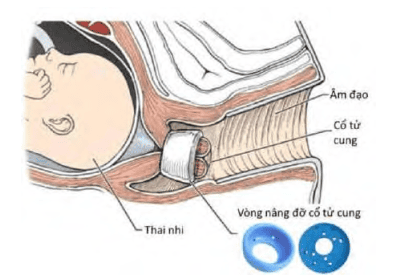

Trẻ sinh non được định nghĩa là trẻ được sinh ra trước khi tuổi thai được 37 tuần.

- Sơ sinh đủ tháng được định nghĩa là sơ sinh với tuổi thai lúc sinh là từ 37 đến 42 tuần.
- Thai kỳ kéo dài quá ngày dự sinh (thai già tháng) được định nghĩa khi thai kỳ kéo dài > 42 tuần vô kinh.
- Trẻ sinh non được định nghĩa là trẻ được sinh ra trước 37 tuần.

## Phân loại

Phân loại dọa đẻ non:

- Tuổi thai dưới 28 tuần là sơ sinh cực non. Chiếm khoảng 5% các trường hợp.
- Tuổi thai từ 28 tuần đến 31 tuần 6 ngày là sơ sinh rất non. Chiếm khoảng 15% các trường hợp.
- Tuổi thai từ 32 tuần đến 33 tuần 6 ngày là sơ sinh non trung bình. Chiếm khoảng 20% các trường hợp.
- Tuổi thai từ 34 tuần đến 36 tuần 6 ngày là sơ sinh non muộn. Chiếm khoảng 60% các trường hợp.
- Tuổi thai từ 37 tuần đến 38 tuần 6 ngày là gần đủ tháng.
- Tuổi thai từ 39 tuần đến 41 tuần là đủ tháng.

## Bệnh học

Có 2 nhóm nguyên nhân lớn của sinh non:

1. Cuộc sinh được chỉ định vì lý do y khoa như tiền sản giật, rau tiền đạo, thai với giới hạn tăng trưởng trong tử cung nặng gây suy thai. Nhóm này chiếm khoảng 20%.
2. Sinh non tự phát, chiếm khoảng 80% các trường hợp còn lại, đa phần liên quan đến chuyển dạ sinh non hoặc ối vỡ non trên thai non tháng (Preterm Premature Rupture Of Membranes - PPROM). Chúng ta không thể tìm được nguyên nhân hoặc yếu tố nguy cơ của chuyển dạ sinh non.

Chuyển dạ sinh non là hội chứng có liên quan đến nhiều cơ chế bệnh sinh khác nhau:

1. Hoạt hóa trục hạ đồi-tuyến yên-tuyến thượng thận ở mẹ hoặc thai nhi do stress, liên quan Corticosteroids.
2. Nhiễm trùng (màng đệm, màng rụng hoặc toàn thân) và khuẩn hệ âm đạo bệnh lý. Loạn khuẩn âm đạo nên được điều trị sớm trước tuần 20, do có thể làm giảm tần suất sinh non, nhờ làm giảm vỡ ối.
3. Giảm tưới máu màng rụng và xuất huyết tại lớp màng rụng (bong nhau).
4. Căng dãn tử cung quá mức do đa thai, đa ối, hay di tử cung dị dạng (tử cung đôi).

## Yếu tố nguy cơ

### Từ phía mẹ

Tiền căn có sinh non, chuyển dạ sinh non, ối vỡ non.

Hở eo cổ tử cung nguyên phát hoặc thứ phát, chiều dài cổ tử cung ngắn, chấn thương cổ tử cung (khoét chóp), phá thai to.

Nhiễm trùng như nhiễm trùng tiểu, loạn khuẩn âm đạo, nhiễm trùng màng ối.

Căng dãn tử cung quá mức như đa thai, đa ối.

Tử cung bị biến dạng do u xơ-cơ trơn tử cung, tử cung có vách ngăn hay các dị tật cấu trúc khác của tử cung.

Bất thường bánh nhau: nhau bong non, rau tiền đạo.

Thời gian giữa 2 lần mang thai ngắn (< 6 tháng).

Mẹ hút thuốc lá. Tuổi mẹ < 17 hay > 35 tuổi.

Kinh tế xã hội thấp.

Suy dinh dưỡng, cân nặng trước mang thai < 50 kg.

Làm việc quá mức.

### Từ thai và phần phụ

Đa ối.

Đa thai.

Thai dị tật

Rau tiền đạo, rau bong non.

## Dự báo dọa đẻ non

### Chiều dài cổ tử cung

Chiều dài kênh cổ tử cung được hiểu là khoảng cách đo được từ lổ cổ tử cung ngoài đến lổ cổ tử cung trong. Đo trên siêu âm. Bình thường, trong giai đoạn giữa của thai kỳ, cổ tử cung dài khoảng 30-40 mm.

Vào tuần lễ 24 của thai kỳ, trên thai phụ không có triệu chứng, nếu chiều dài cổ tử cung ngắn < 25 mm thì nguy cơ sinh non sẽ tăng lên. Ngược lại, nếu có các cơn gò tử cung nhưng cổ tử cung vẫn còn dài hơn 30 mm thì nguy cơ có sinh non trong vòng 7 ngày kế tiếp chỉ là 1%.

Năm 2015, FIGO khuyến cáo thực hiện việc khảo sát chiều dài kênh cổ tử cung thường quy ở tuổi thai 19-23 tuần 6 ngày.

### Hình dạng lỗ trong và ngoài

Các cổ tử cung có dạng U, dạng Y được biết đến như là những dạng có nguy cơ cao sinh non. Dạng I thường có tiên lượng tốt hơn.

### Fetal Fibronectin (fFN)

Khi thực hiện fFN, người ta thường chỉ sử dụng giá trị dự báo âm, mà không sử dụng giá trị dự báo dương.

### Placental α-microglobulin-1

Việc khảo sát sự gia tăng bất thường của nồng độ PAMG-1 trong dịch tiết cổ tử cung sẽ giúp tầm soát các trường hợp có vỡ non các màng ối.

fFN, PAMG-1 có cùng giá trị dự báo âm, nhưng khả dĩ dương có chuyển dạ sinh non khi có PAMG-1 (+) cao khả dĩ dương có chuyển dạ sinh non khi có fFN (+) dương gấp 4 lần.

### Nguyên tắc đánh giá nguy cơ sinh non

Tuổi thai được đánh giá bằng các thông tin có được từ đầu thai kỳ.

Cổ tử cung được khám bằng mỏ vịt, qua siêu âm hoặc bằng tay.

:::caution[Lưu ý]
Khám bằng tay có thể vô tình làm tăng nguy cơ sinh non do vô tình tách các màng ối.
:::

Chiều dài và tình trạng kênh tử cung sẽ được đánh giá qua siêu âm khảo sát kênh cổ tử cung. Thay đổi tình trạng cổ tử cung giúp ta chẩn đoán và theo dõi đáp ứng điều trị.

Siêu âm giúp kiểm định lại tuổi thai, phát triển bào thai, lượng dịch ối, ngôi thai, và vị trí bánh nhau, cũng như khảo sát dị tật của thai nhi.

Theo dõi bằng monitor sản khoa để đánh giá tần số và cường độ cơn gò.

Theo dõi tình trạng xuất huyết của sản phụ, vì nhau bong non và rau tiền đạo có liên quan đến chuyển dạ sinh non.

## Chẩn đoán

### Lâm sàng

Đối với đơn thai: Cơn co tử cung đều đặn (4 cơn trong 2 phút hoặc 8 cơn trong 60 phút) và:

- Cổ tử cung ≥ 3 cm, hoặc
- Chiều dài cổ tử cung theo siêu âm đường âm đạo < 20 mm, hoặc
- Chiều dài cổ tử cung theo siêu âm đường âm đạo 20 mm đến < 30 mm và xét nghiệm Fetal fibronectin (+).

Đối với song thai: Cơn co tử cung đều đặn (4 cơn trong 2 phút hoặc 8 cơn trong 60 phút) và:

- Cổ tử cung ≥ 3 cm, hoặc
- Chiều dài cổ tử cung theo siêu âm đường âm đạo < 25 mm, hoặc
- Chiều dài cổ tử cung theo siêu âm đường âm đạo 25 mm đến < 35 mm và xét nghiệm Fetal fibronectin (+).

Có thể kèm theo ra dịch hồng, nhầy cổ tử cung, đau thắt lưng, trằn nặng bụng.

Có thể có ối vỡ non.

### Cận lâm sàng

Theo dõi cơn co tử cung.

Siêu âm đường âm đạo đo chiều dài cổ tử cung.

Xét nghiệm Fetal fibronectin (fFN).

Partosure: Xét nghiệm sự hiện diện của placental α-microglobulin-1 (PAMG-1).

## Điều trị đẻ non

### Nguyên tắc

Tránh lao động nặng, không kích thích đầu vú và kiêng giao hợp.

Nghỉ ngơi tại giường không được khuyến cáo do chưa có bằng chứng. Ngược lại có thể tăng nguy cơ tắc mạch, giảm mật độ xương.

Ăn hợp lý, đầy đủ dinh dưỡng, ăn nhiều trái cây, ăn rau xanh, ngũ cốc tránh táo bón.

Liệu pháp corticosteroid trước sinh.

Dùng thuốc cắt cơn ngắn hạn để đủ thời gian cho liệu pháp corticosteroid.

Dùng Magnesium sulfate bảo vệ não trẻ sinh non.

Kháng sinh dự phòng liên cầu khuẩn nhóm B (GBS) khi có chỉ định.

Phối hợp bác sĩ sơ sinh để chăm sóc trẻ.

### Thuốc khống chế tạm thời cơn co tử cung

#### Các nhóm thuốc

Có 3 nhóm dược chất lớn có thể được dùng cho mục đích khống chế tạm thời các cơn co tử cung:

1. Thuốc đối vận với thụ thể oxytocin.
2. Các chất ức chế kênh calcium.
3. Các chất đồng vận β-adrenergic (Betamimetics).

:::caution[Lưu ý]
Không sử dụng thuốc cắt cơn:

- Không dùng với mục đích kéo dài thai kỳ dài hạn do không hiệu quả và không cải thiện kết cục sơ sinh.
- Không phối hợp nhiều loại thuốc cùng lúc.
- Không sử dụng thuốc cắt cơn cho cơn gò trên 34 tuần.

:::

#### Chống chỉ định chung

Chống chỉ định tuyệt đối:

- Thai chết lưu trong tử cung.
- Thai dị tật bẩm sinh nặng.
- Thai suy cấp.
- Tiền sản giật nặng hay sản giật.
- Nhiễm trùng ối.
- Mẹ chảy máu nhiều, huyết động không ổn định.
- Tăng áp phổi, viêm phổi, viêm phế quản nặng.
- Suy thận, viêm cầu thận cấp.
- Cường giáp, tăng Calci máu.
- Ketoacidosis, tiểu đường.
- Glaucoma.

Chống chỉ định tương đối:

- Thai suy dinh dưỡng trong buồng tử cung.
- Đái tháo đường phụ thuộc Insulin (có thể dùng Antosiban).
- Đa thai (tăng thể tích huyết tương, cường Aldosterone) nguy cơ tác dụng nặng lên tim mạch, phù phổi cấp không nên dùng Nifedipine, có thể dùng Antosiban.
- Ối vỡ non ở thai non tháng.
- Loạn nhịp tim, tăng huyết áp.
- Rối loạn biến dưỡng cơ (nhược cơ).
- Rau bong non.
- Giảm kali máu.
- Dị ứng.

#### Ức đối vận với oxytocin

Antosiban (Tractocile) có cấu trúc mô phỏng peptide 9 của oxytocin. Đây là peptide tổng hợp có tác dụng đối kháng cạnh tranh với oxytocin, làm giảm tần số cơn gò và trương lực cơ tử cung, nó cũng gắn kết với các thụ thể vasopressin.

Chống chỉ định:

- Mẹ bị dị ứng với thuốc.
- Ối vỡ non thai từ 30 tuần.
- Thai chậm phát triển trong tử cung.
- Rau tiền đạo.

Liều dùng:

- Bước 1: Liều tấn công lọ 1 (37.5 mg/5 mL) lấy 6.75 mg (0.9 mL) pha trong 10 mL Ringer lactate tiêm tĩnh mạch chậm > 1 phút (còn 4.1 mL).
- Bước 2: Liều duy trì với lọ 1 còn 30.75 mg (4.1 mL) pha 36.9 mL Ringer lactate truyền bơm tiêm điện 24 mL/giờ. Sau đó pha lọ 2 (37.5 mg/5 mL) trong 45 mL Ringer lactate truyền bơm tiêm điện 24 mL/giờ trong 3h đầu.
- Bước 3: Còn 19 mL ở bước 2 truyền bơm tiêm điện 8 mL/giờ. Từ lọ 3 pha 45 mL Ringer lactate được 50 mL truyền với tốc độ 8 mL/giờ. Thời gian dùng tối đa là 45h.

Tác dụng phụ thường nhẹ như buồn nôn, nhức đầu, chóng mặt, bừng nóng, nôn, nhịp tim nhanh, dị ứng thuốc.

Theo dõi tim thai, cơ gò trên monitor trong 1h đầu điều trị.

#### Ức chế calcium

Nifedipine ức chế kênh calci type II, có nhiều trong mạch máu, tử cung và bàng quang. Gây dãn cơ trơn, giảm lượng calci trong tế bào. Nifedipine hoạt động trên cơ trơn tế bào mạch gấp 18 lần trên cơ tim gây ảnh hưởng huyết động, giảm huyết áp động mạch, tăng nhịp tim, giãn mạch.

Chống chỉ định:

- Huyết áp mẹ < 90/50 mmHg, bệnh tim.
- Rối loạn chức năng gan, bệnh thận
- Đang dùng thuốc hạ áp khác.
- Đa thai.
- Mẫn cảm với Nifedipine, Nicardipine.

Liều dùng:

- Liều tấn công 20-30 mg (dùng viên tác dụng nhanh), hiệu quả giảm cơn gò sau 20-30 phút.
- Sau 10-20 mg mỗi 3-8h trong tối đa 48h. Liều tối đa 180 mg/ngày.

Tác dụng phụ:

- Đau đầu.
- Nổi mẩn.
- Hạ huyết áp, đặc biệt gây thiếu oxy thai ở những người có tăng huyết áp.
- Nhịp tim nhanh, đánh trống ngực.
- Nóng bừng mặt, nhức đầu, chóng mặt.
- Buồn nôn.
- Phù chi dưới.
- Suy thai.

Theo dõi:

- Theo dõi mạch, huyết áp mẹ sau dùng thuốc mỗi 30 phút trong 1h đầu và 30 phút sau mỗi liều kế tiếp.
- Theo dõi tim thai - cơn co trên monitor trong 1h liều đầu và mỗi 6h trong liều duy trì.
- Không truyền dịch quá nhiều.

#### Progesterone

Duphaston, Utrogestan,... ức chế tổng hợp prostaglandin được sử dụng trong dọa sinh non giai đoạn sớm.

Tác dụng phụ mẹ ứ mật trong thai kỳ.

#### Betamimetics

Betamimetics như Salbutamol là các dẫn xuất Catecholamines làm dãn cơ tử cung và hệ thống cơ trơn khác gồm mạch máu, khí quản,... do kích thích thụ thể β2 adrenaline ở các cơ trên.

Chống chỉ định:

- Mẹ bị bệnh tim.
- Tăng huyết áp nặng hoặc không kiểm soát.
- Sản giật hoặc tiền sản giật.
- Đái tháo đường đang điều trị Insulin.
- Bệnh tuyến giáp, dị ứng với thuốc.
- Đa thai.

Liều dùng:

- Hạn chế đường truyền dịch nhất trong trường hợp song thai hay có điều trị corticoid vì dễ nguy cơ phù phổi cấp.
- Dùng bơm tiêm điện pha Salbutamol 5 mg/5 mL trong 95 mL NaCl 0.9%, bơm 12 mL/giờ (10 mcg/phút), tăng 4 mL/giờ (3.3 mcg/phút) mỗi 30 phút đến khi cắt cơn gò hoặc nhịp tim mẹ ≥ 120 nhịp/phút hoặc tốc độ truyền tối đa 36 mL/giờ (30 mcg/phút).
- Truyền tĩnh mạch Salbutamol 5 mg/5 mL pha trong Glucose 5% (nồng độ 10 mcg/mL), tốc độ 60 mL/giờ (20 giọt/phút, 10 mcg/phút), tăng thêm 20 mL/giờ (7 giọt/phút, 3.3 mcg/phút) mỗi 30 phút đến khi cắt cơn gò hoặc nhịp tim mẹ ≥ 120 nhịp/phút hoặc tốc độ truyền tối đa 180 mL/giờ (60 giọt/phút, 30 mcg/phút).

Tác dụng phụ:

_Tác dụng phụ của betamimetics._

Theo dõi:

- Theo dõi mạch, huyết áp mẹ sau dùng thuốc mỗi 15 phút trong 1h đầu và sau đó mỗi 4h liều kế tiếp. Mạch mẹ không quá 120 nhịp/phút, huyết áp ổn định, không đánh trống ngực, run cơ, khó thở, choáng váng.
- Theo dõi lượng nước tiểu (thiểu niệu là dấu hiệu ngộc độc).
- Xét nghiệm ure, điện giải, Hct mỗi 24h. Đo đường huyết mỗi 4h.
- Theo dõi tim thai - cơn co trên monitor trong 1h liều đầu và mỗi 6h trong liều duy trì.

Thời gian điều trị:

- Điều trị đường tĩnh mạch có thể kéo dài 24-48h.
- Duy trì:
  - Ventolin (2 viên mg) 4-6 viên/ngày (uống).
  - Salbutamol (viên 1mg) 1-3 viên/ngày (đặt hậu môn).

### Corticosteroid liệu pháp dự phòng

_Liệu pháp corticosteroid nhằm mục đích dự phòng hội chứng suy hô hấp cấp ở sơ sinh._

_Nếu thực hiện liệu pháp corticosteroid cho chuyển dạ sinh non xảy ra ở 1 thai có khả năng nuôi sống được (ở Việt Nam, dù rằng 1 vài cơ sở định mốc sống là 24 tuần, nhưng mốc nuôi sống phổ biến vẫn là khoảng 28 tuần) và có tuổi thai dưới 34 tuần vô kinh. Không cần thiết sau 34 tuần_.

Chỉ định: Chỉ thực hiện duy nhất 1 đợt corticosteroid cho thai phụ đang có nguy cơ trực tiếp của sinh non trong vòng 7 ngày, hiện đang ở giữa tuần thai 24 và 34.

- Thường quy cho thai từ 28 đến 38 tuần 6 ngày.
- Cân nhắc với trường hợp trước 28 tuần.
- Cân nhắc lặp lại khi thai < 34 tuần, có nguy cơ sinh non trong vòng 7 ngày và cách đợt điều trị đầu tiên 7-14 ngày (phác đồ Bệnh viện Từ Dũ).
- Sử dụng ngay cả khi không chắc chắn có thể hoàn thành đủ liều corticosteroid.

Liều dùng 1 trong 2 phương pháp sau:

- Betamethasone (12 mg) tiêm bắp, 2 liều, cách 24h
- Dexamethasone (6 mg) tiêm bắp, 4 liều, cách 12h.

Corticosteroid liệu pháp có khả năng gây tác hại cho hệ thần kinh thai nhi khi bị lạm dụng.

### Bảo vệ thần kinh thai bằng Magnesium sulfate

_Magnesium sulfate có vai trò bảo vệ thần kinh cho thai rất non, dưới 32 tuần._

Chỉ định: Thai 24 tuần đến 31 tuần 6 ngày có nguy cơ sinh non trong 24h (cả trường hợp vỡ ối), đơn thai hoặc đa thai.

- Thường quy cho thai 28 tuần đến 31 tuần 6 ngày.
- Cân nhắc thai từ 24 tuần đến 27 tuần 6 ngày.

Chống chỉ định: Mẹ bị nhược cơ.

Thận trọng: Mẹ bị thiếu máu cơ tim, rối loạn dẫn truyền nhịp tim.

Liều dùng: $MgSO_4$ 4.5 g liều duy nhất truyền tĩnh mạch chậm 20-30 phút.

- Giảm liều ở người thiểu niệu hoặc có dấu hiệu suy thận.
- Dùng $MgSO_4$ không tiếp tục dùng thuốc cắt cơn gò.
- Khi có chỉ định chấm dứt thai kỳ, $MgSO_4$ dùng lý tưởng nhất 4h trước sinh.

### Kháng sinh dự phòng GBS

Sử dụng khi có chỉ định.

## Dự phòng (Điều trị) dọa đẻ non

Xác định nhóm người có nguy cơ cao.

Khám thai định kỳ, sáng lọc các yếu tố nguy cơ.

Chế độ ăn uống hợp lý, tập luyện, đầy đủ dinh dưỡng.

Hạn chế số lượng phôi chuyển ở phụ nữ có hỗ trợ sinh sản nhằm hạn chế đa thai.

Điều trị sớm viêm nhiễm trước và trong thai kỳ.

3 biện pháp dự phòng được đề cập nhiều nhất là:

1. Progesterone.
2. Khâu vòng cổ tử cung.
3. Pessary (vòng nâng cổ tử cung).

### Progesterone

Có thể dùng progesterone để dự phòng sinh non cho thai phụ có tiền căn sinh non và hiện có kênh tử cung ngắn dưới 25 mm.

### Khâu vòng cổ tử cung

Có thể khâu vòng cổ tử cung để dự phòng sinh non cho thai phụ có hở eo tử cung và hiện có kênh tử cung ngắn < 25mm.

Những trường hợp có cổ tử cung ngắn nhưng không có tiền căn sinh non thì không thấy lợi ích nào khi tiến hành thủ thuật này. Ở những trường hợp song thai, khi khâu cổ tử cung sẽ làm tăng nguy cơ chuyển dạ sinh non.

### Vòng nâng cổ tử cung (cerclage pessary)

_Giảm số trường hợp sinh non dưới 34 tuần và cả dưới 37 tuần._

_Tiết dịch âm đạo bất thường là than phiền hay gặp nhất ở những thai phụ sử dụng dụng cụ nâng đỡ cổ tử cung._

Chỉ định: Khi có chỉ định khâu vòng nhưng không thỏa mãn điều kiện (rau tiền đạo, sản phụ từ chối khâu, thai >20 tuần).

Chống chỉ định:

- Viêm sinh dục tiến triển.
- Ra máu âm đạo.
- Có dấu hiệu chuyển dạ: Rỉ ối hoặc vỡ, cổ tử cung xóa và mở ≥ 3 cm, cơ cơn gò đều ≥ 2 cơn/10 phút, đầu ối sa và âm đạo.

Thời điểm đặt Pesary:

- Từ 14 đến 32 tuần.
- Hoặc 2 tuần trước thời điểm dọa sảy hoặc sinh non lần trước.

Biến chứng:

- Tiểu khó.
- Đau cộm trong âm đạo.
- Viêm âm đạo.
- Xuất huyết âm đạo do viêm trợt, xói mòn.

Theo dõi:

- Không cần kháng sinh dự phòng.
- Khám thai định kỳ: Kiểm tra tình trạng tiể, khám mỏ vịt kiếm tra viêm sinh dục, huyết âm đạo, vị trí vòng Pessary.
- Lấy vòng Pessary sau 37 tuần hoặc chuyển dạ, ối rỉ/vỡ.
- Sử dụng Progesterone đến hết tuần 36.

### Phác đồ dự phòng sinh non đơn thai Bệnh viện Từ Dũ

## Nguồn tham khảo

- TEAM-BASED LEARNING - Trường Đại học Y Dược Thành phố Hồ Chí Minh 2020.
- PHÁC ĐỒ ĐIỀU TRỊ SẢN PHỤ KHOA - Bệnh viện Từ Dũ.
- THỰC HÀNH SẢN PHỤ KHOA - PGS.TS. Trần Thị Lợi, GS.TS. Nguyễn Duy Tài.
