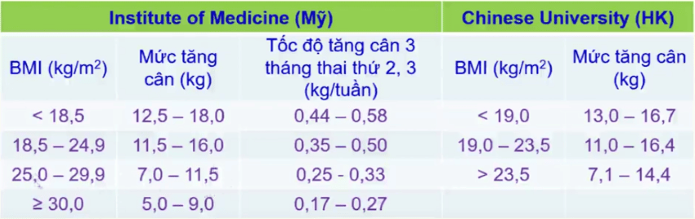

Theo Liên đoàn các nhà Sản Phụ khoa Thế giới (FIGO), HIP (hypergylcemia in pregnancy) là thuật ngữ dùng để chỉ mọi tình trạng rối loạn về biến dưỡng đường xảy ra khi mang thai.

## Định nghĩa

Đái tháo đường là nhóm những rối loạn chuyển hóa không đồng nhất gồm tăng glucose huyết tương và rối loạn dung nạp glucose do thiếu insulin, giảm tác dụng của insulin hoặc cả hai.

Đái tháo đường type 1 có sự phá hủy tế bào beta và thiếu insulin tuyệt đối, được chia làm hai thể do cơ chế tự miễn và không do tự miễn. Theo hướng dẫn của Bộ Y tế 2021 Đái tháo đường type 1 là 1 bệnh tự miễn.

Đái tháo đường type 2 đặc trưng bởi tình trạng thiếu insulin tương đối kèm đề kháng insulin ngoại biên.

Tiền đái tháo đường là tình trạng rối loạn chuyển hóa glucose bao gồm rối loạn glucose lúc đói (Impaired Fasting Glucose - IFG), rối loạn dung nạp glucose (Impaired Glucose Tolerance - IGT) và giá trị HbA1c từ 5,7 - 6,4%.

Đái tháo đường mang thai, hay còn gọi là đái tháo đường rõ (overt diabetes) có mức glucose huyết tương đạt mức chẩn đoán đái tháo đường tiêu chuẩn (WHO, 2006), trong khi đái tháo đường thai kỳ có mức glucose huyết tương thấp hơn.

Hội Nội tiết Hoa kỳ định nghĩa đái tháo đường thai kỳ là tình trạng liên quan đến tăng glucose huyết tương của mẹ với mức độ thấp hơn đái tháo đường mang thai (đái tháo đường rõ) và làm tăng nguy cơ các kết cục sản khoa bất lợi cho cả thai phụ và thai nhi.

## Phân loại đái tháo đường thai kỳ

HIP được chia làm 2 nhóm lớn:

1. Đái tháo đường mang thai (diabetes in pregnancy - DIP):

- Đái tháo đường lần đầu được chẩn đoán trong thai kỳ hoặc đường huyết cao được chẩn đoán lần đầu trong thai kỳ và thoả các tiêu chuẩn chẩn đoán đái tháo đường ở người không mang thai của WHO.
- Có thể phát hiện ở bất kỳ thời điểm nào trong thai kỳ kể cả ở tam cá nguyệt 1.

2. Đái tháo đường thai kỳ (gestational diabetes mellitus - GDM):

- Đường huyết cao trong thai kỳ nhưng thấp hơn tiêu chuẩn chẩn đoán đái tháo đường thực sự.
- Đường huyết cao được chẩn đoán lần đầu trong thai kỳ mà không có bằng chứng về đái tháo đường trước đó.
- Có thể phát hiện ở bất kỳ thời điểm nào trong thai kỳ nhưng hầu hết sau 24 tuần.

## Bệnh sinh

Kháng insulin kết hợp từ 2 yếu tố chính:

- Kháng insulin của thai nghén bắt đầu từ nửa sau (tuần thứ 20) đến cuối thai kỳ nhằm giảm tiêu thụ glucose, chuyển glucose cho thai.
- Kháng insulin mạn tính từ trước đó.

Khiếm khuyết chức năng tế bào β không bù đủ sự gia tăng của kháng insulin.

## Yếu tố nguy cơ

| Phân loại   | Tiêu chuẩn của WHO | Tiêu chuẩn của người châu A (IDI&WPRO) |
| ----------- | ------------------ | -------------------------------------- |
| Thiểu cân   | <18,5              | <18,5                                  |
| Bình thường | 18,5 - 24,9        | 18,5 - 22,9                            |
| Thừa cân    | 25 - 29,9          | 23 - 24,9                              |
| Béo phì     |>30               |>25                                   |

_Bảng phân loại BMI theo tiêu chuẩn của WHO và theo Châu Á._

Người trưởng thành có BMI ≥23 $kg/m^2$ và có 1 trong các nguy cơ sau:

- Gia đình có người mắc đái tháo đường thế hệ cận kề, chiếm 50-60% so với nhóm tiền sử gia đình không có người đái tháo đường.
- Tiền sử sinh con to cân nặng trẻ sơ sinh to ≥4000 gam vừa là hậu quả của đái tháo đường, vừa là yếu tố nguy cơ cho mẹ ở những lần mang thai sau.
- Tiền sử sản khoa bất thường thai chết lưu không rõ nguyên nhân, con bị dị tật bẩm sinh, tiền sản giật, sinh non.
- Tiền sử bệnh tim mạch do sơ vữa.
- Tăng huyết áp (huyết áp tâm thu ≥140 mmHg hoặc huyết áp tâm trương ≥90 mmHg hay điều trị thước tăng huyết áp).
- Nồng độ HDL-C trong máu <0.9 mmol/L và/hoặc Triglyceride >2.82 mmol/L.
- Phụ nữ bị buồng trứng đa nang.
- Ít vận động thể lực.
- Có dấu hiệu đề kháng insulin.

Phụ nữ đã mắc đái tháo đường thai kỳ.

HbA1C ≥5.7%, rối loạn glucose huyết đói hay rối loạn dung nạp glucose ở lần xét nghiệm trước đó.

Glucose niệu dương tính cũng là yếu tố nguy cơ cao đối với đái tháo đường thai kỳ. Tuy nhiên, có khoảng 10 - 15% thai phụ có glucose niệu dương tính mà không phải do mắc đái tháo đường thai kỳ.

Người thực bắt đầu thực hiện xét nghiệm phát hiện đái tháo đường từ 45 tuổi.

## Sàng lọc và chẩn đoán

Trên thế giới có hai mô hình tầm soát chính là tầm soát đại trà và tầm soát chọn lọc (hoặc tầm soát đối tượng nguy cơ). Mặc dù còn một vài vấn đề chưa được thống nhất, nhưng hầu như các tổ chức chuyên môn trên thế giới khuyến cáo nên tầm soát đại trà đái tháo đường thai kỳ.

### 3 tháng đầu thai kỳ

|     | Nguy cơ cao                                                                                                                                                            |
| --- | ---------------------------------------------------------------------------------------------------------------------------------------------------------------------- |
| 1   | BMI thừa cân và có thêm 1 yếu tố: tiền sử gia đình có đái tháo đường thế hệ 1, chủng tộc, tim mạch, tăng huyết áp, HDL <0,9, TG >2,82, PCOs, ít vận động, dấu gai đen. |
| 2   | HbA1C >5,7% hoặc tiền đái tháo đường (IGT / IGF).                                                                                                                      |
| 3   | Tiền sử đái tháo đường thai kỳ.                                                                                                                                        |
| 4   | Tuổi >35.                                                                                                                                                              |
| 5   | Suy giảm miễn dịch mắc phải (HIV).                                                                                                                                     |

|     | Nguy cơ thấp                                                           |
| --- | ---------------------------------------------------------------------- |
| 1   | Tuổi <25.                                                              |
| 2   | BMI <23.                                                               |
| 3   | Không có tiền sử gia đình đái tháo đường thế hệ 1.                     |
| 4   | Không có tiền sử rối loạn dung nạp Glucose hoặc đái tháo đường thai kỳ |

Ngay lần khám thai đầu tiên, tiến hành đánh giá các yếu tố nguy cơ của đái tháo đường chung.

Nhóm thai phụ nguy cơ thấp hẹn xét nghiệm sàng lọc ở tuần 24-28 tuần.

:::note[Kết quả tầm soát đái tháo đường 3 tháng đầu]
Nhóm thai phụ có nguy cơ cao cần được xét nghiệm glucose huyết tương tĩnh mạch lúc đói (nhịn ăn ít nhất 8h trước xét nghiệm) hoặc bất kỳ ngay trong lần khám thai đầu tiên. Kết quả:

- Bình thường:

  - Glucose huyết tương tĩnh mạch khi đói 70 - 90 mg/dL (3,9-5,0 mmol/L).
  - Glucose huyết tương tĩnh mạch bất kỳ ≤199 mg/dL (11 mmol/L).
  - Nhóm này cũng vẫn thực hiện xét nghiệm sàng lọc khi 24-28 tuần.

- Nghi ngờ:

  - Glucose huyết tương tĩnh mạch khi đói 91-125 mg/dL (5.1-6.9 mmol/L) và/ hoặc HbA1c 5,7%-6,4%.
  - Thực hiện xét nghiệm sàng lọc ngay.

- Đái tháo đường mang thai:
  - Glucose huyết tương tĩnh mạch khi đói ≥126 mg/dL (7.0 mmol/L). Cần làm 2 thời điểm khác nhau hoặc kèm thêm HbA1C bất thường.
  - Glucose huyết tương tĩnh mạch bất kỳ ≥200 mg/dL (11.1 mmol/L) kèm các triệu chứng của tăng gluces huyết điển hình hoặc cơn tăng glucose huyết cấp.
  - Giới thiệu khám chuyên khoa Nội tiết.

:::

Y văn ghi nhận tăng HbA1C trong 3 tháng đầu thai kỳ làm tăng nguy cơ dị tật thai (thai vô sọ, tật đầu nhỏ, dị tật tim...). Những thai phụ có HbA1C >6.5% là có tăng nguy cơ dị tật thai. Chuyên khoa Sản lưu ý nguy cơ dị tật và tư vấn sàng lọc dị tật (đặc biệt dị tật tim thai).

Dựa trên tiêu chuẩn của đái tháo đường thực thụ, BN có thể mắc đái tháo đường từ trước nhưng khi có thai mới phát hiện đái tháo đường.

:::note[Tiêu chuẩn chẩn đoán đái tháo đường]
Đường huyết đói ≥126 mg/dL (7.0 mmol/L)

hoặc

Đường huyết sau ăn 2h uống đường ≥200 mg/dL (11.1 mmol/L) trong test OGTT\*

hoặc

A1C ≥6.5%\*

hoặc

BN có triệu chứng điển hình của tăng đường huyết hay các cơn tăng đường huyết, đường huyết bất kỳ ≥200 mg/dL (11.1 mmol/L)

\* Cần thực hiện lại xét nghiệm nếu không có triệu chứng tăng đường huyết rõ ràng trên lâm sàng.
:::

### 3 tháng giữa thai kỳ

Thực hiện tầm soát đái tháo đường thai kỳ cho mọi thai phụ từ tuần thứ 24-28 của tuổi thai và thời điểm này được xem là thời điểm chuẩn, tốt nhất cho phát hiện bất thường chuyển hóa carbohydrate trong thai kỳ với nghiệm pháp dung nạp 75gram glucose.

Khi thai kỳ bước vào tuần thứ 24-28, cần tư vấn cho thai phụ về tầm soát đái tháo đường thai kỳ, phát tờ rơi về những thông tin liên quan đái tháo đường thai kỳ và hướng dẫn ăn uống hợp lý để thực hiện nghiệm pháp dung nạp glucose 75 gram - 2h vào lần khám thai định kỳ tiếp theo, ghi chú vào sổ khám thai ngày tái khám.

Hướng dẫn chuẩn bị trước khi thực hiện sàng lọc: 3 ngày trước khi tiến hành nghiệm pháp chẩn đoán, không ăn chế độ ăn có quá nhiều glucid cũng như không ăn kiêng nhằm tránh ảnh hưởng nghiệm pháp.

- Nhịn đói ít nhất 8h trước khi làm nghiệm pháp (Có thể uống nước lọc).
- Lấy 1-2ml máu tĩnh mạch, định lượng glucose trong huyết tương lúc đói, trước khi làm nghiệm pháp.
- Uống ly nước đường hoặc dung dịch pha sẵn 75g glucose, uống trong vòng 5 phút.
- Lấy 1-2ml máu tĩnh mạch, định lượng glucose trong huyết tương ở 2 thời điểm 1h và 2h sau uống nước glucose.
- Trong thời gian làm nghiệm pháp thai phụ không ăn uống gì thêm, được ngồi nghỉ ngơi trong phòng làm nghiệm pháp hoặc đi lại nhẹ nhàng trong khuôn viên bệnh viện trong thời gian làm nghiệm pháp.

:::note[Tiêu chuẩn chẩn đoán đái tháo đường thai kỳ]
Tham số Glucose huyết tương trong nghiệm pháp 75gram Glucose 2h:

| h   | Glucose huyết tương tĩnh mạch (mg/dl hay mg%) | Glucose huyết tương tĩnh mạch (mmol/l) |
| --- | --------------------------------------------- | -------------------------------------- |
| Đói | ≥92                                           | ≥5.1                                   |
| 1h  | ≥180                                          | ≥10.0                                  |
| 2h  | ≥153                                          | ≥8.5                                   |

:::

### 3 tháng cuối thai kỳ

Không có chống chỉ định khi thực hiện sàng lọc trong 3 tháng cuối thai kỳ. Để quản lý hiệu quả, nên thực hiện thường quy trong 3 tháng giữa thai kỳ.

_Sàng lọc Đái tháo đường thai kỳ._

## Mục tiêu điều trị

| Thời điểm | Glucose (mg/dL) | Glucose (mmol/l) |
| --------- | --------------- | ---------------- |
| Lúc đói   | <95             | <5,3             |
| Sau ăn 1h | <140            | <7,8             |
| Sau ăn 2h | <120            | <6,7             |

_Glucose huyết tương mao mạch mục tiêu._

HbA1c ít có giá trị với đái tháo đường thai kỳ vì đái tháo đường thai kỳ xuất hiện từ nửa sau thai kỳ (khoảng 4 tháng cuối) trong khi HbA1c có giá trị đánh giá trong vòng 3 tháng. Ngoài ra còn chịu ảnh hưởng của nhiều yếu tố như đời sống hồng cầu ngắn lại, máu pha loãng.

## Nguyên tắc điều trị

Nguyên tắc điều trị đái tháo đường thai kỳ:

1. Cung cấp đủ năng lượng và các chất dinh dưỡng cho mẹ và thai nhi.
2. Đạt mục tiêu về đường máu (tránh tăng đường máu sau ăn và hạ đường máu xa bữa ăn).
3. Đạt cân nặng hợp lý.
4. Phù hợp thói quen ăn uống, điều kiện kinh tế, không quá khó thực hiện.

## Quản lý đái tháo đường trong giai đoạn mang thai

### Theo dõi tiền sản

Glucose huyết tương tĩnh mạch dùng để chẩn đoán, glucose huyết tương mao mạch dùng để theo dõi.

Khuyến cáo phụ nữ bị đái tháo đường thai kỳ kiểm soát glucose huyết tương mao mạch đạt mục tiêu hoặc càng gần bình thường càng tốt, nhưng không có nguy cơ hoặc không gây hạ glucose huyết tương.

Khuyến cáo xử trí ban đầu đái tháo đường thai kỳ nên bao gồm: điều chỉnh chế độ ăn và tập luyện ở mức vừa phải trong 30 phút/ngày hoặc hơn.

Khuyến cáo dùng các biện pháp làm hạ glucose huyết tương mao mạch, nếu việc thay đổi lối sống không đủ để duy trì glucose huyết tương mao mạch đạt mục tiêu ở các phụ nữ bị đái tháo đường thai kỳ.

Bên cạnh quản lý chỉ số đường huyết, cần lưu ý tăng cân hợp lý trong thai kỳ-liên quan tỷ lệ thuận với tăng trưởng thai nhi.

Xử trí sản khoa như thai kỳ bình thường nếu đường huyết ổn định.

| BMI trước khi mang thai                          | Tăng cân (kg) | Mức tăng cân trung bình trong quý 2 và quý 3 thời kỳ mang thai (kg/tuần) |
| ------------------------------------------------ | ------------- | ------------------------------------------------------------------------ |
| Thiếu năng lượng trường diễn (BMI<18.5 kg/$m^2$) | 12.5-18       | 0.51 (0.44-0.58)                                                         |
| Bình thường (BMI 18.5-22.9 kg/$m^2$)             | 11.5-16       | 0.42 (0.35-0.50)                                                         |
| Thừa cân (BMI 23.0-24.9 kg/$m^2$)                | 7-11.5        | 0.28 (0.23-0.33)                                                         |
| Béo phì (BMI >24.9 kg/$m^2$)                     | 5-9           | 0.22 (0.17-0.27)                                                         |

_Khuyến cáo về mức tăng cân trong thai kỳ (tiêu chuẩn Châu Á)._

#### Điều trị tiết chế đối với ĐTĐTK:

Dinh dưỡng và vận động theo chế độ dành cho thai phụ có ĐTĐTK.

Theo dõi với glucose huyết tương mao mạch: khi đói và sau ăn 1 hoặc 2h, hướng dẫn cách ghi kết quả-có phiếu theo dõi đường huyết.

Hướng dẫn thai phụ cách đếm và theo dõi cử động thai mỗi ngày.

Đánh giá tình trạng sức khỏe thai nhi bằng Non stress test (NST) mỗi tuần 1-2 lần, có thể kết hợp đánh giá lượng ối qua siêu âm (Bio-Physical cải biên).

Kết hợp vận động trong thai kỳ. Khuyến cáo hoạt động thể chất cho thai phụ bị ĐTĐTK:

- Ít nhất 30 phút/ngày.
- Đi bộ hoặc tập tay lúc ngồi trong 10 phút sau ăn.
- Trước khi mang thai tích cực tập luyện cần duy trì tập luyện trong thai kỳ.

#### Điều trị insulin đối với ĐTĐTK (hoặc ĐTĐ và thai kỳ)-không biến chứng cấp

Khám và sử dụng liều insulin theo ý kiến của chuyên khoa Nội tiết.

Xét nghiệm glucose huyết tương mao mạch khi đói và sau ăn 1 hoặc 2h, lặp lại mỗi ngày (nếu chưa vào chuyển dạ).

Điều chỉnh liều insulin nhằm ổn định glucose huyết tương mao mạch mục tiêu.

Hội chẩn lại chuyên khoa Nội tiết khi glucose huyết tương mao mạch không ổn định hoặc hội chẩn chuyên khoa Sản nếu nghi có bất thường tăng trưởng thai nhi.

Hướng dẫn thai phụ cách đếm và theo dõi cử động thai mỗi ngày.

Đánh giá tình trạng thai nhi bằng Non stress test (NST) mỗi tuần 1 lần nếu thai cử động đều, hoặc 2 lần mỗi tuần khi thai cử động yếu từ 31 tuần tuổi thai. Có thể kết hợp: Non stress test với xem lượng ối qua siêu âm (BPP cải biên)

Dinh dưỡng và vận động theo chế độ dành cho thai phụ có ĐTĐTK (do bệnh viện hướng dẫn và cung cấp).

Nếu glucose huyết tương ổn định: Chấm dứt thai kỳ ở tuổi thai 39 tuần hoặc khi có chỉ định sản khoa.

Nếu glucose huyết tương không ổn định: Cân nhắc chấm dứt thai kỳ sớm hơn 39 tuần hoặc khi có chỉ định sản khoa.

:::note[Lưu ý]
Trong đái tháo đường thai kỳ nguy cơ trẻ sơ sinh suy hô hấp cao hơn thai ký bình thường do trưởng thành phổi thai muộn hơn.

Dùng Corticoides có thể làm tăng glucose huyết tương.
:::

#### Điều trị insulin đối với ĐTĐTK (hoặc ĐTĐ và thai kỳ)-có biến chứng cấp (nhiễm toan cetone, tăng áp lực thẩm thấu máu, hạ đường huyết...)

Biến chứng có thể được chẩn đoán trước nhập viện hoặc trong quá trình theo dõi điều trị nội trú.

Cần được hội chẩn hoặc điều trị bởi chuyên khoa Nội tiết.

Xét nghiệm glucose huyết tương đói, sau ăn 1h, sau ăn 2h hay số lần xét nghiệm glucose huyết tương sẽ do bác sĩ chuyên khoa Nội tiết quyết định, lặp lại mỗi ngày.

Điều chỉnh liều insulin sao cho đạt và duy trì ổn định glucose huyết tương mục tiêu.

Hướng dẫn thai phụ cách đếm và theo dõi cử động thai.

Đánh giá tình trạng thai nhi bằng Non stress test (NST) mỗi ngày.

Dinh dưỡng theo tư vấn của khoa Dinh dưỡng.

Chấm dứt thai kỳ nên xem xét theo từng trường hợp cụ thể, cần cân nhắc đánh giá khả năng trưởng thành phổi thai (nếu được).

### Theo dõi trong và chuyển dạ

#### Trong cuộc chuyển dạ

Cần kiểm soát glucose mao mạch mẹ trong suốt cuộc chuyển dạ và sinh (tốt nhất dao động từ 70-100 mg/dl hay 3.9-5.6 mmol/l). Ngưỡng đường huyết này ghi nhận không đưa đến tình trạng hạ đường huyết sơ sinh ở những thai phụ cần điều trị insulin. Mức đường huyết trong chuyển dạ >140 đến 180 mg/dL (7.8 đến 10 mmol/L) liên quan mật thiết đến tình trạng hạ đường huyết sơ sinh và làm tăng nguy cơ nhiễm ketone acid ở mẹ.

Nếu thai phụ không dùng insulin, theo dõi glucose huyết tương mao mạch 4-6 giờ/lần.

Nếu thai phụ dùng insulin theo dõi, glucose mao mạch 1-2 giờ/lần hoặc theo chỉ định của chuyên khoa Nội tiết.

Theo dõi các yếu tố chuyển dạ.

Sau sổ nhau, nếu đang dùng insulin phải cân nhắc giảm liều thích hợp vì sau khi lấy hết bánh rau, mất hiện tượng kháng insulin có thể gây hạ glucose máu. Theo dõi chặt chỉ số đường huyết để điều chỉnh thuốc cho phù hợp.

Theo dõi sát trẻ sơ sinh trong vòng 3 ngày đầu sau sinh để phát hiện và xử trí kịp thời các biến chứng như: hạ glucose huyết, hạ calci, đa hồng cầu, tăng bilirubin máu, hội chứng suy hô hấp cấp chu sinh, nhiễm khuẩn sơ sinh.

Cho trẻ tiếp xúc da kề da với mẹ ít nhất ngày đầu sau sinh, hướng dẫn sản phụ cho trẻ bú sớm ngay trong vòng 1h đầu sau sinh.

#### Theo dõi sau sinh

Nếu đang dùng insulin, cần giảm liều.

Tư vấn về các biện pháp tránh thai như sử dụng bao cao su, dụng cụ tử cung, viên thuốc ngừa thai kết hợp hàm lượng thấp.

Cần thực hiện Đánh giá chuyển hóa glucose sau sinh cho các phụ nữ có ĐTĐTK 4-12 tuần: làm lại nghiệm pháp dung nạp 75 gram glucose uống-2h, nếu kết quả bình thường, tầm soát định kỳ 1 năm/lần, nếu kết quả xét nghiệm bất thường giới thiệu sản phụ khám chuyên khoa Nội tiết.

## Phương pháp thay đổi đường huyết

### Liệu pháp dinh dưỡng nội khoa

Chế độ dinh dưỡng nội khoa (Medical Nutrition Treatment - MNT) cần đáp ứng được các mục tiêu sau:

1. Ổn định được đường huyết ở mức mục tiêu.
2. Cung cấp đủ năng lượng đảm bảo sức khoẻ cho mẹ và giúp thai phụ tăng cân hợp lý trong thai kỳ.
3. Đảm bảo được sức khoẻ của thai.
4. Ngăn ngừa tình trạng nhiễm Ketone.

#### Chế độ ăn và theo dõi

Đến 80% sản phụ đái tháo đường thai kỳ kiểm soát đường huyết đường huyết bằng chế độ ăn và tập luyện.

Tổng Calo phân bố: Carbohydrate 35-45%, protid 20-25%, lipid 35-40%.

Người đang thực hiện MNT nên ăn 5-7 bữa trong ngày (bao gồm 3 bữa chính và 2-4 bữa phụ). Các bữa ăn không hoàn toàn giống nhau.

Trong giai đoạn đầu khi thực hiện MNT, khuyến khích thai phụ tự theo dõi thường xuyên đường huyết đói cũng như đường huyết 3-4 lần/ngày:

- Đường huyết đói: 1 lần/ ngày, sau khi nhịn đói ít nhất 8h.
- Đường huyết sau ăn: sau ăn 1-2h, 2-3 lần/ ngày, xoay vòng cho các bữa ăn khác nhau trong tuần.
- Ít nhất cũng cần theo dõi đường huyết 1 lần/ngày và phải ghi nhận tương quan với thời điểm bữa ăn.

Ưu tiên thực phẩm có chỉ số đường huyết thấp (<55) hoặc trung bình (56-69).

Khi đã đảm bảo đạt được mục tiêu về đường huyết bằng MNT, việc theo dõi đường huyết có thể được nới lỏng hơn. Nếu thực hiện tốt MNT, rất nhiều thai phụ mắc GDM không cần thiết phải dùng thuốc hạ đường huyết và có kết cục chu sinh tốt.

#### Vận động thể lực

Ngoài thay đổi chế độ ăn, thai phụ mắc GDM nên có chế độ vận động phù hợp với từng cá nhân:

- Vận động khoảng 30 phút/ngày. Nhịp tim tăng từ 10-20% nhịp tim cơ bản của sản phụ.
- Đi bộ nhanh hoặc tập thể dục vùng cánh tay khi ngồi ghế trong 15-20 phút sau ăn 1h mỗi bữa ăn nếu không chống chỉ định.
- Chống chỉ định vận động với: Dọa đẻ non, ối vỡ sớm, hở eo tử cung, xuất hiện 3 tháng giữa/3 tháng cuối thai kỳ, rau tiền đạo, tiền sản giật.
- Những thai phụ vận động tích cực trước khi mang thai được khuyến khích duy trì chế độ vận động của họ trong thai kỳ.

Có thể tham khảo chi tiết [Hướng dẫn điều chỉnh lối sống](/san-khoa/007-01_dai-thao-duong-thai-ky/huong-dan-dieu-chinh-loi-song-benh-nhan-dai-duong-thai-ky.docx) và [Phiếu theo dõi đường huyết](/san-khoa/007-01_dai-thao-duong-thai-ky/phieu-theo-doi-duong-huyet.docx).

### Thuốc kiểm soát đường huyết

Bộ Y tế Việt Nam chưa cho phép việc dùng Metformin trong thai kỳ cho DIP/GDM. Thuốc hạ đường huyết được chỉ định khi MNT thất bại là insulin.

#### Chỉ định dùng insulin

Các chỉ định dùng insulin:

- Đái tháo đường trước khi có thai.
- Đái tháo đường thai kỳ:
  - Đái tháo đường thai kỳ chẩn đoán trước tuần 24.
  - Đường máu đói >7 mmol/l.
  - Đường máu bất kỳ >11.1 mmol/l.
  - Đường máu làm dung nạp đường huyết >11.1 mmol/l.
- Đường máu đói và/hoặc đường máu sau ăn không đạt mục tiêu trong 20% số lần đo trong 1-2 tuần áp dụng điều chỉnh chế độ ăn.
- Xem xét điều trị insulin trong trường hợp đường đói 5.6-5.8 mmol/L kết hợp điều chỉnh chế độ ăn và tập luyện.

#### Phân loại insulin

_Khoanh màu đỏ là insulin được cấp phép sử dụng cho phụ nữ có thai._

#### Liều dùng insulin

Liều insulin thay đổi tùy theo giai đoạn của thai kỳ. insulin được dùng 2 lần trong ngày. Mỗi lần cần phối hợp NPH insulin (tác dụng kéo dài) và regular insulin (thường).

- Tam cá nguyệt 1: 0.7-0.8 U/kg/ngày
- Tam cá nguyệt 2: 0.8-1.0 U/kg/ngày
- Tam cá nguyệt 3: 0.9-1.2 U/kg/ngày

Tổng liều insulin sẽ được chia ra như sau: 2/3 buổi sáng và 1/3 buổi tối. Tuy nhiên chỉnh liều insulin còn phụ thuộc vào từng sản phụ.

#### Phác đồ điều chỉnh cho từng trường hợp

Trường hợp 1: Chỉ đường máu đói sáng cao

- insulin trung gian lúc đi ngủ 0.1-0.2 đơn vị/kg.
- Chỉnh liều 2-3 ngày/lần, mỗi 1-2 đơn vị cho đến khi đạt mục tiêu.

Trường hợp 2: Chỉ đường máu sau ăn cao

- insulin nhanh, liều 0.1 đơn vị/kg/bữa ăn; 1-3 mũi trước bữa ăn có đường máu tăng sau ăn (hoặc 1,5 đơn vị/10g carbohydrate vào bữa sáng, 1 đơn vị/10g carbohydrate vào bữa trưa và tối).
- Chỉnh liều 2-3 ngày/lần, mỗi 1-2 đơn vị cho đến khi đạt mục tiêu.

Trường hợp 3: Cả đường máu đói và sau ăn cao

- 4-5 mũi insulin/ngày.
- Liều ban đầu 0,2-0,3 đơn vị/kg/ngày:
  - 50-70% insulin nhanh (chia 3 bữa ăn)
  - 30-50% insulin nền chia 1-2 mũi.
- Thử đường máu mao mạch nhiều lần/ngày đói buổi sáng, 1 hoặc 2h sau ăn, căn cứ chỉnh liều:
  - Căn cứ đường máu đói buổi sáng để chỉnh liều insulin nền buổi tối.
  - Căn cứ đường máu sau mỗi bữa ăn để chỉnh liều insulin trước mỗi bữa ăn.
- Tiếp tục theo dõi đường máu hàng ngày để chỉnh liều, nhu cầu insulin tăng dần cho đến trước khi đẻ.

#### Biến chứng tiêm insulin

Biến chứng tiêm insulin:

- Hạ đường huyết.
- Loạn dưỡng mỡ tại vị trí tiêm.
- Kháng insulin.
- Dị ứng.

## Kết cục sản khoa

### Biến chứng cấp tính

#### Hôn mê

Hôn mê do tăng áp lực thẩm thấu hoặc hôn mê do nhiễm Cetone ở thai phụ.

#### Hạ đường huyết

:::note[Tiêu chuẩn chẩn đoán hạ đường huyết]
Hạ đường huyết:

- Hạ đường huyết nhẹ (3.3-3.6 mmol/l): Sản phụ tỉnh, run tay, cồn cào, hoa mắt, nhịp tim nhanh, hồi hộp trống ngực, vã mồ hôi.
- Hạ đường huyết trung bình (2.8-3.3 mmol/l): Sản phụ có biểu hiện thần kinh như nhìn mờ, giảm khả năng tập trung, lơ mơ.
- Hạ đường huyết nặng (<2.8 mmol/l): Mất định hướng, loạn thần, co giật, hôn mê.

:::

Xử trí khi hạ đường huyết:

- Ngừng tất cả thuốc liên quan hạ đường huyết.
- Xét nghiệm lại đường máu.
- Nếu sản phụ tỉnh (mức độ nhẹ/trung bình):
  - Cho uống nước đường hoặc ăn đồ chứa đường.
- Nếu sản phụ hôn mê (nặng):
  - Truyền tĩnh mạch nhanh 50 ml glucose 20% hoặc 30%. Lặp lại nếu sản phụ chưa tỉnh. Nếu tỉnh điều chỉnh theo kết quả đường huyết.
  - Duy trì glucose 5% để đường huyết 5.5-7 mmol/l.

### Đối với mẹ

Tăng huyết áp, tiền sản giật, nguy cơ nhiễm độc thai nghén, tai biến mạch máu não, suy gan, suy thận.

Đa ối dẫn tỷ lệ cao gấp 4 lần so với các thai phụ bình thường tới rau bong non, chuyển dạ sinh non, đờ tử cung. Thai phụ bị đái tháo đường thai kỳ làm tăng nguy cơ sinh non so với các thai phụ không bị đái tháo đường thai kỳ. Tỷ lệ sinh non ở phụ nữ đái tháo đường thai kỳ là 26%, trong khi ở nhóm thai phụ bình thường là 9,7%.

Tăng nguy cơ mổ lấy thai.

Chuyển sang đái tháo đường thực thụ. Có khoảng 17% đến 63% các phụ nữ đái tháo đường thai kỳ sẽ bị đái tháo đường type 2 trong thời gian 5 năm đến 16 năm sau sinh.

Nhiễm trùng. Thai phụ mắc đái tháo đường thai kỳ nếu kiểm soát glucose huyết tương không tốt càng tăng nguy cơ nhiễm khuẩn niệu.

Nguy cơ mắc đái tháo đường những lần sau.

### Đối với con

Tần suất thai to (thai ≥4000 g) tăng cao.

Tỷ lệ đột tử của thai tăng.

Thai có thể bị giới hạn tăng trưởng trong buồng tử cung.

Chậm trưởng thành các cơ quan như phổi dẫn đến suy hô hấp.

Hạ đường huyết ở trẻ sơ sinh.

Nguy cơ trong chuyển dạ như kẹt vai.

Dị tật bẩm sinh ở thời điểm thụ thai của người mẹ bị mắc bệnh đái tháo đường, nếu lượng glucose huyết tương không được kiểm soát tốt thì tỷ lệ dị tật bẩm sinh của trẻ sơ sinh sẽ rất cao từ 8-13%, gấp 2-4 lần nhóm không bị đái tháo đường. Tương quan thuận giữa mức HbA1C và tỷ lệ dị tật thai. Trong 3 tháng đầu thai kỳ, khi HbA1C >6,5% nguy cơ dị tật thai tăng.

Tăng hồng cầu là tình trạng thường gặp ở trẻ sơ sinh của các thai phụ có đái tháo đường thai kỳ, nồng độ hemoglobin trong máu tĩnh mạch trung tâm >20g/dl hay dung tích hồng cầu >65%.

Vàng da sơ sinh tăng hủy hemoglobin dẫn đến tăng bilirubin huyết tương gây vàng da sơ sinh, xảy ra khoảng 25% ở các thai phụ có đái tháo đường thai kỳ.

Lâu dài nguy cơ mắc đái tháo đường, thiểu năng tâm thần-thần kinh.

Nhìn chung tăng đường huyết thai kỳ:

- 3 tháng đầu nguy cơ dị tật thai kỳ.
- 3 tháng giữa gây phát triển hành vi và thần kinh.
- 3 tháng cuối thường thay đổi thể trạng như thai to.

## Theo dõi hậu sản

Nhiều thai phụ đái tháo đường không cần thiết điều trị insulin trong 48 đến 72h đầu sau sinh. Đường máu đói sau đẻ ≥7 mmol/L và/hoặc đường máu sau ăn ≥11.1 mmol/L cần điều trị insulin. Cần dùng insulin trong trường hợp có đường huyết tăng với liều khởi đầu sẽ bằng 2/3 liều trước khi mang thai.

Hiệp hội sản phụ khoa Hoa Kỳ khuyến cáo làm lại nghiệm pháp dung nạp đường với 2 thời điểm (đói và 2h sau ăn) trong vòng 4-12 tuần sau đẻ.

- Nếu đái tháo đường cần điều trị ngay.
- Nếu tiền đái tháo đường (đường máu sau 2h từ 7-8.1 mmol/L) cần điều trị. Nếu đang cho con bú thì cần dùng insulin mà không dùng thuốc khác. Nếu không cho con bú có thể cân nhắc dùng Metformin.
- Nếu bình thường. Lặp lại tối thiểu mỗi 3 năm/lần. Nếu mắc đái tháo đường cần điều trị bằng thay đổi lỗi sống hoặc thuốc (Metformin).

## Chuẩn bị trước mang thai

Mục tiêu lý tưởng HbA1c <6.5% an toàn (không có hạ đường huyết) để tránh dị tật thai nhi, tiền sản giật, thai to, đẻ non và các biến chứng khác.

Đái tháo đường type 2 cần chuyển sang insulin và đạt mục tiêu HbA1c trước khi có thai.

Ngừng các thuốc hạ đường huyết khác insulin khi có thai. Nên sử dụng insulin nhiều mũi hoặc tiêm dưới da liên tục.

Đối với đái tháo đường type 1:

- Bắt đầu với liều trước mang thai và chỉnh theo nhu cầu của thời gian mang thai.
- insulin nhanh 50-60% tổng liều/ngày, chia 3 bữa.
- insulin nền 40-50%, chia 1-2 lần.

Đối với đái tháo đường type 2:

- Bắt đầu với liều 0.4-0.5 đơn vị/kg/ngày.
- Chỉnh liều tăng dần từ tuần 13: 0.8 đơn vị/kg từ tuần 13-26, 0.9 đơn vị/kg từ 26-36 và 1 đơn vị/kg từ tuần 36-khi đẻ.
- Sản phụ béo phì cần liều khởi đầu cao hơn 1-2 đơn vị/kg/ngày.
- Aspirin dự phòng đối với đái tháo đường thực sự khi mang thai liều từ 60-150 mg/ngày trong 3 tháng cuối thai thứ nhất để giảm nguy cơ tiền sản giật.

## Câu hỏi thường gặp

1. Đường huyết mao mạch sau ăn 2h thường được tính như nào?
    Tính từ lúc bắt đầu bữa ăn (không phải khi ăn xong như mọi người lầm tưởng).
2. Tiêm insulin như thế nào?
    [Hướng dẫn sử dụng bút tiêm insulin điều trị tiểu đường](https://youtu.be/u5PhTN2VT14?si=lvxC8YfaKneSvl5Q)
3. Đường huyết của các loại thực phẩm?

## Nguồn tham khảo

- TEAM-BASED LEARNING - Trường Đại học Y Dược Thành phố Hồ Chí Minh 2020.
- PHÁC ĐỒ ĐIỀU TRỊ SẢN PHỤ KHOA - Bệnh viện Từ Dũ.
- [Bài giảng đái tháo đường thai kỳ - TS. Lê Quang Toàn](https://www.youtube.com/watch?v=WV4g4cJdMCo).
- Hướng dẫn quốc gia về sàng lọc và quản lý đái tháo đường thai kỳ - Bộ Y Tế 2023.
