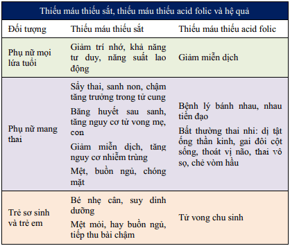
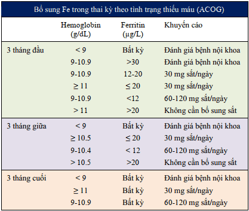
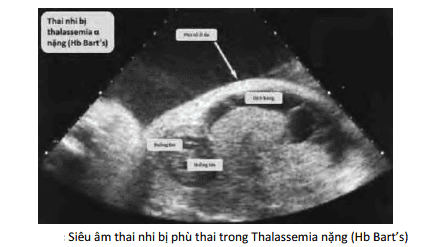
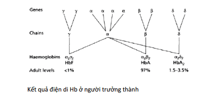
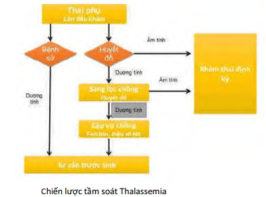
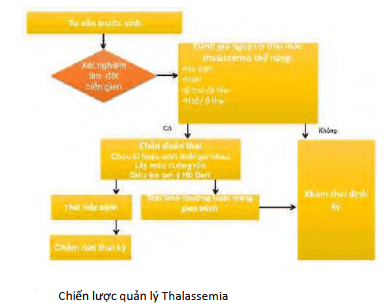

Thiếu máu trong thai kỳ ảnh hưởng đến cả mẹ và con.

## Thay đổi huyết học, tuần hoàn trong thai kỳ

Thể tích huyết thanh tăng từ tuần thứ 6 trong thai kì và ổn định ở tuần 28-30. Tổng lượng huyết thanh tăng khoảng 1250 ml đến cuối thai kì. Lượng huyết thanh tăng trong thai kỳ liên quan đến cân nặng của thai và số thai hơn là cân nặng của sản phụ trước sinh.

Với thai phụ, thiếu máu làm tăng tỷ lệ tử vong khi sinh, tăng nguy cơ băng huyết sau sinh, nhiễm trùng hậu sản...

Với thai nhi, thiếu máu làm tăng nguy cơ sẩy thai, thai chậm tăng trưởng trong tử cung, tăng tỷ lệ chết chu sinh. Riêng Thalassemia ở thai nhi có thể ảnh hưởng đến thai nhi ở các mức độ khác nhau, từ không đe dọa đến đe dọa nặng nề hay gây tử vong cho thai nhi/sơ sinh.

## Phân loại thiếu máu trong thai kỳ

Phân loại thiếu máu theo CDC:

- Hb<10.5 g/dL trong 3 tháng giữa.
- Hb<11 g/dL trong 3 tháng đầu và 3 tháng cuối.
- Hb<10.5 g/dL trong 3 tháng giữa.
- Hb<11 g/dL trong 3 tháng đầu và 3 tháng cuối.

Có 3 nhóm nguyên nhân gây thiếu máu trong thai kỳ:

1. Do thiếu sắt và/hoặc thiếu acid folic.
2. Do mất máu.
3. Do tán huyết (tán huyết di truyền hoặc mắc phải).

## Thiếu máu thiếu sắt

### Hệ quả

Hệ quả của thiếu máu thiếu sắt, thiếu máu thiếu acid folic

### Chẩn đoán

:::note[Tiêu chuẩn chẩn đoán thiếu máu thiếu sắt]
Chẩn đoán thiếu máu thiếu sắt và thiếu máu do thiếu acid folic trong thai kỳ dựa trên huyết đồ và dựa trên nồng độ ferritin huyết thanh:

- Lâm sàng: Thiếu máu nhẹ, thai phụ thường than chóng mặt, hoa mắt, nhức đầu, ù tai, khó thở khi gắng sức, tim đập nhanh. Thiếu máu trung bình, nặng, khám sẽ phát hiện da khô, niêm nhạt, môi khô, lưỡi nứt nẻ, âm thổi thâm thu ở mỏm tim, tổn thương thần kinh.
- Cận lâm sàng: Huyết đồ cho thấy nồng độ Hb<11 g/dL, HCt<30%, MCV (mean cell volume)<80 fL, MCH (mean cell hemoglobin)<28 pg, MCHC (mean cell hemoglobin concentration)<32 g/dL. Ferritin huyết thanh<10-50 µg/L. Ferritin huyết thanh<10 µg/L trong trường hợp nặng.
- Cận lâm sàng: Huyết đồ cho thấy nồng độ Hb<11 g/dL, HCt<30%, MCV (mean cell volume)<80 fL, MCH (mean cell hemoglobin)<28 pg, MCHC (mean cell hemoglobin concentration)<32 g/dL. Ferritin huyết thanh<10-50 µg/L. Ferritin huyết thanh<10 µg/L trong trường hợp nặng.

:::

### Điều trị

Thiếu máu thiếu sắt nhẹ-trung bình cần được điều trị với 100-200 mg sắt nguyên tố/ngày, uống trong các bữa ăn.

Thiếu máu do thiếu acid folic cần được điều trị với 2-5mg acid folic/ngày, uống.

Thiếu máu thiếu sắt nặng cần được truyền máu và bổ sung sắt bằng đường truyền tĩnh mạch hoặc tiêm tĩnh mạch chậm dung dịch Iron Dextran Injection (50 mL). Sau 1 tuần cần xét nghiệm huyết đồ, nếu Hb tăng 0.8 g/dL và HCt tăng 1% mỗi ngày sau 1 tuần là điều trị có đáp ứng. Vẫn tiếp tục điều trị duy trì cùng liều này cho đến lúc sinh, sau sinh và cho con bú.

### Dự phòng

ACOG đề nghị bổ sung sắt nguyên tố cho thai phụ trong suốt thai kỳ, với liều lượng tùy tình trạng thiếu máu:

WHO đề nghị phụ nữ nên bổ sung 60 mg sắt nguyên tố và 200 mcg acid folic ngay từ khi mang thai cho đến suốt thai kỳ nhằm phòng ngừa thiếu máu thiếu sắt trong thai kỳ.

## Thalassemia trong thai kỳ

Thalassemia là bệnh lý thiếu máu do sự giảm sản xuất chọn lọc chuỗi globulin. Thalassemia là bệnh hemoglobin di truyền đơn gene thể lặn trên nhiễm sắc thể thường theo quy luật Mendel.

Ở Việt Nam, hàng năm có 1,700 trẻ sinh ra bị Thalassemia. Cá thể mắc bệnh có thể bị phù thai, thai lưu, hoặc thiếu máu nặng sau sinh. Cho đến nay, điều trị chủ yếu vẫn là truyền máu và thải sắt khiến bệnh lí này trở thành gánh nặng cho gia đình và xã hội. Việc sàng lọc người lành mang gien bệnh và chẩn đoán tiền sản là biện pháp kiểm soát bệnh và giảm tỷ lệ bệnh hiệu quả nhất.

Khi không có 1 chuỗi Hb, thì chuỗi còn lại sẽ không thể giữ được phân tử Hb ổn định. Phân tử bị tan rã và gây ra các tác hại.

Phân tử chỉ có chuỗi α thường mất ổn định nhanh chóng, nên β Thalassemia thường nặng hơn. Do phân tử chỉ có chuỗi β ổn định hơn, nên α Thalassemia thường nhẹ hơn.

Tổng hợp chuỗi α được quy định bởi 4 gene α thuộc NST 16, đột biến kiểu deletion của NST 16 dẫn đến Thalassemia α. Tổng hợp chuỗi β được quy định bởi 2 gene β thuộc NST 11, đột biến kiểu mutation của NST 11 dẫn đến Thalassemia β.

### β-thalassemia

Gồm 3 thể: nặng, trung gian và ẩn.

Thể nặng do đồng hợp tử 1 đột biến hay dị hợp tử kép 2 đột biến $β^0$:

- Bệnh biểu hiện sớm khi trẻ mới sinh hoặc vài tháng tuổi.
- Đặc điểm lâm sàng của thể nặng là thiếu máu nặng, vàng da, gan lách to,...
- Đứa trẻ cần được truyền máu thải sắt để duy trì sự sống. Đặc điểm huyết học của thể nặng là số lượng hồng cầu giảm, nồng độ Hb<70 g/l, MCV, MCH giảm, ferritin bình thường hoặc tăng. Điện di Hb: HbF và HbA2 tăng.
- Đứa trẻ cần được truyền máu thải sắt để duy trì sự sống. Đặc điểm huyết học của thể nặng là số lượng hồng cầu giảm, nồng độ Hb<70 g/l, MCV, MCH giảm, ferritin bình thường hoặc tăng. Điện di Hb: HbF và HbA2 tăng.

Thể trung gian do kết hợp 2 đột biến $β^+$ hoặc kết hợp 1 đột biến $β^+$ và 1 đột biến $β^0$. Tình trạng thiếu máu nhẹ hơn, bệnh biểu hiện muộn hơn.

Thể ẩn (người lành mang gene bệnh) thường do dị hợp tử 1 đột biến. Thể ẩn hiếm khi có triệu chứng lâm sàng, chỉ phát hiện khi xét nghiệm máu tình cờ. Nồng độ Hb giảm nhẹ, MCV và MCH giảm. HbA2 tăng (3.5-7%), có kèm theo hay không kèm tăng HbF (1-3%) tùy loại đột biến.

### α-thalassemia

Gồm 4 thể tùy thuộc vào số gene bị mất.

Hội chứng thai nước (Hb Bart’s) do mất hết cùng lúc cả 4 gene α-globulin:

- Không có chuỗi α, cả 4 chuỗi Hb đều là chuỗi γ. Chuỗi γ có ái lực cực mạnh với oxy, và do đó hầu như không phóng thích oxy cho mô thai. Thai nhi bị phù, tràn dịch đa màng.
- Thường tử vong từ tuần 30 cho đến ngay sau sinh với đặc điểm lâm sàng gồm thiếu máu nặng, gan lách to, phù toàn thân, suy tim kèm các dị tật bẩm sinh khác.

Bệnh Hemoglobin H do mất 3 gene α-globin. Thiếu máu hồng cầu nhỏ nhược sắc, lách to, nồng độ HbA2 bình thường hoặc tăng nhẹ.

Bệnh α-thalassemia thể nhẹ do mất 2 gene α trên cùng 1 nhiễm sắc thể. Không có triệu chứng lâm sàng. Về
mặt huyết học có thiếu máu hồng cầu nhỏ nhược sắc nhẹ, HbA2 và HbF bình thường.

Người mang gien bệnh mất 1 gene α-globin, hoàn toàn không có triệu chứng.

### Trẻ và mẹ với Thalassemia

Với trẻ: Trẻ với Thalassemia nặng có thể không sống sót sau sinh. Do thai có thể không thích ứng với cuộc sống ngoài tử cung trong trường hợp nặng, nên nếu tầm soát Thalassemia phát hiện ra các thể rất nặng như Hb Bart’s, có thể cân nhắc thảo luận chấm dứt thai kỳ.

Với mẹ:

- Vỡ hồng cầu gây ứ đọng sắt. Lách to nhiều do phải làm việc quá sức để phá hủy lượng lớn hồng cầu có hemoglobin bất thường.
- Nhiễm trùng. Nguy cơ nhiễm trùng càng tăng cao ở các phụ nữ đã cắt lách vì cường lách.
- Biến dạng xương do tủy xương phải tăng cường hoạt động sản xuất hồng cầu để bù lại lượng hồng cầu bị vỡ, dẫn đến biến dạng xương, xương xốp hơn, dễ gãy hơn (thường gặp ở thể nặng).
- Bệnh lý tim có thể gặp ở thể nặng do ứ đọng sắt quá mức ở cơ tim, gây ra suy tim xung huyết và rối loạn nhịp tim.
- Chậm phát triển tâm thần vận động là hệ quả của tình trạng thiếu máu.

### Chẩn đoán tiền Thalassemia

Các bước của chiến lược tầm soát Thalassemia hiện nay:

Bước 1. Nhận diện tình trạng thiếu máu nhược sắc hồng cầu nhỏ bằng huyết đồ. Huyết đồ cho thấy thiếu máu hồng cầu nhỏ, nhược sắc: nồng độ Hb<11 g/dL, MCV<80 fL, MCH<27 pg.

Bước 2. Phân biệt với thiếu máu thiếu sắt bằng định lượng ferritin. Ferritin bình thường hoặc cao là chỉ định của điện di hemoglobin.

Bước 3. Định hướng phân loại Thalassemia bằng điện di Hb.

Bước 4. Xác định kiểu đột biến gien Thalassemia ở 2 vợ chồng bằng khảo sát di truyền nhằm xác định nguy cơ Thalassemia thể nặng trên thai.

Bước 5. Khảo sát di truyền trên thai (sinh thiết gai rau, chọc ối, lấy máu cuống rốn) nếu thai có nguy cơ bị Thalassemia thể nặng.

### Quản lý các thai phụ có đồng hợp tử β-Thalassemia

Quản lý thai phụ có thalassemia phải kết hợp điều trị giữa bác sĩ sản khoa, huyết học, gây mê và nữ hộ sinh.

Bất xứng đầu chậu rất thường gặp trên những sản phụ này vì tầm vóc người nhỏ do bệnh lí thalassemia gây nên.

Thai chậm tăng trưởng có thể do thai thiếu oxy mãn do mẹ thiếu máu nặng, do đó nên cố gắng giữ Hb khoảng 10 g/dl.

Điều trị truyền máu tiếp tục trong suốt thai kì nhưng ferritin không nên tăng hơn 10%.

Thai và bánh rau có khả năng giữ sắt nên thai thường không bị thiếu máu.

Đánh giá chức năng tim bằng siêu âm tim, gan, tuyến giáp mỗi tam cá nguyệt.

Sàng lọc tiểu đường trên tất cả sản phụ khi thai 16 tuần, nếu kết quả test dung nạp đường bình thường, thì nên thực hiện lại khi thai 28 tuần.

Siêu âm từ 24-26 tuần, sau đó mỗi 4 tuần để đánh giá phát triển của thai.

Nhu cầu acid folic tăng do xương tăng hoạt động. Cho acid folic hàng ngày (5 mg) để ngăn ngừa thiếu máu hồng cầu to.

Chống chỉ định uống sắt trong thai kì. Nếu chức năng tim xấu hơn trong thai kì nên sử dụng DFO, nguy cơ dị tật thai khi sử dụng DFO còn đang nghi ngờ.

Trong chuyển dạ, nếu thai kì không có biến chứng có thể theo dõi sinh thường. Khuyến cáo sử dụng gây tê ngoài màng cứng để mổ sinh và hạn chế gây mê nội khí quản do bất thường phát triển hàm mặt. Sản phụ nên cho con bú trừ trường hợp bị các bệnh lí lây truyền mẹ con.

Các phương pháp tránh thai: Không sử dụng ngừa thai bằng dụng cụ tử cung vì tăng nguy cơ nhiễm trùng, không sử dụng thuốc ngừa thai phối hợp vì tăng nguy cơ thuyên tắc mạch, trong hầu hết trường hợp nên ngừa thai bằng các phương pháp tránh thai chỉ chứa progesterone hoặc bao cao su.

Ngày nay, mong muốn tránh không mang thai và sinh ra những thai nhi có khả năng bị Thalassemia năng là khả thi. Phôi thu được từ thụ tinh trong ống nghiệm sẽ được nuôi đến giai đoạn phôi nang. Thực hiện sinh thiết phôi nang, khảo sát với các probes của Thalassemia theo phương pháp chẩn đoán di truyền trước khi làm tổ PGD, rồi mới được chuyển vào lòng tử cung. Tế bào máu cuống rốn của trẻ sơ sinh sẽ được giữ lưu trữ lại và nuôi cấy để cấy ghép cho các bệnh nhân.

## Nguồn tham khảo

- TEAM-BASED LEARNING - Trường Đại học Y Dược Thành phố Hồ Chí Minh 2020.
