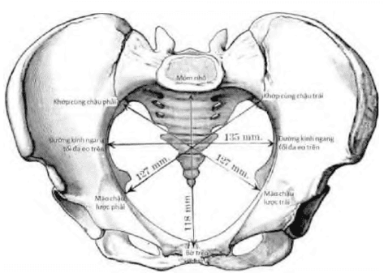
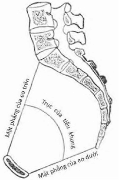
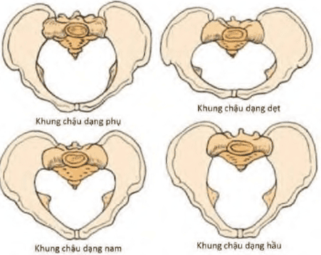

Khung chậu có vai trò rất quan trọng trong sản khoa, vì thai từ trong tử cung muốn sinh qua ngã âm đạo phải vượt qua được đoạn đường bên trong lòng khung chậu.

Khung chậu được cấu tạo bởi 4 xương: phía trước và 2 bên là 2 xương chậu, phía sau là xương cùng-cụt. Mặt trong xương chậu có gờ vô danh chia khung chậu làm 2 phần: đại khung phía trên và tiểu khung phía dưới.

Tiểu khung là phần quan trọng nhất vì ngôi thai phải vượt qua tiểu khung để đi ra ngoài qua ngã âm đạo. Trên đoạn đường đi từ trong ra ngoài này, thai nhi phải lần lượt vượt qua các vòng eo hẹp, có thể được cấu tạo bằng xương, hay bằng xương và cân-cơ, đó là eo trên, eo giữa và eo dưới.

Khi nhìn ngang, lòng tiểu khung có dạng 1 ống cong về phía trước với 2 thành trước và sau không đều nhau. Thành trước ngắn khoảng 4 cm tương ứng với măt sau khớp vệ. Thành sau dài 12-15 cm tương ứng mặt trước xương cùng và xương cụt.

Khi ngôi thai đi qua eo trên gọi là thì lọt, đi từ eo trên đến eo dưới thì gọi là thì xuống; ra khỏi eo dưới gọi là thì sổ.

## Eo trên

Eo trên được giới hạn ở phía sau là mỏm nhô của xương cùng, ở 2 bên là 2 đường vô danh của 2 xương cánh chậu, ở phía trước là mặt sau của khớp vệ. Như vậy, eo trên là 1 vòng xương cứng, có số đo bất biến trong chuyển dạ.

Kích thước của eo trên được thể hiện qua các đường kính (diameter). Các đường kính quan trọng là đường kính trước-sau, đường kính chéo, đường kính ngang hữu dụng:

_Các đường kính eo trên._

- Các đường kính trước sau:
  - Đường kính mỏm nhô-thượng vệ 11 cm.
  - Đường kính mỏm nhô-hạ vệ 12 cm là đường kính duy nhất của eo trên có thể đo được bằng tay, nhưng lại chỉ phản ánh gián tiếp đường kính trước-sau hữu dụng của eo trên.
  - Đường kính mỏm nhô-hậu vệ 10.5 cm là đường kính quan trọng nhất vì là đường kính thật sự mà ngôi thai phải vượt qua, nên còn gọi là đường kính hữu dụng.
- Các đường kính chéo: Các đường kính chéo đi từ khớp cùng-chậu 1 bên (ở phía sau) đến gai mào chậu lược bên đối diện (ở phía trước) có trị số bình thường 12.75 cm.
- Các đường kính ngang:
  - Đường kính ngang tối đa 13.5 cm là khoảng cách xa nhất giữa 2 đường vô danh. Tuy là đường kính lớn nhất, nhưng ngôi thai không thể sử dụng được đường kính này, do đường kính này nằm quá gần với mỏm nhô. Đường kính này không có giá trị về mặt sản khoa.
  - Đường kính ngang hữu dụng 12.5 cm là đường kính ngang tưởng tượng, đi ngang qua trung điểm của đường kính trước-sau, có trị số khoảng 12.5 cm. Tuy là đường kính hữu dụng nhưng nó lại không đo được trên lâm sàng.

## Eo giữa

Eo giữa là mặt phẳng tưởng tượng được dựng bằng 1 điểm là mặt sau của khớp vệ, và 2 điểm khác là 2 gai hông. Mặt phẳng tưởng tượng này sẽ cắt mặt trước của xương cùng khoảng giữa đốt sống S4 và S5.

Xương cùng có dạng cong, và tạo ra 1 hõm trước xương cùng. Hõm này tạo ra 1 khúc quanh, như "khúc cua cùi chỏ trên đèo" mà thai phải vượt qua. Ở hõm này, ngôi sẽ phải xoay sở để có thể đi tiếp qua khúc quanh.

Eo giữa có cấu tạo phía sau là 1 vách xương cứng. 2 bên là 2 gai hông, tạo ra điểm nhô hẳn vào lòng của eo giữa và thắt hẹp eo này. Phần còn lại là các cơ-mạc.

Do các đặc điểm vừa kể nên khi nói đến eo giữa, ta thường nói đến đường kính ngang và độ cong xương cùng:

_Tiểu khung trên thiết đồ đứng dọc._

- Đường kính trước sau của eo giữa 11.5 cm. Đường kính này không có ý nghĩa trên lâm sàng.
- Đường kính ngang của eo giữa là khoảng cách giữa 2 gai hông 10.5 cm. Đường kính có ý nghĩa quan trọng, và là đường
  kính có đo thể được trực tiếp trên lâm sàng.
- Đường kính dọc sau là phần đường kính trước sau đi từ giao điểm với đường kính ngang qua 2 gai hông đến mặt trước xương cùng. Trị số bình thường của nó là 4.5 cm. Đường kính này phản ánh gián tiếp độ cong của xương cùng, và như vậy phản ánh gián tiếp những khó khăn mà thai có thể gặp trong hành trình vượt eo giữa.

## Eo dưới

Eo dưới tạo bởi 2 tam giác không đồng phẳng, 1 bằng xương ở phía trước và 1 bằng cân-cơ-màng ở phía sau:

1. Tam giác xương ở phía trước được tạo bởi bờ dưới khớp vệ và 2 bên là 2 nhánh tọa của xương chậu.
2. Tam giác cân-cơ-màng ở phía sau có đáy là 2 ụ ngồi, và đỉnh là đỉnh xương cụt. Dây chằng tọa-cùng được xem như 2 cạnh bên của tam giác sau của eo dưới. Do khớp cùng-cụt là 1 khớp bán động nên đỉnh xương cụt có thể bị đẩy ra sau khi ngôi thai đi ngang qua đó, nên kích thước của tam giác sau là có thể biến đổi trong cuộc sinh.

Do đặc tính không đồng phẳng, cấu tạo cứng ở phía trước và cân mạc phía sau, nên trong đa số các trường hợp, eo dưới không phải là trở ngại thực sự trên đường sinh:

- Đường kính trước sau của eo dưới 9.5-11.5 cm. Đường kính này không có ý nghĩa lâm sàng, do tính không đồng phẳng của eo dưới.
- Đường kính ngang 11 cm là khoảng cách giữa 2 ụ ngồi, có trị số cố định, đo đạc được trên lâm sàng, có ý nghĩa nhất định, nhưng không mạnh vì eo dưới thực sự không phải là trở ngại lớn trên đường sinh.

## Đánh giá khung chậu

Trên lâm sàng, khám khung chậu cung cấp ý niệm về đường sinh (giới hạn, hẹp hay biến dạng), thông việc đánh giá hay đo đạc (khi có thể) các kích thước của khung chậu.

Khám khung chậu được tiến hành khi sản phụ bắt đầu có dấu hiệu chuyển dạ sinh hay khi thai đã đủ trưởng thành.

- Các đường kính có thể đo đạc được gồm: (1) đường kính mỏm nhô-hạ vệ: đo được bằng thước Beaudelocque, (2) đường kính ngang eo giữa: đo được bằng thước De Lee và (3) đường kính ngang eo dưới đo được bằng thước dây hay thước Beaudelocque.
- Các đường kính có thể khám và đánh giá được gồm: (1) đường kính ngang eo trên: cảm nhận qua độ dài của phần gờ vô danh sờ thấy được, bình thường chỉ sờ được khoảng 1/2 của gờ vô danh, (2) độ cong xương cùng chỉ có thể cảm nhận 1 cách tương đối, và (3) độ rộng hẹp của góc tạo bởi 2 ngành ngồi-mu.

Quang kích chậu phương pháp dùng X-quang để đo đạc các kích thước của khung chậu, nhằm có được trị số chính xác của các đường kính khung chậu.

Dù có được những thông số về kích thước, nhưng không có chỉ định chụp quang kích chậu thường qui. Việc chụp kích quang chậu thường qui cho mọi sản phụ là tăng nguy cơ mổ sinh không cần thiết do thai nhi còn có khả năng tự bình chỉnh để vượt qua các trở ngại cơ học trên tiểu khung.

## Xếp loại khung chậu

_4 dạng khung chậu theo Caldwell-Moloy._

Khung chậu dạng phụ (gynecoid) là dạng khung chậu thường thấy nhất ở phụ nữ (50.6%). Là dạng khung chậu thuận lợi nhất cho cuộc sanh.

Khung chậu dạng hầu (andropoid) giống như khung chậu ở loài khỉ (22.7%). Tỉ lệ sanh bằng dụng cụ rất cao với dạng khung chậu này.

Khung chậu dạng nam (android) giống khung chậu đàn ông (22.4%). Dạng này gây nhiều khó khăn cho cuộc sanh.

Khung chậu dạng dẹt (platypelloid) là dạng khung chậu hiếm gặp nhất ở phụ nữ (4.4%). Dạng khung chậu này gây khó khăn rất nhiều cho thì lọt của ngôi.

## Nguồn tham khảo

- TEAM-BASED LEARNING - Trường Đại học Y Dược Thành phố Hồ Chí Minh 2020.
