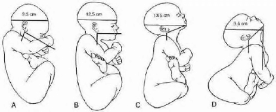
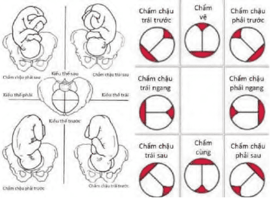

Ngôi, thế kiểu thế là cách dùng để mô tả tư thế, vị trí tương đối của phần thai sẽ đi qua đường sanh, so với các điểm mốc.

## Ngôi

Ngôi được định nghĩa là phần của thai nhi trình diện trước eo trên để qua đó ngôi sẽ lọt và tiến triển theo cơ chế sanh của nó:

- Ngôi có thể là ngôi dọc. Trong ngôi dọc, trục dọc của thai song song với trục của của cơ thể người mẹ. Ngôi dọc có thể là ngôi đầu hoặc ngôi mông.
- Ngôi cũng có thể là ngôi ngang. Trong ngôi ngang, trục của thai nhi vuông góc với trục của cơ thể người mẹ. Đôi khi, trục của thai nhi hợp với trục mẹ thai nhi nằm xéo, không ổn định và sẽ định hình trở thành ngôi dọc hoặc ngôi ngang khi vào chuyển dạ.

_Ngôi đầu._

Tùy theo tương quan giữa đầu và thân thai nhi, ta có:

- Ngôi chỏm là ngôi đầu với đầu cúi tối đa, cằm chạm vào thân.
- Ngôi thóp trước là ngôi đầu với đầu ở tư thế trung gian, thóp trước trình trước eo trên.
- Ngôi trán là ngôi đầu với đầu ở tư thế trung gian, trán trình trước eo trên.
- Ngôi mặt là ngôi đầu với đầu ngửa tối đa thật tốt, gáy chạm vào lưng.

Mỗi ngôi có 1 điểm chuẩn đặc biệt gọi là mốc của ngôi. Mốc là đặc điểm giúp nhận diện được ngôi:

- Ngôi chỏm có mốc là thóp sau.
- Ngôi trán có mốc là gốc mũi.
- Ngôi mặt có mốc là cằm.
- Ngôi mông có mốc là đỉnh xương cùng.
- Ngôi ngang có mốc là mỏm vai.

## Thế

Thế là tương quan giữa điểm mốc của ngôi với bên phải hoặc bên trái khung chậu người mẹ.

Như vậy mỗi ngôi có 2 thế:

- Thế phải.
- Thế trái.

## Kiểu thế

Kiểu thế là tương quan giữa điểm mốc của ngôi với các điểm mốc của khung chậu người mẹ:

1. Gai mào chậu lược.
2. Khớp cùng chậu.
3. Điểm chính giữa của gờ vô danh.

Như vậy mỗi ngôi có 6 kiểu thế:

- Trái trước.
- Trái ngang.
- Trái sau.
- Phải trước.
- Phải ngang.
- Phải sau.

Riêng với ngôi ngang, cần xác định được vai ở phía phải hay trái của người mẹ và lưng thai ở phía trước hay phía sau, để có thể mô tả được kiểu của thai nhi nằm trong tử cung.

## Chẩn đoán ngôi thế kiểu thế

Có nhiều phương pháp chẩn đoán ngôi, thế, kiểu thế: sờ nắn bụng, thăm khám âm đạo, vị trí nghe tim thai. Trong những trường hợp khó, có thể sử dụng đến siêu âm hoặc X-quang trong trường hợp hãn hữu.

### Leopold

4 thủ thuật Leopold giúp xác định ngôi và thế thai nhi.

Thủ thuật thứ nhất: Dùng 2 bàn tay nắn nhẹ nhàng vùng đáy tử cung để xác định cưc nào là của thai nhi (đầu hay mông) đang ở vùng đáy của tử cung. Trên hình là cực mông ở đáy tử cung.

Thủ thuật thứ hai: Nắn nhẹ nhàng nhưng sâu ở 2 bên bụng để xác định bên nào là lưng, bên nào là chi của thai nhi. Trên hình là lưng ở bên phải, chi ở bên trái.

Thủ thuật thứ ba: Người khám dùng ngón cái và các ngón còn lại của bàn tay phải nắn vùng trên xương vệ của sản phụ để xác định lại tên của phần thai nằm ở đoạn dưới của tử cung. Trên hình là cực đầu ở đoạn dưới tử cung.

Thủ thuật thứ tư: người khám xoay người lại, mặt hướng về phía chân sản phụ. Dùng các đầu ngón tay ấn sâu trên xương vệ theo hướng trục của eo trên. Nếu là ngôi đầu, 1 bàn tay sẽ bị chặn lại bởi 1 khối u tròn (ụ đầu), trong khi bàn tay kia xuống được sâu hơn. Trên hình là ngôi chỏm với đầu cao chưa lọt, bàn tay hội tụ, hướng chụm vào nhau. Ụ đầu cùng bên với chi trong ngôi chỏm và ngược bên với chi trong ngôi mặt. Khi đầu chưa lọt, 2 bàn tay sẽ có hướng hội tụ, do có thể ôm được đầu thai dễ dàng. Đầu càng xuống thấp trong tiểu khung, sờ ụ đầu càng khó. Khi đầu đã lọt, 2 bàn tay có hướng phân kỳ ra ngoài, vì không ôm được chỏm đã xuống sâu trong tiểu khung.

### Thăm khám âm đạo

Thăm khám âm đạo trong lúc chuyển dạ, cổ tử cung đã mở, tạo điều kiện tốt nhất và thuận lợi nhất cho việc tìm và xác định các điểm mốc của ngôi, nhờ đó, cung cấp yếu tố giúp chẩn đoán chính xác ngôi, thế, kiểu thế. Cần lưu ý khi khám âm đạo:

Trong ngôi chỏm phải xác định vị trí của các thóp và rãnh liên đỉnh.

_Các kiểu thế trong ngôi chỏm._

Trong ngôi mặt, cần xác định vị trí của cằm.

Trong ngôi mông, cần xác định vị trí của đỉnh xương cùng
và 2 ụ ngồi.

### Vị trí ổ tim thai

Thông thường tiếng tim thai truyền theo cột sống của thai nhi nằm sát với thành tử cung, hoặc qua mỏm cùng vai. Vì vậy, xác định vị trí nghe được tim thai rõ nhất qua ống nghe Pinard là phương pháp hỗ trợ chẩn đoán.

Trong ngôi chỏm và ngôi mông, tim thai nghe rõ nhất ở phía lưng thai nhi và mỏm vai. Trong ngôi mặt, tim thai nghe rõ nhất ở vùng ngực thai.

### Siêu âm

Đôi khi việc thăm khám qua thành bụng hay qua khám âm đạo không phải lúc nào cũng dễ dàng, ví dụ như sản phụ quá mập, thành bụng quá dày, quá chắc, nước ối quá nhiều. Trong trường hợp này, siêu âm là một biện pháp an toàn, được sử dụng cho chẩn đoán ngôi và thế.

## Nguồn tham khảo

- TEAM-BASED LEARNING - Trường Đại học Y Dược Thành phố Hồ Chí Minh 2020.
