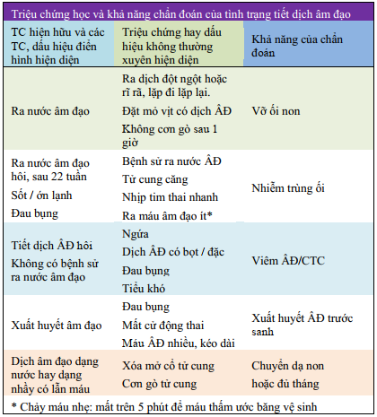

Ối vỡ non được định nghĩa tình trạng không toàn vẹn của các màng đệm và màng ối, dẫn đến chảy nước ối ra ngoài, xảy ra khi thai phụ chưa có chuyển dạ.

## Yếu tố nguy cơ

- Tiền căn ối vỡ non.
- Xuất huyết 3 tháng đầu thai kỳ.
- Mẹ hút thuốc lá.
- Nhiễm trùng đường sinh dục dưới.
- Các yếu tố của chuyển dạ sinh non.

## Chẩn đoán

### Lâm sàng

Mọi thai phụ đến bệnh viện vì ra nước âm đạo, trước tiên bắt buộc phải loại trừ trường hợp thượng khẩn là cấp cứu sa dây rốn bằng cách nghe tim thai. Không đi tìm sa dây rốn bằng khám âm đạo.

Kế đến, dùng mỏ vịt được tiệt trùng tốt để khảo sát và đánh giá hiện tượng ra nước ở âm đạo, bằng quan sát mắt thường và nghiệm pháp Valsava, test Nitrazine.

Chẩn đoán vỡ ối được xác định dễ dàng khi thấy nước ối với đặc tính lâm sàng điển hình: ra nước đột ngột, lượng nhiều, liên tục và có mùi điển hình của nước ối.

Không được thực hiện khám âm đạo bằng tay vì điều này không giúp gì cho việc thực hiện chẩn đoán và có thể dẫn đến tình trạng nhiễm trùng.

Đặt băng vệ sinh âm hộ và kiểm tra miếng băng vệ sinh 1h sau bằng cách nhìn và đánh giá mùi.

:::note[Tiêu chuẩn chẩn đoán ối vỡ non]

:::

### Cận lâm sàng

#### Test Nitrazine

Dựa trên cơ sở là dịch tiết của âm đạo và nước tiểu có tính acid, trong khi nước ối có tính kiềm. Giữ mẫu giấy nitrazine bằng 1 kẹp Kelly và nhúng nó vào dịch đọng lại ở lưỡi mỏ vịt. Dịch có tính kiềm (hiện diện của nước ối) sẽ được thể hiện bằng sự đổi màu của giấy thử, từ màu vàng thành màu xanh lơ.

:::caution[Lưu ý]
Máu và 1 số nhiễm trùng âm đạo có thể cho kết quả dương tính giả.
:::

#### Test dương sỉ

Test lá dương xỉ dựa trên đặc tính kết tinh tạo tinh thể hình lá dương xỉ của muối NaCl trong môi trường có mặt estrogen (dịch ối). Trải 1 ít dịch cần khảo sát lên trên 1 lam kính và để nó khô, sau đó xem dưới kinh hiển vi. Nước ối sẽ kết tinh và có thể tạo nên các cấu trúc có hình lá dương xỉ. Âm tính giả rất thường gặp.

#### Siêu âm

Đánh giá lượng nước ối, ngôi thai, tăng trưởng thai.

#### 1 số xét nghiệm khác

Công thức máu và CRP đánh giá dấu hiệu nhiễm trùng.

CTG hoặc Non-stress test nếu cần.

Liên cầu nhóm B (GBS) nếu cần.

## Xử trí

Xử trí ối vỡ non tùy thuộc 2 yếu tố chủ chốt:

1. Tuổi thai ở thời điểm vỡ ối.
2. Tình trạng có hay không có nhiễm trùng ối.

### Có dấu hiệu nhiễm trùng

Nếu có dấu hiệu nhiễm trùng (sốt, dịch âm đạo có mùi hôi), cho kháng sinh như trong điều trị nhiễm trùng ối và phải chấm dứt thai kỳ bất chấp tuổi thai.

- Khi đã có nhiễm trùng thì không được trì hoãn chấm dứt thai kỳ vì bất cứ lý do gì.
- Không được dùng corticosteroid trong trường hợp có dấu hiệu nhiễm trùng, bất chấp tuổi thai.

### Không có dấu hiệu nhiễm trùng

#### Điều trị mong đợi

Đối với thai < 34 tuần không có nhiễm trùng, không đe dọa mẹ và thai, cần điều trị mong đợi, tư vấn về nguy cơ và lợi ích.

Cho kháng sinh để giảm nguy cơ nhiễm trùng ở mẹ và ở sơ sinh và trì hoãn cuộc sinh: thường là kháng sinh nhắm vào Streptococcus nhóm B. Dùng Ampicillin, đường tĩnh mạch, 2 g mỗi 6h hoặc Penicillin G, đường tĩnh mạch, 2 triệu đơn vị mỗi 6h, cho đến lúc sinh.

:::caution[Lưu ý]
Với ối vỡ non, thai non tháng phức bộ [Amoxicillin + Acid Clavulanic] bị chống chỉ định do khả năng gây viêm ruột hoại tử ở sơ sinh. Cụ thể:

- Lựa chọn 1:
  - Azithromycin 1 g (uống) ngay khi nhập viện, và
  - Ampicillin 2 g (tĩnh mạch chậm) mỗi 6h trong 48h, sau đó
  - Amoxicillin 500 mg (uống) mỗi 8h trong 5 ngày.
- Lựa chọn 2:
  - Ampicillin 1 g (uống) ngay khi nhập viện, và
  - Cefazolin 1 g (tĩnh mạch chậm) mỗi 8h trong 48h, sau đó
  - Cephalexin 500 mg (uống) mỗi 6h trong 5 ngày.
- Trường hợp nguy cơ cao phản ứng phản vệ với Penicillin:
  - Azithromycin 1 g (uống) ngay khi nhập viện, và
  - Clindamycin 900 mg (truyền tĩnh mạch) mỗi 8h trong 48h + Gentamicin 5 mg/kg (truyền tĩnh mạch) mỗi 24h trong 48h, sau đó
  - Clindamycin 300 mg (uống) mỗi 8h trong 5 ngày.
- Trường hợp dị ứng nặng với Penicillin, GBS (+), kháng Clindamycin hoặc không có kháng sinh đồ:
  - Azithromycin 1 g (uống) ngay khi nhập viện, và
  - Vancomycin 20 mg/kg (tối đa 2g) (truyền tĩnh mạch) mỗi 24h trong 48h. Lưu ý xét nghiệm creatinine trước khi sử dụng Vancomycin. _Yếu tố nguy cơ của độc tính trên thận liên quan đến vancomycin có thể được chia thành 3 nhóm: yếu tố liên quan đến việc sử dụng vancomycin, yếu tố liên quan đến bệnh nhân và việc sử dụng đồng thời các thuốc gây độc trên thận. Yếu tố liên quan đến việc sử dụng vancomycin bao gồm sử dụng vancomycin liều cao, ví dụ nồng độ đáy > 15mg/L và thời gian sử dụng kéo dài. Liều của vancomycin vượt quá 4g/ngày liên quan đến tăng độc tính trên thận. Các chỉ số kết hợp với nồng độ đáy bệnh nhân trong theo dõi liều vancomycin có thể hữu ích, tuy nhiên nồng độ đáy cao có thể gây độc tính trên thận hay không vẫn chưa rõ ràng._

:::

Dùng corticosteroid cho mẹ để giảm khả năng xảy ra hội chứng suy hô hấp cấp ở sơ sinh. Dùng ngay cả khi không chắc có đủ thời gian để hoàn thành đủ liều corticosteroids.

Xét nghiệm máu mỗi 48h hoặc khi nghi ngờ có dấu hiệu nhiễm trùng.

Siêu âm kiểm tra chỉ số ối mỗi 48h nếu ối bình thường, mỗi ngày nếu thiểu ối hoặc nghi ngờ ra nước âm đạo nhiều.

Đặt mỏ vịt đánh giá tính chất nước ối mỗi 3 ngày.

Không sử dụng thuốc cắt cơn.

Cân nhắc điều trị ngoại trú, tái khám sau 1 tuần nếu:

- Ối vỡ non không ra thêm nước sau 7 ngày điều trị kháng sinh dự phòng.
- Lượng nước ối bình thường trên siêu âm.
- Sản phụ ký tư vấn đồng thuận về lợi ích và nguy cơ của việc điều trị mong đợi.
- Hướng dẫn sản phụ tự đo nhiệt độ 2 lần/ngày, các dấu hiệu cần tái khám như sốt, ra nước âm đạo, dịch âm đạo hôi, thai máy ít,...

#### Chấm dứt thai kỳ

Chấm dứt thai kỳ khi:

- Thai ≥ 34 tuần hoặc < 24 tuần.
- Chuyển dạ thực sự.
- Sa dây rốn.
- Rau bong nong.
- Bất thường sức khỏe mẹ và con.
- Nghi ngờ hoặc xác định nhiễm trùng ối.

Dùng Magnesium sulfate bảo vệ não ở trẻ sinh non:

- Chỉ định thai 24 tuần đến < 32 tuần có nguy cơ sinh non trong vòng 24h, áp dụng đơn thai và đa thai.
- Thường quy từ 28 đến < 32 tuần. Cân nhắc trường hợp 24 đến < 28 tuần.
- Chống chỉ định khi mẹ bị nhược cơ.
- Thận trọng khi mẹ có tiền căn thiếu máu cơ tim, rối loạn dẫn truyền.
- Trường hợp mẹ tăng huyết áp hay tiền sản giật sử dụng theo phác đồ [Tăng huyết áp thai kỳ](/san-khoa/007-02_tang-huyet-ap-thai-ky/#magnesium-sulfate).
- Liều Magnesium sulfate 4.5 g liều duy nhất, truyền tĩnh mạch chậm trong 20-30 phút. Giảm liều khi BN có thiểu niệu hay suy thận.
- Khi có chỉ định chấm dứt thai kỳ, Magnesium sulfate được chỉ định lý tưởng nhất trước sinh 4h.

Khi có chuyển dạ, đánh giá tiến triển cuộc chuyển dạ mỗi 4h ở giai đoạn tiềm tàng và 1-2h ở giai đoạn hành động, đánh giá các dấu hiệu nhiễm trùng ối.

Nếu màng ối đã vỡ hơn 12h, dùng kháng sinh dự phòng, với mục đích giúp giảm nguy cơ nhiễm Streptococcus nhóm B cho trẻ sơ sinh. Nếu sau khi sinh xong mà không có dấu hiệu nhiễm trùng, ngưng kháng sinh.

Các phương pháp chấm dứt thai kỳ:

- Ưu tiên sinh đường âm đạo, mổ lấy thai khi có chỉ định.
- Theo dõi sinh đường âm đạo: không có dấu hiệu nhiễm trùng, không có dấu hiệu de dọa mẹ và thai, có thể theo dõi sau 12h nếu không có chuyển dạ tự nhiên, khởi phát chuyển dạ dựa trên Bishop:
  - Bishop ≥ 6 khởi phát bằng Oxytocin.
  - Bishop < 6 gây chín muồi cổ tử cung bằng PGE2 trước khi dùng Oxytocin.

## Nhiễm trùng ối

Nhiễm trùng ối là 1 nhiễm trùng ngoại khoa. Khi có nhiễm trùng ối, buộc phải giải quyết ổ nhiễm, tức là nước ối, màng ối. Điều trị gồm có:

1. Kháng sinh.
2. Chấm dứt thai kỳ.

Khi đã có nhiễm trùng ối, nếu không chấm dứt thai kỳ, tình trạng nhiễm trùng sẽ diễn tiến nặng dần, đưa đến nhiễm trùng huyết và tử vong.

Sử dụng kháng sinh phổ rộng và phối hợp đến sau sinh và đã kiểm soát được nhiễm trùng, ít nhất là đã được 48h liên tục không dấu nhiễm trùng.

Đánh giá tình trạng cổ tử cung trước khởi phát chuyển dạ. Cuộc mổ có thể là nguy hiểm hơn cuộc sinh, do khả năng vấy bẩn phúc mạc. Cần cân nhắc lợi ích và nguy cơ của sinh đường âm đạo và sinh mổ.

Xem thêm tại [Nhiễm trùng ối](/san-khoa/005-04_nhiem-trung-oi/).

## Nguồn tham khảo

- TEAM-BASED LEARNING - Trường Đại học Y Dược Thành phố Hồ Chí Minh 2020.
- PHÁC ĐỒ ĐIỀU TRỊ SẢN PHỤ KHOA - Bệnh viện Từ Dũ.
