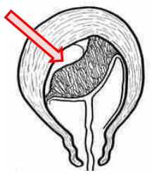
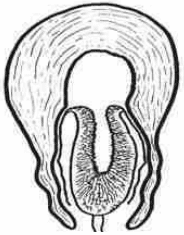
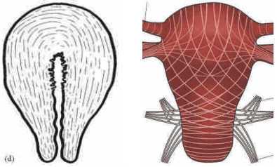

Mỗi năm trên thế giới có khoảng nửa triệu người chết vì các vấn đề liên quan đến thai sản và sinh đẻ. Phần lớn trong số này là do băng huyết sau sinh. Mặc dù đã có những tiến bộ lớn trong chăm sóc sản khoa thiết yếu và hồi sức, nhưng cuộc sinh vẫn được xem là biến cố có rủi ro tử vong cao.

## Xử trí tích cực giai đoạn 3

### Sinh lý giai đoạn 3

Giai đoạn 3 của chuyển dạ, còn gọi là thời kỳ sổ rau và cầm máu, là khoảng thời gian từ sau khi sổ thai đến khi rau bong và được đẩy ra ngoài âm đạo. Thời gian trung bình của toàn bộ thời kỳ sổ rau và cầm máu vào khoảng 6-30 phút nếu không có các can thiệp từ bên ngoài. Tổng lượng máu mất trung bình trong giai đoạn 3 của chuyển dạ thường khoảng 300 gram.

Về mặt sinh lý, giai đoạn sổ rau được chia ra 3 thì:

1. Bong rau.
2. Sổ rau.
3. Cầm máu.

#### Bong rau

Thì bong rau là khoảng thời gian từ sau khi sổ thai đến khi rau bong hoàn toàn khỏi vị trí bám trên tử cung.

Sau khi thai sổ, lòng tử cung trở nên trống, tử cung co lại. Cùng lúc đó, do bánh rau không có tính đàn hồi, nên nó sẽ bị bóp nhăn nhúm lại và bong tróc 1 phần khỏi vị trí bám của nó trên buồng tử cung. Tại vị trí bong tróc nguyên khởi này, các mạch máu của mẹ sẽ bị hở ra, gây chảy máu vào các khoảng trống tạo ra do bong tróc. Máu chảy ra bị giới hạn bởi sự bám của bánh rau sẽ tạo thành 1 khối máu tụ sau rau. Máu tiếp tục chảy, làm khối máu tụ này to dần, và lan rộng dần, lần lượt tách các phần rau còn lại tách khỏi vị trí bám, cho đến
khi rau bong hoàn toàn khỏi thành tử cung.

_Thì bong rau._

Trong khoảng thời gian hình thành khối tụ máu, tử cung không có cơn co, được gọi là khoảng nghỉ sinh lý của tử cung trong giai đoạn 3 của chuyển dạ.

#### Sổ rau

Thì sổ rau là khoảng thời gian mà rau, lúc này đã bong hoàn toàn, di chuyển từ buồng tử cung ra ngoài.

Sau khoảng nghỉ ngắn, tử cung bắt đầu co trở lại. Dưới tác dụng của cơn co, toàn bộ bánh rau đã bong sẽ được tống xuất ra khỏi buồng tử cung để vào âm đạo.

Có 2 kiểu sổ rau:

1. Kiểu Beaudelocque là kiểu sổ rau phổ biến. Nếu khối tụ máu hình thành ở trung tâm của bánh rau, và sau đó lan rộng ra phía ngoại vi của bánh rau, thì rau sẽ phồng lên ở trung tâm, rồi tróc dần ra ngoài, đưa mặt con (fetal side) của rau ra trước cổ tử cung để được sổ. Kiểu bong và sổ rau này được gọi là kiểu Beaudelocque, là kiểu sổ rau phổ biến và ít có nguy cơ mất máu.
2. Kiểu Duncan ít phổ biến. Nếu khối tụ máu khởi đầu ở vùng rìa bánh rau và sau đó lan không đều về phía trong thì cơ chế hình thành khối tụ máu có áp lực sẽ kém hiệu quả, rau bong kém hơn, với lượng máu sẽ chảy ra ngoài trước khi rau bong, và rau sẽ trình các phần đã bong trước ra ngoài, thường là mặt mẹ (maternal side). Kiểu sổ rau này không phổ biến, gọi là kiểu Duncan, thường gặp trong các trường hợp rau bám thấp về phía dưới của buồng tử cung, là kiểu sổ rau thường kèm theo mất nhiều máu, kể cả trước khi rau bong hoàn toàn và thêm vào đó là 1 thì cầm máu kém hiệu quả.

_Thì sổ rau._

#### Cầm máu

Thì cầm máu là khoảng thời gian bắt đầu từ sau khi rau
được tống xuất khỏi buồng tử cung ra âm đạo cho đến khi
hiện tượng chảy máu chấm dứt hoàn toàn.

Sau khi tống xuất rau, toàn bộ tử cung, lúc này đã hoàn toàn rỗng, sẽ co lại thành một khối cầu bằng cơ, gọi là khối cầu an toàn.

Có 2 cơ chế cầm máu:

1. Cơ chế cầm máu cơ học, đảm bảo bằng sự co cơ tử cung gây siết các mạch máu bị hở. Cơ tử cung được tạo thành từ các sợi cơ vòng, cơ dọc và các bó cơ đan chéo. Sự co thắt của các bó cơ đan chéo ở vùng thân tử cung sẽ xiết chặt các mạch máu, và đảm bảo sự cầm máu về mặt cơ học.
2. Cơ chế cầm máu bằng cục máu đông bịt kín các đầu mạch máu bị hở. Sau cầm máu cơ học là cầm máu bằng cục máu đông. Hiện tượng cầm máu sẽ được hoàn chỉnh bởi cơ chế đông máu bình thường tạo thành các cục máu đông bịt kín các đầu mạch máu.

_Thì cầm máu._

Cần lưu ý rằng các sợi cơ đan chéo chỉ hiện diện ở phần thân tử cung, do đó chỉ đảm bảo được cầm máu nếu nguồn chảy máu là các mạch máu diện rau bám ở thân tử cung mà thôi. Do đoạn dưới của tử cung không có các bó cơ đan chéo nên xuất huyết từ các mạch máu bị hở ở vùng này, xảy ra trong trường hợp rau bám thấp ở đoạn dưới (rau tiền đạo), luôn phải đối mặt với một tình trạng cầm máu cơ học không hiệu quả. Do cơ chế này, chảy máu trầm trọng rất thường thấy trong giai đoạn 3 của các trường hợp rau tiền đạo.

### Xử trí tích cực

Can thiệp tích cực giai đoạn 3 có làm giảm tổng lượng máu mất có ý nghĩa thống kê, nhưng lượng máu mất giảm được lại không có ý nghĩa lâm sàng (< 100 mL). Can thiệp tích cực giai đoạn 3 không làm giảm có ý nghĩa tần suất của băng huyết sau sinh.

Hiện nay, WHO vẫn khuyến khích thực hiện can thiệp tích cực giai đoạn 3 có điều kiện. Điều kiện quan trọng nhất mà WHO đưa ra để thực hiện can thiệp tích cực giai đoạn 3 là có nhân sự được huấn luyện để có thực hiện đúng kỹ thuật này.

Nội dung can thiệp tích cực giai đoạn 3 gồm:

1. Thuốc co hồi tử cung là yếu tố quan trọng nhất của can thiệp tích cực giai đoạn 3 của chuyển dạ. Oxytocin là thuốc được ưu tiên lựa chọn. Oxytocin được dùng bằng đường tiêm bắp, với liều 10 IU, thực hiện ngay sau sổ vai.

2. Kéo dây rốn có kiểm soát là thành tố thứ nhì của can thiệp tích cực giai đoạn 3. Việc thực hiện sớm sổ rau, khi tử cung đã gò dưới oxytocin, sẽ làm giảm tổng lượng máu mất. Kẹp dây rốn gần sát âm hộ, 1 tay cầm kẹp dây rốn, đặt 1 tay lên bụng sản phụ, phía trên xương vệ để giữ cho đáy tử cung không bị lộn khi kéo dây rốn. Khi có cơn co tử cung, tạo bởi oxytocin đã tiêm trước đó, khuyến khích sản phụ rặn xuống đồng thời kéo nhẹ dây rốn giúp sổ rau, đồng thời tay trên vệ chặn không cho tử cung di chuyển khi kéo dây rốn. rau sẽ nhẹ nhàng tróc và sổ khi kéo. Khi rau ra đến âm hộ, tiến hành đỡ nhẹ bánh rau bằng hai tay và xoay nhẹ đẻ sổ trọn màng rau như thường quy. Nếu dây rốn không xuống được sau khi kéo khoảng 30 giây thì ngưng kéo. Tiếp tục lại trong cơn co tử cung kế tiếp sau đó.
3. Xoa bóp đáy tử cung được thực hiện sau khi sổ rau, nhằm kích thích duy trì sự co của tử cung đảm bảo cầm máu cơ học đến khi cầm máu được thực hiện hoàn toàn bằng cơ chế đông-cầm máu.

## Băng huyết sau sinh

Băng huyết sau sinh được định nghĩa là chảy máu ≥ 500 mL, trong vòng 24 giờ sau sổ thai, từ bất kỳ nơi nào trên đường sinh.

Bất kể nguyên nhân, tốc độ mất máu trong băng huyết sau sinh là rất nhanh. Tình trạng mất máu có thể lên đến vài trăm mL mỗi phút, và tổng lượng mất máu trong vòng vài giờ có thể lên đến nhiều nghìn mL. Đây là tình trạng mất máu cấp với hệ quả trước tiên và chết người là choáng giảm thể tích. Đi sau choáng giảm thể tích, việc mất 1 lượng lớn huyết cầu sẽ dẫn đến những vấn đề liên quan đến thiếu oxy mô.

Bất cứ cuộc sinh bình thường nào cũng luôn có chảy máu trong giai đoạn sổ rau và cầm máu. Số lượng máu mất bình quân trong cuộc sinh có thể đến vài trăm mL. Tuy nhiên, do các biến đổi sinh lý trong nửa sau thai kỳ đã làm thể tích máu tăng đáng kể, khoảng 30-60%, tương ứng với 1000-2000 mL máu vào những tháng cuối của thai kỳ, nên đa số sản phụ có thể dung nạp được với tình trạng mất máu trong giai đoạn 3 mà không ảnh hưởng đến tổng trạng.

Mốc thiết lập định nghĩa là 500 mL thực ra rất tương đối, lệ thuộc vào nhiều yếu tố như căn cứ vào cảm tính chủ quan, lượng máu mất lẫn với dịch ối hay các thứ dung dịch chăm sóc, lượng máu mất vào champ phủ phẫu trường... Cần lưu ý rằng số lượng máu mất mà ta ước lượng thường chỉ bằng 1 nửa lượng máu mất thật sự, do đó việc phải đo lường lượng máu mất 1 cách tin cậy, khách quan. Vài nghiên cứu ghi nhận gần 50% sản phụ sinh ngả âm đạo bị mất tượng máu kể trên, mổ lấy thai mất khoảng 1000 mL máu. Vì thế, nếu định ngưỡng định nghĩa băng huyết sau sinh ở mức 500 mL thì có thể sẽ có các chăm sóc vượt mức cần thiết. Tuy nhiên, nếu đặt mốc định nghĩa băng huyết sau sinh lên cao hơn thì can thiệp có thể bị trễ và gây ra nguy hiểm cho sản phụ. Vì thế, nhà sản khoa cần đánh giá từng trường hợp lâm sàng cụ thể để can thiệp đúng mức và kịp
thời.

Có 3 nhóm nguyên nhân chính gây băng huyết sau sinh:

1. Đờ tử cung.
2. Tổn thương đường sinh dục.
3. Rối loạn đông máu.

### Đờ tử cung

Đờ tử cung là nguyên nhân chủ yếu gây băng huyết sau sinh.

Cầm máu cơ học bằng co hồi tử cung với sự siết chặt vết thương hở mạch máu ở diện rau bám là cơ chế chính của cầm máu.

Trong đờ tử cung sau sinh, các cơ đan chéo không hoạt động, làm mất khả năng thắt miệng của các chỗ hở của các mạch máu nơi diện rau bám làm cho cầm máu cơ học không thể xảy ra.

Nhiều nhóm nguyên nhân có thể gây đờ tử cung:

- Tử cung không còn đủ sức co hồi sau chuyển dạ kéo dài có hay không có tăng co với oxytocin.
- Tử cung quá căng trong suốt thai kỳ có đa thai, đa ối, con to.
- Chất lượng cơ tử cung kém do sinh đẻ nhiều lần.
- Nhiễm trùng trong chuyển dạ cũng là nguyên nhân phổ biến khác của đờ tử cung.

Thất bại của cầm máu cơ học các chảy máu từ diện bám không hẳn luôn luôn là do đờ tử cung. Trong trường hợp rau bám ở vị trí bất thường trên đoạn dưới của tử cung, dù tử cung không bị đờ, thậm chí co hồi rất tốt, thì vẫn có băng huyết sau sinh. Trong trường hợp này, hoạt động của cơ đan chéo không giúp đỡ cho việc cầm máu, do các cơ này chỉ hiện diện ở phần thân tử cung mà không hiện diện ở đoạn dưới. Chảy máu từ vị trí rau bám không do đờ tử cung đòi hỏi can thiệp khác hẳn với can thiệp cho chảy máu từ vị trí rau bám do đờ tử cung.

### Tổn thương đường sinh dục

Tổn thương đường sinh dục là nguyên nhân gây băng huyết sau sinh khá phổ biến. Cuộc sinh có thể dẫn đến tổn thương ở 1 hay nhiều vị trí trên đường sinh dục. Có thể chỉ là tổn thương các mạch máu lớn ở tầng sinh môn do rách tầng sinh môn-âm đạo, nhưng tổn thương có thể xảy ra ở các vị trí cao hơn như cổ tử cung, hay thậm chí là tổn thương khối cơ tử cung tức vỡ tử cung.

### Rối loạn đông máu

Rối loạn đông máu khá hiếm, nhưng khi đã xảy ra băng huyết sau sinh do rối loạn đông máu thì tiên lượng thường rất nặng.

Rối loạn đông máu có thể là:

- Có từ trước chuyển dạ.
- Mới xuất hiện trong chuyển dạ.
- Nguyên phát.
- Thứ phát.

Rối loạn đông máu có thể là có từ trước chuyển dạ như trong hội chứng tiêu sợi huyết thấy trong thai chết lưu, hay tiêu hao tiểu cầu trong hội chứng HELLP của tiền sản giật, hay trong các trường hợp hiếm hoi của các bệnh lý rối loạn đông máu thụ đắc hay bẩm sinh như bệnh máu không đông bẩm sinh do thiếu yếu tố đông máu, xuất huyết giảm tiểu cầu vô căn...

Rối loạn đông máu có thể chỉ xuất hiện trong chuyển dạ như hội chứng đông máu nội mạch rải rác (Disseminated Intravascular Coagulation) (DIC) hậu quả của tình trạng choáng phản vệ trong thuyên tắc ối, hay hậu quả của tăng tiêu thụ trong bệnh lý rau bong non.

Rối loạn đông máu có thể là do chính tình trạng tiêu thụ yếu tố đông máu trong băng huyết sau sinh. Băng huyết sau sinh gây rối loạn đông máu do tiêu thụ và rối loạn đông máu do băng huyết sau sinh làm cho băng huyết sau sinh trở thành rất nặng không còn kiểm soát được nữa.

### Phòng ngừa

Dự phòng băng huyết sau sinh có thể là dự phòng sơ cấp (primary) như nhận diện yếu tố nguy cơ của băng huyết sau sinh ở thai phụ, thực hiện phòng tránh chuyển dạ kéo dài bằng cách dùng sản đồ, thực hiện cuộc sinh an toàn và đúng kỹ thuật, kể cả sinh thường hay sinh thủ thuật.

## Nguồn tham khảo

- TEAM-BASED LEARNING - Trường Đại học Y Dược Thành phố Hồ Chí Minh 2020.
