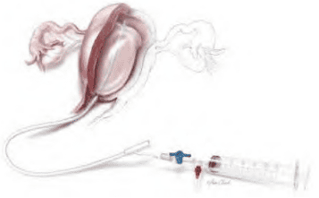
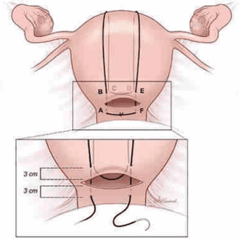
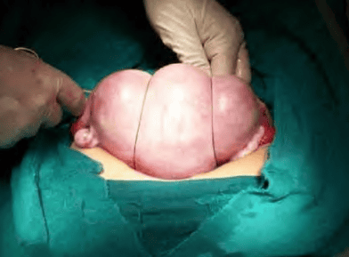
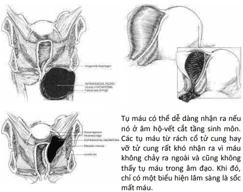
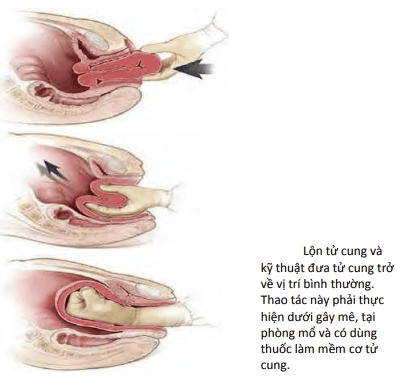

Ước tính có khoảng 140.000 phụ nữ tử vong vì băng huyết sau sanh trên thế giới mỗi năm. Có nghĩa là cứ mỗi 4 phút thì có 1 trường hợp tử vong vì băng huyết sau sanh (Post-Partum Hemorrhage) (PPH) trên thế giới, với hơn phân nửa số tử vong này là xảy ra trong vòng 24h đầu sau sanh. Băng huyết sau sanh còn đưa đến nhiều hậu quả nặng nề khác như suy hô hấp, bệnh lý về đông cầm máu, sốc, mất khả năng sinh sản, hoại tử tuyến yên...

## Băng huyết sau sinh

:::note[Định nghĩa băng huyết sau sinh]
Băng huyết sau sinh được định nghĩa là chảy máu ≥500 mL, trong vòng 24h sau sổ thai, từ bất kỳ nơi nào trên đường sinh.
:::

Bất kể nguyên nhân, tốc độ mất máu trong băng huyết sau sinh là rất nhanh. Tình trạng mất máu có thể lên đến vài trăm mL mỗi phút, và tổng lượng mất máu trong vòng vàih có thể lên đến nhiều nghìn mL. Đây là tình trạng mất máu cấp với hệ quả trước tiên và chết người là choáng giảm thể tích. Đi sau choáng giảm thể tích, việc mất lượng lớn huyết cầu sẽ dẫn đến những vấn đề liên quan đến thiếu oxy mô.

Mốc thiết lập định nghĩa là 500 mL thực ra rất tương đối, lệ thuộc vào nhiều yếu tố như căn cứ vào cảm tính chủ quan, lượng máu mất lẫn với dịch ối hay các thứ dung dịch chăm sóc, lượng máu mất vào champ phủ phẫu trường... Cần lưu ý rằng số lượng máu mất mà ta ước lượng thường chỉ bằng nửa lượng máu mất thật sự, do đó việc phải đo lường lượng máu mất tin cậy, khách quan. Vài nghiên cứu ghi nhận gần 50% sản phụ sinh ngả âm đạo bị mất tượng máu kể trên, mổ lấy thai mất khoảng 1000 mL máu. Vì thế, nếu định ngưỡng định nghĩa băng huyết sau sinh ở mức 500 mL thì có thể sẽ có các chăm sóc vượt mức cần thiết. Tuy nhiên, nếu đặt mốc định nghĩa băng huyết sau sinh lên cao hơn thì can thiệp có thể bị trễ và gây ra nguy hiểm cho sản phụ. Vì thế, nhà sản khoa cần đánh giá từng trường hợp lâm sàng cụ thể để can thiệp đúng mức và kịp
thời.

Cho mục đích mô tả, băng huyết sau sinh có thể chia thành:

1. Băng huyết sau sinh sớm, khi xảy ra trong vòng 24h đầu sau sanh.
2. Băng huyết sau sinh muộn, khi xảy ra từ 24h đến 12 tuần sau sanh.

## Yếu tố nguy cơ

Trên lâm sàng có nhiều yếu tố nguy cơ liên quan đến băng huyết sau sinh như:

- Chuyển dạ kéo dài.
- Chuyển dạ có sử dụng thuốc tăng co.
- Chuyển dạ nhanh.
- Tiền căn băng huyết sau sinh.
- Cắt tầng sinh môn.
- Tiền sản giật
- Tử cung quá căng (thai to, đa thai, đa ối).
- Mổ lấy thai.
- Người gốc Á, nhiễm trùng ối...

Khi có sự hiện diện của các yếu tố nguy cơ này, người bác sĩ lâm sàng nên hết sức lưu tâm về khả năng sẽ xảy ra băng huyết sau sinh. Tuy nhiên nên nhớ rằng băng huyết sau sinh có thể xảy ra ngay cả khi vắng mặt các yếu tố nguy cơ, hay ngay trong trường hợp không có dấu hiệu nào cảnh báo trước đó.

## Nguyên nhân

Có 3 nhóm nguyên nhân chính gây băng huyết sau sinh:

1. Đờ tử cung (thường gặp nhất chiếm 80%).
2. Tổn thương đường sinh dục (nguyên nhân hàng thứ nhì).
3. Rối loạn đông máu.

Ngoài ra có thể do sót rau, lộn tử cung.

### Đờ tử cung

Đờ tử cung là nguyên nhân chủ yếu gây băng huyết sau sinh.

Cầm máu cơ học bằng co hồi tử cung với sự siết chặt vết thương hở mạch máu ở diện rau bám là cơ chế chính của cầm máu.

Trong đờ tử cung sau sinh, các cơ đan chéo không hoạt động, làm mất khả năng thắt miệng của các chỗ hở của các mạch máu nơi diện rau bám làm cho cầm máu cơ học không thể xảy ra.

Nhiều nhóm nguyên nhân có thể gây đờ tử cung:

- Tử cung không còn đủ sức co hồi sau chuyển dạ kéo dài có hay không có tăng co với oxytocin.
- Tử cung quá căng trong suốt thai kỳ có đa thai, đa ối, con to.
- Chất lượng cơ tử cung kém do sinh đẻ nhiều lần.
- Nhiễm trùng trong chuyển dạ cũng là nguyên nhân phổ biến khác của đờ tử cung.

Thất bại của cầm máu cơ học các chảy máu từ diện bám không hẳn luôn luôn là do đờ tử cung. Trong trường hợp rau bám ở vị trí bất thường trên đoạn dưới của tử cung, dù tử cung không bị đờ, thậm chí co hồi rất tốt, thì vẫn có băng huyết sau sinh. Trong trường hợp này, hoạt động của cơ đan chéo không giúp đỡ cho việc cầm máu, do các cơ này chỉ hiện diện ở phần thân tử cung mà không hiện diện ở đoạn dưới. Chảy máu từ vị trí rau bám không do đờ tử cung đòi hỏi can thiệp khác hẳn với can thiệp cho chảy máu từ vị trí rau bám do đờ tử cung.

Tử cung bị đờ mềm nhão, không co hồi, không có khối cầu an toàn hoặc tử cung chỉ co hồi khi được xoa bóp và trở lại mềm nhão ngay sau đó.

Chẩn đoán đờ tử cung chủ yếu dựa vào lâm sàng. Thông thường sau sanh ta sẽ sờ thấy tử cung co hồi tốt, chắc, cảm nhận được "khối cầu an toàn". Ngược lại khi đờ tử cung xuất hiện, ta sẽ thấy tử cung mềm nhão, không co hồi, không có khối cầu như mô tả, cổ tử cung thường mở rộng, hoặc tử cung chỉ co hồi khi được xoa bóp và trở lại mềm nhão ngay sau đó.

### Tổn thương đường sinh dục

Tổn thương đường sinh dục là nguyên nhân gây băng huyết sau sinh khá phổ biến. Cuộc sinh có thể dẫn đến tổn thương ở 1 hay nhiều vị trí trên đường sinh dục. Có thể chỉ là tổn thương các mạch máu lớn ở tầng sinh môn do rách tầng sinh môn-âm đạo, nhưng tổn thương có thể xảy ra ở các vị trí cao hơn như cổ tử cung, hay thậm chí là tổn thương khối cơ tử cung tức vỡ tử cung.

Các yếu tố nguy cơ gây ra tổn thương đường sinh dục thường gặp là giúp sanh bằng dụng cụ, sanh ngôi mông, sanh nhanh, thai to, ngôi chẩm kiểu thế sau. Để giảm thiểu mất máu do tổn thương đường sinh dục, các sản phụ có các yếu tố nguy cơ kể trên nên được kiểm tra đường sinh dục dưới cẩn thận sau sanh.

### Rối loạn đông máu

Rối loạn đông máu khá hiếm, nhưng khi đã xảy ra băng huyết sau sinh do rối loạn đông máu thì tiên lượng thường rất nặng.

Rối loạn đông máu có thể là:

- Có từ trước chuyển dạ.
- Mới xuất hiện trong chuyển dạ.
- Nguyên phát.
- Thứ phát.

Rối loạn đông máu có thể là có từ trước chuyển dạ như trong hội chứng tiêu sợi huyết thấy trong thai chết lưu, hay tiêu hao tiểu cầu trong hội chứng HELLP của tiền sản giật, hay trong các trường hợp hiếm hoi của các bệnh lý rối loạn đông máu thụ đắc hay bẩm sinh như bệnh máu không đông bẩm sinh do thiếu yếu tố đông máu, xuất huyết giảm tiểu cầu vô căn...

Rối loạn đông máu có thể chỉ xuất hiện trong chuyển dạ như hội chứng đông máu nội mạch rải rác (Disseminated Intravascular Coagulation) (DIC) hậu quả của tình trạng choáng phản vệ trong thuyên tắc ối, hay hậu quả của tăng tiêu thụ trong bệnh lý rau bong non.

Rối loạn đông máu có thể là do chính tình trạng tiêu thụ yếu tố đông máu trong băng huyết sau sinh. Băng huyết sau sinh gây rối loạn đông máu do tiêu thụ và rối loạn đông máu do băng huyết sau sinh làm cho băng huyết sau sinh trở thành rất nặng không còn kiểm soát được nữa.

Thuyên tắc ối là biến chứng có ti lệ tử vong rất cao.

### Sót rau

Sót mô rau đôi khi gây ra chảy máu ồ ạt.

Thông thường, sau khi sanh sự co hồi của tử cung sẽ làm cho bánh rau bong tróc và tống xuất ra ngoài. Khi quá trình bong rau hoặc tống xuất bánh rau diễn ra không hoàn toàn sẽ dẫn tới sót rau.

Những yếu tố nguy cơ có thể kể ra bao gồm tiền căn mổ lấy thai, u xơ tử cung, tiền căn hút nạo lòng tử cung, bánh rau phụ... mô rau bị sót trong tử cung sẽ làm cho tử cung co hồi kém, đờ tử cung và chảy máu ồ ạt.

sót rau đôi khi gây ra bởi bất thường của bánh rau bám vào thành tử cung, khi đó bánh rau có thể bám tới bề mặt của cơ tử cung, hoặc bám vào cơ tử cung hoặc đôi khi bám xuyên qua hết lớp cơ của tử cung. Nếu sự bất thường này xảy ra ở toàn bộ bề mặt bánh rau thì toàn bộ rau sẽ bị cầm tù, không thể bong tróc được.

Khi sự bám bất thường chỉ xảy ra ở 1 phần thì bánh rau sẽ bong tróc 1 phần và phần còn lại nằm trong tử cung. Những trường hợp này có thể dẫn đến chảy máu ồ ạt đe dọa nghiêm trọng sinh mạng của sản phụ.

### Lộn tử cung

Lộn tử cung là tình trạng hiếm gặp. Đáy tử cung bị lộn ngược ra ngoài qua cổ tử cung vào trong âm đạo. Thỉnh thoảng, tử cung bị lộn ngược ra ngoài âm hộ.

Chảy máu do lộn tử cung có đặc diểm là đột ngột và thường nghiêm trọng.

## Bệnh sinh

Băng huyết sau sinh là cấp cứu sản khoa.

Bệnh sinh của băng huyết sau sinh là tình trạng mất đột ngột 1 khối lượng lớn thể tích tuần hoàn và 1 lượng lớn huyết cầu có khả năng vận chuyển oxy.

Cùng lượng máu mất nhưng ảnh hưởng trên những cá thể khác nhau là không giống nhau (ví dụ 1 người cân nặng 40 kg so với người cân nặng 60 kg, người có thiếu máu trước đó so với người không có thiếu máu trước đó, đơn thai so với đa thai...). Vì lẽ đó, trên lâm sàng băng huyết sau sinh có thể xác định dựa vào các yếu tố khách quan hơn như những biến động về mạch, huyết áp, nước tiểu, hematocrit...

Theo dõi đáp ứng huyết động đối với tình trạng mất máu sẽ cho nhiều thông tin hữu ích về lượng máu thiếu hụt cũng như tiên lượng của người bệnh. Đối với người bình thường:

- Việc mất từ 10-15% thể tích máu có thể được dung nạp tốt và chưa biểu hiện dấu hiệu, triệu chứng trên lâm sàng.
- Khi mất tới 20% thể tích thì những dấu hiệu về thiếu hụt nội mạch sẽ xuất hiện như nhịp tim nhanh, thở nhanh, chậm làm đầy mao mạch, tụt huyết áp tư thế, huyết áp kẹp (do co mạch làm tăng huyết áp tâm trương với huyết áp tâm thu còn chưa thay đổi).
- Khi mất đến 30% thể tích máu thì nhịp tim, nhịp thở tăng nhiều hơn nữa, tụt huyết áp thấy rõ.
- Mất trên 40% đến 50% thể tích sẽ làm thiểu niệu, shock, hôn mê, thậm chí là tử vong.

Bất cứ cuộc sinh bình thường nào cũng luôn có chảy máu trong giai đoạn sổ rau và cầm máu. Số lượng máu mất bình quân trong cuộc sinh có thể đến vài trăm mL. Tuy nhiên, do các biến đổi sinh lý trong nửa sau thai kỳ đã làm thể tích máu tăng đáng kể, khoảng 30-60%, tương ứng với 1000-2000 mL máu vào những tháng cuối của thai kỳ, nên đa số sản phụ có thể dung nạp được với tình trạng mất máu trong giai đoạn 3 mà không ảnh hưởng đến tổng trạng.

Lượng máu mất được tính theo công thức $EBV\frac{H_0 - H_f}{H_0}$. Trong đó $H_0$ là hematocrit ban đầu, $H_f$ là hematocrit cuối cùng. EBV là lượng máu ước tính; trọng lượng (kg) × thể tích máu trung bình. Dựa trên tuổi, giá trị thể tích máu trung bình được sử dụng để tính EBV như sau:

- Trẻ sơ sinh đẻ non: 95-100 mL/kg.
- Trẻ sơ sinh đủ tháng: 85-90 mL/kg.
- Trẻ em: 80 mL/kg.
- Đàn ông trưởng thành: 70-75 mL/kg.
- Phụ nữ trưởng thành: 65-70 mL/kg.

## Điều trị và phòng ngừa

Dự phòng băng huyết sau sinh có thể là dự phòng sơ cấp (primary) như nhận diện yếu tố nguy cơ của băng huyết sau sinh ở thai phụ, thực hiện phòng tránh chuyển dạ kéo dài bằng cách dùng sản đồ, thực hiện cuộc sinh an toàn và đúng kỹ thuật, kể cả sinh thường hay sinh thủ thuật.

### Đờ tử cung

Xử trí tích cực giai đoạn 3 chuyển dạ giúp làm giảm lượng máu mất sau sinh. Về dự phòng đờ tử cung, xử trí tích cực giai đoạn 3 của chuyển dạ có làm giảm tỷ lệ băng huyết sau sinh do đờ tử cung. Theo đó, oxytocin được sử dụng sau khi đã sổ vai trước của thai nhi, kéo dây rốn nhẹ nhàng có kiểm soát và xoa đáy tử cung sau sanh là những điểm chính yếu của việc xử trí tích cực này. Việc cho bú mẹ sớm sau sanh cũng làm tử cung co hồi tốt hơn và qua đó làm giảm mất máu sau sanh. Luôn thực hiện xoa bóp tử cung bằng tay.

Trong băng huyết sau sinh do đờ tử cung, oxytocin là lựa chọn đầu tay. Ergot alkaloids và prostaglandin là lựa chọn hàng 2nd. Vì hầu hết các trường hợp băng huyết sau sinh là do đờ tử cung, do đó cần sờ nắn tử cung qua thành bụng xem tử cung có mềm nhão không. Nếu băng huyết sau sinh là do đờ tử cung thì nhất thiết phải dùng oxytocin ở liều thích hợp và xem xét sử dụng thêm ergometrin hay prostaglandin nếu chảy máu vẫn tiếp tục:

- Oxytocin được sử dụng khá rộng rãi trong dự phòng băng huyết sau sinh như đã đề cập, trong trường hợp đờ tử cung thì oxytocin thường được tăng liều lượng và phối hợp với các tác nhân gây co hồi tử cung khác.
- Methylergonovine là tác nhân gây co hồi tử cung mạnh, đạt hiệu quả trong vài phút. Đường sử dụng luôn luôn là tiêm bắp vì tiêm mạch có thể gây ra tình trạng tăng huyết áp nguy hiểm, và cũng vì lý do đó nó không được sử dụng trên những sản phụ bị rối loạn tăng huyết áp.
- 15 methyl prostaglandin $F_{2α}$ có thể sử dụng tiêm bắp hoặc tiêm trực tiếp vào cơ tử cung và hết sức thận trọng hoặc không nên dùng ở những sản phụ bị các rối loạn về tim, phổi, gan và thận.
- Misoprostol và dinoprostone đặt hậu môn cũng giúp làm co hồi tử cung hiệu quả.

Khi tử cung gò chắc thì các tác nhân này tỏ ra không còn hiệu quả nữa khi đó các nguyên nhân khác gây ra băng huyết sau sinh cần được kiểm tra cẩn thận.

:::tip[Câu có thể giúp đánh giá nhanh tình hình hiện tại]

1. Rau đã sổ chưa? Nếu đã sổ thì bánh rau có sổ tự nhiên và đầy đủ hay không? (sót rau?)
2. Cuộc sanh diễn biến ra sao? Có can thiệp giúp sanh bằng dụng cụ hay không? (tổn thương đường sanh?)
3. Có sanh thai to, sanh khó hay sanh quá nhanh hay không? (đờ tử cung?)
4. Đã được kiểm tra tổn thương đường sinh dục chưa?
5. Hematocrit căn bản?
6. Có cục máu đông không? (bệnh lý đông máu?)

:::

Trong khi chờ xác định được nguyên nhân gây băng huyết, vẫn phải bắt đầu những biện pháp hỗ trợ như thiết lập đường truyền tĩnh mạch với kim lớn, truyền nhanh dung dịch tinh thể (truyền dịch tinh thể thay vì truyền đường vì mất máu thiếu oxy nên chuyển hóa đường làm tăng nhu cầu oxy), xác định nhóm máu, phản ứng chéo, truyền máu và các chế phẩm máu nếu cần thiết, đánh giá tình trạng đông máu, mức độ thiếu máu và lượng nước tiểu. Nên xem xét sử dụng các chế phẩm máu nhằm can thiệp sớm và ngăn ngừa tình trạng rối loạn đông máu hơn là chờ đợi đến khi rối loạn đông máu thật sự xuất hiện.

Với các sản phụ có yếu tố nguy cơ của băng huyết sau sinh, việc triển khai các biện pháp dự phòng và chuẩn bị là quan trọng.

Chuẩn bị tốt cuộc sanh.
:::tip[Các biện pháp thực hiện trước sanh]

1. Xác định các yếu tố nguy cơ gây băng huyết.
2. Thiết lập đường truyền tĩnh mạch trước khi sanh.
3. Xác định hematocrit.
4. Nhóm máu.
5. Số lượng tiểu cầu, các yếu tố đông máu.

:::

Thực hiện tốt cuộc sanh.
:::tip[Các biện pháp cần tuân thủ trong cuộc sanh]

1. Cân nhắc kỹ lưỡng khi quyết định giúp sanh.
2. Đảm bảo rau được sổ toàn vẹn.
3. Tránh kéo dây rốn quá mức.
4. Xử trí tích cực giai đoạn 3 chuyển dạ.
5. Kiểm tra đủ và đúng đường sanh, tránh sót tổn thương.
6. Nên lấy hết máu cục khỏi tử cung, âm đạo trước khi chuyển khỏi phòng sanh.

:::

Sau khi sổ thai, cần đặc biệt lưu ý rằng băng huyết sau sanh có thể xảy ra rất nhanh chóng.
:::tip[Những việc cần thiết trong giai đoạn hậu sản gần]

1. Theo dõi kỹ và phát hiện ngay chảy máu lượng nhiều.
2. Tiếp tục duy trì thuốc co hồi tử cung.
3. Xoa đáy tử cung thường xuyên.
4. Theo dõi sinh hiệu thường xuyên.

:::

Băng huyết sau sanh là cấp cứu sản khoa. Cần được tổ chức tốt để đảm bảo một điều trị hiệu quả.
:::tip[Các xử trí chung, bước đầu khi có băng huyết sau sinh cần được thực hiện nhanh chóng]

1. Kêu gọi sự giúp đỡ của đồng nghiệp.
2. Đánh giá máu mất lượng nhiều ngay lập tức.
3. Đánh giá tình trạng chung của bệnh nhân.
4. Theo dõi và giữ vững tuần hoàn:

- Thiết lập 2 đường truyền tĩnh mạch với kim lớn.
- Nhóm máu và phản ứng chéo.
- Bắt đầu/tăng dịch truyền tinh thể.

5. Đánh giá đông cầm máu.
6. Xem lại lâm sàng tìm nguyên nhân có thể gây băng huyết sau sinh:

- Có khó khăn khi lấy bánh rau không?
- Có sử dụng forceps không?
- Những yếu tố nguy cơ khác?

7. Chuẩn bị nhân sự phòng mổ.
8. Đánh giá tình trạng huyết động.
9. Khám bằng 2 tay, đánh giá đờ tử cung:

- Có thể giúp phát hiện sót rau.
- Có thể giúp phát hiện vỡ tử cung.
- Thăm khám tầng sinh môn, âm hộ, âm đạo, cổ tử cung. Nhờ thêm người hỗ trợ.
- Xác định khối máu tụ, rách?
- Kiểm tra lại sự toàn vẹn bánh rau.
- Can thiệp nguyên nhân: Xử trí băng huyết sau sinh sau đó cần dựa vào từng nguyên nhân cụ thể.

:::

Mục tiêu của điều trị đờ tử cung là đảm bảo gò tử cung tốt.
:::caution[Xử trí băng huyết sau sinh do đờ tử cung]

1. Xoa đáy tử cung bằng 2 tay ngay lập tức.
2. Dùng thuốc co hồi tử cung, với sự thận trọng cần thiết.

- Oxytocin truyền tĩnh mạch (Oxytocin PIV: 10-40 IU trong 1 L NaCl 0.9% hoặc LR).
- Ergometrin (Methylergonovine IM: 0.2 mg, có thể lặp lại trong 2-4h).
- 15-Methyl $PGF_{2α}$ hay Dinoprostone (Dinoprostone đặt hậu môn 20 mg mỗi 2h hay 15-Methyl $PGF_{2α}$ IM 0.25 mg mỗi 15-90 ph, tối đa 8 liều).
- Misoprostol (800-1000 µg đặt hậu môn 1 liều trong trường hợp không có sẵn $PGF_{2α}$).

3. Dùng bóng chèn. Đây là phương pháp tạm thời.
4. Đánh giá phẫu thuật (theo đúng trình tự)

- Phẫu thuật thắt động mạch tử cung.
- May chèn ép tử cung theo B-Lynch.
- Phẫu thuật cắt tử cung.

:::

Trong đờ tử cung, khi xoa bóp tử cung và thuốc co hồi không có tác dụng thì phải nghĩ tới các biện pháp khác.

Đặt bóng chèn lòng tử cung có thể xem xét như là biện pháp tạm thời, mang tính trì hoãn cho sản phụ.

_Chèn bóng buồng tử cung. Bóng phải được đặt cao, chèn hoàn toàn các mạch máu bị hở. Bóng sẽ không hiệu quả nếu bị tụt, bơm không đủ thể tích chèn. Bóng chèn cũng rất hiệu quả trong nhau tiền đạo, khi không có sự siết mạch máu do không có cơ đan chéo ở đoạn dưới._

Phẫu thuật điều trị đờ tử cung bao gồm may chèn ép tử cung (mũi B-Lynch), thắt động tử cung, động mạch tử cung-buồng trứng, động mạch chậu trong, thuyên tắc chọn lọc động mạch tử cung hoặc cắt tử cung. Kỹ thuật may chèn ép tử cung cho thấy hiệu quả cao, làm giảm tỷ lệ cắt tử cung hoặc thắt động mạch chậu trong qua đó làm giảm tỷ lệ biến chứng và tử vong cho sản phụ. Ưu điểm nữa của việc may chèn ép tử cung là thực hiện nhanh cũng như duy trì khả năng sinh sản cho sản phụ.

_Mũi khâu B-Lynch._

_Tử cung sau khâu mũi B-Lynch._

### Tổn thương đường sinh dục

Tổn thương đường sinh dục dưới gây băng huyết sau sinh thường ít gặp hơn so với đờ tử cung, tuy nhiên nó cũng có thể nặng nề và đòi hỏi cần phải sửa chữa ngay lập tức.

:::caution[Xử trí tổn thương đường sinh dục]
Mục tiêu của xử lý tổn thương đường sinh dục là phẫu thuật cầm máu và phục hồi tổn thương.

1. Khôi phục tổn thương ngay

- Cần người hỗ trợ, có thể thực hiện tại phòng mổ.
- Không nên khâu mù.

2. Khối máu tụ không triệu chứng thì có thể theo dõi.

:::

Việc kiểm tra đường sanh bằng dụng cụ rất cần thiết đối với các sản phụ mất máu nhiều sau sanh nhưng khám thấy tử cung co hồi rất tốt.

Khi kiểm tra âm đạo, cổ tử cung thường cần thêm người phụ sẽ giúp bộc lộ vùng tổn thương rõ ràng hơn và giúp việc khâu phục hồi sau đó cũng trở nên dễ dàng hơn. Lưu ý những trường hợp tổn thương quanh niệu đạo sẽ làm phù nề mô xung quanh, hẹp niệu đạo dẫn tới nước tiểu bị ứ đọng. Vì thế, sau khi khâu phục hồi tầng sinh môn nên thực hiện việc lưu thông tiểu 12-24h theo khuyến cáo.

Khối máu tụ có thể xuất hiện mọi nơi trong đường sinh dục dưới do sang chấn trong quá trình sanh gây ra như ở âm hộ, âm đạo, vết cắt tầng sinh môn, vết rách ở đáy chậu... đôi khi khối máu tụ xảy ra không kèm theo tổn thương niêm mạc âm đạo nên dễ bị bỏ sót khi thăm khám. Tìm ra được điểm chảy máu là chìa khóa cho việc điều trị khối máu tụ.

Những khối máu tụ dưới 5 cm đường kính và không phát triển lớn ra thêm có thể chưa cần can thiệp, theo dõi sát kích thước của khối máu tụ, sinh hiệu của sản phụ, lượng nước tiểu là cần thiết. Khi khối máu tụ này lớn ra thì cần thiết can thiệp bằng ngoại khoa:

- Nếu khối máu tụ ở vị trí vết cắt tầng sinh môn thì cần tháo bỏ chỉ khâu cũ, tìm điểm chảy máu và cột/may cầm máu vị trí này.
- Nếu khối máu tụ không nằm ở vị trí vết cắt tầng sinh môn thì cũng nên mở khối máu tụ này ra và tìm điểm chảy máu.
- Trong trường hợp không tìm thấy điểm chảy máu thì mũi khâu cần lấy hết niêm mạc âm đạo để cầm máu.
- Dẫn lưu hoặc chèn ép âm đạo có thể được sử dụng cho việc ngăn chặn tụ máu sau đó.
- Các tụ máu lượng lớn có thể bóc tách, len lõi giữa các lớp mô, đặc biệt là hố ngồi trực tràng làm cho chẩn đoán trở nên khó khăn. Khi đó việc theo dõi sát tình trạng huyết động của sản phụ có thể giúp ích phát hiện những trường hợp chảy máu kín đáo này.

Vỡ tử cung phức tạp thường phải cắt tử cung để cứu mẹ. Cần phân biệt 2 dạng vỡ tử cung là vỡ tử cung hoàn toàn và vỡ tử cung dưới phúc mạc do tiên lượng trên lâm sàng là rất khác nhau. Vỡ tử cung hoàn toàn thường kèm theo tỷ lệ bệnh suất và tử vong cao hơn hẳn dạng còn lại. Vỡ tử cung có thể xuất hiện ở sẹo mổ lấy thai lần trước hoặc lên quan với chấn thương, thủ thuật bóc rau bằng tay thô bạo, hoặc xảy ra tự phát. Điều trị vỡ tử cung là phẫu thuật, khâu lại đường vỡ bảo tồn tử cung khi có thể. Việc điều trị phụ thuộc nhiều vào vị trí vỡ, mức độ vỡ, tình trạng lâm sàng cũng như mong muốn sinh sản của bệnh nhân. Ngoài ra, cần xem xét cẩn thận sự tổn thương các cơ quan lân cận như bàng quang, niệu quản, dây chằng tròn, mạch máu ở chu cung có hay không? Khi tình trạng bệnh nhân là nguy kịch do đường vỡ phức tạp thì cắt tử cung là biện pháp được chọn lựa bất chấp mong muốn bảo tồn tử cung của bệnh nhân.

_Các tụ máu._

### Bệnh đông máu

Điều trị cần tập trung vào việc bồi hoàn thành phần đông máu nào bị khiếm khuyết. Cần lưu ý tình trạng chảy máu lượng lớn bản thân nó cũng có thể gây ra rối loạn đông máu và tạo thành vòng xoắn bệnh lý nguy hiểm.

:::caution[Xử trí rối loạn đông máu]
Mục tiêu của xử lý rối loạn đông máu là khôi phục tình trạng đông cầm máu bình thường.

1. Bù các yếu tố đông máu thiếu hụt.
2. Xác định căn nguyên của bệnh lý đông máu: chảy máu nhiều, nhiễm trùng, thuyên tắc ối...

:::

### Sót rau

Sót mô rau đôi khi gây ra chảy máu ồ ạt.

:::caution[Xử trí sót rau]
Mục tiêu của xử lý sót rau là làm trống buồng tử cung.

1. Lấy rau bằng tay, xử trí đờ tử cung như trên. Có thể dùng siêu âm để đảm bảo bánh rau đã được lấy hết.
2. Hút nạo lòng tử cung, có thể làm dưới hướng dẫn của siêu âm. Lưu ý: hút nạo buồng tử cung trong giai đoạn có thể gây nhiều biến chứng.
3. Nếu nghi ngờ rau cài răng lược, cần thiết có những can thiệp đặc hiệu.

:::

Việc cần thiết sau khi sổ rau là kiểm tra kỹ bánh rau để đảo bảo không bị sót mô rau trong lòng tử cung. Khi kiểm tra thấy thiếu múi rau hoặc khi chảy máu nhiều nghi sót rau nên tiến hành soát lòng tử cung bằng tay. Siêu âm có thể được sử dụng trong các trường hợp khó khăn. Khi cần hút nạo để lấy hết mô rau bị sót cần tiến hành cẩn thận tránh thủng tử cung cũng như những biến chứng về sau như dính lòng tử cung làm ảnh hưởng đến chu kỳ kinh và khả năng sinh sản về sau.

Nếu chỉ sót 1 phần bánh rau thì các biện pháp nhằm lấy hết mô rau sót như hút nạo lòng tử cung, khâu chèn ép, thắt động mạch tử cung có thể được xem xét cẩn thận nhằm bảo tồn chức năng sinh sản cho người phụ nữ về sau. Đôi khi có thể phải cắt tử cung nếu cần thiết.

### Lộn tử cung

Lộn tử cung xảy ra do động tác kéo dây rốn quá thô bạo.

:::caution[Xử trí lộn tử cung]
Điều trị bằng cách trả tử cung về lại vị trí bình thường.

1. Dùng tay trả tử cung về vị trí bình thường.
2. Tại phòng mổ, với các tác gây làm mềm tử cung.
3. Nếu thất bại, phẫu thuật là cần thiết.

:::

Điều trị bằng cách dùng tay trả tử cung về lại vị trí bình thường, việc này được tiến hành tại phòng mổ, với các tác gây làm mềm tử cung như ngậm nitroglycerine dưới lưỡi, terbutaline, magnesium sulfate và gây mê toàn thân.

_Lộn tử cung._

Nếu thất bại, phẫu thuật là cần thiết.

## Nguồn tham khảo

- TEAM-BASED LEARNING - Trường Đại học Y Dược Thành phố Hồ Chí Minh 2020.
