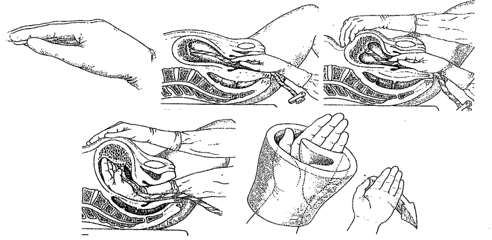
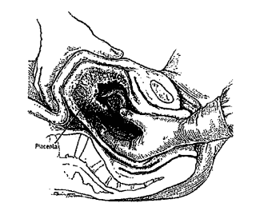

Trong cuộc chuyển dạ và sinh đường âm đạo sau sổ thai cần:

- Hạ đầu thấp.
- Đo lại mạch, huyết áp.
- Để ngay chậu hứng máu chảy để theo dõi lượng máu mất.

Không được xoa đáy tử cung, tôn trọng thời gian nghỉ ngơi sinh lý của tử cung vì xoa đáy sớm làm tử cung co hồi khiến rau bong không hoàn toàn.

Chờ rau bong hoàn toàn, tuy nhiên nhiều trường hợp cần bóc rau nhân tạo và kiểm soát tử cung, cổ tử cung, âm đạo, tầng sinh môn chứ không chờ rau sổ tự nhiên.

## Bóc rau nhân tạo

### Chỉ định

Rau chưa sổ mà mất > 300g máu.

Quá 30 phút kể từ khi sổ thai mà rau chưa bong.

Có yêu cầu kiểm soát toàn vẹn của tử cung sau chuyển dạ kéo dài, khó khăn, giúp sinh, thủ thuật nội xoay thai, đại kéo thai.

Kiểm soát tử cung ở người có thai và dụng cụ tử cung.

Nghi ngờ tử cung dị dạng, u xơ tử cung.

### Chống chỉ định

BN đang sốc thì hồi sức chống sốc rồi mới tiến hành thủ thuật.

### Chuẩn bị

Giải thích cho BN và sự cần thiết của thủ thuật để BN hợp tác.

Dụng cụ:

- Champs, găng tay dài vô khuẩn.
- Gòn và thuốc sát khuẩn.
- Dụng cụ chống shock.
- Đường truyền tĩnh mạch.

Thuốc:

- Atropin 0.25mg 1 ống tiêm dưới da hay tiêm tĩnh mạch chậm phòng ngừa shock vagal.
- Thuốc giảm đau: Dolargan 100mg x 1/2 ống tiêm tĩnh mạch chậm, Morphin 100mg x 1 ống tiêm bắp, Seduxen 10mg x 1 ống tiêm bắp.

BN nằm tư thế sản khoa đầu hơi cao.

Sát khuẩn âm hộ âm đạo

Trải champs vô trùng.

### Kỹ thuật

Trong quá trình thực hiện phải nhẹ nhàng và luôn quan sát bệnh nhân.

1 tay để trên bụng cố định đáy tử cung. Tay còn lại lần theo dây rốn đưa vào buồng tử cung. Xác định vị trí rau bám và mép bánh rau, dùng bờ trụ bàn tay lách vào giữa bánh rau và thành tử cung. Mặt lòng bàn tay ôm bánh rau và mặt lưng tiếp xúc với thành tử cung để từ từ tách bánh rau khỏi thành tử cung. Đến khi bánh rau tróc hoàn toàn khỏi tử cung, ôm trọn bánh rau kéo từ từ ra khỏi buồng tử cung.

Liền sau đó kiểm tra tử cung.

Kiểm tra bánh rau, màng rau, dây rốn xem đủ chưa? Đồng thời đánh giá bất thường.

_Kỹ thuật bóc rau nhân tạo._

_Thủ thuật bóc rau nhân tạo._

### Tai biến

Shock vagal. Ngất do phản xạ phế vị xảy ra do 1 phần của hệ thần kinh (phần điều hòa nhịp tim, huyết áp) bị kích thích bởi 1 tác nhân gây ra, chẳng hạn như nhìn thấy máu. Nhịp tim của bạn sẽ bị giảm, mạch máu ở chi bị giãn (đặc biệt hai chân). Làm máu bị ứ trệ ở ngoại vi, gây hạ huyết áp.

Nhiễm trùng hậu sản.

Tổn thương tử cung, thủng tử cung đặc biệt trong trường hợp mổ cũ, thủ thuật thô bạo.

Lộn tử cung nếu chưa bóc hoàn toàn bánh rau mà đã nắm dây rốn.

## Kiểm soát tử cung

### Chỉ định

Sau thủ thuật bóc rau nhân tạo.

Kiểm tra sự toàn vẹn của tử cung trong trường hợp sinh vết mổ cũ, sinh giúp, chuyển dạ kéo dài.

Sau khi sổ rau thiếu: Nếu kiểm tra thấy thiếu múi rau thì chỉ định tuyệt đối; nếu sót màng thì chỉ định khi sót nhiều (1/3-1/4 màng rau).

Băng huyết sau sinh ở tuyến dưới chuyển lên cần kiểm tra lại hệ thống tử cung, cổ tử cung, âm đạo, tầng sinh môn.

Sau kiểm tra cổ tử cung thấy rách lên túi cùng.

### Chống chỉ định, chuẩn bị

Giống với bóc rau nhân tạo

### Kỹ thuật

Kiểm tra từ đáy (chú ý 2 góc) đến thân (mặt trước, sau và 2 thành trái, phải) và đoạn dưới tử cung, cần chú ý:

- Vị trí bánh rau.
- Tử cung co hồi tốt không: tử cung siết chặt bàn tay hay rỗng, mềm nhão.
- Còn sót rau trong buồng tử cung: lòng tử cung sạch, thấy thành tử cung đều nhám, nếu thấy thành có chỗ gồ lên cần nghĩ đến sót rau. Cần chú ý 2 góc vì dễ sót rau khi tử cung siết chặt.
- Sự toàn vẹn của tử cung: xem tử cung có dễ bị vỡ hay không? Cần chú ý đến đoạn dưới tử cung ở vị tri 3h và 9h, nếu có vết mổ cũ cần lần theo vết mổ cũ. Khi kiểm tra đoạn dưới tử cung, tay đặt trên thành bụng đẩy đáy tử cung về phía rốn để đoạn dưới căng dễ kiểm tra đáy, tay trong tử cung miết dọc từ trên xuống dưới và từ trái qua phải để kiểm tra sự toàn vẹn của đoạn dưới.
- Kiểm tra xem tử cung có dị dạng không: tử cung đôi, tử cung 2 sừng,... và những bất thường khác như u xơ tử cung.
- Khi làm xong mới rút tay ra ngoài, tránh rút tay ra và cho vào nhiều lần vì nguy cơ nhiễm khuẩn và gây đau.

Sau thủ thuật:

- Cho thuốc co hồi tử cung.
- Theo dõi toàn trạng, cầu an toàn, huyết âm đạo.
- Kháng sinh dự phòng.

## Kiểm tra cổ tử cung

### Chỉ định

Sau sinh giúp ventouse, forceps.

Sau sinh thấy máu đỏ tươi chảy ra nhiều mặc dù tử cung co tốt.

Băng huyết sau sinh chuyển từ tuyến dưới lên cần kiểm tra lại hệ thống.

Sau sinh nhanh, cổ tử cung phù nền, chắc (con so lớn tuổi), con to.

### Chống chỉ định

BN bị shock.

### Chuẩn bị

Tương tự như bóc rau nhân tạo.

Dụng cụ:

- Champs, mâm vô khuẩn.
- 2 valve âm đạo.
- 3 kìm hình tim và 1 kìm gắp gạc.
- Kìm mang kim, nhíp, kim chỉ, kéo cắt chỉ.
- Gòn và thuốc sát khuẩn.

BN nằm tư thế sản khoa. Sát trùng âm đạo. Trải săng vô khuẩn. 1 người kiểm tra cổ và 1 hoặc 2 người phụ.

### Kỹ thuật

1 người ấn đáy tử cung và 1 người giữ valve âm đạo.

Dùng kìm hình tim vị trí 12h làm mốc. Kìm thứ 2 kẹp vị trí 1-2h và kiểm tra giữa 2 kìm này xem có rách, có chảy máu gì không? Kế tiếp dùng kìm hình tim thứ 3 kẹp vị trí 3-4h và kiểm tra giữa kìm thứ 2 và 3. Tháo kìm thứ 2, di chuyển tới vị trí 5-6h, lại kiểm tra giữa 2 kìm này. Cứ làm như vậy theo chiều kim đồng hồ đến khi về vị trí 12h thì ngưng. Trong khi làm người phụ xoay valve sao cho thấy rõ vùng đang kiểm tra.

Các vết rách < 2cm được xem là điều khó tránh khi sinh. Các vết rách thế lành nhanh và khi lành làm biến đổi hình dạng cổ tử cung.

Rách cổ thường ở vị trí 3h và 9h vì vùng này ít mô xơ và mô sợi.

Vết rách ở cổ tử cung có thể lan rộng tới đoạn dưới tử cung, động mạch tử cung và các nhánh chính của nó, thậm chí vùng đáy chậu.

Vết rách giới hạn ở cổ, chỉ cần khâu cổ tử cung. Nếu kèm theo rách âm đạo thì phải được khâu sau vết rách cổ tử cung. Khâu vết rách cổ tử cung chủ yếu cầm máu, không cần cố gắng phục hồi hình dáng vì có thể dẫn đến hẹp.

Khi rách lan rộng khỏi cổ tử cung, rách đến cùng đồ âm đạo hoặc tạo thành khối máu tụ lớn sau phúc mạc hay trong phúc mạc, phải tiến hành mở bụng quan sát để phát hiện vơ tử cung và xử trí kịp thời.

## Kiểm tra âm đạo - tầng sinh môn

### Chỉ định

Tất cả các trường hợp sinh ngả âm đạo dùng có cắt tầng sinh môn hay không đều phải kiểm tra.

### Chuẩn bị

Tương tự kiểm tra cổ tử cung.

### Kỹ thuật

Dùng tay kiểm tra hết các thành âm đạo xem có rách không? Nếu rách sâu cần phải có người phụ valve âm đạo và xoay valve để quan sát thành âm đạo. Kiểm tra cần chú ý các vết rách sâu và phải xem có bị bóc tách lớp niêm mạc và cơ ở dưới không?

Kiểm tra vùng tiền đình, tầng sinh môn xem có rách và cơ vòng hậu môn chưa?

Kiểm tra cơ vòng hậu môn đưa ngón tay vào hậu môn xem cơ vòng có xiết chặt hay lỏng lẻo.

Sang chấn phần mềm ở âm đạo, âm hộ, tầng sinh môn thường xảy ra sau khi sinh quá nhanh, sau sinh thủ thuật và nhất ở sản phụ bị tiền sản giật, thiếu máu, suy kiệt. Mô bị phù nề, rách bở do đố dễ bị sang chấn.

Đối với vết xước niêm mạc nhẹ, cạn, không chảy máu không cần xử trí gì. Nhưng vết xước dài, sâu, xuất huyết phải khâu phục hồi, cầm máu.

Nếu vết rách sâu vào cơ nhẹ, chảy máu ít có thể khâu phục hồi tại phòng sinh dưới gây tê tại chỗ. Nếu rách sâu nặng, chảy nhiều máu phải khâu phục hồi tại phòng mổ và mê tĩnh mạch.

Nguyên tắc khâu phải đảm bảo đúng lớp, không để khoảng ở dưới. Sau khâu thăm trực tràng để đảm bảo không dính vào trực tràng.

### Phân độ rách tầng sinh môn

Độ I: Rách niêm mạc âm đạo và da.

Độ II: Độ I + cân, cơ.

Độ III: Độ II + cơ vòng hậu môn.

Độ IV: Độ III + niêm mạc trực tràng.

## Nguồn tham khảo

- THỰC HÀNH SẢN PHỤ KHOA - PGS.TS. Trần Thị Lợi, GS.TS. Nguyễn Duy Tài.
