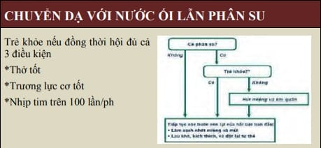

## Tuần hoàn bào thai và tuần hoàn sơ sinh

_Tuần hoàn bào thai (trái) và tuần hoàn sơ sinh (phải). Tuần hoàn bào thai được đặc trưng bởi: 1. Trao đổi khí qua nhau. 2. 1 tiểu tuần hoàn trở kháng cao, không chức năng hô hấp. 3. Tồn tại các shunt ở vị trí lỗ Botal và ống động mạch. Tuần hoàn sơ sinh được đặc trưng bởi: 1. Thiết lập tiểu tuần hoàn chức năng. 2. Thực hiện trao đổi khí qua phổi. 3. Đóng các shunt._

Phổi của bào thai là cơ quan không có hoạt động sinh lý thực thụ. Tiểu tuần hoàn chỉ là tuần hoàn giải phẫu, không có vai trò trao đổi khí. Vì thế, trở kháng tiểu tuần hoàn rất cao. Chỉ lượng máu rất nhỏ được lưu thông trong tiểu tuần hoàn, nhằm đảm bảo nuôi dưỡng phổi mà thôi. Trong thời kỳ này, mọi trao đổi khí đều được thực hiện qua nhau.

Máu bão hòa oxygen từ hồ máu của nhau sẽ theo tĩnh mạch rốn về tâm nhĩ phải. Do trở kháng cao của tiểu tuần hoàn và do sự hiện diện của lỗ bầu dục (Botal) nên máu bão hòa oxygen sẽ đi theo đường từ tâm nhĩ phải qua lỗ Botal vào tâm nhĩ trái mà không đi qua tâm thất phải và động mạch phổi để lên phổi. Lúc này phổi chỉ được nuôi dưỡng bằng nguồn máu ít ỏi đến dược nó thông qua động mạch phổi. 1 phần lượng máu qua động mạch phổi lại theo ống động mạch để quay về đại tuần hoàn.

Từ tâm nhĩ trái, máu sẽ đi theo động mạch chủ để nuôi dưỡng các cơ quan của bào thai. Máu mang $CO_2$ sẽ theo tĩnh mạch rốn về nhau và thực hiện trao đổi khí tại hồ máu. giường rau (placental bed) là 1 hệ thống hồ máu với các vi shunt giữa các động mạch và tĩnh mạch nhỏ tạo nên 1 hệ thống trở kháng thấp. Như vậy, tuần hoàn bào thai có các đặc điểm sau:
1. Tiểu tuần hoàn không chức năng với trở kháng cao.
2. Tồn tại các shunt phải-trái chức năng là lỗ Botal và ống động mạch.

_Bảng điểm apgar._

_Đánh giá và hồi sức._

_Chuyển dạ với nước ối lần phân su._

_3 mức độ chăm sóc sau hồi sức._

## Nguồn tham khảo

- TEAM-BASED LEARNING - Trường Đại học Y Dược Thành phố Hồ Chí Minh 2020.
