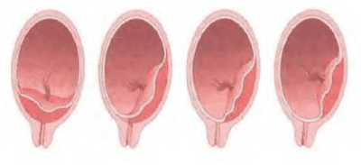
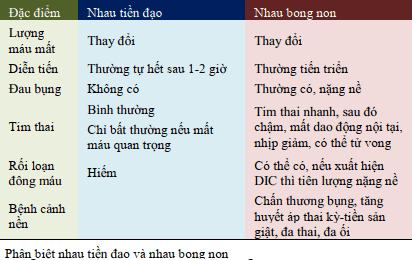

Rau tiền đạo (Placenta Previa) là vấn đề lớn mà các nhà sản khoa phải đối mặt, do những thai phụ với rau tiền đạo có thể phải được nằm bệnh viện theo dõi dài hạn, tăng nguy cơ truyền máu, sinh non, tỷ lệ cắt tử cung vì băng huyết tăng cao (đến 5.3%), dẫn đến tử suất của mẹ cao.

## Định nghĩa

Rau tiền đạo được định nghĩa là khi rau bám ở đoạn dưới tử cung mà không bám ở vị trí bình thường của nó.

## Phân loại

Phân loại rau tiền đạo

1. Rau tiền đạo toàn phần (trung tâm) (complete) khi bánh rau bám lan tới và che hết cổ trong cổ tử cung.
2. Rau tiền đạo 1 phần (bán phần) (partial) khi bánh rau chỉ bám qua 1 phần lỗ trong cổ tử cung.
3. Rau bám mép (marginal) khi mép dưới của bánh rau bám sát tới bờ lỗ cổ tử cung.
4. Rau bám thấp (low lying) là khi bánh rau bám ở đoạn dưới của tử cung nhưng mép dưới của nó chưa lan tới lỗ trong cổ tử cung.

Siêu âm đầu dò âm đạo phân loại rau tiền đạo dùng đơn vị là millimes (mm) để miêu tả khoảng cách giữa mép bánh rau và lỗ cổ trong cổ tử cung.

- Trong trường hợp mép bánh rau nằm ngay ở lỗ trong cổ tử cung thì khoảng cách này được mô tả là 0 mm.
- Nếu mép bánh rau bám chưa lan tới lỗ trong cổ tử cung thì sẽ mô tả khoảng cách từ lỗ trong cổ tử cung đến mép bánh rau.
- Khi mép bánh rau bám lan qua lỗ trong cổ tử cung thì mô tả khoảng mà mép bánh rau đã bám lan qua lỗ cổ tử cung.

## Yếu tố nguy cơ

Rau tiền đạo ở thai kỳ trước.

Sinh nhiều lần.

Mẹ lớn tuổi.

Tiền căn mổ sinh hoặc đã chịu các phẫu thuật khác trên tử cung như bóc nhân xơ tử cung.

Các yếu tố khác như sử dụng cocaine, hút thuốc lá.

## Chẩn đoán

### Lâm sàng

#### Cơ năng

Không có triệu chứng đặc biệt, chỉ có thể phát hiện qua siêu âm.

Ra huyết âm đạo đột ngột, lượng thay đổi, không kèm đau bụng trong 3 tháng giữa hoặc 3 tháng cuối.

Tử cung mềm, không đau căng (phân biệt với rau bong non và vỡ tử cung).

#### Thực thể

Ngôi bất thường (ngôi ngang, ngôi mông), ngôi đầu cao.

Tim thai không thay đổi, bất thường khi có choáng mất máu, bóc tách bánh rau hay biến chứng dây rốn.

Đặt mỏ vịt thấy máu đỏ tươi từ lỗ trong cổ tử cung.

Khám âm đạo chỉ thực hiện tại phòng mổ khi có huyết ra nhiều hoặc cần chấm dứt thai kỳ. Các trường hợp khác không khám âm đạo.

### Cận lâm sàng

Siêu âm xác định vị trí bám của bánh rau sẽ thay đổi cùng với tiến trình lớn lên của thai nhi. Chỉ được phép xác lập chẩn đoán rau tiền đạo kể từ sau khi tuổi thai đạt 28 tuần lễ tròn vô kinh.

Siêu âm đầu dò âm đạo là công cụ giúp chẩn đoán rau tiền đạo.

Cộng hưởng từ (MRI) có thể có ích trong khảo sát rau cài răng lược.

Soi bàng quang khi nghi ngờ rau cài răng lược xâm lấn bàng quang qua chẩn đoán hình ảnh kèm tiểu máu.

_Theo nghiên cứu, khảo sát mép bánh rau bám lan qua lỗ trong cổ tử cung 23 mm ở tuổi thai 11-14 tuần thấy chỉ có khoảng 8% số này là có rau tiền đạo lúc sinh. Nếu mép bánh rau bám lan qua lỗ trong cổ tử cung với khoảng cách nhỏ hơn 10 mm ở tuổi thai 9-16 tuần thì rất ít khả năng xuất hiện rau tiền đạo sau đó. Rau tiền đạo gần như bằng 0 nếu khảo sát trước đó cho thấy mép bánh rau chưa lan qua lỗ trong cổ tử cung. Nếu mép bánh rau vượt qua lỗ trong cổ tử cung với khoảng cách lớn hơn 25 mm thì khả năng có rau tiền đạo lúc sinh là rất lớn, đạt đến 40-100%._

## Bệnh sinh

Xuất huyết âm đạo trong 3 tháng cuối thai kỳ không kèm theo đau bụng là dấu hiệu điển hình của rau tiền đạo.

Máu chảy ra ngoài trong rau tiền đạo là máu mẹ. Đợt chảy máu âm đạo đầu tiên thường tự ổn định trong vòng 1-2 giờ, nếu như nó không quá nghiêm trọng để có chỉ định chấm dứt thai kỳ. Nếu chảy máu là trầm trọng hoặc thai nhi đã trưởng thành thì chấm dứt thai kỳ là lựa chọn. Số đợt xuất hiện chảy máu không có mối liên quan đến độ nặng của rau tiền đạo cũng như kết cục của thai nhi.

Khả năng tự cầm máu sau sinh của cuộc sinh với rau tiền đạo rất kém. Cơ chế cầm máu bình thường sau sổ rau trong các trường hợp rau bám ở thân tử cung là do các thớ cơ đan chéo siết chặt các mạch máu bị hở ra sau sinh ở các hồ máu. Trong rau tiền đạo, do các hồ máu có vị trí là ở đoạn dưới tử cung, không có các lớp cơ đan chéo, nên các mạch máu này không được siết lại sau khi sinh.

Phân biệt ra máu 3 tháng cuối thai kỳ giữa rau tiền đạo, rau bong non và vỡ tử cung. Vỡ tử cung có những dấu hiệu riêng. Có thể chẩn đoán phân biệt rau tiền đạo và rau bong non qua bảng sau:

## Xử trí

Quyết định chấm dứt thai kỳ phải dựa vào tuổi thai và tình trạng lâm sàng của thai phụ. Trong điều kiện bệnh nhân ổn định, mổ lấy thai thường được chỉ định ở tuổi thai 37-38 tuần. Đôi khi phải chấm dứt thai kỳ sớm hơn nếu chảy máu nhiều hoặc thai phụ đi vào chuyển dạ sinh non.

### Rau tiền đạo không triệu chứng

Theo dõi và điều trị ngoại trú.

Giảm nguy cơ chảy máu:

- Kiêng giao hợp, không làm nặng, không tập thể dục sau tuần 20.
- Không khám âm đạo.
- Có cơn gò tử cung hoặc ra máu cần nhập viện ngay.

Liệu pháp corticosteroid từ tuần 28 đến trước 34 tuần.

Mổ chủ động từ tuần thai 36-37.

### Rau tiền đạo đang chảy máu

#### Chảy máu ít, thai chưa trưởng thành

Xác định độ trưởng thành phổi. Cố gắng dưỡng thai đến 32-34 tuần. Sau 34 tuần cần cân nhắc lợi ích giữa mẹ và thai với nguy cơ mất máu.

Liệu pháp corticosteroid từ tuần 28 đến trước 34 tuần.

Truyền máu khi Hb < 10 g/dL.

Có thể xuất viện trong vòng 48 giờ không kèm theo yếu tố nguy cơ nào khác.

Chấm dứt thai kỳ:

- Có thể sinh đường âm đạo nếu rau bám thấp và ngôi đầu nếu khảo sát ở tuổi thai trên 35 tuần cho thấy mép bánh rau bám chưa đến lỗ cổ tử cung và khoảng cách này trên 20 mm. Thai có thể thiếu oxy (suy thai) do rau bong non hay biến chứng dây rốn như sa dây rốn, chèn ép dây rốn. Nên cần theo dõi sát tim thai để mổ lấy thai ngay, ngoại trừ đang rặn sinh.
- Mổ lấy thai trong các trường hợp khác.

Cầm máu vị trí rau bám:

- Dùng thuốc co hồi tử cung: Oxytocin, Carbetocin, Methylergotamine (maleat), Prostaglandin.
- Thắt động mạch tử cung khi cần.
- Có thể phải cắt tử cung toàn phần đặc biệt trường hợp rau cài răng lược.

#### Chảy máu âm đạo nhiều

Là cấp cứu sản khoa cần mổ lấy thai cấp cứu.

Cần lập 1-2 đường truyền tĩnh mạch. Truyền Ringer lactated hoặc NaCl 0.9% nhằm duy trì huyết động, có nước tiểu, ít nhất 30 mL/h.

Xét nghiệm nhóm máu, dự trù 2-4 đơn vị máu. Truyền khi lượng máu mất quá 30% (xuất huyết độ III) hoặc Hb < 10 g/dL.

Theo dõi huyết áp mẹ, nước tiểu mỗi giờ bằng sonde tiểu. Ước lượng máu mất bằng bằng vệ sinh.

Phương pháp vô cảm lúc mổ lấy thai: Trong phần lớn trường hợp, gây tê vùng là lựa chọn khi mổ lấy thai rau tiền đạo. Tuy nhiên, trong trường hợp dự đoán cuộc mổ kéo dài hay khó khăn như trong trường hợp của rau cài răng lược thì gây mê nội khí quản sẽ được chọn lựa.

## Biến chứng

### Biến chứng mẹ

Mất máu nhiều, choáng, tử vong.

Cắt tử cung, tổn thương niệu quản.

Tăng nguy cơ nhiễm trùng, rối loạn đông máu, phải truyền máu.

### Biến chứng con

Con non tháng gây tử vong chu sinh.

Trẻ sơ sinh bị thiếu tháng.

## Nguồn tham khảo

- TEAM-BASED LEARNING - Trường Đại học Y Dược Thành phố Hồ Chí Minh 2020.
- PHÁC ĐỒ ĐIỀU TRỊ SẢN PHỤ KHOA - Bệnh viện Từ Dũ.
