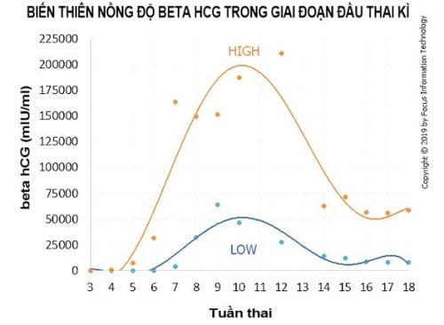

human Chorionic Gonadotropin (hCG) là glycoprotein có trọng lượng phân tử 36000-40000 Da. Đây là hormone
có chứa nhiều liên kết carbohydrate nhất trong các hormone ở loài người.

## Nguồn gốc

β-hCG được sản xuất chủ yếu bởi các hội bào nuôi và thường là dấu hiệu có thai sinh hóa.

Khi thai dưới 5 tuần tuổi, β-hCG được sản xuất ở cả nguyên bào nuôi và hội bào nuôi. Đến khi nồng độ β-hCG trong huyết tương mẹ đạt đỉnh, β-hCG chỉ còn được sản xuất bởi các hội bào nuôi.

Ngoài bánh nhau, thận, tuyến yên và 1 số mô khác của thai cũng có thể sản xuất ra β-hCG. Điều này giải thích trong bệnh lý tăng sản tuyến thượng thận, tuyến yên có thể xét nghiệm β-hCG tăng cao.

Tìm thấy với nồng độ rất nhỏ ở đàn ông và phụ nữ không có thai, có lẽ chủ yếu sản sinh ở tuyến yên trước. β-hCG cũng được tìm thấy trong bệnh lý tân sinh nguyên bào nuôi hoặc trong các bệnh lý ác tính không liên quan đến nguyên bào nuôi.

## Chức năng

Chức năng sinh học được biết rõ nhất của β-hCG là biến hoàng thể chu kỳ thành hoàng thể thai kỳ, duy trì hoàng thể thai kỳ trong tam cá nguyệt I và thúc đẩy hoàng thể sản xuất hormone steroid.

β-hCG được sản xuất từ khối hội bào nuôi còn có thể tác động theo con đường cận tiết để thúc đầy sự phát triển chất nền nội mạc tử cung, tăng tạo mạch để hỗ trợ cho quá trình làm tổ của phôi.

β-hCG là kích thích tinh hoàn thai nhi sản xuất ra testosterone.

β-hCG cũng kích thích hoàng thể sản xuất ra relaxin giúp giảm co thắt cơ trơn tử cung.

## Động học β-hCG

Động học β-hCG là sự diễn biến của β-hCG theo thời gian.

Đối với phụ nữ không mang thai, nồng độ β-hCG dưới 5 mUI/ml, phụ nữ có thai nồng độ β-hCG là trên 25 mUI/ml. Que thử thai thường có độ nhạy từ 20-25 mUI/ml.

hCG có thể tìm thấy trước khi trễ kinh, tăng dần đến đỉnh ở tuần thứ 8-10 của thai kỳ sau đó giảm dần.

Ở thai kỳ bình thường có thể phát hiện hCG sau đỉnh LH 9-11 ngày tức là khoảng 8 ngày sau phóng noãn, và chỉ 1 ngày sau khi phôi làm tổ.

Trước 6 tuần, nồng độ hCG tăng gấp đôi mỗi 2 ngày và đạt đỉnh ở tuần 8-10, có thể vào khoảng 100.000 mUI/mL. Sau đó, nồng độ hCG sẽ giảm dần và đạt cực tiểu tại thời điểm 16-20 tuần rồi giữ ổn định ở mức này đển cuối thai kỳ.

Động học β-hCG có ích lợi trong 6 tuần đầu thai kỳ khi siêu âm chưa phát hiện vị trí túi thai và chưa xác nhận phôi và hoạt động tim thai:

- β-hCG tăng phù hợp cho biết thai sống trong tử cung. 99.9% thai sống trong tử cung có β-hCG tăng trên 35% mỗi 48 giờ. Tuy nhiên, vẫn có khoảng 21% thai ngoài tử cung có kiểu tăng β-hCG như trên.
- β-hCG bình nguyên hay tăng ít, dưới 35% mỗi 48 giờ gợi ý đi tìm tình trạng thai ngoài tử cung hay thai trong tử cung có diễn biến bất thường.
- β-hCG giảm gợi ý khả năng là thai trong tử cung nhưng có thể là thai lưu, túi thai trống. β-hCG không cho phép loại trừ khả năng có thai ngoài tử cung.
- Sau khi sẩy thai tự nhiên, β-hCG huyết thanh sẽ giảm ít nhất 21-35% mỗi 2 ngày. Nếu β-hCG huyết thanh giảm chậm, dưới 20% mỗi 2 ngày thì có nhiều khả năng là 1 trong 2 tình trạng còn tồn tại sản phẩm thụ thai hoặc có thai ngoài tử cung.

## Ngưỡng phân định β-hCG

Thai trong tử cung bình thường, khi nồng độ β-hCG huyết thanh ở trên ngưỡng cắt này thì phải thấy được hình ảnh của thai trong tử cung. β-hCG đạt mức 1500 mIU/mL có thể thấy được hình ảnh túi thai trong buồng tử cung qua siêu âm đầu dò âm đạo và 3000 mIU/mL đối với song thai. Nếu không thấy được hình ảnh túi thai cần nghĩ đến thai ngoài tử cung, thai ngưng tiến triển hoặc đã sẩy hay giai đoạn sớm của trường hợp đa thai.

β-hCG trên 4000 mIU/mL trên siêu âm có thể thấy được hình ảnh phôi thai với hoạt động tim phôi. β-hCG đạt mức 5000-6000 mIU/mL có thể thấy hình ảnh túi thai qua siêu âm đầu dò bụng.

| Tuổi thai               | Nồng độ HCG theo tuổi thai |
| ----------------------- | -------------------------- |
| 3 tuần                  | 5-50 mIU/ml                |
| 4 tuần                  | 5-426 mIU/ml               |
| 5 tuần                  | 18-7.340 mIU/ml            |
| 6 tuần                  | 1.080-56.500 mIU/ml        |
| 7-8 tuần                | 7.650-229.000 mIU/ml       |
| 9-12 tuần               | 25.700-288.000 mIU/ml      |
| 13-16 tuần              | 13.300-254.000 mIU/ml      |
| 17-24 tuần              | 4.060-165.400 mIU/ml       |
| Từ 25 tuần đến lúc sinh | 3.640-117.000 mIU/ml       |
| Sau sinh 4-6 tuần       | dưới 5 mIU/ml              |

hCG phải được kết hợp với siêu âm để chẩn đoán. Trong trường hợp tử cung rỗng, khả năng mang thai khả thi giảm khi mức hCG tăng. Ví dụ, ước tính ở mức hCG từ 2000 đến 3000 mIU/ml, 2% có thai, 65% thai kỳ thất bại và 33% sẽ là thai ngoài tử cung. Ở mức hCG >3000 mIU/ml, 0,5% có thai, 66,3% thai kỳ thất bại và 33,2% sẽ là thai ngoài tử cung. Tuy nhiên, vẫn có thể sinh 1 thai nhi sống ngay cả khi mức hCG >4000 mIU/mL và không phát hiện thấy dấu hiệu siêu âm khi khám ban đầu. Mức hCG phân biệt có sự thay đổi lớn do các kỹ thuật xét nghiệm hCG, chất lượng siêu âm và kinh nghiệm của người thực hiện. Ngoài ra, thai đôi sẽ có mức hCG cao hơn đáng kể so với thai đơn trước khi phát hiện thấy dấu hiệu siêu âm. Mặc dù nhiều mức độ phân biệt hCG đã được sử dụng để đánh giá nguy cơ mang thai ngoài tử cung, nhưng không có mức độ hCG nào được xác định là có thể chẩn đoán được thai ngoài tử cung.

## Nguồn tham khảo

- TEAM-BASED LEARNING - Trường Đại học Y Dược Thành phố Hồ Chí Minh 2020.
- [Early Fetal Development](https://americanpregnancy.org/healthy-pregnancy/pregnancy-health-wellness/early-fetal-development) - American Pregnancy Association.
