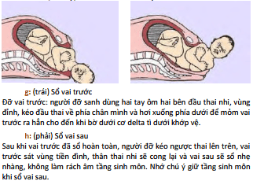
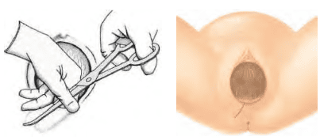

Ngôi chỏm là 1 ngôi mà trong phần lớn các trường hợp sẽ sinh được qua đường âm đạo.

## Cơ chế đẻ thường ngôi chỏm

Trong cuộc sinh ngôi chỏm, mỗi phần lớn nhất của thai nhi (đầu, vai, mông) đều phải lần lượt qua các eo của
khung chậu: eo trên, eo giữa, eo dưới, được chia ra những thì tuần tự như sau:

1. Qua eo trên gọi là thì lọt.
2. Đi từ eo trên xuống eo dưới gọi là thì xuống và xoay.
3. Qua eo dưới gọi là thì sổ.

Trong thực tế, các hiện tượng trên xảy ra kế tiếp nhau, hiện tượng này chưa hoàn tất thì hiện tượng sau đã bắt đầu, nên cũng có thể chia cơ chế sinh thành 2 thì:

1. Thì lọt và xuống, xảy ra ở các vị trí cao.
2. Thì xoay và sổ, xảy ra ở các vị trí thấp.

Bình chỉnh ngôi thai trong những tuần cuối cùng của thai kỳ, khi phần thân thai đã trở nên lớn hơn rất nhiều so với phần đầu thai, thì thân thai sẽ có xu hướng di chuyển lên phía đáy tử cung, là nơi rộng rãi hơn, còn đầu thai, do có kích thước nhỏ, sẽ hướng về phía dưới, là nơi có thể tích hẹp hơn.

### Lọt

Ngôi gọi là lọt khi đường kính lọt của ngôi đã đi qua được măt phẳng của eo trên 12.75 cm. Đường kính lọt lý thuyết của ngôi chỏm là đường kính hạ chẩm-thóp trước (9.5 cm). Trên lâm sàng, người ta dùng đường kính lưỡng đỉnh (9.5cm) thay vì dùng đường kính hạ chẩm-thóp trước. Chẩn đoán hiện tượng lọt qua khám bụng và khám âm đạo.

- Khám bụng: Phần đầu thai nhi còn trên xương vệ tương ứng độ rộng bao nhiêu ngón tay khép lại sẽ tương ứng với độ lọt bao nhiêu phần năm. Nếu toàn bộ đầu thai nhi nằm trên xương vệ, tương ứng với chiều rộng của năm ngón tay khi khép lại, ta nói đầu ở vị trí 5/5. Nếu toàn bộ thai nhi đã xuống dưới xương vệ, ta nói đầu ở vị trí 0/5. Ngôi thai lọt sẽ có vị trí khoảng 2/5.
- Khám âm đạo: Khi ngôi thai chưa lọt, phần thấp nhất của xương đầu vẫn còn ở trên vị trí của gai hông, được đánh giá -1, -2, -3. Khi ngôi thai đã lọt, phần thấp nhất của xương đầu (phần xương cứng) đã vượt khỏi vị trí của gai hông, được đánh giá +1, +2, +3.

### Xuống

Hiện tượng xuống là sự di chuyển của ngôi trong tiểu khung sau khi ngôi đã lọt.

### Xoay

Hệ quả của xoay trong là ngôi hướng được đường kính sổ của mình trùng với đường kính trước sau của eo dưới.

### Sổ

Hiện tượng sổ thai qua eo dưới có điểm tựa bờ dưới khớp vệ. Ngôi sẽ thực hiện động tác sổ trên điểm tựa này.

## Kỹ thuật đỡ đẻ ngôi chỏm

Các giai đoạn sau đây (a đến d) diễn ra theo cơ chế sinh tự nhiên. Không được can thiệp vào các giai đoạn này.

Giai đoạn cần hỗ trợ để cuộc sinh an toàn (e đến h). Chỉ được phép can thiệp khi có đủ tất cả các điều kiện sau:

1. Ngôi đã hoàn thành xoay về chẩm vệ.
2. Ngôi đã sẵn sàng để sổ, ở vị trí +3 làm căng phồng tầng sinh môn, âm hộ nhìn về phía trần nhà.
3. 2 âm môi bé tách rộng ra.

Người đỡ sinh dùng 3 ngón tay giữa của tay phải đè vào vùng thượng chẩm để cho đầu cúi thêm, cho tới khi hạ chẩm ra đến bờ dưới khớp vệ. Song song với giúp đầu cúi bằng tay phải, người đỡ sinh tay trái đè vào vùng tầng sinh môn tránh rách thêm tầng sinh môn.

Khi hạ chẩm ra đến bờ dưới khớp vệ, bắt đầu dùng tay phải kiểm soát tốc độ ngửa của đầu khi thực hiện sổ trán. Tay còn lại giữ tầng sinh môn. Nếu tầng sinh môn quá căng thì có thể thực hiện cắt tầng sinh môn lúc này.

Khi đầu đã sổ, nếu thấy dây rốn quấn cổ lỏng, tháo dây rốn qua đầu thai ngay. Nếu dây rốn quấn cổ chặt thì kẹp cắt dây rốn ngay tại vùng cổ thai.

Sau khi đầu sổ hoàn toàn, để đầu tự xoay ngoài về vị trí nguyên thủy của nó (xoay ngoài thì 1st), chờ thêm để cho cơn co tự nhiên đưa vai lọt vào tiểu khung. Khi vai đã lọt, đường kính lưỡng mỏm vai đi vào đường kính chéo của eo trên và xoay. Vai xoay trong sẽ làm cho đầu xoay ngoài thêm 1 thì nữa, gọi là xoay ngoài thì 2nd. Cuối thì này, vai đã vào đến đường kính trước sau eo dưới, đầu có vị trí chẩm ngang. Người đỡ sinh có thể giúp thai hoàn thành thì xoay ngoài thứ 2nd, rồi bắt đầu đỡ vai.

- Đỡ vai trước: người đỡ sinh dùng 2 tay ôm 2 bên đầu thai nhi, vùng đỉnh, kéo đầu thai về phía chân mình và hơi xuống phía dưới để mỏm vai trước ra hẳn cho đến khi bờ dưới cơ delta tì dưới khớp vệ. Nhớ chú ý giữ đúng phương kéo để tránh gãy xương đòn.
- Đỡ vai sau: sau khi vai trước đã sổ hoàn toàn, người đỡ kéo ngược thai lên trên, vai trước sát vùng tiền đình, thân thai nhi sẽ cong lại và vai sau sẽ sổ nhẹ nhàng, không làm rách âm tầng sinh môn. Nhớ chú ý giữ tầng sinh môn khi sổ vai sau.

Phần còn lại của thai và mông sẽ dễ dàng. Bàn tay trái đỡ cổ thai nhi, bàn tay phải vuốt dọc lưng thai
nhi tới chân, nắm 2 chân bằng cách cầm 2 bàn chân bằng 3 ngón cái, trỏ và giữa bàn tay phải. Sau sổ thai, cần giữ đầu thai nhi thấp hơn bàn sinh.

Thủ thuật cắt tầng sinh môn là cần thiết nhưng không phải là 1 can thiệp thường quy. Trong khi đỡ sinh, sau khi đã giúp cho đầu cúi tối đa, hạ chẩm đã ra đến bờ dưới khớp vệ, có thể bắt đầu cho đầu thai ngửa dần làm thoát âm các phần của đầu thai với đường kính ngày càng lớn đi qua tầng sinh môn. Nên cắt tầng sinh môn khi quá căng để mở rộng chủ động ở lối ra của đường sinh, nhằm tránh các tổn thương không kiểm soát được.
Việc cắt tầng sinh môn không phải luôn luôn cần thiết. 1 số tình huống mà trong đó việc cắt tầng sinh môn sẽ có lợi như sinh con to, sinh thủ thuật. Con so không phải là 1 tình huống mà trong đó việc cắt tầng môn được thực hiện thường quy.

Cần lưu ý rằng cắt tầng sinh môn không giúp rút ngắn giai đoạn rặn sổ thai, không làm cho sản phụ sinh nhanh hơn.

## Cách thở và rặn trong cuộc đẻ

### Cách thở

Dựa theo tính chất chu kỳ của cơn gò tử cung, sản phụ sẽ chú ý, tập trung vào hơi thở:

- Khi bắt đầu cảm nhận đau, nghĩa là khi bắt đầu thì co, có cơn co xuất hiện thai phụ nên tập trung vào hơi thở để tập thở nhanh dần. Hít vào bằng mũi và thở ra bằng miệng. Cơn đau càng tăng thì thở càng nhanh hơn và nông hơn, tần suất nhịp thở tăng dần ở thì kéo dài. Cảm nhận đau càng nhiều thì thở càng nhanh hơn. Ở thì thở ra làm sao tạo được tiếng rít gần như tiếng rít, tiếng huýt sáo nhỏ. Đến khi cảm nhận bớt đau thì thở chậm lại và thở sâu hơn, tần suất nhịp thở giảm dần.
- Ở thì nghỉ giữa các cơn co tử cung, thai phụ nên thở sâu và nhẹ nhàng bình thường để lấy lại năng lượng đã bị mất đi khi thở nhanh, nông ở thì co và tích trữ năng lượng cho lần thở của cơn đau kế tiếp. Nên thư giãn toàn thân là tốt nhất.

Khi rặn, thai phụ nên tập rặn đúng cách thì mới có hiệu quả đẩy thai ra khỏi bụng mẹ và ống sinh dục được. Rặn không hiệu quả, giai đoạn xổ thai kéo dài sẽ làm mất sức người mẹ và em bé có thể bị ngạt ngay khi chưa kịp sinh ra.

### Cách rặn

Khi cảm nhận được cơn co tử cung (bụng gò cứng dần và xuất hiện cơn đau): thai phụ nên hít vào 1 hơi thở thất sâu. Sau đó nín thở, miệng ngậm chặt, 2 tay nắm chặt vào 2 thành của bàn sinh, 2 chân đạp mạnh vào 2 ống treo cổ chân của bàn sanh, dồn hơi rặn mạnh để đẩy hơi xuống vùng bụng dưới giúp tống xuất thai nhi ra ngoài. Khi cảm thấy sắp hết hơi nhưng vẫn còn đau có thể hít vào 1 hơi khác và rặn tiếp tục cho đến khi hết cảm thấy đau bụng nữa. Chú ý là trong khi rặn, thai phụ phải giữ sao cho lưng thẳng, áp sát vào bề mặt bàn sanh và phần mông phải cong lên phía trước. Đặt biệt là phải giữ để khi rặn thì miệng không được phát ra bất cứ âm thanh nào.

Giữa 2 cơn co tử cung, hết đau thì thở sâu điều hòa, dưỡng sức để tập trung vào đợt rặn kế tiếp.

## Nguồn tham khảo

- TEAM-BASED LEARNING - Trường Đại học Y Dược Thành phố Hồ Chí Minh 2020.
- [Cách thở và rặn sanh trong cuộc chuyển dạ](https://tudu.com.vn/vn/y-hoc-thuong-thuc/suc-khoe-phu-nu/lam-me-an-toan/cham-soc-ba-me-mang-thai/cach-tho-va-ran-sanh-trong-cuoc-chuyen-da/) - Bệnh viện Từ Dũ.
