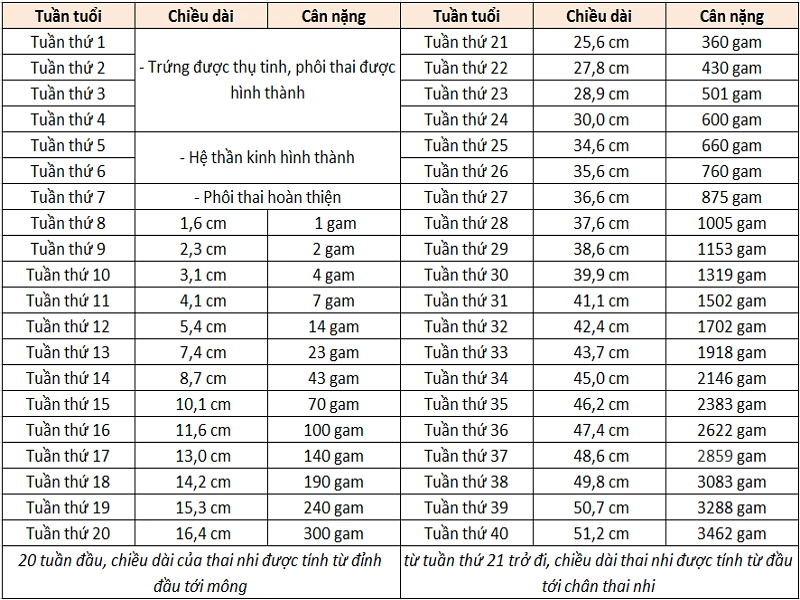
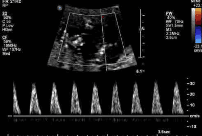

Thai nhỏ so với tuổi thai (Small-for-Gestational Age - SGA) và thai với tăng trưởng trong tử cung bị giới hạn (Fetal Growth Restriction - FGR)(Intra-Uterine Growth Retardation - IUGR) có ảnh hưởng không nhỏ tới sức khỏe thai.

## Tổng quan về SGA và IUGR

### Phân loại thai có kích thước nhỏ

Các thai nhi với kích cỡ nhỏ hơn bình thường được phân ra các nhóm khác nhau:

1. Thai nhỏ nhưng là 1 thai bình thường (constitutionally).
2. Thai với tăng trưởng trong tử cung bị giới hạn không do nguyên nhân rau thai như bất thường nhiễm sắc thể, bất thường chuyển hóa hay nhiễm trùng bào thai.
3. Thai với tăng trưởng trong tử cung bị giới hạn do nguyên nhân trao đổi qua nhau bất thường.

### Yếu tố ảnh hưởng tăng trưởng của thai

Vận chuyển qua nhau của các dưỡng chất như trọng lượng trước khi có thai thấp, mẹ dinh dưỡng kém, nghiện thuốc hay thiếu máu nặng.

1 số tình trạng bệnh lý có thể ảnh hưởng đến sự hình thành và phát triển của rau thai và hệ thống giường mạch máu của rau thai như tiền sản giật, các bệnh tự miễn kiểu hội chứng kháng phospholipid, bệnh ưa chảy máu, bệnh lý thận, tiểu đường hay cao huyết áp mạn tính.

### Thuật ngữ liên quan

Thai nhỏ so với tuổi thai là trọng lượng thai ước tính (EFW) hay chu vi vòng bụng (AC) nằm dưới 10th percentile.

SGA nặng (severe SGA) là khi thai nhi có EFW hay AC nằm dưới 3rd percentile.

Các thăm dò cần phải được tiến hành từ ngay thời điểm mà các thông số sinh trắc chạm điểm cắt 10th percentile. Phải có thái độ tích cực nhưng thận trọng khi các thông số này đã chạm đến điểm cắt 3rd percentile.

### Quản lý thai SGA và IUGR

Trước tiên là loại trừ khả năng có các bất thường về di truyền (lệch bội, đột biến gien...) hay
dị tật nghiêm trọng ở bào thai. Xác nhận thông qua 1 hay nhiều test tiền sản và tầm soát đã được thực hiện sớm trong đầu thai kỳ như test huyết thanh (double-test, triple test), khảo sát hình ảnh (NT, soft-markers), NIPT hay test xâm lấn chẩn đoán (CVS, chọc ối karyotype), các khảo sát huyết thanh nhiễm trùng bào thai như Rubella hay CMV...

Chấm dứt thai kỳ, nếu đã loại trừ các yếu tố bất thường về dị tật hay di truyền cũng như nhiễm trùng bào thai, theo dõi SGA/FGR là cân bằng giữa lợi ích của việc kéo dài việc nuôi dưỡng thai phát triển trong tử cung cho đến khi sơ sinh có khả năng sống sót khi được đưa ra sống môi trường mới ngoài tử cung và nguy cơ của việc kéo dài cuộc sống trong tử cung với mối đe dọa thiếu hụt về trao đổi chất và khí máu dẫn đến toan hóa máu thai và tử vong của thai nhi trong tử cung.

Các khảo sát thông dụng gồm theo dõi tim thai và cơn co tử cung (non-stress test và contraction stress
test), khảo sát động học các dòng chảy với hiệu ứng Doppler, trắc đồ sinh vật lý của Manning hay trắc đồ sinh vật lý biến đổi. Trong SGS/FGR xuất hiện sớm, vai trò của velocimetry Doppler là quan trọng.
Trong khi đó với SGA/FGR xuất hiện muộn trong tam cá nguyệt thứ ba, vai trò của EFM lại quan trọng hơn.

Đối với SGA/FGR, chỉ định của Corticosteroid liệu pháp cần phải mở rộng thêm đến 36 tuần vô kinh hay hơn nữa, mà không dừng lại ở 34 tuần vô kinh.

### Nguy cơ trẻ sơ sinh

Hạ đường huyết. Việc bổ sung bằng sữa công thức là cần thiết, do sữa mẹ hoàn toàn không thể đảm bảo nhu cầu về năng lượng của các trẻ này.

Hoạt động còn non kém của hệ thần kinh như Hạ thân nhiệt do nhiều yếu tố kết hợp. Các rối loạn hô hấp kiểu các cơn ngưng thở khá phổ biến. Có thể có co giật sơ sinh.

Đa hồng cầu là hệ quả của đáp ứng với thiếu oxy trường diễn.

Tăng bilirubin máu và vàng da sơ sinh nặng.

Dễ bị nhiễm trùng.

### Bảng cân nặng và chiều dài thai nhi

## Thai chậm tăng trưởng trong buồng tử cung

### Tiếp cận

Bệnh sinh và kết cục của IUGR xuất hiện sớm và IUGR xuất hiện muộn rất khác nhau.

#### IUGR xuất hiện sớm

IUGR xuất hiện sớm gồm các trường hợp từ trong những tuần đầu tiên của thai kỳ cho đến trong 3 tháng giữa của thai kỳ.

IUGR xuất hiện sớm liên quan đến các bất thường về cấu trúc hay lệch bội ở bào thai. Do liên quan đến bất thường cấu trúc hay lệch bội, nên có tiên lượng rất xấu.

_Vắng mặt dòng tâm trương rất phổ biến trong IUGR sớm_

#### IUGR xuất hiện muộn

IUGR xuất hiện muộn, trong nửa sau của thai kỳ thường liên quan đến 1 trong 2 tình trạng:

1. Mọi bệnh lý gây bất thường của trao đổi tử cung-nhau.
2. Mọi bệnh lý gây thiếu oxygen trường diễn ở mẹ hoặc giảm khả năng vận chuyển oxygen đến thai.

Các bệnh lý gây bất thường của trao đổi tử cung-nhau dẫn đến tình trạng thiếu oxygen trường diễn ở bào thai như tăng huyết áp, đái tháo đường có trước thai kỳ kèm theo tổn thương cơ quan đích, Lupus đỏ hệ thống, hội chứng kháng phospholipid...

Các bệnh lý gây thiếu oxygen trường diễn ở mẹ hoặc giảm khả năng vận chuyển oxygen đến thai như thiếu máu nặng, bệnh lý hemoglobin (hồng cầu hình liềm), các bệnh có thể gây thiếu oxygen trường diễn ở mẹ như bệnh hô hấp tắc nghẽn mạn, hen phế quản trong thai kỳ, mẹ hút thuốc lá...

Thiếu oxygen trường diễn dẫn đến chậm tăng trưởng của thai trong tử cung (thể hiện qua các thông số sinh trắc), gây suy giảm hệ đệm (thể hiện qua bất thường trong cử động thai, EFM). Khi tình trạng đã tiến triển xa, bắt đầu xuất hiện các dấu hiệu của tái phân bố tuần hoàn gồm co mạch thận và các cơ quan ngoại vi để dồn máu cho não (thể hiện qua giảm cung xuất nước tiểu tức tình trạng thiểu ối và tình trạng bất thường trong động học các dòng chảy).

1 số yếu tố khác cũng có liên quan đến IUGR gồm nhiễm trùng bào thai do CMV hay do Rubella hay liên quan đến tăng cân của mẹ trong thai kỳ.

### Chẩn đoán

Thiết lập chẩn đoán IUGR bao gồm 3 nội dung:

1. Xác nhận tình trạng thai nhỏ so với tuổi thai.
2. Nguyên nhân dẫn đến sự giới hạn trong tăng trưởng của bào thai trong tử cung, nói cách khác là phân biệt SGA và IUGR-FGR.
3. Sự đe dọa thai tình trạng sức khỏe của thai nhi cũng như các dự báo về diễn biến của tình trạng bào thai.

Điều kiện thiết yếu để đảm bảo tính tin cậy của việc xác định 1 thai nhỏ gồm 2 vấn đề:

1. Phải biết rõ các thông tin về tuổi thai.
2. Phải có 1 biểu đồ tăng trưởng từ 1 dân số phù hợp.

### IUGR trong song thai

Thai nhỏ hơn bình thường trong trường hợp song thai không đồng nghĩa với các thai này có giới hạn tăng trưởng trong tử cung.

1 số không nhỏ thai nhi song thai chỉ là SGA. 1 số khác lại có vấn đề thật sự liên quan đến IUGR cấp máu qua nhau không đủ cho nhiều thai nhi tăng trưởng đồng thời bình thường, hay hội chứng truyền máu trong song thai 1 trứng.

## Nguồn tham khảo

- TEAM-BASED LEARNING - Trường Đại học Y Dược Thành phố Hồ Chí Minh 2020.
