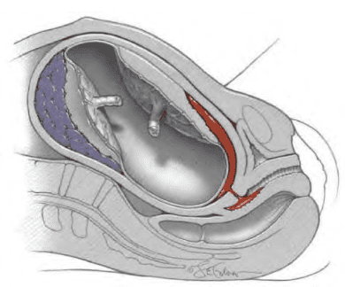
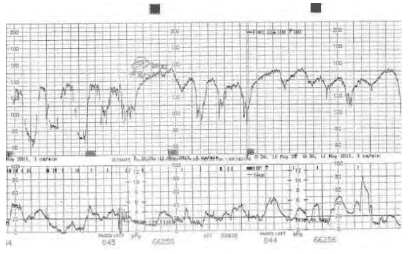
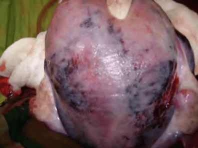

Rau bong non được định nghĩa là trường hợp rau bám đúng vị trí nhưng bị bong sớm trước khi thai sổ ra ngoài.

## Cơ chế bệnh sinh

### Cơ chế

Khởi đầu của rau bong non là sự xuất huyết trong màng rụng đáy và hình thành khối máu tụ ở màng rụng. Cấu trúc của màng rụng bị đứt gãy ở một vị trí, gây chảy máu do sự phá vỡ các tiểu động mạch xoắn của màng rụng. Diện tích xuất huyết tăng dần, tạo thành khối máu tụ tách màng đệm khỏi lớp cơ tử cung. Khối máu tụ này lớn lên, gây bóc tách lan rộng và chèn ép vào mô rau lân cận, kết quả là rau bị bong một phần hoặc bong toàn bộ.

Máu chảy ra giữa lớp cơ tử cung và các màng thai bị giam cầm trong khối máu tụ. Khi khối máu tụ lớn hơn, cùng áp lực tăng lên sẽ gây rò rỉ máu ra ngoài qua cổ tử cung, dẫn đến xuất huyết âm đạo.

_Khối máu tụ._

### Nguồn chảy máu

- Trong trường hợp tự phát (không do chấn thương), máu trong khối máu tụ chủ yếu là máu mẹ, xuất phát từ đổ vỡ các mạch xoắn màng rụng, trong khi các gai rau vẫn còn nguyên vẹn.
- Nếu bong non sau chấn thương (tổn thương tử cung do va đập hoặc thủ thuật), gai rau có thể bị rách vỡ cùng với màng rụng, dẫn đến mất cả máu thai và máu mẹ.

## Nguyên nhân và các yếu tố nguy cơ

Ngoại trừ chấn thương, nguyên nhân trực tiếp của rau bong non thường chưa rõ. Một số yếu tố thuận lợi:

- Tiền sản giật, do xâm nhập không hoàn toàn của tế bào nuôi vào tiểu động mạch xoắn.
- Viêm hoặc nhiễm trùng màng ối.
- Hút thuốc lá hoặc dùng chất kích thích.
- Tăng huyết áp mạn tính hoặc tiền sử bệnh lý mạch máu.

## Chẩn đoán và triệu chứng lâm sàng

### Triệu chứng lâm sàng

- Đau bụng khởi phát đột ngột, liên tục hoặc co thắt cường tính.
- Chảy máu âm đạo (có thể ít hoặc nhiều).
- Tăng trương lực cơ bản tử cung.
- Dấu hiệu suy thai: tim thai thay đổi, giảm vận động thai.
- Thai lưu có thể xảy ra trong trường hợp nặng.

_EFM rau bong non._

Siêu âm không thấy khối máu tụ sau rau không loại trừ được chẩn đoán, nhưng giúp phân biệt với rau tiền đạo. Nồng độ D-dimer tăng có thể gợi ý.

### Chẩn đoán

Chẩn đoán rau bong non là chẩn đoán loại trừ dựa vào lâm sàng và cận lâm sàng.

:::caution[Lưu ý]
Rau bong non là chẩn đoán loại trừ và cần loại bỏ các nguyên nhân đau bụng và chảy máu khác.
:::

## Rau bong non là cấp cứu sản khoa

Biến chứng phổ biến:

1. Sốc giảm thể tích.
2. Rối loạn đông máu (DIC).
3. Tử vong sơ sinh do ngạt.

### Sốc giảm thể tích

- Khối máu tụ có thể giữ lại nhiều máu hơn so với lượng chảy ra ngoài âm đạo.
- Sốc có thể xảy ra nhanh dù máu mất qua âm đạo ít.
- Nặng có thể dẫn đến suy thận cấp và hội chứng Sheehan (suy tuyến yên sau mất máu cấp) nếu tình trạng mất máu không được đánh giá đúng mức và điều trị kịp thời.

### Rối loạn đông máu

- Tiêu thụ yếu tố đông máu do khối máu tụ.
- Thromboplastin từ màng rụng phóng thích kích hoạt DIC.
- DIC thúc đẩy tiêu fibrin, tạo sản phẩm chống đông.

### Tử vong sơ sinh do ngạt

- Bong rau làm gián đoạn trao đổi khí mẹ-thai.
- Nguy cơ tử vong trong chuyển dạ lên đến 25%.
- 15–20% trẻ sống sót có di chứng thần kinh dài hạn.

### Tử cung Couvelaire

- Máu thẩm lậu vào thành cơ tử cung và dưới thanh mạc.
- Nặng có thể lan tới vòi trứng, dây chằng rộng, buồng trứng.
- Không phải chỉ định cắt tử cung.

_Tử cung Couvelaire._

## Điều trị

Mục tiêu: hạn chế tiến triển của khối máu tụ, phòng biến chứng và bảo toàn tính mạng mẹ con.

### Điều trị nội khoa và biến chứng

- Bù dịch tinh thể và truyền máu để điều trị sốc giảm thể tích.
- Điều chỉnh DIC: truyền huyết tương tươi đông lạnh, yếu tố đông máu.
- Điều trị biến chứng của sốc và DIC.

### Điều trị sản khoa

- Ưu tiên sinh càng sớm càng tốt, trừ khi khối máu tụ rất nhỏ.
- Tia ối sớm: giảm áp lực khối máu tụ, giảm phóng thích thromboplastin, thúc đẩy chuyển dạ.
- Nếu thai đủ khả năng sống và không thể sinh ngả nhanh, mổ lấy thai là ưu tiên.
- Nếu thai đã mất hoặc không khả năng sống, có thể sinh ngả.
- Rau bong non càng để lâu càng mất máu và DIC càng nặng.

## Nguồn tham khảo

- Trường Đại học Y Dược TP. HCM (2020) – _Team-based learning_
