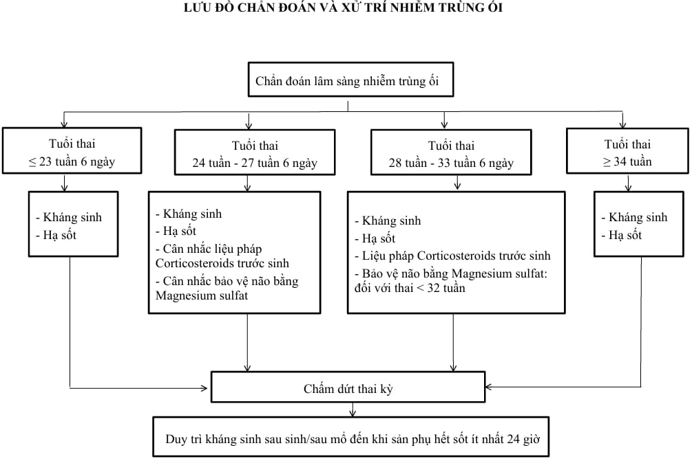

**Nhiễm trùng ối (intra-amniotic infection - IAI**) được xác định khi có nhiễm trùng tại một hoặc nhiều cấu trúc trong buồng ối bao gồm: Dịch ối, thai nhi, dây rốn, bánh rau, màng ối hoặc màng đệm.

## Nguyên nhân

Nhiễm trùng ối thường do vi khuẩn xâm nhập ngược dòng từ đường sinh dục dưới, bao gồm cả vi khuẩn kị khí và hiếu khí. Ngoài ra, một số trường hợp có thể do vi khuẩn từ đường máu đi đến buồng ối (ít gặp), điển hình như _Listeria monocytogenes_. Nhiễm trùng cũng có thể xảy ra sau các thủ thuật xâm lấn như:

- Chọc ối.
- Sinh thiết gai nhau.
- Nội soi bào thai.

**Các tác nhân thường gặp**:

- _Ureaplasma urealyticum_.
- _Mycoplasma hominis_.
- **Gardnerella vaginalis**.
- _Bacteroides bivius_.
- Vi khuẩn Gram âm.
- Liên cầu khuẩn nhóm B (_Group B Streptococcus - GBS_).

## Yếu tố nguy cơ

- Ối vỡ non.
- Chuyển dạ kéo dài, đặc biệt ở con so.
- Ối vỡ lâu.
- Thăm khám âm đạo nhiều lần sau khi vỡ ối.
- Nhiễm phân su trong nước ối.
- Hở eo tử cung.
- Nhiễm khuẩn đường sinh dục (GBS, bệnh lây truyền qua đường tình dục).
- Hút thuốc lá, uống rượu.
- Tiền căn nhiễm trùng ối.

## Chẩn đoán

:::note[Tiêu chuẩn chẩn đoán nhiễm trùng ối]

_Bảng "Chẩn đoán nhiễm trùng ối"._

| Chẩn đoán nhiễm trùng ối    | Đặc điểm                                                                                                                                                                                                                                                                             |
| --------------------------- | ------------------------------------------------------------------------------------------------------------------------------------------------------------------------------------------------------------------------------------------------------------------------------------ |
| **Mẹ sốt đơn thuần**        | Nhiệt độ mẹ ≥ 38.0°C nhưng < 39.0°C, không có nguyên nhân khác, tình trạng sốt có thể thoáng qua hoặc kéo dài                                                                                                                                                                        |
| **Nghi ngờ nhiễm trùng ối** | Sốt không rõ nguyên nhân kết hợp với một hoặc nhiều dấu hiệu sau:  1. Tim thai cơ bản > 160 lần/phút kéo dài ≥ 10 phút  2. Bạch cầu máu mẹ > 15000/mm³, không dùng corticosteroids hoặc xét nghiệm sau 48 giờ nếu có  3. Dịch âm đạo đục chảy qua cổ tử cung khi đặt mỏ vịt |
| **Xác định nhiễm trùng ối** | Có dấu hiệu nghi ngờ + ít nhất một trong các xét nghiệm dịch ối sau:  1. Nhuộm Gram thấy vi khuẩn  2. Nồng độ glucose ≤ 14 mg/dL  3. Bạch cầu dịch ối > 30 tế bào/mm³ (không lẫn máu)                                                                                       |

:::
:::caution
Chẩn đoán chủ yếu dựa vào lâm sàng. Chọc ối hay giải phẫu bệnh có vai trò nghiên cứu, không giúp cải thiện kết cục sản khoa nếu dùng làm tiêu chuẩn xử trí.
:::

## Biến chứng

### Với mẹ

- Tăng nguy cơ chuyển dạ bất thường.
- Tăng tỷ lệ mổ lấy thai.
- Đờ tử cung.
- Băng huyết sau sinh.
- Nhiễm trùng tại chỗ (viêm nội mạc tử cung, viêm vùng chậu, nhiễm trùng vết mổ).
- Nhiễm khuẩn huyết, rối loạn đông máu, hội chứng suy hô hấp cấp.
- Tử vong (hiếm nhưng nghiêm trọng).

### Với thai

**Giai đoạn cấp tính**:

- Viêm phổi sơ sinh.
- Viêm màng não.
- Nhiễm khuẩn huyết.
- Tử vong sơ sinh.

**Di chứng lâu dài**:

- Loạn sản phế quản phổi (BPD).
- Bại não.

:::caution
Khi nghi ngờ hoặc xác định nhiễm trùng ối, cần hội chẩn bác sĩ sơ sinh để đánh giá và xử trí sau sinh phù hợp.
:::

## Điều trị

### Nguyên tắc

- Bắt đầu kháng sinh khi mẹ sốt đơn thuần trong chuyển dạ không rõ nguyên nhân.
- Điều trị kháng sinh ngay khi nghi ngờ hoặc xác định nhiễm trùng ối.
- Dùng kháng sinh phổ rộng đường TM.
- Kháng sinh phải có hiệu lực trên GBS và _E. coli_.
- Không trì hoãn điều trị đến sau sinh.
- Chấm dứt thai kỳ ngay sau khi nghi ngờ hoặc chẩn đoán xác định, ưu tiên sinh ngả âm đạo.
- Khởi phát hoặc đẩy nhanh chuyển dạ, không để quá 12 giờ từ chẩn đoán đến sinh.
- Mổ lấy thai khi có chỉ định sản khoa, cân nhắc nguy cơ phụ.
- Duy trì kháng sinh sau sinh/mổ đến khi hết sốt ít nhất 24 giờ.
- Điều trị tích cực nếu nhiễm trùng lan rộng.

### Kháng sinh

**Phác đồ 1 (ưu tiên)**:

- Ampicillin 2 g tiêm TM mỗi 6 giờ + Gentamicin 5 mg/kg truyền TM mỗi 24 giờ. Nếu mổ lấy thai, thêm Clindamycin 900mg mỗi 8 giờ hoặc Metronidazole 500 mg truyền TM mỗi 8 giờ.
- Hoặc Ampicillin-sulbactam 3 g tiêm TM mỗi 6h.
- Hoặc Cefoxitin 2 g tiêm TM mỗi 8 giờ.
- Hoặc Cefotetan 2 g tiêm TM mỗi 12h.
- Hoặc Mezlocillin 4 g tiêm TM mỗi 6h.

**Phác đồ 2: Dị ứng nhẹ với Penicillin**:

- Cefazolin 2 g tiêm TM mỗi 8 giờ + Gentamicin 5 mg/kg truyền TM mỗi 24 giờ.
- Nếu mổ lấy thai, thêm Clindamycin hoặc Metronidazole như trên.

**Phác đồ 3: Dị ứng nặng với Penicillin**:

- Clindamycin 900 mg truyền TM mỗi 8 giờ.
- Hoặc Vancomycin 1 g truyền TM mỗi 12h + Gentamicin 5 mg/kg truyền TM mỗi 24 giờ.

:::caution
Vancomycin chỉ dùng khi:

- GBS đề kháng Clindamycin hoặc Erythromycin.
- GBS nhưng chưa có kết quả kháng sinh đồ.

:::

**Nếu không đáp ứng**:

- Piperacillin-Tazobactam 4.5 g truyền TM mỗi 8 giờ.
- Hoặc Ertapenem 1 g truyền TM mỗi 24 giờ.

### Hạ sốt

- Dùng thuốc hạ sốt theo chỉ định để giảm khó chịu cho mẹ và nguy cơ cho thai.

_Hình ảnh "Lưu đồ xử trí nhiễm trùng ối - Bệnh viện Từ Dũ"_.

## Tài liệu tham khảo

- Trường ĐH Y Dược TP. HCM (2020) - _Team-based learning_
- Bệnh viện Từ Dũ (2022) - _Phác đồ điều trị Sản Phụ khoa_
