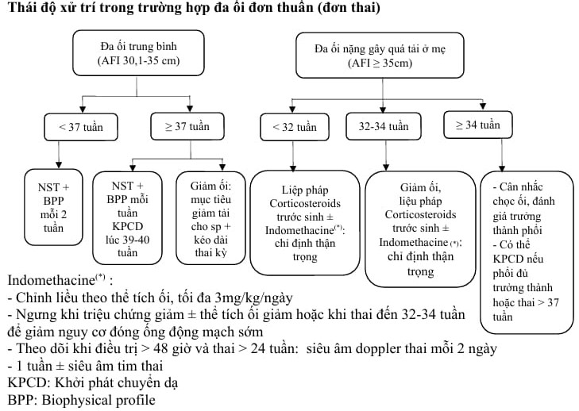

Đa ối là tình trạng dịch ối nhiều hơn so với tuổi thai tương ứng và được chẩn đoán qua siêu âm.

## Nguyên nhân

### Từ phía mẹ

- Đái tháo đường (20%).
- Bất đồng nhóm máu Rhesus (10%).

### Từ phía thai

- Bất thường nhiễm sắc thể.
- Nhiễm trùng bào thai (TORCH).
- Thiếu máu thai.
- Bất thường thần kinh trung ương: Não úng thủy, vô sọ, chẻ đôi đốt sống.
- Bất thường thần kinh–cơ: Nhược cơ, bệnh Steinert, rối loạn nuốt, sức môi...
- Bất thường vùng cổ–lồng ngực: Tăng sinh tuyến dạng nang ở phổi.
- Tim bẩm sinh.
- Bất thường hệ tiêu hóa: Hẹp thực quản, hẹp tá tràng.
- Bất thường thành bụng: Thoát vị rốn.
- Thoát vị hoành.
- Bất thường thận: Hội chứng Bartter.
- Bất thường hệ xương.
- Shunt bào thai: Phình tĩnh mạch Galien, bướu quái cùng cụt, bướu máu...
- Hội chứng đa dị tật.
- Song thai: Hội chứng truyền máu song thai, TRAPs.
- Phù rau thai.
- Vô căn (30%).

### Từ phần phụ

- Nhau bong non.
- Truyền máu song thai.
- Nhồi máu hoặc thuyên tắc rau.

## Chẩn đoán

:::note[Tiêu chuẩn chẩn đoán đa ối]
Chủ yếu dựa vào siêu âm:

- AFI ≥ 22 cm ở 3 tháng giữa và ≥ 25 cm ở 3 tháng cuối.
- SDP ≥ 8 cm (SDP ≥ 16 cm là đa ối nặng).

  | Mức độ  | Nhẹ       | Trung bình | Nặng    |
  | ------- | --------- | ---------- | ------- |
  | **AFI** | 25–30 cm  | 30.1–35 cm | > 35 cm |
  | **SDP** | 8–11.9 cm | 12–15.9 cm | ≥ 16 cm |

:::

Bề cao tử cung lớn hơn tuổi thai, dấu hiệu quá tải (khó thở, tim nhanh), sờ bụng có "sóng vỗ", thăm âm đạo thấy "cục đá".

Siêu âm hình thái, đo chiều dài cổ tử cung; Nghiệm pháp dung nạp đường huyết; Xét nghiệm TORCH, karyotype, thalassemia...

## Biến chứng

- Sinh non.
- Ối vỡ non.
- Sa dây rốn.
- Ngôi bất thường.
- Băng huyết sau sinh do đờ tử cung.

## Điều trị

### Ngoại trú

- < 34 tuần: Tái khám mỗi 2 tuần, đo chiều dài cổ tử cung, cân nhắc corticosteroids trước sinh.
- ≥ 34 tuần: Siêu âm Doppler, non-stress test mỗi tuần.

### Nhập viện

**Chỉ định**:

- Biểu hiện quá tải dịch.
- Dọa đẻ non.
- Thai ≥ 39 tuần.
- CTG nhóm II trở lên hoặc Doppler bất thường.

**Hướng điều trị**:

- Điều trị nguyên nhân nếu xác định được.
- **Giảm ối** thoát vị nếu có quá tải (khó thở, tim nhanh), tốc độ ≤ 1 L/20 phút.
- **Indomethacin** (đa ối vô căn, thai chưa trưởng thành) liều 25 mg uống 4 lần/ngày. Nếu AFI không giảm sau 2–3 ngày, có thể tăng lên 3 mg/kg/ngày. Nguy cơ đóng ống động mạch sớm → theo dõi Doppler thai mỗi 2 ngày.
- Liệu pháp corticosteroids khi có nguy cơ sinh non.

### Chấm dứt thai kỳ

- Thai ≥ 39 tuần với đa ối nhẹ–trung bình.
- Thai ≥ 37 tuần với đa ối nặng.
- Thai 34–37 tuần có quá tải dịch nặng và đã dùng corticosteroids.

_Hình ảnh "Phác đồ xử trí đa ối đơn thuần (đơn thai) – Bệnh viện Từ Dũ"._

## Tài liệu tham khảo

- Bệnh viện Từ Dũ (2022) – _Phác đồ điều trị Sản Phụ khoa_
