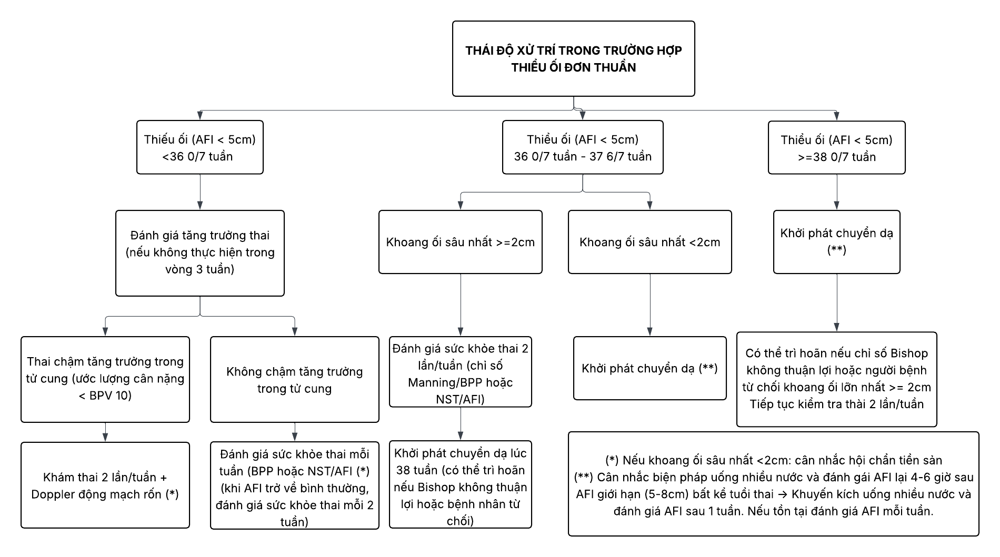

Thiểu ối được định nghĩa là tình trạng dịch ối ít hơn so với tuổi thai tương ứng và được chẩn đoán qua siêu âm.

## Nguyên nhân

### Từ phía mẹ

Bệnh lý nội khoa ảnh hưởng tuần hoàn như động kinh, tăng huyết áp mạn, bệnh lý collagen, bệnh lý thận, rối loạn đông máu…

Thuốc như ức chế men chuyển, ức chế tổng hợp Prostaglandin, Trastuzumab…

### Từ phía thai

_Thiểu ối có nguồn gốc do thai chỉ xuất hiện sau 17-20 tuần._

Bất thường nhiễm sắc thể.

Bất thường bẩm sinh, đặc biệt là đường tiết niệu.

Thai chậm tăng trưởng.

Thai lưu.

Thai quá ngày.

Ối vỡ sớm, ối vỡ non.

### Từ phần phụ của thai

Rau bong non.

Truyền máu song thai.

Nhồi máu hoặc thuyên tắc rau thai.

## Chẩn đoán

Chủ yếu dựa trên siêu âm. Trên lâm sàng có thể thấy bề cao tử cung nhỏ hơn tuổi thai.

:::note[Tiêu chuẩn chẩn đoán thiểu ối]
Siêu âm:

- Chỉ số ối (Amniotic fluid index - AFI) ≤ 5cm hoặc xoang ối lớn nhất (Single deepest pocket measurement - SDP) ≤ 2cm.
- SDP ≤ 1cm là thiểu ối nặng. Tương đương AFI ≤ 3cm.

:::

Có thể thấy ối rỉ, ối vỡ là dấu hiệu quan trọng. Khi đó test Nitrazine sẽ dương tính.

Công thức máu mẹ phát hiện nhiễm trùng gồm Toxoplasma gondii, Rubella, CMV, HSV.

Những tuần thai sớm có thể thấy bất thường karyotype thai, TORCH…

## Xử trí

### 3 tháng đầu

_Hầu như không chỉ định điều trị._

Tư vấn nguy cơ thai chết lưu.

Khám lại 1-2 tuần.

### 3 tháng giữa

Tư vấn tình trạng thai.

Truyền ối khi có chỉ định:

- Tuổi thai > 16 tuần.
- Lấy ối làm xét nghiệm nhiễm sắc thể, TORCH…
- Hỗ trợ siêu âm tầm soát hình thái học thai nhi.

### 3 tháng cuối

Tư vấn tình trạng thai.

Chỉ định chấm dứt thai kỳ:

- SDP ≤ 1cm.
  - ≥ 34 tuần: Mổ lấy thai.
  - &lt; 34 tuần: Điều trị mong đợi.
- 1 ≤ SDP ≤ 2cm: Thai 37 tuần sinh thường hoặc mổ lấy thai.

Liệu pháp corticosteroids:

- Thường quy từ 28 tuần đến 33 tuần 6 ngày.
- Cân nhắc trường hợp từ 24 tuần đến 27 tuần 6 ngày.

_Phác đồ xử trí thiểu ối đơn thuần Bệnh viện Từ Dũ._

## Nguồn tham khảo

- Bệnh viện Từ Dũ (2022) – _Phác đồ điều trị Sản phụ khoa_
