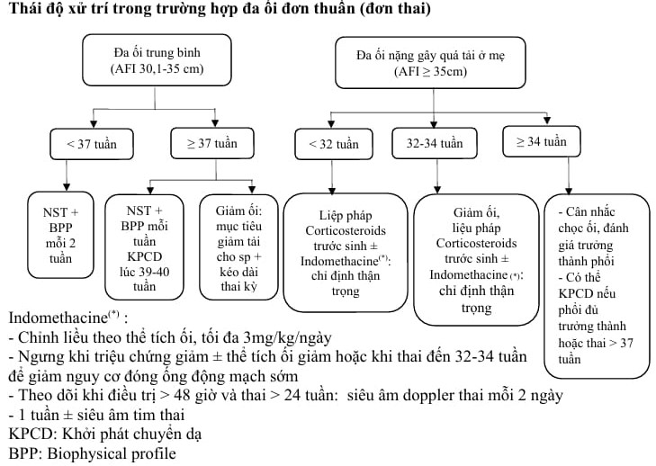

Đa ối được định nghĩa là tình trạng dịch ối nhiều hơn so với tuổi thai tương ứng và được chẩn đoán qua siêu âm.

## Nguyên nhân

### Từ phía mẹ

Đái tháo đường (20%).

Bất đồng nhóm máu Rhesus (10%).

### Từ phía thai

Bất thường nhiễm sắc thể.

Nhiễm trùng bào thai (TORCH).

Thiếu máu thai.

Bất thường hình thái thai:

- Bất thường thần kinh trung ương: não úng thủy, vô sọ, chẻ đôi đốt sống.
- Bất thường thần kinh - cơ: Nhược cơ, bệnh Steinert, rối loạn nuốt, sức môi...
- Bất thường vùng cổ - lồng ngực: Tăng sinh tuyến dạng nang ở phổi.
- Tim bẩm sinh.
- Bất thường hệ tiêu hóa: Hẹp thực quản, hẹp tá tràng.
- Bất thường thành bụng: Thoát vị rốn.
- Thoát vị hoành.
- Bất thường thận: Hội chứng Bartter.
- Bất thường hệ xương.
- Shunt: Phình tĩnh mạch Galien, bướu quái cùng cụt, bướu máu...
- Hội chứng đa dị tật.
- Song thai: Hội chứng truyền máu song thai, TRAPs.
- Phù rau thai.

Vô căn (30%).

## Chẩn đoán

Trên lâm sàng có thể thấy bề cao tử cung lớn hơn tuổi thai.

Dấu hiệu quá tải: Khó thở, tim nhanh...

Sờ bụng có dấu hiệu sóng vỗ.

Khám âm đạo có dấu hiệu cục đá.

:::note[Tiêu chuẩn chẩn đoán đa ối]
Siêu âm:

- Chỉ số ối (Amniotic fluid index - AFI) ≥22cm ở 3 tháng giữa và ≥25cm ở 3 tháng cuối.
- Khoang ối sâu nhất (Single deepest pocket measurement - SDP - SDP) ≥8cm. SDP ≥16cm là đa ối nặng.

:::

| Mức độ | Nhẹ       | Trung bình | Nặng    |
| ------ | --------- | ---------- | ------- |
| AFI    | 25-30cm  | 30.1-35cm |>35cm |
| SDP    | 8-11.9cm | 12-15.9cm | ≥16cm |

Siêu âm hình thái thai nhi, đo chiều dài cổ tử cung.

Nghiệm pháp dung nạp đường huyết.

Công thức máu mẹ phát hiện nhiễm trùng gồm Toxoplasma gondii, Rubella, CMV, HSV.

Những tuần thai sớm có thể thấy bất thường karyotype thai, TORCH, Thalassemia...

## Xử trí

### Hướng điều trị

Điều trị nguyên nhân (nếu có).

Điều trị triệu chứng:

- Giảm ối nếu có quá tải dịch (khó thở, tim nhanh, đau bụng) tốc độ <1l/20 phút.
- Điều trị Indomethasone:
  - Chỉ định: Đa ối vô căn, thai nhi chưa trưởng thành.
  - Liều 25mg (uống), 4 lần/ngày, nếu AFI không giảm trong 2-3 này có thể tăng 3mg/kg/ngày. Giảm hoặc ngưng AFI trước 34 tuần.
  - Tác dụng phụ lo ngại nhất là nguy cơ đóng ống động mạch sớm ở thai vì thế cần theo dõi Doppler thai mỗi 2 ngày kèm siêu âm. Ngoài ra mẹ có thể trào ngược, nôn ói, viêm dạ dày...

Liệu pháp corticosteroids thường quy.

### Điều trị ngoại trú

<34 tuần: Tái khám mỗi 2 tuần đo chiều dài cổ tử cung, cân nhắc corticosteroids trước sinh.

≥34 tuần: Siêu âm Doppler, non-stress test mỗi tuần.

### Tiêu chuẩn nhập viện

Xuất hiện quá tải dịch.

Dấu hiệu dọa đẻ non.

Thai ≥39 tuần.

CTG nhóm II trở lên hoặc siêu âm Doppler màu bất thường.

### Chỉ định chấm dứt thai kỳ

Thai ≥39 tuần có đa ối nhẹ đến trung bình.

Thai ≥37 tuần có đa ối nặng.

Thai 34-37 tuần có quá tải dịch nặng và đã dùng corticosteroids.

_Phác đồ xử trí đa ối đơn thuần (đơn thai) Bệnh viện Từ Dũ._

## Biến chứng

Sinh non.

Ối vỡ non.

Sa dây rốn.

Ngôi bất thường.

Băng huyết sau sinh do đờ tử cung.

## Nguồn tham khảo

- PHÁC ĐỒ ĐIỀU TRỊ SẢN PHỤ KHOA - Bệnh viện Từ Dũ.
