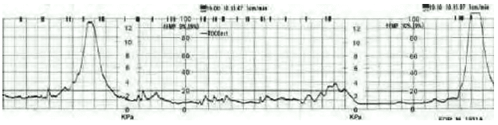
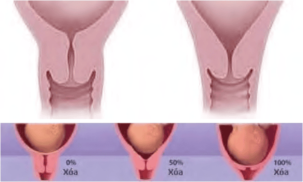
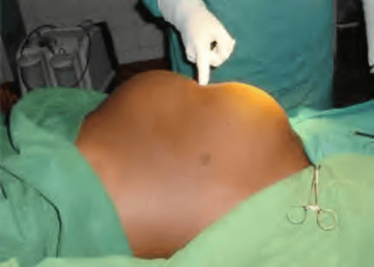
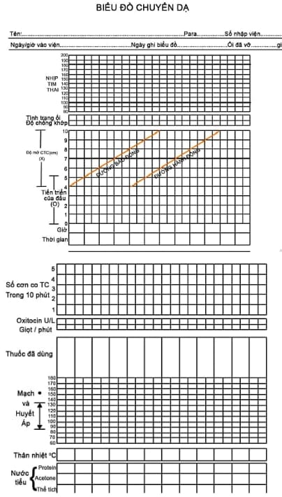

**Chuyển dạ** là quá trình có sự xuất hiện các cơn co tử cung hiệu quả, gây nên hiện tượng xóa và mở cổ tử cung, nhằm tống xuất thai nhi và phần phụ ra ngoài qua ngả âm đạo.

## Đặc điểm

### Sự chín muồi của cổ tử cung

Trước chuyển dạ, tử cung mang thai - vốn gồm hàng tỉ sợi cơ trơn không đáp ứng với kích thích - sẽ trải qua các thay đổi nội tiết, chủ yếu là tăng tỉ lệ **Estrogen:Progesterone**, tăng tổng hợp Prostaglandin E2 và các enzyme làm mềm cổ tử cung.

Cổ tử cung vốn chắc và đóng kín do cấu trúc collagen và chất nền, sẽ trải qua quá trình "chín muồi", tức là:

- Ly giải collagen.
- Tăng giữ nước trong mô cổ tử cung.
- Làm mềm và tăng tính đàn hồi của cổ tử cung.

Nhờ đó, cổ tử cung trở nên thuận lợi cho quá trình xóa mở và cho phép thai đi qua.

### Cơn co tử cung

**Xuất hiện cơn co tử cung** là dấu hiệu quan trọng nhất của chuyển dạ. Cơn co tử cung là động lực chính giúp xóa mở cổ tử cung và đẩy thai ra ngoài.

- Dưới tác động của Prostaglandin và Oxytocin, các kênh Ca²⁺ trên màng tế bào cơ trơn tử cung mở ra, tạo điều kiện hình thành phức hợp actin-myosin gây co cơ.
- Nhờ các liên kết liên bào, toàn bộ cơ tử cung co bóp theo tổ chức và hướng nhất định.

Phân biệt với cơn co Braxton-Hicks:

- Cơn co sinh lý (Braxton-Hicks): Không đều, không gây đau, không làm thay đổi cổ tử cung.
- Cơn co chuyển dạ: Tự động, đều đặn, tăng dần về cường độ và tần số, gây đau, và đặc biệt phải gây hiệu quả làm xóa mở cổ tử cung. 

_Hình ảnh "Cơn co Braxton-Hicks là những cơn co thưa, không đều, không gây đau, xuất hiện vào cuối thai kỳ, không gây thay đổi trên cổ tử cung"_.

### Xóa mở cổ tử cung

Đặc điểm của xóa mở cổ tử cung:

- **Xóa cổ tử cung:** Các thớ cơ dọc của thân tử cung co lại, kéo cổ tử cung lên trên, làm nó mỏng dần.
- **Mở cổ tử cung:** Sự co rút các cơ tử cung kèm với sự tiến triển của ngôi thai và đầu ối tạo nên hiện tượng cổ tử cung giãn rộng ra.

Hiện tượng này xảy ra chủ yếu nhờ:

- Cơn co tử cung: Động lực chính.
- Đầu ối và ngôi thai: Hỗ trợ mở cổ tử cung, đặc biệt trong giai đoạn đầu.

Vòng thắt sinh lý nằm giữa thân và đoạn dưới tử cung, nếu chuyển dạ bị tắc nghẽn lâu dài, vòng này có thể trở thành vòng thắt Bandl - dấu hiệu bệnh lý.

_Hình ảnh "Cơn co tử cung làm cho các thành phần của kênh cổ tử cung bị kéo lên phía trên làm cổ tử cung mỏng đi"_.

_Hình ảnh "Vòng Bandl bệnh lý khi có chuyển dạ tắc nghẽn. Phía trên đáy tử cung (trái) là thân tử cung. Phía dưới (phải) là đoạn dưới"_.

### Thành lập đầu ối

Khi cổ tử cung bắt đầu mở, nút nhầy bong ra, một phần túi ối bị đẩy xuống qua lỗ cổ tử cung tạo thành "đầu ối". Đầu ối có vai trò như "nêm thủy lực" giúp cổ tử cung mở nhanh hơn khi ngôi thai còn cao.

_Hình ảnh "Thành lập đầu ối phía trước ngôi thai, ở vị trí lỗ cổ tử cung"_.

## Chẩn đoán

:::note[Tiêu chuẩn chẩn đoán chuyển dạ]
Chẩn đoán chuyển dạ khi có ≥ 2 trong các tiêu chuẩn sau:

1. Có ≥ 2 cơn co tử cung mỗi 10 phút, mỗi cơn kéo dài ≥ 20 giây, gây đau.
2. Cổ tử cung xóa ≥ 30%.
3. Có đầu ối, ối căng phồng theo cơn co.

:::

## Các giai đoạn

Chuyển dạ gồm 3 giai đoạn:

1. **Xóa mở cổ tử cung** (Giai đoạn I).
2. **Sổ thai** (Giai đoạn II).
3. **Sổ rau và cầm máu** (Giai đoạn III).

Xóa mở cổ tử cung chia thành 2 pha:

- **Pha tiềm thời:** Cổ tử cung mềm dần, xóa và định hướng trục. Cơn co thưa, ngắn và không đều. Ngôi thai bắt đầu bình chỉnh. Được xác định khi cổ tử cung mở < 3cm.
- **Pha hoạt động:** Cổ tử cung mở nhanh và hoàn tất xóa. Cơn co tử cung mạnh, đều, tăng dần về cường độ. Ngôi thai tiến triển trong đường sinh. Được xác định khi cổ tử cung mở ≥ 3cm.

_Hình ảnh "So sánh pha tiềm thời và pha hoạt động"_.

## Theo dõi

Chuyển dạ là quá trình tương tác của **3 yếu tố chính - còn gọi là "3P":**

1. **Power - Cơn co tử cung:** Động lực chính tạo ra xóa mở cổ tử cung và đẩy thai xuống. Cơn co có hiệu quả khi nhịp nhàng, đều đặn và có biên độ lớn.
2. **Passenger - Ngôi thai:** Kích thước, tư thế, kiểu thế của ngôi thai ảnh hưởng đến khả năng vượt qua khung chậu. Ngôi thai cần biến dạng phù hợp để thích nghi với đường sinh.
3. **Passage - Đường sinh (khung chậu):** Gồm khung chậu xương và phần mềm. Tạo ra lực cản và ảnh hưởng đến sự tiến triển của ngôi thai.

Các yếu tố này có ảnh hưởng qua lại lẫn nhau và được theo dõi bằng **biểu đồ chuyển dạ:**

1. Cường độ và tần số cơn co tử cung.
2. Mức độ xóa mở cổ tử cung.
3. Tiến triển và sự biến dạng của ngôi thai.
4. Nhịp tim thai, nhất là biến động theo cơn co.
5. Màu sắc và tính chất nước ối.
6. Các thuốc sử dụng trong quá trình chuyển dạ.
7. Sinh hiệu của mẹ (mạch, huyết áp, nhiệt độ...).

_Hình ảnh "Biểu đồ chuyển dạ giúp theo dõi tiến trình chuyển dạ một cách trực quan"_.

## Tài liệu tham khảo

- Trường ĐH Y Dược TP. HCM (2020) - _Team-based learning_
