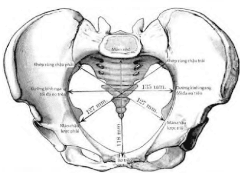
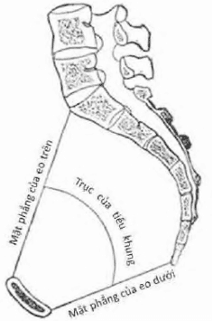
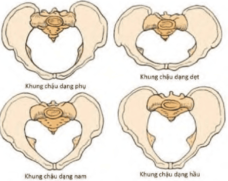

Khung chậu có vai trò rất quan trọng trong sản khoa, vì thai từ trong tử cung muốn sinh qua ngã âm đạo phải vượt qua được đoạn đường bên trong lòng khung chậu.

## Giải phẫu

- Khung chậu được cấu tạo bởi 4 xương: Phía trước và 2 bên là 2 xương chậu, phía sau là xương cùng-cụt. Mặt trong xương chậu có gờ vô danh chia khung chậu làm 2 phần: **đại khung** phía trên và **tiểu khung** phía dưới.

- Tiểu khung là phần quan trọng nhất vì ngôi thai phải vượt qua tiểu khung để đi ra ngoài qua ngã âm đạo. Trên đoạn đường đi từ trong ra ngoài này, thai nhi phải lần lượt vượt qua các vòng eo hẹp – có thể được cấu tạo bằng xương hoặc xương kết hợp với cân-cơ – đó là: **eo trên**, **eo giữa** và **eo dưới**.

- Khi nhìn ngang, lòng tiểu khung có dạng ống cong về phía trước với 2 thành không đều nhau:

  - Thành trước ngắn, khoảng 4cm, tương ứng với mặt sau khớp vệ.
  - Thành sau dài hơn, 12–15cm, tương ứng với mặt trước xương cùng và xương cụt.

- Các thì trong quá trình ngôi thai đi qua khung chậu:

  - **Lọt**: Ngôi thai đi qua **eo trên**.
  - **Xuống**: Ngôi di chuyển từ **eo trên đến eo dưới**.
  - **Sổ**: Ngôi vượt qua **eo dưới** và ra ngoài.

### Eo trên

- Eo trên là mặt phẳng xương đầu tiên mà ngôi thai phải vượt qua khi bắt đầu chuyển dạ. **Giới hạn**:

  - Sau: Mỏm nhô của xương cùng.
  - Hai bên: Đường vô danh của 2 xương cánh chậu.
  - Trước: Mặt sau của khớp vệ.

- Eo trên là vòng xương cứng, không thay đổi trong chuyển dạ. Kích thước của eo trên được thể hiện qua các **đường kính**:

  

  _Các đường kính eo trên._

  - **Đường kính trước-sau**:

    - **Mỏm nhô – thượng vệ**: 11 cm.
    - **Mỏm nhô – hạ vệ**: 12 cm. Đo được bằng tay, nhưng chỉ phản ánh gián tiếp đường kính thật sự của eo trên.
    - **Mỏm nhô – hậu vệ**: 10.5 cm. Đây là đường kính **hữu dụng** và **quan trọng nhất**, vì là đường kính thật sự mà ngôi thai phải vượt qua.

  - **Đường kính chéo**:

    - Từ khớp cùng-chậu bên này đến gai mào chậu lược bên kia.
    - Trị số bình thường: 12.75 cm.

  - **Đường kính ngang**:

    - **Ngang tối đa**: 13.5 cm – không có giá trị sản khoa vì nằm gần mỏm nhô.
    - **Ngang hữu dụng**: 12.5 cm – là đường kính ngang đi qua trung điểm của đường kính trước-sau. Dù quan trọng, nhưng **không thể đo được lâm sàng**.

### Eo giữa

- Eo giữa là đoạn hẹp nhất về mặt giải phẫu của đường sinh. Được tạo bởi:

  - Sau: Xương cùng (hõm xương cùng).
  - Hai bên: Gai hông – điểm nhô vào lòng tiểu khung, gây hẹp rõ rệt.
  - Trước: Mặt sau khớp vệ.
  - Phần còn lại là cơ và mạc.

- Hõm xương cùng tạo thành một **khúc cong**, giống như "khúc cua cùi chỏ", đòi hỏi ngôi thai phải xoay để vượt qua.

  

  _Tiểu khung trên thiết đồ đứng dọc._

- **Các đường kính chính**:

  - **Đường kính trước-sau**: 11.5 cm – không có ý nghĩa lâm sàng.
  - **Đường kính ngang**: 10.5 cm – khoảng cách giữa 2 gai hông; **có thể đo được và có giá trị lâm sàng cao**.
  - **Đường kính dọc sau**: 4.5 cm – từ điểm giao với đường kính ngang đến mặt trước xương cùng; phản ánh **độ cong xương cùng** và **khả năng di chuyển của ngôi**.

### Eo dưới

- Eo dưới là đoạn cuối cùng của đường sinh, không phải là trở ngại lớn trong phần lớn các trường hợp. Cấu tạo gồm 2 tam giác:

  1. **Tam giác xương (phía trước)**

  - Bờ dưới khớp vệ.
  - Hai bên là hai nhánh tọa của xương chậu.

  2. **Tam giác cân-cơ-màng (phía sau)**

  - Đỉnh: Đỉnh xương cụt.
  - Đáy: 2 ụ ngồi.
  - Hai cạnh bên: Dây chằng tọa-cùng.
  - Do khớp cùng-cụt là **khớp bán động**, đỉnh xương cụt có thể bị đẩy ra sau, giúp mở rộng thêm không gian eo dưới trong chuyển dạ.

- **Các đường kính chính**:

  - **Trước-sau**: 9.5–11.5 cm – không có ý nghĩa lâm sàng vì tính chất không đồng phẳng.
  - **Ngang**: 11 cm – khoảng cách giữa hai ụ ngồi; đo được trên lâm sàng, **có giá trị nhất định**.

## Đánh giá

### Lâm sàng

Thực hiện khi sản phụ chuyển dạ hoặc thai đủ trưởng thành. Mục tiêu là đánh giá khả năng sinh ngả âm đạo thông qua việc cảm nhận và đo đạc:

- **Đo đạc được**:

  - Mỏm nhô – hạ vệ: Thước Beaudelocque.
  - Đường kính ngang eo giữa: Thước De Lee.
  - Đường kính ngang eo dưới: Thước dây hoặc thước Beaudelocque.

- **Đánh giá cảm nhận**:

  - Đường kính ngang eo trên: Đánh giá qua chiều dài phần gờ vô danh sờ được (thường chỉ sờ được khoảng ½ nếu bình thường).
  - Độ cong xương cùng: Chỉ ước lượng tương đối.
  - Độ rộng của góc tạo bởi 2 ngành ngồi-mu.

### Cận lâm sàng

- Phương pháp sử dụng X-quang để đo chính xác các đường kính khung chậu.
- **Không chỉ định thường quy** vì có thể dẫn đến **can thiệp không cần thiết** (như chỉ định mổ lấy thai sớm).
- Thai có khả năng tự điều chỉnh để vượt qua khung chậu nếu không có biến dạng rõ ràng.

## Xếp loại khung chậu

Theo Caldwell–Moloy, khung chậu được chia thành 4 loại chính:

_4 dạng khung chậu theo Caldwell-Moloy._

- **Gynecoid (dạng phụ nữ)** – 50.6%:

  - Thường gặp nhất ở phụ nữ.
  - Thuận lợi cho sinh ngả âm đạo.

- **Anthropoid (dạng hầu)** – 22.7%:

  - Giống khung chậu loài khỉ.
  - Tỷ lệ sinh bằng dụng cụ cao.

- **Android (dạng nam)** – 22.4%:

  - Giống khung chậu đàn ông.
  - Gây nhiều khó khăn khi sinh.

- **Platypelloid (dạng dẹt)** – 4.4%:
  - Hiếm gặp.
  - Gây trở ngại lớn cho **thì lọt** của ngôi.

## Nguồn tham khảo

- Trường ĐH Y Dược TP. HCM (2020) – _Team-based learning_
