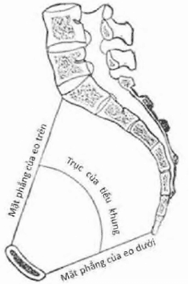
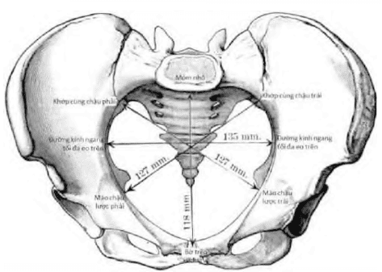
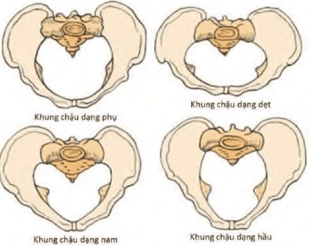

Trong cuộc đẻ, thai nhi từ tử cung ra ngoài phải đi qua một ống hình trụ cong gồm các tổ chức xơ, cơ và xương. Khung chậu đóng vai trò như "nòng súng" mà thai nhi ("viên đạn") phải vượt qua dưới động lực của cơn co tử cung.

## Giải phẫu chung

Khung chậu được cấu tạo bởi **4 xương**:

- Phía trước và 2 bên là **2 xương chậu** (xương dẹt, to, hình cánh quạt).
- Phía sau gồm **xương cùng** ở trên và **xương cụt** ở dưới.
  - **Xương cùng:** Gồm 5 đốt, mặt trước lõm, mặt sau lồi. Bờ trên đốt cùng 1 lồi ra trước gọi là **mỏm nhô** – mốc quan trọng nhất để đánh giá khung chậu.
  - **Xương cụt:** Gồm 4-6 đốt, đỉnh xương cụt là mốc đánh giá eo dưới.

Bốn xương này khớp với nhau bởi **4 khớp bán động**: khớp mu (trước), 2 khớp cùng-chậu (sau bên) và khớp cùng-cụt (sau). Các khớp này có khả năng **giãn nở** trong chuyển dạ, giúp đầu thai nhi đi qua dễ dàng hơn.

Mặt trong xương chậu có **đường vô danh** chia khung chậu làm 2 phần: **Đại khung** ở trên và **Tiểu khung** ở dưới.

## Đại khung

Đại khung chủ yếu có tác dụng nâng đỡ tử cung khi có thai, ít có vai trò trực tiếp trong chuyển dạ nhưng nếu quá nhỏ cũng có thể ảnh hưởng đến tiểu khung.

### Các đường kính ngoài

Sử dụng compa Baudelocque để đo các đường kính (số liệu trung bình ở người Việt Nam):

- **Đường kính Baudelocque (trước-sau):** Từ bờ trên khớp vệ đến mỏm gai L5: **17,5 cm**.
- **Đường kính lưỡng gai:** Nối 2 gai chậu trước trên: **22,5 cm**.
- **Đường kính lưỡng mào:** Nối 2 điểm xa nhất của mào chậu: **25,5 cm**.
- **Đường kính lưỡng mấu:** Nối 2 mấu chuyển xương đùi: **27,5 cm**.

### Trám Michaelis

Là hình trám giới hạn bởi: mỏm gai L5 (trên), 2 gai chậu sau trên (hai bên) và đỉnh rãnh liên mông (dưới).

- **Kích thước bình thường:** Đường chéo dọc 11 cm (phần trên 4 cm, phần dưới 7 cm), đường chéo ngang 10 cm (mỗi bên 5 cm).
- Nếu hình trám mất cân đối, khung chậu có thể bị lệch hoặc méo.

## Tiểu khung

Tiểu khung là phần quan trọng nhất vì thai nhi phải chui qua đây để ra ngoài. Lòng tiểu khung là một ống cong về phía trước với thành trước ngắn (4 cm) và thành sau dài (12-15 cm).

_Hình ảnh "Tiểu khung trên thiết đồ đứng dọc"_.

Tiểu khung có 3 vị trí hẹp gọi là 3 eo:

### Eo trên

Giới hạn bởi mỏm nhô (sau), đường vô danh (hai bên) và bờ trên khớp vệ (trước).

- **Các đường kính trước-sau:**
  - **Mỏm nhô - thượng vệ:** 11 cm.
  - **Mỏm nhô - hạ vệ:** 12 cm (đo được bằng tay).
  - **Mỏm nhô - hậu vệ:** **10,5 cm**. Đây là **đường kính hữu dụng** (quan trọng nhất) mà thai nhi thực sự phải đi qua.
- **Các đường kính ngang:**
  - **Ngang tối đa:** 13 cm (quá gần mỏm nhô nên không có giá trị sản khoa).
  - **Ngang hữu dụng:** 12,5 cm (đi ngang qua trung điểm đường kính trước-sau).
- **Các đường kính chéo:** Là đường kính lọt của eo trên.
  - **Chéo trái:** 12,5 cm (từ khớp cùng chậu phải đến mỏm chậu lược trái).
  - **Chéo phải:** 12 cm (từ khớp cùng chậu trái đến mỏm chậu lược phải).

_Hình ảnh "Các đường kính eo trên"_.

### Eo giữa

Mặt phẳng đi qua trung điểm mặt sau khớp vệ, hai gai hông và liên đốt cùng 4-5.

- **Đường kính ngang (lưỡng gai hông):** **10,5 cm**. Là khoảng cách hẹp nhất, có giá trị lâm sàng cao.
- **Đường kính trước-sau:** 11,5 cm.
- **Đường kính dọc sau:** 4,5 cm (từ trung điểm đường ngang đến mặt trước xương cùng).

### Eo dưới

Hợp bởi 2 hình tam giác chung đáy là đường liên ụ ngồi.

- **Đường kính trước-sau:** 9,5 cm (đỉnh cụt - hạ mu), có thể tăng đến 11,5 cm khi xương cụt bị đẩy ra sau.
- **Đường kính ngang (lưỡng ụ ngồi):** **11 cm**.

## Đánh giá và Khám khung chậu

### Khám lâm sàng

Thực hiện khi thai đủ tháng hoặc đang chuyển dạ.

**1. Khám eo trên:**

- Tìm mỏm nhô qua thăm âm đạo. Bình thường không sờ thấy. Nếu sờ thấy là khung chậu hẹp.
- Đo đường kính **nhô - hạ vệ**, sau đó trừ đi 1,5 cm để tính đường kính **nhô - hậu vệ**.
  - **< 8,5 cm:** Khung chậu hẹp tuyệt đối (chỉ định mổ).
  - **8,5 - 10 cm:** Khung chậu hẹp tương đối (có thể thử nghiệm pháp lọt).
- Đánh giá gờ vô danh: Bình thường chỉ sờ được 1/2 trước.

**2. Khám eo giữa:**

- Sờ gai hông: Nếu nhọn và nhô vào lòng tiểu khung là eo giữa hẹp.
- Đánh giá độ cong xương cùng: Xương cùng quá phẳng hoặc quá cong (hình móc câu) đều bất lợi.

**3. Khám eo dưới:**

- Đo khoảng cách giữa 2 ụ ngồi (bình thường 11 cm). Có thể ước lượng bằng nắm tay (> 9 cm là bình thường).
- Đo **góc vòm vệ**: Góc hợp bởi 2 ngành ngồi-mu. Bình thường **> 90 độ**. Nếu góc hẹp, thai sẽ khó sổ.

### Cận lâm sàng

- **X-quang kích khung chậu:** Đo chính xác các đường kính nhưng không chỉ định thường quy để tránh can thiệp không cần thiết.

## Xếp loại khung chậu (Caldwell-Moloy)

_Hình ảnh "4 dạng khung chậu theo Caldwell-Moloy"_.

1. **Khung chậu dạng nữ (Gynecoid):** 50%, hình bầu dục đều đặn, thuận lợi nhất cho sinh ngả âm đạo.
2. **Khung chậu dạng nam (Android):** Hình trái tim, mỏm nhô gồ, gai hông nhọn. Khó đẻ, thường gây lọt không đối xứng.
3. **Khung chậu dạng dẹt (Platypelloid):** Đường kính ngang lớn hơn trước-sau. Cản trở thì lọt của ngôi thai.
4. **Khung chậu dạng hầu (Anthropoid):** Đường kính trước-sau lớn hơn ngang. Xương cùng dài, mỏm nhô ngửa sau.

## Tài liệu tham khảo

- Trường ĐH Y Dược TP. HCM (2020) - _Team-based learning_
- Viện Y học Bản địa Việt Nam - _Khung chậu sản khoa_
