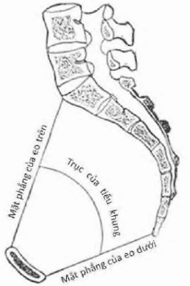
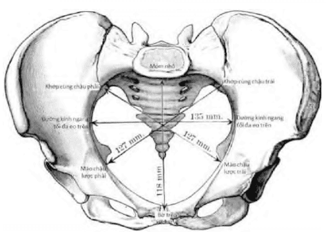
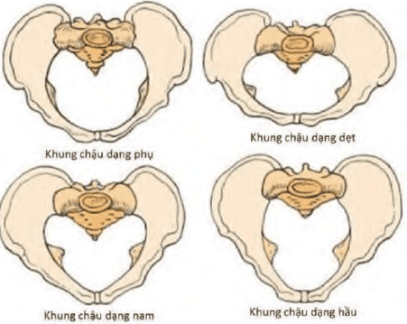

Khung chậu có vai trò rất quan trọng trong sản khoa, vì thai từ trong tử cung muốn sinh qua ngã âm đạo phải vượt qua được đoạn đường bên trong lòng khung chậu (tiểu khung). Việc đánh giá chính xác giải phẫu, kích thước các eo và hình dạng khung chậu giúp tiên lượng khả năng sinh ngả âm đạo và đưa ra hướng xử trí phù hợp.

## Giải phẫu

Khung chậu được cấu tạo bởi **4 xương** bao gồm phía **trước và 2 bên là 2 xương chậu**, **phía sau là xương cùng-cụt.** Mặt trong xương chậu có gờ vô danh chia khung chậu làm 2 phần: **đại khung** phía trên và **tiểu khung** phía dưới.

**Tiểu khung** là phần quan trọng nhất vì ngôi thai phải vượt qua tiểu khung để đi ra ngoài qua ngã âm đạo. Trên đoạn đường đi từ trong ra ngoài này, thai nhi phải lần lượt vượt qua các vòng eo hẹp - có thể được cấu tạo bằng xương hoặc xương kết hợp với cân-cơ - đó là **eo trên**, **eo giữa** và **eo dưới.**

_Hình "Tiểu khung trên thiết đồ đứng dọc"_.

Khi nhìn ngang, lòng tiểu khung có dạng ống cong về phía trước với 2 thành không đều nhau:

- Thành trước ngắn, khoảng 4 cm, tương ứng với mặt sau khớp vệ.
- Thành sau dài hơn, 12 - 15 cm, tương ứng với mặt trước xương cùng và xương cụt.

Các thì trong **quá trình ngôi thai đi qua khung chậu:**

- **Lọt:** Ngôi thai đi qua **eo trên.**
- **Xuống:** Ngôi di chuyển từ **eo trên đến eo dưới.**
- **Sổ:** Ngôi vượt qua **eo dưới** và ra ngoài.

### Eo trên

Eo trên là mặt phẳng xương đầu tiên mà ngôi thai phải vượt qua khi bắt đầu chuyển dạ. Giới hạn bởi:

- Phía sau: Mỏm nhô của xương cùng.
- Hai bên: Đường vô danh của 2 xương cánh chậu.
- Phía trước: Mặt sau của khớp vệ.

Eo trên là vòng xương cứng, không thay đổi trong chuyển dạ. Kích thước của eo trên được thể hiện qua các **đường kính:**

- **Đường kính trước - sau:**
  - **Mỏm nhô - thượng vệ:** 11 cm.
  - **Mỏm nhô - hạ vệ:** 12 cm (đo được qua thăm khám âm đạo).
  - **Mỏm nhô - hậu vệ:** **≥ 10,5 cm**. Đây là đường kính **hữu dụng** và **quan trọng nhất**, vì là đường kính thật sự mà ngôi thai phải vượt qua. Đường kính này được tính bằng đường kính Mỏm nhô - hạ vệ trừ đi 1,5 cm.
- **Đường kính chéo:** Từ khớp cùng - chậu bên này đến gai mào chậu lược bên kia. Trị số bình thường 12,75 cm.
- **Đường kính ngang:**
  - **Ngang tối đa:** 13,5 cm - không có giá trị sản khoa vì nằm gần mỏm nhô.
  - **Ngang hữu dụng:** 12,5 cm là đường kính ngang đi qua trung điểm của đường kính trước - sau. Dù quan trọng, nhưng không thể đo được trên lâm sàng.

_Hình "Các đường kính eo trên"_.

### Eo giữa

Eo giữa là đoạn hẹp nhất về mặt giải phẫu của đường sinh. Được tạo bởi:

- Phía sau: Xương cùng (hõm xương cùng).
- Hai bên: Gai hông - điểm nhô vào lòng tiểu khung, gây hẹp rõ rệt.
- Phía trước: Mặt sau khớp vệ.
- Phần còn lại là cơ và mạc.

Hõm xương cùng tạo thành một **khúc cong**, giống như "khúc cua cùi chỏ", đòi hỏi ngôi thai phải xoay để vượt qua. **Các đường kính chính:**

- **Đường kính ngang (Lưỡng gai hông):** **≥ 10 cm** - khoảng cách giữa 2 gai hông; có thể đo được và có giá trị lâm sàng cao.
- **Đường kính trước - sau:** 11,5 cm - từ bờ dưới khớp vệ đến đốt sống cùng S4 - S5.
- **Đường kính dọc sau:** 4,5 cm - từ điểm giao với đường kính ngang đến mặt trước xương cùng; phản ánh độ cong xương cùng và khả năng di chuyển của ngôi.

### Eo dưới

Eo dưới là đoạn cuối cùng của đường sinh. Cấu tạo gồm 2 tam giác:

- **Tam giác xương (phía trước):** Bờ dưới khớp vệ. Hai bên là hai nhánh tọa của xương chậu.
- **Tam giác cân - cơ - màng (phía sau):** Đỉnh là đỉnh xương cụt. Đáy là 2 ụ ngồi. Hai cạnh bên là dây chằng tọa - cùng. Do khớp cùng - cụt là **khớp bán động**, đỉnh xương cụt có thể bị đẩy ra sau, giúp mở rộng thêm không gian eo dưới trong chuyển dạ.

**Các đường kính chính:**

- **Đường kính ngang (Lưỡng ụ ngồi):** **≥ 11 cm** - khoảng cách giữa hai ụ ngồi; đo được trên lâm sàng.
- **Đường kính trước - sau:** 9,5 - 11,5 cm - từ bờ dưới khớp vệ đến đỉnh xương cụt (có thể thay đổi nhờ tính linh hoạt của khớp cùng - cụt).

## Thăm khám lâm sàng

Thăm khám khung chậu được thực hiện khi thai phụ chuyển dạ hoặc thai đủ trưởng thành. Trước khi thăm khám, thai phụ cần nằm tư thế phụ khoa, bàng quang và trực tràng đã được làm rỗng. Người khám mang găng tay vô khuẩn.

_Bảng "Các số liệu giải phẫu trọng yếu và kỹ thuật đo"_.

| Tên eo      | Đường kính quyết định               | Trị số chuẩn | Kỹ thuật đo đạc và Mô tả thao tác                                                                                                                                                                                                     |
| ----------- | ----------------------------------- | ------------ | ------------------------------------------------------------------------------------------------------------------------------------------------------------------------------------------------------------------------------------- |
| Eo trên     | Nhô - Hậu vệ (Trước - sau hữu dụng) | ≥ 10,5 cm    | Không đo trực tiếp được. • Dùng 2 ngón tay qua âm đạo tìm Mỏm nhô (S1). • Áp sát bờ bàn tay vào bờ dưới khớp vệ, dùng ngón trỏ tay còn lại đánh dấu điểm chạm. • Đo khoảng cách ra đường kính Nhô - Hạ vệ rồi trừ đi 1,5 cm. |
| Eo giữa     | Lưỡng gai hông (Ngang)              | ≥ 10 cm      | • Đưa 2 ngón tay rà sang 2 bên thành âm đạo. • Xác định độ nhọn của gai hông và khoảng cách giữa 2 gai. • Rà ngón tay dọc gờ nách xương cùng để đánh giá độ lõm khuyết hông (chuẩn: đút vừa 2 ngón tay).                        |
| Eo dưới     | Lưỡng ụ ngồi (Ngang)                | ≥ 11 cm      | • Đo ngoài: Dùng nắm tay ép vào vùng tầng sinh môn giữa 2 ụ ngồi (nắm tay vừa vặn ≈ ≥ 8,5 - 9 cm). • Rà ngón tay dưới bờ dưới khớp vệ để xác định Góc vòm vệ (chuẩn: góc tù > 90°).                                                |
| Khung ngoài | _Baudelocque_ và _Michaelis_        | Cân đối      | • Nhìn: Quan sát hình trám _Michaelis_ (11 × 10 cm). • Thước _Baudelocque_: Đo các đường kính ngoài (Lưỡng gai 25 cm, Lưỡng mào 27 cm, Lưỡng mấu 30 cm, Đường kính trước - sau ngoài 17,5 cm).                                     |

### Thăm khám ngoài

- **Khám hình trám _Michaelis_:** Cho thai phụ đứng (hoặc nằm sấp/nằm nghiêng). Quan sát vùng thắt lưng - mông để xác định 4 đỉnh:
  - Đỉnh trên: Đốt sống L5.
  - Đỉnh dưới: Đầu trên rãnh liên mông.
  - Hai đỉnh bên: Hai gai chậu sau trên.
  - Đánh giá hình trám: Hình trám cân đối có đường chéo dọc 11 cm và đường chéo ngang 10 cm. Bất thường (trám lệch, đường chéo ngang/ngang bất đối xứng) gợi ý khung chậu vẹo hoặc méo.
- **Đo khung chậu ngoài bằng thước _Baudelocque_:** Đặt hai đầu thước vào các mốc giải phẫu tương ứng để lấy chỉ số:
  - Đường kính Lưỡng gai: 25 cm.
  - Đường kính Lưỡng mào: 27 cm.
  - Đường kính Lưỡng mấu: 30 cm.
  - Đường kính Trước - sau ngoài: 17,5 cm.
  - Giá trị lâm sàng: Các chỉ số khung ngoài chỉ mang tính chất định hướng, không có giá trị quyết định như thăm khám trong.

### Thăm khám trong

Thăm khám trong qua âm đạo là thao tác cốt lõi trong đánh giá tiểu khung:

- **Đánh giá Eo trên (Xác định mỏm nhô):**
  - Ngón trỏ và ngón giữa tay thuận đưa vào âm đạo, đi ngược lên trên và ra sau dọc theo mặt trước xương cùng.
  - Đánh giá: Bình thường tay không sờ thấy mỏm nhô. Nếu sờ thấy gồ xương nhô ra, áp sát bờ bàn tay vào bờ dưới khớp vệ để đo đường kính Nhô - Hạ vệ, sau đó trừ đi 1,5 cm để ước tính đường kính Nhô - Hậu vệ.
- **Đánh giá Eo giữa (Mặt phẳng độ lọt):**
  - Rà ngón tay dọc theo hai bên thành chậu để xác định gai hông.
  - Đánh giá: Gai hông tù hoặc phẳng là bình thường. Nếu gai hông nhọn chĩa vào trong âm đạo → Eo giữa hẹp ngang. Tiếp tục đưa ngón tay ra sau kiểm tra khuyết hông (nếu hẹp, không đút vừa 2 ngón tay → Độ cong xương cùng giảm).
- **Đánh giá Eo dưới (Mặt phẳng đường ra):**
  - Đưa ngón tay rà dưới bờ dưới xương vệ để kiểm tra góc vòm vệ.
  - Đánh giá: Góc vòm vệ tù (> 90°) là rộng rãi; nếu nhọn (< 90°) → Hẹp eo dưới. Nắm tay ấn thử vào vùng tầng sinh môn giữa 2 ụ ngồi để ước lượng khoảng cách (nắm tay vừa vặn ≈ ≥ 8,5 - 9 cm).

## Xếp loại khung chậu

Theo _Caldwell-Moloy_, khung chậu được chia thành 4 loại chính:

_Hình "4 dạng khung chậu theo Caldwell-Moloy"_.

1. **_Gynecoid_ (dạng phụ nữ)** - 50,6%: Thường gặp nhất ở phụ nữ. Khung chậu có các đường kính đạt chuẩn, rất thuận lợi cho sinh ngả âm đạo.
2. **_Anthropoid_ (dạng hầu)** - 22,7%: Đường kính trước - sau lớn hơn đường kính ngang (giống khung chậu loài khỉ). Tỷ lệ sinh bằng dụng cụ cao hơn.
3. **_Android_ (dạng nam)** - 22,4%: Khung chậu có hình tim, gai hông nhọn, góc vòm vệ hẹp (giống khung chậu đàn ông). Gây nhiều khó khăn khi sinh.
4. **_Platypelloid_ (dạng dẹt)** - 4,4%: Đường kính ngang lớn nhưng đường kính trước - sau hẹp. Hiếm gặp, gây trở ngại lớn cho thì lọt của ngôi thai.[^1]

## Tiên lượng cuộc đẻ và Hướng xử trí

Kết quả thăm khám khung chậu kết hợp với đánh giá kích thước thai nhi và củng cố cơn co tử cung giúp đưa ra tiên lượng và hướng xử trí lâm sàng phù hợp.

_Bảng "Tổng hợp ý nghĩa lâm sàng và tiên lượng cuộc đẻ"_.

| Kết quả thăm khám                                 | Chẩn đoán lâm sàng                 | Nguy cơ và Ý nghĩa trong cuộc đẻ                                                                     | Hướng xử trí                                                     |
| ------------------------------------------------- | ---------------------------------- | ---------------------------------------------------------------------------------------------------- | ---------------------------------------------------------------- |
| Không sờ thấy mỏm nhô, gai hông tù, góc vòm vệ tù | Khung chậu bình thường             | Thai nhi lọt, xoay và sổ thuận lợi nếu cơn co tử cung tốt.                                           | Theo dõi đẻ đường âm đạo bình thường.                            |
| Sờ thấy mỏm nhô, Nhô - Hậu vệ < 8,5 cm            | Khung chậu hẹp tuyệt đối (Eo trên) | Ngôi thai không thể lọt qua eo trên. Nguy cơ vỡ tử cung, suy thai cấp.                               | Mổ lấy thai chủ động (Chỉ định tuyệt đối).                       |
| Sờ thấy mỏm nhô, Nhô - Hậu vệ 8,5 - 10 cm         | Khung chậu giới hạn                | Tiên lượng dè dặt. Cần sự phối hợp của thai nhỏ và cơn co tử cung tốt để đầu thai biến dạng lọt qua. | Xem xét làm Thử nghiệm chuyển dạ (Nếu ngôi chỏm, thai ≤ 3200 g). |
| Gai hông nhọn, khuyết hông hẹp                    | Hẹp eo giữa                        | Thai lọt qua eo trên nhưng bị ngưng trệ ở giữa tiểu khung (lọt kẹt giữa chừng).                      | Can thiệp mổ lấy thai cấp cứu hoặc _Forceps_ nếu đủ điều kiện.   |
| Góc vòm vệ nhọn (< 90°), Lưỡng ụ ngồi < 8 cm      | Hẹp eo dưới                        | Cản trở thì sổ của thai. Dễ gây kẹt vai, rách tầng sinh môn phức tạp cấp độ 3, 4.                    | Cắt tầng sinh môn rộng hoặc Mổ lấy thai.                         |
| Hình trám _Michaelis_ bất cân đối                 | Khung chậu lệch / méo              | Gây bất tương xứng đầu chậu động, thai nhi cúi không tốt, bất thường cơ chế xoay.                    | Theo dõi sát trên biểu đồ chuyển dạ, nguy cơ mổ cao.             |

## Tài liệu tham khảo

[^1]: Bộ môn Sản Phụ khoa, Trường Đại học Y Dược TP. Hồ Chí Minh. _Thực hành Sản Phụ khoa_. NXB Y học; 2020.
