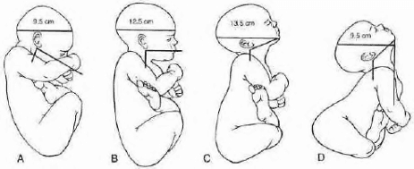
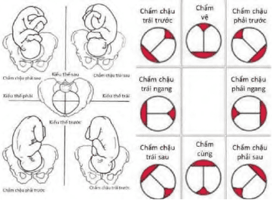

**Ngôi, thế, kiểu thế** là cách mô tả tư thế và vị trí tương đối của phần thai sẽ đi qua đường sinh, dựa trên mối liên hệ giữa các mốc giải phẫu của thai nhi và khung chậu người mẹ.

## Ngôi

**Ngôi** được định nghĩa là phần của thai nhi trình diện đầu tiên trước **eo trên** và sẽ tiến triển qua đường sinh theo cơ chế tương ứng:

- **Ngôi dọc**: Trục dọc của thai nhi song song với trục của cơ thể người mẹ. Bao gồm **ngôi đầu** và **ngôi mông**.
- **Ngôi ngang**: Trục của thai nhi vuông góc với trục cơ thể người mẹ. Thai có thể ở tư thế **chéo**, không ổn định, và thường chuyển thành ngôi dọc hoặc ngang khi vào chuyển dạ.

**Phân loại ngôi đầu**:

_Hình ảnh "Phân loại ngôi đầu"._

- **Ngôi chỏm**: Đầu cúi tối đa, cằm áp sát ngực.
- **Ngôi thóp trước**: Đầu ở tư thế trung gian, thóp trước trình diện.
- **Ngôi trán**: Đầu ngửa trung gian, trán là phần trình diện.
- **Ngôi mặt**: Đầu ngửa tối đa, gáy chạm lưng, cằm là phần trình diện.

Mỗi ngôi có **mốc giải phẫu** đặc trưng giúp nhận biết:

- Ngôi chỏm: **Thóp sau**.
- Ngôi trán: **Gốc mũi**.
- Ngôi mặt: **Cằm**.
- Ngôi mông: **Đỉnh xương cùng**.
- Ngôi ngang: **Mỏm vai**.

## Thế

**Thế** là tương quan giữa mốc của ngôi với **bên phải** hoặc **bên trái** của khung chậu người mẹ. Mỗi ngôi có 2 thế:

- **Thế phải**.
- **Thế trái**.

## Kiểu thế

**Kiểu thế** là mối liên hệ giữa điểm mốc của ngôi với các mốc giải phẫu của khung chậu mẹ, gồm:

- Gai mào chậu lược.
- Khớp cùng-chậu.
- Trung điểm của gờ vô danh.

Từ đó, mỗi ngôi có 6 **kiểu thế**:

- **Trái trước**.
- **Trái ngang**.
- **Trái sau**.
- **Phải trước**.
- **Phải ngang**.
- **Phải sau**.

Riêng ngôi ngang cần xác định thêm vai thai nhi ở bên nào (trái/phải mẹ) và **lưng thai** nằm phía trước hay sau, để mô tả đầy đủ tư thế thai nhi trong tử cung.

## Chẩn đoán

Chẩn đoán dựa vào:

- **Sờ nắn bụng (thủ thuật Leopold)**.
- **Khám âm đạo**.
- **Nghe tim thai**.
- **Siêu âm** (trong một số trường hợp khó).
- **X-quang** (hiếm khi chỉ định).

### Thủ thuật Leopold

Bốn thủ thuật Leopold giúp xác định ngôi và thế thai:

1. **Thủ thuật thứ nhất**: Nắn đáy tử cung để xác định phần thai (đầu hoặc mông).
2. **Thủ thuật thứ hai**: Nắn hai bên bụng để xác định bên nào là **lưng** và bên nào là **chi**.
3. **Thủ thuật thứ ba**: Nắn vùng trên xương vệ để xác định phần thai ở đoạn dưới tử cung (đầu hoặc mông).
4. **Thủ thuật thứ tư**: Khám từ hướng chân sản phụ, dùng đầu ngón tay ấn trên xương vệ để đánh giá **mức độ lọt** của đầu thai → Nếu đầu chưa lọt, hai bàn tay **hội tụ vào nhau**. Khi đầu đã lọt, hai bàn tay **phân kỳ ra ngoài**.

Trong ngôi chỏm, **ụ đầu** cùng bên với chi; trong ngôi mặt, ụ đầu ngược bên với chi.

### Khám âm đạo

_Hình ảnh "Các kiểu thế trong ngôi chỏm"._

Khám âm đạo lúc cổ tử cung đã mở là **phương pháp chính xác nhất** để xác định ngôi – thế – kiểu thế:

- Ngôi chỏm: Tìm **thóp trước**, **thóp sau**, và **các đường khớp sọ**.
- Ngôi mặt: Xác định **cằm**.
- Ngôi mông: Xác định **đỉnh xương cùng** và **2 ụ ngồi**.

### Vị trí nghe tim thai

- Tim thai thường nghe rõ nhất **ở lưng thai nhi**, đặc biệt tại **mỏm vai**.
- Ngôi chỏm/ngôi mông: Tim thai nghe rõ ở vùng lưng.
- Ngôi mặt: Tim thai nghe rõ ở vùng **ngực thai nhi**.

### Siêu âm

Siêu âm có giá trị khi:

- Bụng sản phụ dày, khó sờ nắn.
- Nước ối quá nhiều.
- Không xác định được rõ ngôi qua sờ nắn hoặc khám âm đạo.

Đây là phương tiện **an toàn, chính xác** trong xác định ngôi, thế và kiểu thế.

## Tài liệu tham khảo

- Trường ĐH Y Dược TP. HCM (2020) – _Team-based learning_
