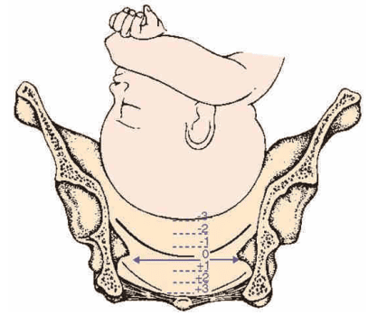
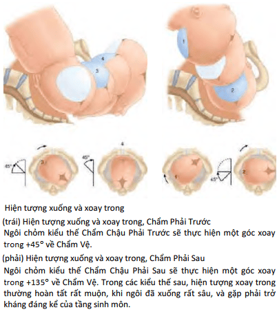
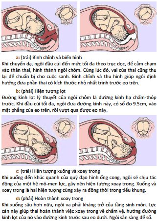
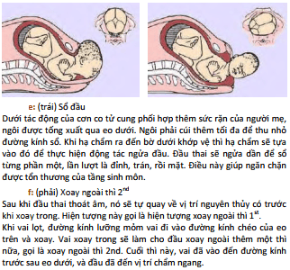
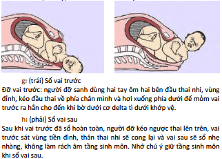
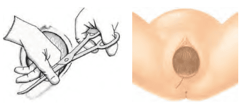

Ngôi chỏm là ngôi thai mà trong đa số các trường hợp có thể sinh qua đường âm đạo.

## Cơ chế

Trong cuộc sinh ngôi chỏm, các phần lớn nhất của thai (đầu, vai, mông) sẽ lần lượt vượt qua các eo của khung chậu: Eo trên, eo giữa, eo dưới. Quá trình này bao gồm các thì tuần tự sau:

1. **Lọt:** Khi phần thai đi qua eo trên.
2. **Xuống và xoay:** Khi phần thai di chuyển từ eo trên xuống eo dưới, đồng thời xoay.
3. **Sổ:** Khi phần thai đi qua eo dưới và ra ngoài.

Trên lâm sàng, các hiện tượng này diễn ra nối tiếp và có thể chồng lấp nhau. Vì vậy, cơ chế sinh cũng có thể chia thành hai giai đoạn:

1. **Thì lọt và xuống:** Xảy ra ở vị trí cao.
2. **Thì xoay và sổ:** Xảy ra ở vị trí thấp. Trong những tuần cuối thai kỳ, do thân thai lớn hơn đầu, thân thường hướng lên phía đáy tử cung - vùng rộng hơn - còn đầu hướng xuống vùng eo - nơi hẹp hơn.

### Lọt

Ngôi được xem là đã lọt khi đường kính lọt của ngôi vượt qua mặt phẳng eo trên (12.75 cm). Ở ngôi chỏm, đường kính lọt lý thuyết là **hạ chẩm - thóp trước** (9.5 cm), nhưng lâm sàng thường dùng đường kính **lưỡng đỉnh** (cũng 9.5 cm). Chẩn đoán lọt dựa vào khám bụng và khám âm đạo.

**Khám bụng:** Đánh giá độ lọt bằng cách ước lượng phần đầu thai nhi còn nằm trên xương vệ so với chiều rộng của năm ngón tay khép lại:

- Toàn bộ đầu trên xương vệ: 5/5.
- Toàn bộ đầu dưới xương vệ: 0/5.
- Ngôi lọt thường ở khoảng 2/5.

**Khám âm đạo:** Xác định vị trí thấp nhất của xương đầu so với gai hông:

- Chưa lọt: -1, -2, -3.
- Đã lọt: +1, +2, +3.

_Hình ảnh "Độ lọt ngôi thai"_.

### Xuống

Là sự di chuyển tiếp theo của ngôi thai trong tiểu khung sau khi đã lọt.

### Xoay

Xoay trong giúp ngôi điều chỉnh để đường kính sổ của đầu trùng với đường kính trước - sau của eo dưới.

_Hình ảnh "Xuống và xoay trong"_.

### Sổ

Sổ thai xảy ra khi ngôi vượt qua eo dưới, điểm tựa chính là **bờ dưới khớp vệ**, nơi ngôi thực hiện động tác sổ ra ngoài.

## Thực hiện đỡ đẻ

Các giai đoạn **(a → d)** xảy ra theo cơ chế tự nhiên, **không được can thiệp:**

_Hình ảnh "Đẻ thường ngôi chỏm a → d"_.

Từ giai đoạn **(e → h)**, người đỡ sinh có thể **hỗ trợ** nếu thỏa 3 điều kiện:

1. Ngôi đã xoay về chẩm vệ.
2. Đầu đã xuống đến vị trí +3, làm căng phồng tầng sinh môn.
3. Hai môi bé tách rộng.

**Giúp đầu cúi tối đa:** Tay phải dùng 3 ngón giữa ấn vào thượng chẩm, tay trái giữ tầng sinh môn.
_Hình ảnh "Đẻ thường ngôi chỏm e → f"_.

**Khi hạ chẩm ra khỏi bờ dưới khớp vệ:** Tay phải kiểm soát tốc độ ngửa đầu để sổ trán, nếu tầng sinh môn căng quá có thể cắt chủ động.

**Sổ đầu xong** kiểm tra dây rốn quấn cổ:

- Quấn lỏng: Tháo.
- Quấn chặt: Kẹp và cắt.

**Xoay ngoài thì 1st** đầu tự xoay về vị trí ban đầu. **Xoay ngoài thì 2nd** vai xoay trong → đầu xoay ngoài thêm → vào đường kính trước sau.

**Đỡ vai trước** kéo đầu về phía chân người đỡ, xuống dưới để vai ra. **Đỡ vai sau** kéo thai lên trên, vai sau sổ nhẹ nhàng, giữ tầng sinh môn.

_Hình ảnh "Đẻ thường ngôi chỏm g → h"_.

**Sổ phần còn lại** tay trái đỡ cổ, tay phải vuốt dọc lưng, nắm 2 bàn chân bằng 3 ngón tay (cái, trỏ, giữa). Sau sổ, giữ đầu thai thấp hơn bàn sinh.

**Cắt tầng sinh môn** chỉ thực hiện khi thực sự cần, không phải thủ thuật thường quy. Cần thiết khi:

- Tầng sinh môn quá căng.
- Thai to, sinh thủ thuật.
  :::caution
  Cắt tầng sinh môn không rút ngắn thời gian rặn, không giúp sinh nhanh hơn.
  :::

_Hình ảnh "Cắt tầng sinh môn"_.

## Thở và rặn

### Cách thở

Dựa trên chu kỳ co tử cung:

- **Khi bắt đầu đau:** Thở nhanh, nông, hít bằng mũi - thở ra bằng miệng, tạo âm thanh rít nhẹ. Khi bớt đau, thở chậm và sâu.
- **Giữa các cơn:** Thở đều, thư giãn toàn thân, tích lũy năng lượng.

### Cách rặn

**Khi có cơn co:** Hít sâu. Nín thở, ngậm miệng, nắm hai bên bàn sinh, chân đạp ống treo. Dồn hơi rặn mạnh xuống bụng dưới. Rặn thêm nếu còn đau và còn hơi. Lưng giữ thẳng, sát bàn sinh; Mông cong lên; **không phát âm** khi rặn.

**Khi hết đau:** Thở sâu, nghỉ và dưỡng sức cho đợt tiếp theo.

## Tài liệu tham khảo

- Trường ĐH Y Dược TP. HCM (2020) - _Team-based learning_
- Bệnh viện Từ Dũ - [_Cách thở và rặn sinh trong cuộc chuyển dạ_](https://tudu.com.vn/vn/y-hoc-thuong-thuc/suc-khoe-phu-nu/lam-me-an-toan/cham-soc-ba-me-mang-thai/cach-tho-va-ran-sinh-trong-cuoc-chuyen-da/)
