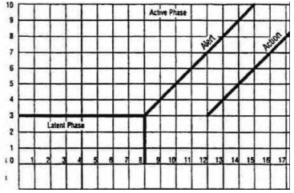

Hậu quả của chuyển dạ kéo dài rất nặng nề. Hầu hết các biến chứng của chuyển dạ có liên quan đến chuyển dạ kéo dài hay chuyển dạ tắc nghẽn, với nguyên nhân chính của nó là do bất xứng đầu chậu. Tuy nhiên, chuyển dạ kéo dài có thể phòng tránh được. Chuyển dạ tắc nghẽn cũng có thể được nhận biết sớm, trước khi kịp gây hay để lại các hậu quả nghiêm trọng. Phòng tránh chuyển dạ kéo dài mang lại lợi ích lớn. Phương tiện hữu hiệu cho mục đích này là sản đồ.

## Chuyển dạ kéo dài

Chuyển dạ kéo dài được hiểu là chuyển dạ kéo dài trên 24h. Chuyển dạ giai đoạn hoạt động trên 12h là kéo dài.
Chuyển dạ kéo dài được hiểu là chuyển dạ kéo dài trên 24h. Chuyển dạ giai đoạn hoạt động trên 12h là kéo dài.

Do giai đoạn xóa mở cổ tử cung của chuyển dạ gồm 2 giai đoạn liên tiếp, nên có thể phân biệt:

1. Chuyển dạ giai đoạn tiềm thời kéo dài: thường khó xác định, do khó biết được khởi đầu của chuyển dạ.
2. Chuyển dạ giai đoạn hoạt động kéo dài: khi độ dài của giai đoạn hoạt động kéo dài trên 12h.
2. Chuyển dạ giai đoạn hoạt động kéo dài: khi độ dài của giai đoạn hoạt động kéo dài trên 12h.

Có 3 yếu tố gây bất thường trong chuyển dạ 3P:

1. Bất thường của cơn co (Power): Cơn co tử cung là động lực của chuyển dạ, gây xóa mở cổ tử cung. Cơn gò yếu hay không tương hợp sẽ dẫn đến diễn tiến bất thường của xóa mở cổ tử cung.
2. Bất thường của ngôi thai (Passenger): Bất tương xứng của các kích thước của ngôi thai so với các kích thước của đường sanh, kiểu trình thai bất thường có cơ chế sinh khó hay không có cơ chế sinh là các yếu tố về phía thai gây chuyển dạ bất thường. Tuy nhiên, thuật ngữ chuyển dạ kéo dài thường được dùng cho ngôi chỏm. Thuật ngữ chuyển dạ kéo dài hiếm khi được dùng trong chuyển dạ với ngôi thai không phải là ngôi chỏm.
3. Bất thường của đường sinh (Passage): Đoạn đường qua tiểu khung bất thường về hình dạng, cấu trúc hay kích thước sẽ gây khó khăn cho thai nhi khi nỗ lực vượt qua đường sanh. Khối u cản trở đường sinh không phải là nguyên nhân thường gặp.

## Chuyển dạ tắc nghẽn

Chuyển dạ tắc nghẽn (obstructed labor) là thuật ngữ dùng để chỉ chuyển dạ với tắc nghẽn cơ học ở đường ra.

:::note[Chẩn đoán hội chứng tắc nghẽn]

Khi hiện diện cản trở cơ học trên đường ra, thai nhi sẽ có những nỗ lực để vượt qua. Các nỗ lực để vượt trở ngại được thể hiện qua:

1. Việc tăng hoạt động của tử cung, với các cơn co trở nên dồn dập.
2. Không dẫn đến tiến triển của ngôi thai dù.
3. Thai nhi đã cố gắng thực hiện những biến đổi hình dạng cần thiết như uốn khuôn đầu theo dạng của khung chậu hay chồng xương sọ.

:::

### Nguyên nhân

Cản trở cơ học có thể có nguyên nhân là kích thước không thỏa đáng của khung chậu (khung chậu hẹp) hay hình dạng bất thường của khung chậu. Cản trở do nguyên nhân khung chậu tạo rào cản không thể vượt qua. Khung chậu hẹp ở eo trên là thường thấy nhất, nhưng cũng phổ biến trong đoạn đường đi trong tiểu khung (hẹp eo giữa). Cản trở ở eo trên thường rõ ràng, dễ nhận biết, trong khi đó cản trở ở eo giữa thường gây khó khăn trong thiết lập chẩn đoán, và có thể dẫn đến những sai lầm chết người.

Cản trở cơ học không chỉ do nguyên nhân khung chậu. Mọi nguyên nhân làm cho các kích thước của ngôi không còn tương thích với kích thước của khung chậu cũng gây ra cản trở cơ học. Các nguyên nhân gây chuyển dạ tắc nghẽn thường thấy nhất là:

- Bất xứng đầu chậu.
- Ngôi bất thường với cơ chế sinh bất thường như ngôi mặt cằm sau.
- Ngôi bất thường không có cơ chế sinh ngả âm đạo: ngôi trán, ngôi ngang.
- Dị tật thai nhi: não úng thủy.
- U đường sinh dục và vùng chậu cản trở đường sanh.

### Bất xứng đầu chậu

Bất xứng dầu chậu được hiểu là sự không tương thích giữa các đường kính trình thai và kích thước tiểu khung.

Khung chậu không hẹp nhưng do thai nhi không vào được khung chậu do những kiểu trình thai bất thường như đầu cúi không tốt, đầu lọt bất đối xứng... Trong những trường hợp này, ngôi thai trình những đường kính không phải là đường kính nhỏ nhất của ngôi ra trước lối vào của eo trên, và dẫn đến bất tương xứng giữa kích thước của phần trình thai và kích thước lối vào của tiểu khung. Có thể xảy ra giữa: khung chậu hẹp với đầu thai bình thường, hoặc thai to khung chậu bình thường, hoặc cả 2 điều trên.

Thuật ngữ bất xứng đầu chậu thường chỉ dùng trong chuyển dạ. Trong quá trình chuẩn bị cho chuyển dạ, thai nhi thực hiện các bình chỉnh cần thiết gồm thu các đường kính lọt về tối thiểu, hướng các đường kính lọt vào đường kính lớn nhất của tiểu khung, và tiến trình vượt qua tiểu khung cũng như các điều chỉnh cuối cùng tư thế, kích thước ngôi bằng các kiểu trình bất đối xứng hay uốn khuôn chỉ xảy ra trong chuyển dạ và chỉ trong chuyển dạ.

Chỉ trong rất ít trường hợp trong đó (1) các kích thước của tiểu khung quá nhỏ, quá lệch trong khi thai nhi có kích cỡ bình thường, hay (2) khi thai nhi to vượt mức là những trường hợp hiếm hoi mà chẩn đoán bất xứng đầu chậu có thể được thiết lập ngoài chuyển dạ. Khi đó, mổ lấy thai là cần thiết.

### Hậu quả

#### Suy thai

Suy thai trong chuyển dạ là hệ quả của hoạt động dồn dập với tần số và cường độ cao của cơ tử cung.

Cơn co tử cung với tần số và cường độ cao, kèm theo tăng trương lực căn bản dẫn đến suy giảm nghiêm trọng trong trao đổi tử cung-rau. Ngưng cấp máu trong cơn co tử cung, khoảng nghỉ ngắn không cho phép bù đắp tình trạng thiếu oxy trong cơn co làm suy giảm nhanh chóng khả năng bù trừ của hệ đệm với tình trạng toan hóa hô hấp. Tình trạng này kéo dài sẽ dẫn đến khả năng mất bù trừ và nhiễm toan chuyển hóa, với các di chứng trên hệ thần kinh thai.

#### Hội chứng vượt trở ngại - Dọa vỡ tử cung - Vỡ tử cung

Dọa vỡ tử cung là đỉnh điểm của hội chứng vượt trở ngại, xảy ra ngay trước khi thành tử cung bị xé toạc do thai phải tìm được lối ra khỏi ống sinh bị tắc nghẽn.

Trong nhiều trường hợp, tử cung co thắt mãnh liệt. Cơ tử cung ở vùng thân càng lúc càng dầy thêm, trong khi đoạn dưới bị kéo dài và trở nên mỏng quá mức. Tử cung có thắt mạnh với lớp cơ dầy làm đáy tử cung bị dịch lên cao, căng kéo hai dây chằng tròn (dấu hiệu Frommel). Ranh giới giữa vùng thân và vùng đoạn dưới trở nên rõ rệt, có hình dạng như vòng thắt tạo cho tử cung có dạng quả bầu (vòng Bandl).

:::note[Chẩn đoán dọa vỡ tử cung]
Bộ các triệu chứng gồm:

1. Cơ tử cung hoạt động với tần số dồn dập.
2. Hiện diện của vòng Bandl.
3. Dấu hiệu Frommel.
4. Ngôi thai không tiến triển trong ống sinh
5. Các biến dạng trên ngôi thai như chồng xương sọ quan trọng, lọt không đối xứng và bướu huyết thanh càng lúc càng to.

:::

Vỡ tử cung là hệ quả cuối cùng của chuyển dạ tắc nghẽn, với nhiều hệ quả nghiêm trọng. Khi tiến triển xa hơn nữa, cơn co tử cung sẽ dẫn đến việc tống xuất thai nhi vượt qua nơi có trở kháng yếu nhất trên đường sanh. Lúc này, nơi có trở kháng kém nhất chính là đoạn dưới tử cung. Dưới tác dụng của cơn co tử cung, ngôi thai xé toạc đoạn dưới tử cung và rơi vào trong ổ bụng.

Tình trạng vỡ tử cung thường kèm theo (1) tổn thương các mạch máu chủ yếu cấp máu cho tử cung và gây chảy máu nghiêm trọng và nhanh chóng dẫn đến tử vong mẹ, (2) tồng xuất thai nhi ra ngoài, bong rau và chấm dứt trao đổi tử cung-rau trong khi thai vẫn chưa tiếp xúc với khí trời gây tử vong thai nhanh chóng.

#### Các đường dò sinh dục

Trong những nỗ lực vượt qua trở ngại, các cơn co tử cung thúc ngôi thai xuống dưới. Dưới sức mạnh của lực đẩy của tử cung, phần mềm của đường sinh bị chèn ép mạnh giữa 2 vật cứng là xương đầu thai và khung chậu, gây nên tình trạng thiếu máu tạm thời. Khi tình trạng kéo dài, thiếu máu sẽ dẫn đến hoại tử mô mềm nơi bị chèn ép và dẫn đến hình thành các đường dò niệu-sinh dục (thường nhất là bàng quang-tử cung) hay tiêu hóa-sinh dục (thường nhất là giữa trực tràng và ống sinh dục). Do chèn ép phía trước giữa đầu và xương vệ thường liên tục và mạnh, trong khi chèn ép mô phía sau giữa đầu và mỏm nhô thường gián đoạn và yếu hơn nên các đường dò niệu-sinh dục xảy ra với tần suất phổ biến hơn là các đường dò tiêu hóa-sinh dục.

#### Nhiễm trùng sơ sinh và nhiễm trùng hậu sản

Ở các chuyển dạ bình thường, trong điều kiện các màng ối còn nguyên vẹn, màng ối có nhiệm vụ như chốt chặn ngăn cản sự xâm nhập lên trên của vi khuẩn. Khi các màng ối đã vỡ, nhiều biến động sẽ xảy ra:

1. Tử cung co thắt làm thay đổi áp suất trong buồng tử cung có chu kỳ, có tác động như bơm tống nước ối sạch từ tử cung vào âm đạo, và hút nước ối/dịch âm đạo có vi khuẩn vào buồng ối. Thời gian càng chuyển dạ có vỡ ối càng kéo dài, hoạt độ tử cung càng mạnh thì nguy cơ vấy bẩn buồng ối do xâm nhập ngược dòng càng cao.
2. Chuyển dạ kéo dài làm tăng không mong muốn số lần khám, dẫn đến việc đưa vi khuẩn âm đạo xâm nhập vào buồng ối khi thực hiện thao tác khám.

Nhiễm trùng ối là tình trạng nhiễm trùng rất nặng, ảnh hưởng nghiêm trọng đến sơ sinh. Nhiễm khuẩn ối được định nghĩa là nhiễm khuẩn của nước ối và các màng ối. Vi khuẩn tìm thấy ở nước ối môi trường nuôi cấy và phát triển lý tưởng, và gây nên nhiễm khuẩn nước ối sau 6 giờ. Nhiễm khuẩn của nước ối kéo theo hệ quả trực tiếp là nhiễm khuẩn thai nhi, do thai nhi uống và hít thở nước ối. Nhiễm trùng sơ sinh là hệ quả trực tiếp của nhiễm khuẩn ối. Nhiễm khuẩn này càng nặng nề hơn nếu tác nhân gây bệnh là Streptococcus B. Nhiễm khuẩn nước ối làm thay đổi tính chất của dịch ối, dịch ối trở nên hôi. Sơ sinh tống xuất phân su do cả tình trạng thiếu oxy kéo dài lẫm tình trạng nhiễm trùng dẫn đến đổi màu nước ối. Do lúc này, vi khuẩn còn chưa tấn công người mẹ, nên vẫn chưa có biểu hiện lâm sàng về phía mẹ.

Nhiễm trùng nội mạc tử cung, tử cung, du khuẩn huyết và nhiễm trùng huyết là hệ quả tiếp theo của nhiễm trùng ối. Đích đến kế đó của vi khuẩn sẽ là màng ối và màng đệm. Vi khuẩn nhanh chóng vượt qua các màng bào thai để vào đến tử cung và hệ tuần hoàn mẹ. Nhiễm trùng của màng rụng, lớp cơ tử cung, du khuẩn huyết, tiếp theo bằng huyết nhiễm trùng là các mức độ tuần tự tăng dần của nhiễm trùng ối. Lúc này, đã có các triệu chứng toàn thân ở mẹ. Biến đổi trong công thức bạch cầu, CRP là nhiễm dấu chứng của tình trạng nhiễm trùng ối đã xâm nhập vào tuần hoàn mẹ. Co thắt tử cung mạnh và liên tục tạo điều kiện thuận lợi hơn cho du khuẩn huyết và nhiễm trùng huyết.

Huyết nhiễm trùng là tình trạng rất nặng, có thể dẫn đến sốc nhiễm trùng và tử vong cho mẹ.

## Biểu đồ chuyển dạ (Sản đồ)

Sản đồ WHO model 1993 còn là công cụ rất mạnh dùng để tầm soát chuyển dạ kéo dài và đề ra các biện pháp phòng tránh chuyển dạ kéo dài.

_Sản đồ WHO 1993._

### Đặc điểm

Trung tâm của sản đồ model WHO là đường báo động, thuộc về phần biểu đồ ghi lại diễn tiến cổ tử cung. Đường báo động là đường thẳng xuất phát tử tung độ mở cổ tử cung là 3cm, và hoành độ thời gian làh thứ 8 sau khi bắt đầu. Hệ số góc của đường này là 1, ứng với tốc độ mở cổ tử cung là 1cm/h, trùng với tốc độ mở cổ tử cung ở bách phân vị thứ 10 của dân số khảo sát bởi Philpott và các khảo sát trước đó của WHO. Điều này có nghĩa là khi tốc độ mở cổ tử cung là chậm hơn đường báo động, tức sản đồ ở bên phải của đường báo động, thì cũng đồng nghĩa với cổ tử cung đang diễn tiến như người có mở cổ tử cung chậm trong dân số khảo sát, cũng đồng nghĩa với việc chuyển dạ có nguy cơ trở thành chuyển dạ kéo dài, nếu không được nhận diện hay can thiệp thích hợp.
Trung tâm của sản đồ model WHO là đường báo động, thuộc về phần biểu đồ ghi lại diễn tiến cổ tử cung. Đường báo động là đường thẳng xuất phát tử tung độ mở cổ tử cung là 3cm, và hoành độ thời gian làh thứ 8 sau khi bắt đầu. Hệ số góc của đường này là 1, ứng với tốc độ mở cổ tử cung là 1cm/h, trùng với tốc độ mở cổ tử cung ở bách phân vị thứ 10 của dân số khảo sát bởi Philpott và các khảo sát trước đó của WHO. Điều này có nghĩa là khi tốc độ mở cổ tử cung là chậm hơn đường báo động, tức sản đồ ở bên phải của đường báo động, thì cũng đồng nghĩa với cổ tử cung đang diễn tiến như người có mở cổ tử cung chậm trong dân số khảo sát, cũng đồng nghĩa với việc chuyển dạ có nguy cơ trở thành chuyển dạ kéo dài, nếu không được nhận diện hay can thiệp thích hợp.

Trong sản đồ model 1993 của WHO, độ dài của pha tiềm thời là bất định. Điều này phản ánh những khó khăn trong việc xác định thời điểm bắt đầu chuyển dạ.

Động tác tịnh tiến lên đường báo động có ý nghĩa quan trọng, vì nó thể hiện việc bắt đầu so sánh với diễn tiến tối thiểu khi chuyển dạ đã vào giai đoạn hoạt động. Điểm đánh dấu pha hoạt động của sản đồ model 1993 của WHO được set là ≥3cm. Đường hành động là đường song song với đường báo động và cách đường báo động 4 đơn vị hoành độ về phía phải. Đường này cảnh báo đã hết thời hạn để thực hiện các điều chỉnh, có ý nghĩa phân định giữa chờ đợi và hành động tích cực. Biểu đồ chạm đường hành động là thời điểm buộc phải tiến hành các can thiệp có tính quyết đoán, nhưng không hoàn toàn đồng nghĩa với chấm dứt chuyển dạ.
Động tác tịnh tiến lên đường báo động có ý nghĩa quan trọng, vì nó thể hiện việc bắt đầu so sánh với diễn tiến tối thiểu khi chuyển dạ đã vào giai đoạn hoạt động. Điểm đánh dấu pha hoạt động của sản đồ model 1993 của WHO được set là ≥3cm. Đường hành động là đường song song với đường báo động và cách đường báo động 4 đơn vị hoành độ về phía phải. Đường này cảnh báo đã hết thời hạn để thực hiện các điều chỉnh, có ý nghĩa phân định giữa chờ đợi và hành động tích cực. Biểu đồ chạm đường hành động là thời điểm buộc phải tiến hành các can thiệp có tính quyết đoán, nhưng không hoàn toàn đồng nghĩa với chấm dứt chuyển dạ.

Sau model 1993, WHO có nhiều cải tiến trong sản đồ. Cải tiến gần nhất (2002) là:

- Bỏ phần ghi giai đoạn tiềm thời và việc tịnh tiến, cùng lúc với việc chỉ bắt đầu ghi trong giai đoạn hoạt động.
- Giai đoạn hoạt động, tức thời điểm bắt đầu có thể ghi sản đồ được điều chỉnh là ≥4cm, nhằm tránh những can thiệp khi chưa thực sự bắt đầu giai đoạn hoạt động.
- Giai đoạn hoạt động, tức thời điểm bắt đầu có thể ghi sản đồ được điều chỉnh là ≥4cm, nhằm tránh những can thiệp khi chưa thực sự bắt đầu giai đoạn hoạt động.

### Ý nghĩa

Sản đồ cũng cải thiện quản lý chuyển dạ, đặc biệt là cho nhân viên y tế tuyến chưa có nhiều kinh nghiệm.

Sản đồ cũng cải thiện có ý nghĩa kết cục thai kỳ ở mọi cấp độ của đơn vị chăm sóc y tế, đặc biệt các đơn vị chăm sóc y tế thiếu cán bộ được đào tạo chuyên sâu.

Sản đồ cũng hỗ trợ đắc lực cho đơn vị chăm sóc y tế tuyến cao, cải thiện và nâng cao hiệu quả của huấn luyện thực hành sản khoa.

## Nguồn tham khảo

- Trường Đại học Y Dược Thành phố Hồ Chí Minh (2020) - TEAM-BASED LEARNING.
