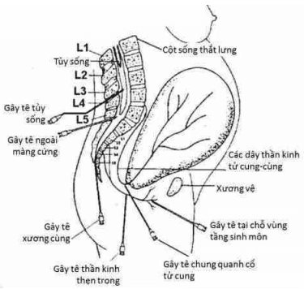
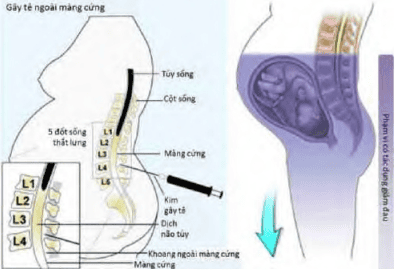

**Đau** là một hiện tượng chủ quan, thay đổi tùy theo tính chất và cường độ cảm nhận của từng cá nhân. Trong chuyển dạ, cảm giác đau truyền qua các đoạn tủy sống, nơi tiếp nhận tín hiệu từ tử cung, cổ tử cung, khung chậu và tầng sinh môn. Khi không có biện pháp giảm đau, các tín hiệu thần kinh này có thể lan rộng và kích hoạt các đoạn tủy kế cận, làm tăng cảm giác đau lan tỏa.

## Sinh lý

- Trong giai đoạn I, đau chủ yếu xuất phát từ các cơn co tử cung gây **xóa và mở cổ tử cung.** Cơn co làm căng và kéo giãn cổ tử cung, tạo áp lực lên các đầu dây thần kinh tại cơ tử cung và vùng đáy tử cung, dẫn đến đau. Ngoài ra, đau còn có thể đến từ co thắt tử cung, thiếu máu cục bộ và co mạch do hoạt động giao cảm gia tăng. Đáp ứng của hệ thần kinh trung ương và ngoại vi đối với các kích thích này làm tăng cảm nhận đau, thường biểu hiện ở vùng giữa rốn và xương mu, lan ra sau lưng trên vùng xương cùng. Đây là sự kết hợp giữa đau nội tạng từ tử cung, cổ tử cung và đau thân thể từ khung chậu, âm đạo, tầng sinh môn, thành bụng và lưng.
- Ở giai đoạn II, khi cổ tử cung đã mở hoàn toàn, đau do **căng giãn các cấu trúc sàn chậu và tầng sinh môn** trở nên nổi bật. Phần trình diện của thai gây áp lực lên niệu đạo, bàng quang, cơ và dây chằng của vùng tiểu khung.
- Vào cuối giai đoạn II và trong giai đoạn III, đau phản ánh **quá trình thai lọt và rau bong**, cùng với tình trạng tăng cảm giác đau ở cả hệ thần kinh ngoại vi và trung ương. Tăng cảm giác đau cơ học, dẫn truyền qua sợi Aδ, có thể tồn tại sau sinh, đặc biệt nếu có thực hiện thủ thuật cắt tầng sinh môn.

## Yếu tố ảnh hưởng

_Hình ảnh "Các yếu tố ảnh hưởng đến đau trong chuyển dạ"_.

- **Tăng endorphin trong thai kỳ:** Mang thai làm tăng ngưỡng chịu đau, một phần do nồng độ endorphin huyết tương tăng cao. Tác dụng này bị đảo ngược khi sử dụng thuốc đối kháng opioid như naltrexone. Nồng độ chất P giảm và tác động điều hòa của progesterone lên chất dẫn truyền thần kinh cũng góp phần vào thay đổi cảm nhận đau. Lâm sàng ghi nhận phụ nữ mang thai cần lượng thuốc tê ít hơn khoảng 30% để đạt hiệu quả khi gây tê ngoài màng cứng.
- **Tăng nhạy cảm với thuốc tê và thuốc mê:** Thai kỳ làm tăng độ nhạy cảm với gây mê và gây tê vùng, có thể do tác dụng của progesterone lên tính thấm của màng tế bào hoặc gián tiếp qua chất dẫn truyền thần kinh.
- **Số lần mang thai:** Phụ nữ sinh con lần đầu thường cảm nhận đau dữ dội hơn và có xu hướng sử dụng nhiều thuốc giảm đau hơn so với sản phụ đa sản. Ở con so, cảm giác đau liên quan đến tần suất co và độ mở cổ tử cung, trong khi ở con rạ, chủ yếu do độ giãn nở cổ tử cung.
- **Lo âu:** Lo âu ảnh hưởng đến cảm nhận đau theo nhiều cách. Mức độ lo âu cao làm tăng phóng thích epinephrine, có thể làm tăng nhạy cảm của các thụ thể đau. Tuy nhiên, lo âu cũng có thể kích thích sản xuất endorphin nội sinh. Hướng chú ý vào nỗi lo khác ngoài đau có thể làm giảm cảm giác đau; Ngược lại, tập trung vào đau có thể làm nó trầm trọng hơn.
- **Tuổi:** Phụ nữ lớn tuổi thường chịu đau tốt hơn trong chuyển dạ so với những sản phụ trẻ tuổi.
- **Yếu tố khác:** Tiền sử đau nhiều khi hành kinh, đau lưng mạn tính có thể ảnh hưởng đến cảm nhận đau trong chuyển dạ. Tư thế thai và sử dụng oxytocin vẫn còn gây tranh cãi về vai trò đối với cảm giác đau. Sự khác biệt về văn hóa, tôn giáo, cá tính và kinh nghiệm sinh đẻ cũng ảnh hưởng rõ rệt đến cảm nhận đau.

## Lợi ích

Đau trong chuyển dạ **không có lợi ích sinh lý thiết yếu và không nên bị coi là "cần thiết".** Giảm đau hiệu quả không những nâng cao trải nghiệm sinh đẻ mà còn có thể cải thiện kết cục sản khoa. Tuy nhiên, một số người vẫn tin rằng chịu đựng đau sẽ giúp sinh nở tốt hơn hoặc sợ rằng giảm đau sẽ làm chậm chuyển dạ — những điều này chưa có bằng chứng rõ ràng.

_Hình ảnh "Các phương pháp có thể dùng để giảm đau trong chuyển dạ"_.

## Gây tê ngoài màng cứng

Tê ngoài màng cứng là phương pháp phổ biến trong giảm đau sản khoa, cho phép linh hoạt trong kiểm soát cơn đau:

- Catheter cho phép hiệu chỉnh mức độ phong bế tùy vào tình trạng lâm sàng.
- Có thể sử dụng tiếp nếu cần mổ lấy thai.
- Mức độ phong bế cảm giác thay đổi theo loại thuốc, thể tích và nồng độ thuốc.
- Giảm đau được duy trì liên tục hoặc ngắt quãng, tùy vào phác đồ.
- Khởi phát phong bế chậm giúp giảm nguy cơ hạ huyết áp đột ngột.
- Phương pháp này an toàn với sản phụ có tiền sản giật nặng hoặc một số bệnh tim như hẹp van động mạch chủ.

_Hình ảnh "Vị trí đâm kim tê ngoài màng cứng"_.

### Chống chỉ định

**Hai chống chỉ định tuyệt đối** của tê ngoài màng cứng:

1. Bệnh nhân từ chối.
2. Nhiễm trùng tại vị trí chọc kim.

Một số chống chỉ định tương đối:

1. **Đau lưng, thoát vị đĩa đệm:** Không phải chống chỉ định tuyệt đối.
2. **Bệnh lý thần kinh:** Vẫn có thể thực hiện nếu đánh giá kỹ càng.
3. **Giảm thể tích tuần hoàn:** Thận trọng khi chưa bù đủ dịch.
4. **Rối loạn đông máu:** Cần đánh giá kỹ vì nguy cơ xuất huyết trong khoang ngoài màng cứng.

### Ảnh hưởng

- **Giai đoạn I:** Không ảnh hưởng đến cơn co tử cung nhưng có thể làm chậm mở cổ tử cung.
- **Giai đoạn II:** Có thể làm giảm oxytocin nội sinh, yếu sức rặn, giảm khả năng xoay đầu thai — tăng nguy cơ can thiệp thủ thuật.

### Biến chứng

- **Hạ huyết áp:** Thường gặp, nhưng có thể phòng ngừa bằng truyền dịch và theo dõi sát.
- **Ảnh hưởng tim thai:** Thường thoáng qua, nhưng cần theo dõi liên tục.
- **Chọc thủng màng cứng, đặt nhầm vị trí catheter:** Hiếm gặp.
- **Đau lưng, nhức đầu sau gây tê:** Thường thoáng qua.

### Ứng dụng

_Bảng "So sánh tê tủy sống và tê ngoài màng cứng"_.

| So sánh tê tủy sống và tê ngoài màng cứng | Cơ chế                                                                       | Ứng dụng                                                          |
| ----------------------------------------- | ---------------------------------------------------------------------------- | ----------------------------------------------------------------- |
| Tê tủy sống                               | Thuốc tê vào dịch não tủy → tác dụng nhanh, phong bế mạnh.                   | Phù hợp trong mổ lấy thai nhờ khởi phát nhanh.                    |
| Tê ngoài màng cứng                        | Thuốc vào khoang ngoài màng cứng → tác dụng chậm hơn, nhưng duy trì lâu hơn. | Thích hợp cho chuyển dạ kéo dài, có thể điều chỉnh liều liên tục. |

## Tài liệu tham khảo

- Trường ĐH Y Dược TP. HCM (2020) - _Team-based learning_
