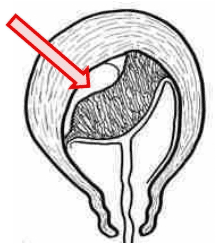

Giai đoạn 3 của chuyển dạ từ khi thai sổ đến khi rau bong và cầm máu hoàn toàn. Nếu không can thiệp, rau bong tự nhiên theo 3 thì:

1. **Bong rau**
2. **Sổ rau**
3. **Cầm máu**

## Sinh lý giai đoạn 3

### Bong rau

- Sau sổ thai, tử cung co khít, tạo áp lực bóp khối rau bám không đàn hồi, làm nó tách dần khỏi thành tử cung.
- Máu rò rỉ vào khoảng trống sau bong, hình thành khối máu tụ, lan dần để tách phần rau còn bám.

  

  _Thì bong rau._

Giữa bong và sổ rau, tử cung có giai đoạn **nghỉ sinh lý**, không co bóp.

### Sổ rau

- Tử cung tái co bóp tống khối rau đã bong ra âm đạo.
- **Kiểu Beaudelocque** (phổ biến): máu tụ trung tâm, rau phồng lên rồi tróc dần, mặt thai (fetal side) xuất trước.
- **Kiểu Duncan** (ít gặp): máu tụ ở mép, rau bong kém, mặt mẹ (maternal side) xuất trước, mất máu nhiều.

  

  _Thì sổ rau._

### Cầm máu

- Sau khi rau sổ, tử cung co thành **khối cầu an toàn**, siết chặt mạch máu diện bám rau (cơ chế cơ học).
- Cục máu đông hình thành bịt kín đầu mạch (cơ chế đông máu).

  

  _Thì cầm máu._

:::caution[Lưu ý]
Đoạn dưới tử cung không có bó cơ đan chéo, nên băng huyết do rau tiền đạo luôn phải xử trí khẩn cấp.
:::

## Xử trí tích cực giai đoạn 3

Can thiệp tích cực gồm ba bước chính, thực hiện ngay sau sổ vai:

1. **Thuốc co hồi tử cung**

   - **Oxytocin 10 IU** tiêm bắp/vào dây rốn ngay, hoặc 5 IU IV nếu chỉ định.
   - Giúp tăng co bóp nhanh, giảm mất máu.

2. **Kéo dây rốn có kiểm soát**

   - Kẹp dây rốn gần âm hộ, đặt tay kia chặn đáy tử cung.
   - Khi có cơn co (dưới tác dụng oxytocin), khuyến khích sản phụ rặn nhẹ, vừa kéo dây rốn vừa chặn đáy để rau tróc ra chậm, an toàn.
   - Ngưng kéo nếu không xuống sau 30 giây, thử lại trong cơn co kế tiếp.

3. **Xoa bóp đáy tử cung**
   - Xoa đáy tử cung sau khi rau sổ để duy trì co cơ, đảm bảo cơ chế cầm máu cơ học.

> Các nghiên cứu cho thấy giảm tổng mất máu dù không đến 100 mL, nhưng việc này giúp phòng ngừa băng huyết sau sinh và được WHO khuyến khích nếu có nhân sự đào tạo bài bản.

## Theo dõi

- Quan sát tính trạng co hồi của tử cung (độ rắn, vị trí).
- Đếm số lần thay băng đẫm máu.
- Theo dõi sinh hiệu mẹ (mạch, HA) để phát hiện mất máu nhiều.
- Kiểm tra dấu hiệu nhiễm trùng nếu sổ rau kéo dài.

## Tóm tắt

Giai đoạn 3 chuyển dạ (sổ rau và cầm máu) kéo dài trung bình 6–30 phút, mất khoảng 300 mL máu. Xử trí tích cực giúp giảm nhẹ lượng máu mất và hạn chế nguy cơ băng huyết sau sinh.

## Nguồn tham khảo

- Trường Đại học Y Dược TP. HCM (2020) – _Team-based learning_
