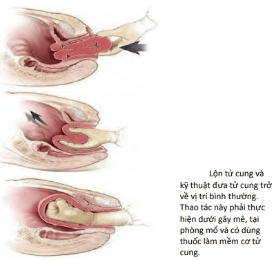

Băng huyết sau sinh (Postpartum hemorrhage – PPH) là nguyên nhân hàng đầu gây tử vong mẹ, chiếm trung bình 140,000 ca tử vong mỗi năm toàn cầu (1 ca/4 phút), với > 50% xảy ra trong 24 giờ đầu sau sinh. PPH cũng dẫn tới suy hô hấp, rối loạn đông cầm máu, sốc, mất khả năng sinh sản, hoại tử tuyến yên...

## Chẩn đoán

:::note[Chẩn đoán PPH]
Chảy máu ≥ 500 mL trong 24 giờ đầu sau sổ thai, từ bất kỳ vị trí nào trên đường sinh.
:::

## Phân loại

- **PPH sớm**: Trong 24 giờ đầu sau sinh.
- **PPH muộn**: Từ 24 giờ đến 12 tuần sau sinh.

## Yếu tố nguy cơ

- Tiền căn PPH.
- Chuyển dạ kéo dài, chuyển dạ nhanh, có dùng thuốc tăng co.
- Cắt tầng sinh môn, sinh bằng dụng cụ, mổ lấy thai.
- Tử cung căng (đa thai, đa ối, thai to).
- Tiền sản giật, nhiễm trùng ối.
- Dân tộc gốc Á.

## Nguyên nhân (4T)

1. **Tone** – Đờ tử cung (80%).
2. **Tissue** – Sót rau hoặc rau bám bất thường.
3. **Trauma** – Tổn thương đường sinh dục (rách tầng sinh môn, cổ tử cung, âm đạo).
4. **Thrombin** – Rối loạn đông máu (có sẵn hoặc mắc mới).

### Đờ tử cung

- Cơ chế cầm máu cơ học thất bại: Cơ đan chéo không co bóp, không siết được mạch máu diện rau.
- Nguyên nhân: Tử cung mệt sau chuyển dạ kéo dài, quá căng (thai to, đa thai, đa ối), nhiễm trùng, cơ tử cung suy yếu do đa sản.
- **Chẩn đoán**: Sờ bụng thấy tử cung mềm, nhão, không có "khối cầu an toàn" hoặc co chỉ khi xoa bóp.

### Tổn thương đường sinh dục

- Rách âm hộ, tầng sinh môn, âm đạo, cổ tử cung.
- Nguyên nhân: Sinh nhanh, ngôi mông, dụng cụ, cổ tử cung mỏng...
- **Xử trí**: Khâu cầm máu kỹ, khám kỹ dưới hỗ trợ, dẫn lưu khối máu tụ nếu cần.

### Rối loạn đông máu

- Có sẵn (viêm gan nặng, HELLP, thiếu yếu tố đông máu) hoặc thứ phát (DIC do rau bong non, choáng phản vệ, thuyên tắc ối).
- Chu trình mất máu → tiêu hao yếu tố đông → PPH nặng hơn.
- **Xử trí**: Bù yếu tố thiếu (TC, FFP, cryo), tầm soát DIC.

### Sót rau và lộn tử cung

- **Sót rau**:
  - Sót múi rau hoặc rau cài răng lược → đờ tử cung, chảy máu liên tục.
  - **Xử trí**: Lấy rau sót, hút nạo, kiểm tra siêu âm.
- **Lộn tử cung**:
  - Đáy tử cung lộn ngược qua cổ tử cung.
  - **Xử trí**: đỡ tay trả cổ tử cung về, gây mềm cơ tử cung (MgSO₄, terbutaline), nếu thất bại phẫu thuật.

## Bệnh sinh

- Mất máu cấp → giảm thể tích tuần hoàn → choáng giảm thể tích → thiếu O₂ mô.
- Mức độ và tốc độ mất máu quyết định tình trạng lâm sàng (từ bù trừ tốt đến shock, tử vong).
- Giai đoạn 3 chuyển dạ, máu mất trung bình 300 mL, nhưng có thể đến > 1000 mL mổ lấy thai.

## Điều trị

### Cấp cứu ban đầu

1. Gọi hỗ trợ ngay.
2. Thiết lập 2 đường truyền TM lớn.
3. Truyền dịch tinh thể nhanh.
4. Nhóm máu, test chéo.
5. Theo dõi sinh hiệu, nước tiểu, nhịp tim thai.

### Theo nguyên nhân

1. **Đờ tử cung**
   - Xoa đáy tử cung ngay.
   - Thuốc tăng co: Oxytocin, Methylergonovine, PGF₂α, Misoprostol.
   - Nếu thất bại: Bóng chèn buồng tử cung, khâu B-Lynch, thắt động mạch tử cung, cắt tử cung.
2. **Tổn thương đường sinh dục**
   - Khâu cầm máu trực tiếp, sửa tổn thương, dẫn lưu khối máu tụ.
3. **Rối loạn đông máu**
   - Bù yếu tố đông máu (TC, FFP, cryo), điều trị nguyên nhân (DIC, thuyên tắc ối).
4. **Sót rau**
   - Lấy rau sót, hút nạo buồng tử cung.
5. **Lộn tử cung**
   - Trả tử cung, gây mềm cơ tử cung, phẫu thuật nếu cần. 
     _Lộn tử cung và kỹ thuật đưa tử cung về bình thường._
     

## Phòng ngừa

- Nhận diện yếu tố nguy cơ trước sinh.
- Xử trí tích cực giai đoạn 3 chuyển dạ (oxytocin, kéo dây rốn có kiểm soát, xoa đáy tử cung).
- Cho bú sớm để tăng co hồi tử cung.
- Kiểm tra bánh rau và đường sinh dưới sau sổ rau.

## Tài liệu tham khảo

- Trường ĐH Y Dược TP. HCM (2020) – _Team-based learning_
