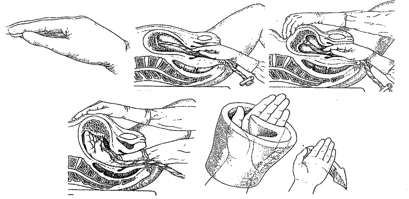

Sau sổ thai, cần theo dõi sinh hiệu và lượng máu mất, **không** xoa đáy tử cung quá sớm để tôn trọng giai đoạn nghỉ sinh lý. Khi rau không bong hoặc có chỉ định, thực hiện **bóc rau nhân tạo** và kiểm tra kỹ tử cung, cổ tử cung, âm đạo và tầng sinh môn.

## Bóc rau nhân tạo

### Chỉ định

- Rau chưa bong sau 30 phút sổ thai.
- Mất > 300 mL máu trước khi rau bong.
- Chuyển dạ kéo dài, khó, có can thiệp forceps/ventouse.
- Nghi ngờ tử cung dị dạng, u xơ.
- Sau mổ lấy thai cần kiểm soát chặt buồng tử cung.

### Chống chỉ định

- Sốc nặng: Phải hồi sức ổn định trước.

### Chuẩn bị

- Giải thích rõ cho sản phụ, lấy chấp thuận.
- Trang bị: Găng tay dài vô khuẩn, champs, đầy đủ dụng cụ theo dõi, đường truyền TM.
- Thuốc: Atropin 0.25 mg tiêm bắp/tĩnh mạch, giảm đau (morphin, dolargan), seduxen.
- Sát khuẩn âm hộ, đặt sản phụ tư thế sản khoa (đầu hơi cao).

### Kỹ thuật

_Hình ảnh "Kỹ thuật bóc rau nhân tạo"._

- Ấn giữ đáy tử cung qua thành bụng bằng 1 tay.
- Tay kia (đeo găng) lần theo dây rốn vào buồng tử cung, tìm mép bánh rau.
- Lách bề mặt lòng bàn tay giữa rau và thành tử cung, lòng bàn tay ôm rau.
- Tách nhẹ & từ từ cho đến khi rau bong hoàn toàn, rồi kéo rau ra ngoài.
- Kiểm tra bánh rau, màng rau, dây rốn đầy đủ.

### Tai biến

- **Shock phế vị**: Ngất do kích thích phản xạ vagal (giảm nhịp tim, giãn mạch).
- **Thủng tử cung**: Khi lực quá mạnh hoặc vết mổ cũ.
- **Lộn tử cung**: Nếu kéo dây rốn sai cách.
- **Nhiễm trùng**.

## Kiểm tra tử cung

### Chỉ định

- Sau bóc rau nhân tạo.
- Sinh mổ cũ, forceps, ventouse.
- PPH chuyển tuyến cần tìm nguyên nhân.
- Nghi sót rau hoặc rách tử cung.

### Chuẩn bị

- Tương tự bóc rau: Vô khuẩn, đường truyền TM, thuốc giảm đau.

### Kỹ thuật

- Tay ngoài cố định đáy tử cung.
- Tay trong kiểm tra dọc thân tử cung (mặt trước, sau, hai bên).
- Kiểm tra đoạn dưới từ "3 giờ–9 giờ" theo kim đồng hồ.
- Đánh giá: **Co hồi tử cung** chắc (tốt) hay mềm (đờ). **Sót rau** thành tử cung nhám, gồ lên hay nhẵn. **Toàn vẹn** vết mổ cũ, vết rách. **Dị dạng/khối u**.
- Rút tay ra sau khi đã kiểm tra xong, không thao tác nhiều lần để tránh nhiễm trùng.

**Sau thủ thuật**:

- Tiêm thêm thuốc co hồi (oxytocin).
- Theo dõi sinh hiệu, lượng máu âm đạo.
- Dự phòng kháng sinh nếu cần.

## Kiểm tra cổ tử cung

### Chỉ định

- Sau forceps/ventouse.
- Máu tươi chảy nhiều dù tử cung co tốt.
- PPH chuyển tuyến.

### Chuẩn bị

- Như kiểm tra tử cung, thêm valve âm đạo, kìm tim, gạc, dụng cụ khâu.

### Kỹ thuật

- Ấn đáy tử cung giữ cố định.
- Người thứ hai đặt valve mở âm đạo.
- Dùng kìm tim kẹp lần lượt ở các "giờ" trên vòng cổ tử cung (12 giờ, 2 giờ, 4 giờ... 10 giờ), kiểm tra khoảng giữa mỗi lần kẹp: Rách, chảy máu, phù nền.
- Lần mò quanh toàn bộ cổ tử cung theo kim đồng hồ.
- Rách thường ở 3 giờ hoặc 9 giờ, có thể lan vào đoạn dưới. Rách nhỏ (< 2 cm) thường tự lành; rách lớn phải khâu, ưu tiên khâu cổ trước, sau đó khâu âm đạo.

## Kiểm tra âm đạo & tầng sinh môn

### Chỉ định

- Tất cả sản phụ sinh âm đạo, dù cắt tầng sinh môn hay không.

### Chuẩn bị

- Tương tự kiểm tra cổ tử cung.

### Kỹ thuật

- Khám toàn bộ thành âm đạo bằng ngón tay: Tìm rách niêm mạc, cơ.
- Mở valve, kiểm tra đáy chậu, tầng sinh môn.
- Thăm trực tràng: Đánh giá cơ vòng hậu môn.

**Phân độ rách tầng sinh môn**

- **Độ I**: Niêm mạc + da.
- **Độ II**: + cơ tầng sinh môn.
- **Độ III**: + cơ vòng hậu môn.
- **Độ IV**: + niêm mạc trực tràng.

**Khâu phục hồi**:

- Rạch sâu hoặc chảy máu nhiều: Khâu tại phòng mổ + gây tê/ mê.
- Rách nhẹ: Khâu tại giường sinh, tê tại chỗ.
- Đảm bảo khâu đúng tầng, không để khoang ảo, thăm trực tràng sau khâu.

## Tài liệu tham khảo

- PGS.TS. Trần Thị Lợi & GS.TS. Nguyễn Duy Tài – _Thực hành Sản Phụ khoa_
