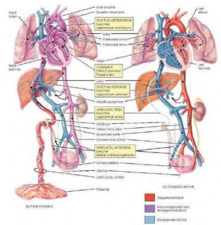
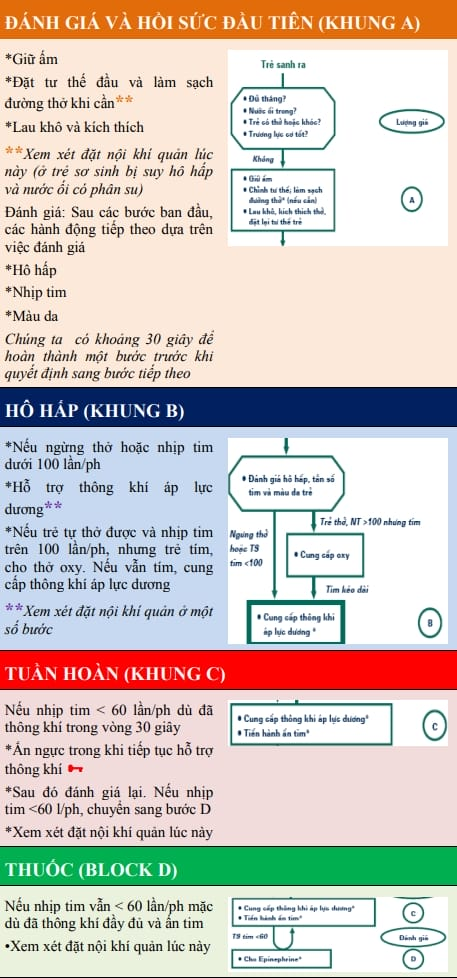
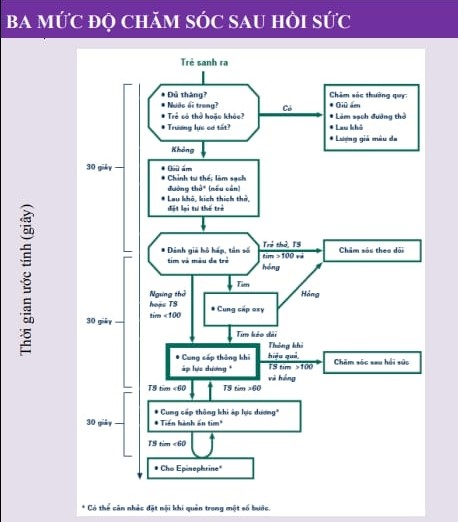

Mục tiêu chính của hồi sức sơ sinh là giúp trẻ thiết lập **tuần hoàn phổi chức năng** và **hô hấp hiệu quả** ngay lập tức sau sinh, tránh ngạt kéo dài và tổn thương não.

## Từ tuần hoàn bào thai sang sơ sinh

_Hình ảnh "Tuần hoàn bào thai (trái) với shunt qua lỗ Botal & ống động mạch - Phổi không trao đổi khí. Tuần hoàn sơ sinh (phải) - Phổi mở, shunt đóng"_.

- **Bào thai:** Trao đổi khí qua rau, phổi không vận hành, trở kháng mạch phổi cao → máu qua shunt tim-phổi.
- **Sơ sinh:** Hít vào đầu tiên → phổi nở, giảm kháng trở mạch phổi. Cắt rốn → tăng kháng trở ngoại vi → dòng máu qua phổi để trao đổi khí.

## Đánh giá ban đầu (APGAR)

Thực hiện tại **1, 5** và khi cần **10 phút** sau sinh theo 5 tiêu chí:

_Bảng "Điểm APGAR"_.

| Điểm APGAR        | 0 điểm            | 1 điểm                  | 2 điểm                    |
| ----------------- | ----------------- | ----------------------- | ------------------------- |
| **Nhịp tim**      | < 80 lần/phút     | 80-100 lần/phút         | > 100 lần/phút            |
| **Hô hấp**        | Không thở         | Thở không đều, khóc yếu | Thở đều, khóc to          |
| **Trương lực cơ** | Mềm nhũn          | Vận động yếu            | Vận động tốt              |
| **Phản xạ**       | Không có          | Phản ứng yếu, nhăn mặt  | Phản ứng tốt, cử động tốt |
| **Màu da**        | Toàn thân tím tái | Thân hồng, tay chân tím | Toàn thân hồng hào        |

**Điểm APGAR:**

- **0-3:** Ngạt nặng, cần hồi sức cấp cứu.
- **4-7:** Ngạt nhẹ-vừa, hỗ trợ hô hấp.
- **8-10:** Tốt, chỉ theo dõi.

## Chỉ định

Khoảng 10% trẻ sơ sinh cần hỗ trợ, chỉ 1% cần hồi sức tích cực (thông khí/ấn ngực/thuốc). Khi có **dấu hiệu nguy cơ:**

- Không tự thở hoặc khóc.
- Nhịp tim < 100 lần/phút.
- Trương lực cơ kém.
- Màu da tím tái.

## Quy trình

_Hình ảnh "Lưu đồ hồi sức sơ sinh"_.

1. **Giảm thất thoát nhiệt:** Lau khô, đặt dưới đèn sưởi. Hút dịch mũi-họng nếu cần.
2. **Đánh giá hô hấp & hỗ trợ:** Chờ 30 giây đầu để trẻ hít thở tự nhiên. Nếu không thở hoặc thở yếu **thông khí áp lực dương** (PPV) qua mặt nạ, 40-60 lần/phút, FiO₂ 21-100%. Áp lực phục hồi phế nang 30-40 cmH₂O, có van an toàn.
3. **Đánh giá nhịp tim** sau 30 giây PPV: Nhịp tim ≥ 100 ck/p tiếp tục theo dõi, ngừng PPV. Nhịp tim 60-99 ck/p tiếp tục PPV. Nhịp tim < 60 ck/p bắt đầu **ấn ngực**, 3:1 (PPV:ấn chèn), 120 lần/phút, đồng thời xem xét **adrenaline.** Hầu hết trẻ phục hồi nhịp tim nhanh sau thông khí hiệu quả. Nếu vẫn < 60 ck/p sau 30 giây ấn ngực, đặt nội khí quản, cho thuốc.
4. **Chuyển giai đoạn theo đáp ứng:** Tim ≥ 100 ck/p, tự hô hấp → chuyển về chăm sóc thông thường. Tiếp tục các bước khi tim < 100 ck/p.

## Theo dõi

_Hình ảnh "3 mức độ chăm sóc sau hồi sức"_.

- **Chăm sóc hồi sức:** Trẻ cần PPV/ấn ngực/thuốc.
- **Chăm sóc cấp cứu:** Theo dõi sát 24-48 giờ, kiểm soát đường huyết, thân nhiệt, điện giải.
- **Chăm sóc thường quy:** ổn định hô hấp, dinh dưỡng, cho bú sớm.

:::caution

Cần lưu ý nguy cơ:

- Giảm đường huyết, hạ thân nhiệt.
- Phù não, co giật do hạ Ca²⁺.
- Nhiễm trùng bội nhiễm.

:::

## Thoát vị hoành

Là trường hợp đặc biệt với **đặc điểm:**

- Trẻ khỏe bỗng ngừng thở, tím tái, nhịp tim giảm.
- Khám thấy lồng ngực phồng, bụng xẹp.
- Tim nghe rõ lệch phải.

**Xử trí ngay:**

- **Không** thông khí mặt nạ.
- Đặt nội khí quản, kèm sonde dạ dày.
- Nằm đầu cao, nghiêng về bên thoát vị.
- Chuyển phẫu thuật cấp cứu.

## Tài liệu tham khảo

- Trường ĐH Y Dược TP. HCM (2020) - _Team-based learning_
