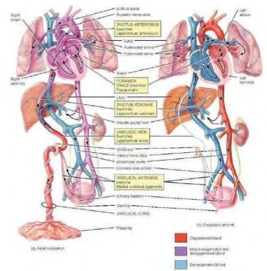
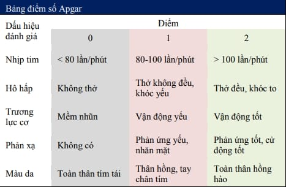
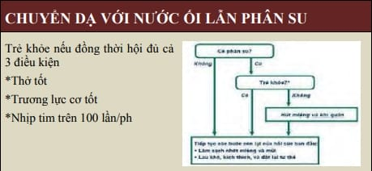
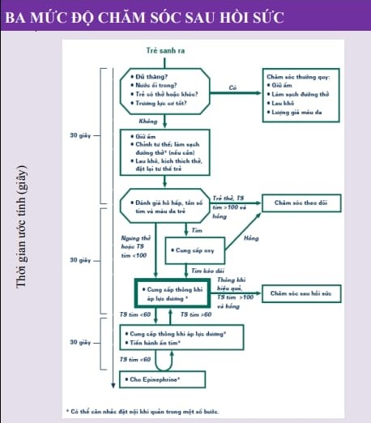

Điểm thiết yếu nhất trong hồi sức sơ sinh là giúp chúng thiết lập được tiểu tuần hoàn chức năng. Thao tác quan trọng nhất trong hồi sức sơ sinh là đánh giá tình trạng hô hấp và hỗ trợ thông khí phổi bằng thông khí áp lực dương, là biện pháp được ưu tiên thực hiện khi sơ sinh không tự thực hiện được các động tác hít vào đầu tiên.

## Tuần hoàn bào thai và tuần hoàn sơ sinh

_Tuần hoàn bào thai (trái) và tuần hoàn sơ sinh (phải). Tuần hoàn bào thai được đặc trưng bởi: 1. Trao đổi khí qua rau. 2. 1 tiểu tuần hoàn trở kháng cao, không chức năng hô hấp. 3. Tồn tại các shunt ở vị trí lỗ Botal và ống động mạch. Tuần hoàn sơ sinh được đặc trưng bởi: 1. Thiết lập tiểu tuần hoàn chức năng. 2. Thực hiện trao đổi khí qua phổi. 3. Đóng các shunt._

Phổi của bào thai là cơ quan không có hoạt động sinh lý thực thụ. Tiểu tuần hoàn chỉ là tuần hoàn giải phẫu, không có vai trò trao đổi khí. Vì thế, trở kháng tiểu tuần hoàn rất cao. Chỉ lượng máu rất nhỏ được lưu thông trong tiểu tuần hoàn, nhằm đảm bảo nuôi dưỡng phổi mà thôi. Trong thời kỳ này, mọi trao đổi khí đều được thực hiện qua rau.

Máu bão hòa oxygen từ hồ máu của rau sẽ theo tĩnh mạch rốn về tâm nhĩ phải. Do trở kháng cao của tiểu tuần hoàn và do sự hiện diện của lỗ bầu dục (Botal) nên máu bão hòa oxygen sẽ đi theo đường từ tâm nhĩ phải qua lỗ Botal vào tâm nhĩ trái mà không đi qua tâm thất phải và động mạch phổi để lên phổi. Lúc này phổi chỉ được nuôi dưỡng bằng nguồn máu ít ỏi đến dược nó thông qua động mạch phổi. 1 phần lượng máu qua động mạch phổi lại theo ống động mạch để quay về đại tuần hoàn.

Từ tâm nhĩ trái, máu sẽ đi theo động mạch chủ để nuôi dưỡng các cơ quan của bào thai. Máu mang $CO_2$ sẽ theo tĩnh mạch rốn về rau và thực hiện trao đổi khí tại hồ máu. giường rau (placental bed) là hệ thống hồ máu với các vi shunt giữa các động mạch và tĩnh mạch nhỏ tạo nên hệ thống trở kháng thấp. Như vậy, tuần hoàn bào thai có các đặc điểm sau:

1. Tiểu tuần hoàn không chức năng với trở kháng cao.
2. Tồn tại các shunt phải-trái chức năng là lỗ Botal và ống động mạch.

Kiểu tuần hoàn này thích hợp với cuộc sống trong tử cung mà mọi trao đổi khí đều được thực hiện qua rau thai.

Tiểu tuần hoàn chức năng được thiết lập ngay tức khắc sau sinh. Cơ chế của thiết lập tiểu tuần hoàn chức năng là:

1. Động tác hít vào đầu tiên làm phổi nở ra và giảm trở kháng tiểu tuần hoàn.
2. Động tác cắt rốn làm tăng trở kháng ngoại vi.

Trong khi sinh, lồng ngực thai bị bóp chặt trong âm đạo, đẩy các dịch phế quản và phế nang ra khỏi đường hô hấp.

Ngay sau khi thoát âm, sự thay đổi vật lý của môi trường như chênh lệch về nhiệt độ, áp suất đã khởi động cho hoạt động hô hấp đầu tiên: đó là động tác hít vào. Động tác hít vào làm cho không khí tràn vào phế nang. Phế nang, trước đó đã được trang bị các surfactant làm giảm sức căng bề mặt của chúng, sẽ nở ra. Phổi nở ra làm giảm ngay tức khắc trở kháng của tiểu tuần hoàn. Mặt khác, hệ thống trở kháng thấp là giường rau bị tách rời khỏi thai nhi do động tác cắt rốn, gây ra sự tăng đột ngột của trở kháng ngoại vi. Giảm trở kháng tiểu tuần hoàn và tăng trở kháng ngoại vi là 2 hiện tượng song hành, ngay tức khắc tái định hướng lại lưu thông máu.

Máu về nhĩ phải sẽ không còn theo lỗ Botal nữa, do áp suất nhĩ trái đã tăng. Lúc này, dòng máu từ nhĩ phải sẽ qua van 3 lá vào thất phải rồi vào động mạch phổi, nơi có trở kháng thấp hơn rất nhiều so với trở kháng của tuần hoàn trái, tức đại tuần hoàn. Sau đó, máu đến phế nang và thực hiện những trao đổi khí đầu tiên tại nơi này. Như vậy tiểu tuần hoàn chức năng đã được thiết lập. Máu bão hòa oxygen theo tĩnh mạch phổi về tâm nhĩ trái, qua van 2 lá vào tâm thất trái và đi vào đại tuần hoàn.

Máu về nhĩ phải sẽ không còn theo lỗ Botal nữa, do áp suất nhĩ trái đã tăng. Lúc này, dòng máu từ nhĩ phải sẽ qua van 3 lá vào thất phải rồi vào động mạch phổi, nơi có trở kháng thấp hơn rất nhiều so với trở kháng của tuần hoàn trái, tức đại tuần hoàn. Sau đó, máu đến phế nang và thực hiện những trao đổi khí đầu tiên tại nơi này. Như vậy tiểu tuần hoàn chức năng đã được thiết lập. Máu bão hòa oxygen theo tĩnh mạch phổi về tâm nhĩ trái, qua van 2 lá vào tâm thất trái và đi vào đại tuần hoàn.

Điểm thiết yếu nhất trong hồi sức sơ sinh là giúp chúng thiết lập được tiểu tuần hoàn chức năng. Để thiết lập được tiểu tuần hoàn chức năng, việc quan trọng nhất phải thực hiện được, bằng mọi giá, là làm giảm trở kháng tiểu tuần hoàn. Điều nay chỉ có thể đạt được khi và chỉ khi tạo ra được thông khí tốt ở phổi, làm nở phế nang, làm giảm trở kháng của hệ thống giường mao mạch phổi. Thao tác quan trọng nhất trong hồi sức sơ sinh là đánh giá tình trạng hô hấp và hỗ trợ thông khí phổi. Thông khí áp lực dương là biện pháp được ưu tiên thực hiện khi sơ sinh không tự thực hiện được các động tác hít vào đầu tiên.

## Đánh giá sơ sinh sau sinh - điểm số APGAR

Người ta thường quen dùng điểm số APGAR để đánh giá tình trạng trẻ ngay sau sinh. Đánh giá theo APGAR được thực hiện ở thời điểm 1 phút, 5 phút, và 10 phút sau sinh. Các thông số được dùng để đánh giá gồm:

1. Nhịp tim.
2. Hô hấp.
3. Trương lực cơ.
4. Phản xạ.
5. Màu da.

_Bảng điểm apgar._

Có sự liên quan nhất định giữa điểm số APGAR và tử vong sơ sinh nếu đánh giá thật đúng. Tuy nhiên, liên quan giữa APGAR với dự hậu lâu dài là không rõ ràng.

- <3: tình trạng ngạt nguy kịch, phải hồi sức tích cực.
- 4-7: trẻ bị ngạt, cần được hồi sức tốt.
- &gt; 7: tình trạng tốt, chỉ cần theo dõi, chưa cần hồi sức.

Do tình trạng ngạt có thể đã bắt đầu từ trong tử cung và tiếp tục trong giai đoạn sơ sinh, nên để giảm thiểu các tổn thương não do ngạt gây ra, cần tiến hành hồi sức ngay khi có bằng chứng cho thấy trẻ thở không hiệu quả.

Nhịp tim là thông số khác của điểm APGAR, với giá trị thể hiện gián tiếp tình trạng thăng bằng kiềm toan, hoặc tổn thương hành não. Nhịp tim chậm có liên quan đến tình trạng toan hóa máu. Trẻ sơ sinh bình thường có thể chịu đựng tốt được tình trạng thiếu oxy huyết tạm thời hoặc toan hô hấp. Ở những trẻ này, sự can thiệp sớm trên hô hấp sẽ giúp trẻ vượt qua và thường không để lại bất cứ hậu quả vĩnh viễn nào. Cũng nên lưu ý rằng các trường hợp thiếu oxy huyết hoặc toan hóa kéo dài làm cản trở sự chuyển tiếp từ tuần hoàn bào thai sang tuần hoàn sơ sinh, gây khó khăn thêm cho hồi sức sơ sinh.

## Các trẻ cần hồi sức

Hầu hết trẻ sơ sinh đều khỏe mạnh khi sinh. Chỉ khoảng 10% trẻ sơ sinh là cần hỗ trợ sau sanh. Tuy nhiên, chỉ có khoảng 1% trẻ sơ sinh là cần các biện pháp hồi sức tích cực để được cứu sống. Các trẻ này sẽ cần đặt nội khí quản, ấn ngực, và/hoặc thuốc. Phải lưu ý quan trọng là mọi trẻ sinh ra phải được đánh giá, xem xét có cần can thiệp hồi sức hay không. Các dấu hiệu cho phép nhận diện một trẻ sơ sinh bị tổn
thương gồm:

- Trương lực cơ giảm.
- Suy hô hấp: bé không thở hay không khóc.
- Nhịp tim chậm.
- Huyết áp thấp.
- Thở nhanh.
- Tím.

Ngừng thở được phân ra:

1. Ngừng thở nguyên phát: Khi trẻ bị thiếu $O_2$, ban đầu sẽ nỗ lực thở nhanh, kế đó là ngừng thở nguyên phát, nhịp tim giảm. Ngưng thở nguyên phát sẽ cải thiện khi kích thích da.
2. Ngừng thở thứ phát: Nếu trẻ tiếp tục thiếu $O_2$, ngừng thở thứ phát sẽ xảy ra, kèm theo giảm nhịp tim và tụt huyết áp. Ngừng thở thứ phát không thể phục hồi khi kích thích, mà cần phải thông khí hỗ trợ. Bắt đầu thông khí áp lực dương hiệu quả khi ngừng thở thứ phát thường cải thiện nhịp tim nhanh chóng.

## Quy trình tiếp đón thường quy trẻ sơ sinh tại phòng sinh

Luôn ở trong trạng thái sẵn sàng. Chuẩn bị là quan trọng:

1. Nhân viên y tế phải thuần thục về hồi sức sơ sinh.
2. Đảm bảo trang thiết bị hồi sức.

Ngay sau khi sinh, trẻ cần được chăm sóc theo 3 bước:

1. Giảm thiểu mất nhiệt. Stress lạnh đưa đến thiếu oxy huyết, thừa $CO_2$ trong máu và toan chuyển hóa, tạo thuận lợi cho sự tồn tại tuần hoàn thai nhi và cản trở sự hồi sức. Trong vòng 20 giây đầu của cuộc sống, sơ sinh phải được làm khô, đặt dưới bộ làm ấm tỏa nhiệt và tiến hành hút miệng và mũi nếu ối có tẩm phân su.
2. Đánh giá tình trạng hô hấp của sơ sinh trong vòng 30 giây sau sinh. Nếu bé thở nấc hoặc không thở, bắt đầu giúp thở bằng bóng áp lực dương với tần số từ 40 đến 60 lần/phút với $O_2$ 100 %. Khí trời cũng có thể dùng được. Áp lực đỉnh thì hít vào là 30 đến 40 $cmH_2O$ là điều cần thiết để khởi động hô hấp. Lưu ý rằng bóng phải có van điều áp. Áp lực dương quá cao làm vỡ phế nang và gây tràn khí màng phổi. Hầu hết sơ sinh đều đáp ứng tốt sau 2 bước đầu. Chỉ có chỉ định đặt nội khí quản khi giúp thở bằng bóng qua mặt nạ không hiệu quả.
3. Đánh giá nhịp tim. Xoa bóp tim ngoài lồng ngực chỉ cần thiết ở 0.03% số trường hợp sinh. Ngưng tim sơ sinh thường là kết quả của suy hô hấp, thiếu oxygen máu kéo dài và nhiễm toan chuyển hóa.Xoa bóp tim ngoài lồng ngực nên được thực hiện ở tần số 120 lần/phút. Sau khi giúp thở bằng áp lực dương trong 30 giây, nếu nhịp tim dưới 60 hoặc không cải thiện thì có thể hỗ trợ xoa bóp tim. Ở đa số sơ sinh với giúp thở thích hợp thì chức năng tim trở lại bình thường nhanh chóng. Ngưng xoa bóp tim khi nhịp tim trên 80 lần/ phút.

Các bước này nên thực hiện trong vòng phút đầu tiên của cuộc sống. Ít có khả năng sống sót khi chỉ số Apgar là 0 vào phút thứ 10.

Tiêu chuẩn đánh giá kết quả hồi sức tốt bao gồm tiêu chuẩn lâm sàng và xét nghiệm sinh hóa. Các tiêu chuẩn lâm sàng đánh giá hiệu quả của hồi sức gồm trẻ tự thở đều và sâu, hết tím tái, nhịp tim đều và rõ trên 100 lần/phút, các phản xạ thần kinh hành não tốt, trương lực cơ bình thường. Các tiêu chuẩn sinh hóa gồm ổn định được tình trạng toan chuyển hóa, với pH máu ≥7.3, $PaCO_2$<40mmHg, $PaO_2$ = 60-70mmHg.

## Lưu đồ hồi sức sơ sinh

_Lưu đồ hồi sức sơ sinh._

Những điểm quan trọng trong lưu đồ hồi sức sơ sinh.

- Thông khí là thủ thuật quan trọng nhất trong hồi sức sơ sinh.
- Thông khí áp lực dương hiệu quả trong ngừng thở thứ phát thường sẽ giúp cải thiện nhịp tim.
- Nếu nhịp tim không tăng, có thể là thông khí không đầy đủ và/hoặc cần thiết phải ấn ngực và cho epinephrine.
- Nhịp tim <60 lần/ph cần các bước hỗ trợ.
- Nhịp tim >60 lần/ph có thể ngừng ấn ngực.
- Nhịp tim >100 lần/ph và tự thở có thể ngừng thông khí áp lực dương.
- Giới hạn thời gian: nếu không cải thiện sau 30 giây, chuyển sang bước tiếp theo.
- Có thể xem xét đặt nội khí quản ở 1 số bước.

_Chuyển dạ với nước ối lần phân su._

## Theo dõi sau hồi sức

_3 mức độ chăm sóc sau hồi sức._

Tất cả trẻ đã trải qua hồi sức sau sinh đều phải được theo dõi ít nhất 24h.

Sau hồi sức, dù tình trạng trẻ có khả quan lên, nhưng vẫn có thể có những biến chứng sau đó. Do đó, phải phát hiện kịp thời để xử trí các biến chứng thường gặp như giảm đường huyết, phù não, giảm calci huyết, hạ thân nhiệt, suy hô hấp thứ phát hoặc nhiễm khuẩn bội nhiễm. Cần tiếp tục ủ ấm trẻ sau hồi sức. Bảo đảm nhiệt độ thích hợp và nguồn oxy khi chuyển trẻ sang khu dưỡng nhi. Cần cho kháng sinh ít nhất là 5 ngày để ngừa nhiễm trùng.

Thoát vị cơ hoành là tình trạng làm cho trẻ sinh ra khỏe mạnh bị xấu đi nhanh chóng. Phải nghĩ đến thoát vị hoành khi trẻ sinh ra khỏe mạnh, khóc ngay, đột nhiên rơi ngay vào tình trạng tím tái liên tục dù đang hồi sức, quan sát thấy bụng ít căng, lồng ngực phồng lên. Do 90% trường hợp là bị thoát vị cơ hoành ở bên trái nên tiếng tim nghe rõ về phía phải lồng ngực. Chẩn đoán xác định bằng X-quang ngực thẳng và nghiêng.
Điều quan trọng nhất cần nhớ là nếu thoát vị hoành đã được chẩn đoán trước sinh hoặc đã được chẩn đoán thì không viện trợ hô hấp bằng mặt nạ vì sẽ làm dạ dày càng chướng hơi nhiều hơn. Khi vào chuyển dạ, cần thông báo cho ngoại nhi biết để có kế hoạch tiếp đón ngay sau sinh. Trong trường hợp cần thiết, viện trợ hô hấp được thực hiện qua nội khí quản. Đặt ống sonde vào dạ dày để thoát hơi. Cho trẻ nằm đầu cao, nghiêng về phía thoát vị để tránh chèn ép phổi bên lành. Chuyển ngay bệnh nhi tới cơ sở ngoại khoa để giải quyết phẫu thuật.

## Nguồn tham khảo

- TEAM-BASED LEARNING - Trường Đại học Y Dược Thành phố Hồ Chí Minh 2020.
