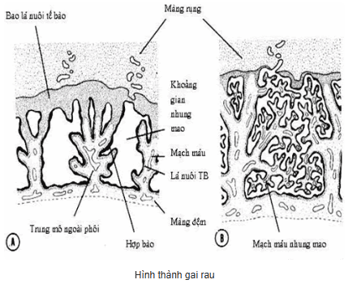
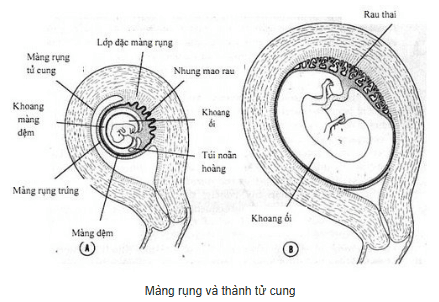

Nguồn gốc bánh rau:

1. Rau thuộc thai: Màng đệm có nhung mao.
2. Rau thuộc mẹ: Màng rụng rau.

Rau thường bám ở 1/3 trên của buồng tử cung (thành trước/thành sau).

## Sự hình thành

### Từ phía con

Sau khi thụ tinh 4 ngày, hợp tử chia thành phôi nang với các tế bào mầm xếp thành 2 khối: Khối ngoại vi sẽ thành nguyên bào nuôi, khối tế bào bên trong thành bào thai.

Rau nguyên phát hình thành trong tuần thứ 2 khi thành các tiểu động mạch và tiểu tĩnh mạch của niêm mạc tử cung mẹ nơi trứng làm tổ bị xói mòn bởi sự phát triển của lá nuôi hợp bào, máu mẹ chảy vào các khoảng trống trong lá nuôi hợp bào.

Cuối tuần thứ 2, những cột lá nuôi tế bào xâm nhập vào các tua hình ngón tay của lá nuôi hợp bào, hình thành những nhung mao đệm nguyên phát là gai rau bậc 1.

Tuần 3 phần trung mô ngoài phôi của màng đệm phát triển xâm lấn vào các gai rau bậc 1 tạo nên gai rau bậc 2.

Cuối tuần 3 tế bào trung mô màng đệm ở trục của gai rau sẽ biệt hoá tạo ra các mạch máu, các mạch máu này sẽ hình thành nên hệ thống động mạch, mao mạch, tĩnh mạch liên hệ với mạch máu trong màng đệm rồi liên hệ mạch máu nằm trong dây rốn và đi vào trong phôi thai tạo thành gai rau bậc 3 là gai rau chính thức.

### Từ phía mẹ

Nội mạc tử cung của mẹ gọi là màng rụng và chia làm 3 phần (khi trẻ ra đời chúng sẽ được bong ra cùng với rau):

1. Màng rụng rau: xen giữa phôi và cơ tử cung.
2. Màng rụng trứng: xen giữa phôi và khoang tử cung.
3. Màng rụng tử cung: phần còn lại.

Biến đổi của màng rụng rau:

- Lá nuôi hợp bào làm xói mòn những vùng mô màng rụng rau &rarr; khoảng gian rau gai có kích thước không đồng đều.
- Phần còn lại là các vách rau, vách rau nhô vào khoang gai rau chia thành nhiều khoang, mỗi khoang chứa 1 múi rau gồm vài gai rau gốc, 1 rau: 10-38 múi rau.
- Phần rau thuộc mẹ và phần rau thuộc con được neo giữ do những nhung mao bám (gai rau bám) vào đĩa đáy/vách ra.

Biến đổi của màng rụng tử cung:

- Phản ứng màng rụng: các tế bào liên kết tích trữ chất dinh dưỡng &rarr; trương to &rarr; tế bào rụng &rarr; lớp đặc.
- Lớp sâu: các tuyến bị ép dẹt &rarr; lớp xốp.

Biến đổi của màng rụng trứng:

- Tháng thứ 4: sát với màng rụng tử cung làm mất khoang tử cung, biểu mô sát nhập và tiêu đi.
- Nửa sau thai kỳ: 4 màng (màng ối, màng đệm, màng rụng trứng, màng rụng tử cung) nhập lại tạo thành màng bọc thai.

Rau được coi như đã hoàn thành sau tháng thứ 4 với cấu tạo hình đĩa, đường kính ≈ 20cm, trọng lượng ≈ 500 g.

## Vai trò

Rau thai là phần phụ của thai:

- Nơi trao đổi chất dinh dưỡng, nước, oxy, kháng thể, hormone... từ mẹ sang thai hay các chất dị hoá, nước, carbonic,.. từ thai sang mẹ.
- Bài tiết 1 số hormone như: hCG (human chronic gonadotropin), estrogen, progesterone...
- Miễn dịch thụ động kháng thể từ máu mẹ qua hàng rào rau sang thai.

## Nguồn tham khảo

- Vinmec - [_Quá trình hình thành rau thai?_](https://www.vinmec.com/vi/bai-viet/qua-trinh-hinh-thanh-rau-thai)
