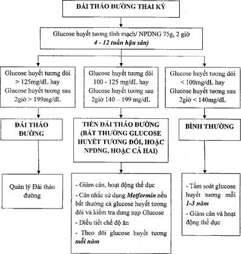

## Theo dõi sau sinh

Cho bé bú sớm nhất có thể, ngay trong vòng 1h đầu sau sinh.

Thực hiện da kề da ít nhất ngày đầu sau sinh.

Cho bú sữa non mỗi 2-3 h/lần.

Áp dụng biện pháp tránh thai như bao cao su, dụng cụ tử cung, viên thuốc ngừa thai kết hợp hàm lượng thấp.

### Theo dõi trẻ sơ sinh

Ngay sau sinh, trẻ được chăm sóc và theo dõi sát để phát hiện nguy cơ hạ đường huyết sơ sinh.

Trẻ sơ sinh cần được thử glucose huyết tương mao mạch trong vòng 2h sau sanh và có xử trí phù hợp.

Theo dõi tình trạng thân nhiệt, tim mạch, hô hấp (cần phát hiện kịp thời hội chứng suy hô hấp cấp, hạ thân nhiệt).

### Theo dõi sản phụ

#### Đối với thai phụ đái tháo đường thai kỳ

Ngay sau sinh không cần dùng insulin vì glucose huyết tương thường trở về bình thường.

Kiểm tra glucose huyết tương đói trong vòng 24h sau sinh. Nếu đang dùng insulin: ngưng tiêm và theo dõi glucose máu bất kỳ; khi glucose ≥11.1mmol/L, giảm liều đang dùng 50%.

#### Đối với đái tháo đường và thai kỳ (đái tháo đường thực sự)

Sau sinh nếu glucose huyết tương bất kỳ ≥11.1mmol/L phải sử dụng insulin cho mẹ.

Nếu đang dùng insulin, ngưng. Kiểm tra nếu glucose huyết tương bất kỳ ≥11.1mmol/L, dùng insulin với liều insulin giảm 50% so với liều trong thời gian mang thai, ngay sau sinh. Giới thiệu khám chuyên khoa Nội Tiết sau khi xuất viện.

### Đánh giá rối loạn chuyển hóa đường

Thực hiện sau sinh 4-12 tuần với xét nghiệm 75 ram glucose uống 2h.

|Glucose huyết tương tĩnh mạch|Tiền đái tháo đường|đái tháo đường|
|---|---|---|
|Khi đói|100-125mg/dL (5.6-6.9mmol/L)|≥126mg/dL (≥7mmol/L)|
|Sau uống 2h|140-199mg/dL (7.8-11mmol/L)|≥200mg/dL (≥11.1mmol/L)|
_Giá trị glucose huyết tương tĩnh mạch nghiệm pháp 75g sau sinh 2h._

Kết quả:

- Nếu kết quả bình thường sau sinh tầm soát định kỳ 1-3 năm/lần.
- Nếu kết quả bất thường chuyển Nội tiết điều trị và theo dõi.

_Theo dõi và quản Đái tháo đường sau sinh._

## Nguồn tham khảo

- Trường Đại học Y Dược TP. HCM (2020) – _TEAM-BASED LEARNING_
- Bệnh viện Từ Dũ (2022) - _PHÁC ĐỒ ĐIỀU TRỊ SẢN PHỤ KHOA_
- TS. Lê Quang Toàn - [_Bài giảng đái tháo đường thai kỳ_](https://www.youtube.com/watch?v=WV4g4cJdMCo)
- Bộ Y Tế (2023) - _HƯỚNG DẪN QUỐC GIA VỀ SÀNG LỌC VÀ QUẢN LÝ ĐÁI THÁO ĐƯỜNG THAI KỲ_