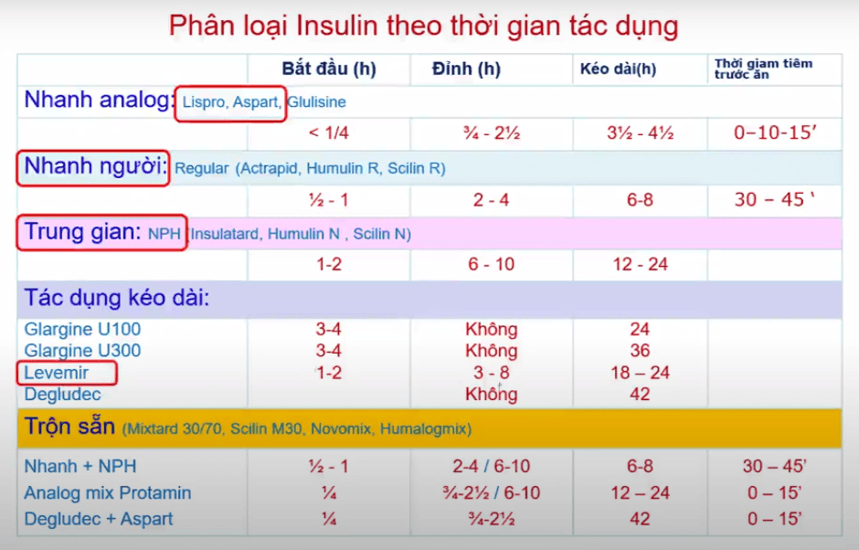
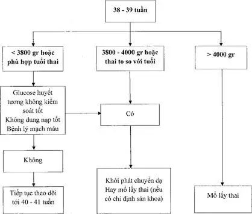

Đái tháo đường là nhóm rối loạn chuyển hóa không đồng nhất, đặc trưng bởi tăng glucose huyết và/hoặc rối loạn dung nạp glucose do thiếu insulin, giảm tác dụng insulin hoặc cả hai.

1. **Đái tháo đường type 1**

   - Cơ chế: phá hủy tế bào β đảo tụy → thiếu insulin tuyệt đối.
   - Theo Bộ Y tế (2021): xem là bệnh tự miễn.

2. **Đái tháo đường type 2**

   - Thiếu insulin tương đối và đề kháng insulin ngoại biên.
   - Thường liên quan đến thừa cân, béo phì, lối sống ít vận động.

3. **Tiền đái tháo đường**

   - Rối loạn glucose đói (Impaired Fasting Glucose – IFG): 100–125 mg/dL (5.6–6.9 mmol/L).
   - Rối loạn dung nạp glucose (Impaired Glucose Tolerance – IGT): 2h nghiệm pháp dung nạp glucose 75 g (Oral Glucose Tolerance Test - OGTT) 75 g 140–199 mg/dL (7.8–11.0 mmol/L).
   - HbA1c 5.7–6.4%.

4. **Đái tháo đường "rõ" (Overt diabetes in pregnancy – DIP)**

   - Mức glucose huyết tương đạt tiêu chuẩn chẩn đoán đái tháo đường ở người không mang thai (WHO 2006).
   - Phát hiện lần đầu trong thai kỳ, có thể ngay 3 tháng đầu.

5. **Đái tháo đường thai kỳ (Gestational Diabetes Mellitus – GDM)**

   - Tăng glucose huyết mức độ nhẹ hơn tiêu chuẩn đái tháo đường rõ.
   - Phát hiện lần đầu trong thai kỳ, không có bằng chứng ĐTĐ trước đó.
   - Thường chẩn đoán sau 24–28 tuần.

## Phân loại

1. **Đái tháo đường rõ (DIP)**

   - Đường huyết đói ≥ 126 mg/dL (7.0 mmol/L) hoặc bất kỳ ≥ 200 mg/dL (11.1 mmol/L) kèm triệu chứng tăng glucose huyết.
   - Xét nghiệm lần đầu trong thai kỳ, có thể ngay 3 tháng đầu.

2. **Đái tháo đường thai kỳ (GDM)**

   - Đường huyết đói 92–125 mg/dL (5.1–6.9 mmol/L) hoặc  
     đường huyết sau 2 giờ OGTT 75 g 153–199 mg/dL (8.5–11.0 mmol/L).
   - Phát hiện sau 24–28 tuần, không có tiền sử ĐTĐ trước mang thai.

## Bệnh sinh

1. **Kháng insulin sinh lý**  
   Bắt đầu tăng từ giữa thai kỳ (tuần 20–24) do hormon nhau thai (hPL, cortisol, estrogen, progesterone, prolactin...) làm giảm tiêu thụ glucose của mẹ, ưu tiên cho thai nhi.

2. **Kháng insulin mạn tính**  
   Do tiền sử gia đình ĐTĐ, thừa cân – béo phì, tuổi mẹ cao, PCOS...

3. **Suy giảm chức năng tế bào β**  
   Không đáp ứng đủ nhu cầu insulin tăng cao → tăng glucose huyết.

   

   _Thay đổi nhu cầu insulin theo các giai đoạn thai kỳ._

## Yếu tố nguy cơ

| Yếu tố                  | Tiêu chí / Ngưỡng                                                                                                  |
| ----------------------- | ------------------------------------------------------------------------------------------------------------------ |
| **BMI trước mang thai** | ≥ 23 kg/m² (người châu Á)                                                                                          |
| **Tiền sử gia đình**    | Cha/mẹ/anh/chị/em ruột có ĐTĐ                                                                                      |
| **Tiền sử sản khoa**    | Con ≥ 4.0 kg; thai chết lưu vô căn; dị tật bẩm sinh                                                                |
| **Bệnh lý kèm theo**    | Tăng huyết áp; bệnh tim mạch; HDL < 0.9 mmol/L; TG > 2.82 mmol/L; PCOS; HIV                                        |
| **Tuổi mẹ**             | > 35 tuổi                                                                                                          |
| **Tiền sử cá nhân**     | GDM lần trước; IFG/IGT trước đó; HbA1c 5.7–6.4%                                                                    |
| **Lối sống**            | Ít vận động; stress; hút thuốc                                                                                     |
| **Glucosuria (+)**      | Có thể dương tính cơ học, không đặc hiệu cho GDM (gặp 10–15% thai phụ không GDM, cần kết hợp xét nghiệm chính xác) |

_Yếu tố nguy cơ của bệnh nhân đái tháo đường thai kỳ._

## Sàng lọc và chẩn đoán

### 3 tháng đầu (≤ 13 tuần 6 ngày)

- **Đánh giá nguy cơ** ngay lần khám đầu tiên.
- **Nguy cơ cao** (≥ 1 yếu tố bảng trên) → Xét nghiệm glucose đói hoặc HbA1c ngay.

  | Kết quả          | Tiêu chí                                                                               | Xử trí                      |
  | ---------------- | -------------------------------------------------------------------------------------- | --------------------------- |
  | **Bình thường**  | Glucose đói 70–90 mg/dL (3.9–5.0 mmol/L) và Glucose bất kỳ ≤ 199 mg/dL (≤ 11.0 mmol/L) | Sàng lọc lại 24–28 tuần     |
  | **Nghi ngờ GDM** | Glucose đói 91–125 mg/dL (5.1–6.9 mmol/L) và/hoặc HbA1c 5.7–6.4%                       | Sàng lọc hoặc OGTT ngay     |
  | **ĐTĐ rõ (DIP)** | Glucose đói ≥ 126 mg/dL hoặc bất kỳ ≥ 200 mg/dL + triệu chứng                          | Chuyển chuyên khoa Nội tiết |

  _Kết quả sàng lọc 3 tháng đầu._

- **Nguy cơ thấp** → Sàng lọc định kỳ 24–28 tuần.

### 3 tháng giữa (24–28 tuần)

- **OGTT 75 g chuẩn**

  - **Chuẩn bị**:

    - 3 ngày trước: chế độ ăn chứa ≥ 150 g glucid/ngày.
    - Nhịn đói ít nhất 8 giờ (chỉ được uống nước lọc).

  - **Quy trình**:

    - Lấy máu tĩnh mạch đo glucose lúc đói.
    - Uống dung dịch chứa 75 g glucose trong vòng 5 phút.
    - Lấy máu tĩnh mạch đo glucose sau 1 giờ và sau 2 giờ.
    - Trong thời gian làm nghiệm pháp thai phụ không ăn uống gì thêm, được ngồi nghỉ ngơi hoặc đi lại nhẹ nhàng.

  :::note[Tiêu chuẩn chẩn đoán GDM]
  **Chẩn đoán GDM** khi có ≥ 1 tiêu chí bất thường.

  | Thời điểm | Glucose (mg/dL) | Glucose (mmol/L) |
  | --------- | --------------- | ---------------- |
  | **Đói**   | ≥ 92            | ≥ 5.1            |
  | **1h**    | ≥ 180           | ≥ 10.0           |
  | **2h**    | ≥ 153           | ≥ 8.5            |

  _Tiêu chuẩn chẩn đoán GDM (IADPSG/WHO 2013)._
  :::

### 3 tháng cuối (> 28 tuần)

- Không cần sàng lọc lại nếu đã chẩn đoán GDM.
- Nếu bỏ sót trước đó, vẫn làm OGTT 75 g.

## Biến chứng

### Với mẹ

- Tiền sản giật, bong nhau non, đờ tử cung.
- Sinh non, tăng tỉ lệ mổ lấy thai.
- Chuyển thành ĐTĐ type 2: 17–63% trong 5–16 năm sau sinh.
- Nhiễm khuẩn niệu, nhiễm trùng sản khoa.

### Với thai và trẻ sơ sinh

- Thai to (≥ 4 kg), kẹt vai.
- Hạ đường huyết sơ sinh, suy hô hấp do trưởng thành phổi muộn.
- Tăng hồng cầu (Hb > 20 g/dL), vàng da.
- Dị tật bẩm sinh liên quan HbA1c mẹ > 6.5% trong 3 tháng đầu.
- Nguy cơ lâu dài: béo phì, ĐTĐ type 2, chậm phát triển thần kinh.

## Điều trị

### Nguyên tắc

1. **Dinh dưỡng (Medical Nutrition Therapy – MNT)**

   - Đủ năng lượng, đảm bảo vi chất.
   - Phòng ngừa tăng đường máu sau ăn.
   - Không quá khắt khe, phù hợp văn hóa và điều kiện.

2. **Vận động**

   - Ít nhất 150 phút/tuần (đi bộ, tập nhẹ sau ăn).
   - Khuyến khích đi bộ 10–15 phút sau bữa ăn.

3. **Kiểm soát glucose**

   - Gần mức bình thường, tránh hạ đường huyết.
   - Đo bằng glucose mao mạch tại nhà.

4. **Tăng phù hợp với BMI trước mang thai**

   | BMI trước khi mang thai                             | Tăng cân (kg) | Mức tăng cân trung bình trong quý 2 và quý 3 thời kỳ mang thai (kg/tuần) |
   | --------------------------------------------------- | ------------- | ------------------------------------------------------------------------ |
   | **Thiếu năng lượng trường diễn (BMI < 18.5 kg/m²)** | 12.5–18       | 0.51 (0.44–0.58)                                                         |
   | **Bình thường (BMI 18.5–22.9 kg/m²)**               | 11.5–16       | 0.42 (0.35–0.50)                                                         |
   | **Thừa cân (BMI 23.0–24.9 kg/m²)**                  | 7–11.5        | 0.28 (0.23–0.33)                                                         |
   | **Béo phì (BMI > 24.9 kg/m²)**                      | 5–9           | 0.22 (0.17–0.27)                                                         |

   _Khuyến cáo về mức tăng cân trong thai kỳ (tiêu chuẩn Châu Á)._

### Mục tiêu

| Thời điểm     | Glucose (mg/dL) | Glucose (mmol/L) |
| ------------- | --------------- | ---------------- |
| **Lúc đói**   | < 95            | < 5.3            |
| **Sau ăn 1h** | < 140           | < 7.8            |
| **Sau ăn 2h** | < 120           | < 6.7            |

_Đường huyết tương mao mạch mục tiêu._

:::caution

- HbA1c < 6% (kiểm tra 1 lần/tháng), không đánh giá tốt GDM do thời gian bán hủy hồng cầu.
- Đo glucose sau ăn 2 giờ tính từ miếng đầu tiên, không ăn thêm.

:::

### Ngoại trú

- **Glucose mao mạch**: đo lúc đói + sau ăn 1–2 giờ, 1–2 lần/ngày, luân phiên các bữa.
- **Theo dõi cử động thai**: đếm ≥ 10 cử động/2 giờ vào giai đoạn > 28 tuần.
- **Khám kết hợp**: Sản – Nội tiết nếu không đạt mục tiêu sau 1–2 tuần MNT.

### Không dùng thuốc

- **Cá nhân hóa khẩu phần**: dựa trên kết quả OGTT và cân nặng hiện tại.
- **Tài liệu hướng dẫn**: phát tờ rơi, sổ tay dinh dưỡng.
- **Theo dõi**: đánh giá MNT hiệu quả sau 2 tuần (≥ 4/8 giá trị glucose đạt mục tiêu → tiếp tục MNT; ngược lại → cân nhắc nhập viện → theo dõi liên tục 5 ngày → đạt mục tiêu ra viện điều chỉnh chế độ ăn, không đạt mục tiêu tiêm insulin).

### Insulin

1. **Chỉ định**

   - \> 50% mẫu đo không đạt mục tiêu sau 1–2 tuần MNT.
   - Glucose đói > 126 mg/dL hoặc bất kỳ > 200 mg/dL cần điều trị ngay.
   - Dấu hiệu thai to (chu vi bụng > 75th percentile).

2. **Phác đồ cơ bản**

   - **Basal**: insulin NPH hoặc Detemir nếu chỉ tăng glucose lúc đói.
   - **Bolus**: insulin tác dụng nhanh (Regular, Lispro, Aspart) nếu tăng sau ăn.
   - **Basal-bolus**: phối hợp khi tăng cả đói và sau ăn.

   

   _Các loại insulin và dấu đỏ: loại được phép dùng cho phụ nữ mang thai._

3. **Điều chỉnh liều**
   - Tăng 1–2 IU mỗi 2–3 ngày cho đến khi đạt mục tiêu.
   - Theo dõi sát và điều chỉnh phối hợp chế độ ăn.

:::caution

Phẫu thuật ở BN dùng insulin:

- Ngừng ăn từ 0 giờ sáng, tiếp tục insulin nền tối trước mổ.
- Theo dõi glucose mỗi 2–4 giờ, chỉnh liều khi cần.
- Sau sinh giảm liều insulin do kháng insulin giảm.

:::

_Tóm tắt thời điểm và chỉ định cách sinh._

## Theo dõi chuyển dạ

1. **Chuyển dạ**

   - Giữ glucose mao mạch 70–100 mg/dL (3.9–5.6 mmol/L).
   - Theo dõi: không dùng insulin → 4–6 giờ/lần; dùng insulin → 1–2 giờ/lần hoặc theo chỉ định.

2. **Ngay sau sinh**

   - Giảm liều insulin ngay khi bánh rau sổ (giảm kháng insulin sinh lý).
   - Theo dõi trẻ sơ sinh 72 giờ đầu: hạ đường huyết, hạ canxi, đa hồng cầu, vàng da, hô hấp.
   - Cho trẻ da kề da và bú sớm trong 1 giờ đầu tiên.

## Chuẩn bị trước mang thai

1. **HbA1c mục tiêu**: < 6.5% (tránh hạ đường huyết).
2. **ĐTĐ type 1**: duy trì basal-bolus, điều chỉnh liều trước và trong thai kỳ.
3. **ĐTĐ type 2**: chuyển sang insulin 0.4–0.5 IU/kg/ngày, tăng dần từ tuần 13 (0.8–1.0 IU/kg/ngày cuối thai kỳ).
4. **Thuốc dự phòng tiền sản giật**: Aspirin 60–150 mg/ngày trong 3 tháng đầu.
5. **Tư vấn dinh dưỡng – luyện tập** sớm, đánh giá các biến chứng mạch máu, thận trước khi mang thai.

## Nguồn tham khảo

- Bộ Y tế (2023) – _Hướng dẫn quốc gia về sàng lọc và quản lý ĐTĐ thai kỳ_
- FIGO (2015) – _Management of Pre-existing Diabetes and GDM in Pregnancy_
- Hiệp hội Đái tháo đường Hoa Kỳ (ADA, 2024) – _Standards of Medical Care in Diabetes – Pregnancy Section_
- Bệnh viện Từ Dũ (2022) – _Phác đồ điều trị Sản Phụ khoa_
- TS. Lê Quang Toàn – [_Bài giảng đái tháo đường thai kỳ_](https://www.youtube.com/watch?v=WV4g4cJdMCo)
