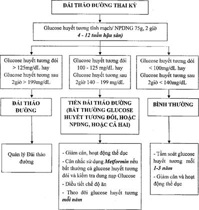

Quy trình chăm sóc và theo dõi sức khỏe mẹ – con ngay sau sinh và trong những tuần đầu tiên, nhằm phát hiện sớm rối loạn chuyển hóa đường, giảm thiểu biến chứng và phòng ngừa chuyển sang đái tháo đường type 2 sau này.

## Thực hiện sau sinh

- **Cho bú sớm**: Bắt đầu trong vòng 1 giờ đầu sau sinh để ổn định đường huyết sơ sinh và kích thích tiết oxytocin, hỗ trợ co hồi tử cung mẹ.
- **Da kề da**: ít nhất 1 ngày đầu để duy trì nhiệt độ, ổn định hô hấp và glucose cho bé, đồng thời giảm stress cho mẹ.
- **Cho bú sữa non**: Mỗi 2–3 giờ một lần, đảm bảo bé có năng lượng và kháng thể; khuyến khích bú mẹ hoàn toàn ít nhất 6 tháng đầu.
- **Biện pháp tránh thai**: Trì hoãn thai kỳ tiếp theo ≥ 6–12 tháng, ưu tiên phương pháp an toàn (bao cao su, dụng cụ tử cung, viên thuốc kết hợp hàm lượng thấp).

## Theo dõi trẻ sơ sinh

- **Hạ đường huyết sơ sinh**: Thường xảy ra trong 2–24 giờ đầu.
  - Mục tiêu: Duy trì glucose ≥ 45 mg/dL (2.5 mmol/L).
  - Xét nghiệm glucose mao mạch ngay trong 2 giờ đầu, sau đó 6 giờ và 12 giờ nếu vẫn có yếu tố nguy cơ.
- **Thân nhiệt, tim mạch, hô hấp**:
  - Đo mỗi 4–6 giờ trong 24 giờ đầu.
  - Phát hiện sớm hội chứng suy hô hấp, hạ thân nhiệt, vàng da.
- **Dinh dưỡng**: ưu tiên bú mẹ; nếu cần, bổ sung sữa công thức cho trẻ hạ đường huyết nặng hoặc không bú tốt.

## Theo dõi sản phụ

### Với ĐTĐ thai kỳ

- **Insulin**: Thường ngưng ngay sau sinh.
- **Đường huyết đói**: Kiểm tra trong vòng 24 giờ sau sinh; nếu bất thường (≥ 7.0 mmol/L), giảm liều insulin còn 50% nếu vẫn duy trì.
- **Theo dõi huyết áp, cân nặng, cử động tử cung**: Để phát hiện tiền sản giật còn sót, xuất huyết sau sinh.

### Với ĐTĐ thực sự

- **Insulin**: Tiếp tục điều chỉnh sau sinh—nếu không cần liều cao như khi mang thai, giảm 30–50% so với liều trước đó.
- **Khám chuyên khoa Nội tiết**: Lên lịch tái khám 4–12 tuần sau sinh để đánh giá lại nhu cầu insulin và kiểm soát glucose.

## Đánh giá

- **OGTT 75 g** thực hiện ở 4–12 tuần sau sinh: 
  _Bảng "Đánh giá OGTT 75 g sau sinh"._
  | **Thời điểm** | Bình thường | Tiền đái tháo đường | Đái tháo đường |
  | ------------------- | -------------------------- | ------------------------------- | --------------------------- |
  | **Glucose khi đói** | < 5.6 mmol/L (< 100 mg/dL) | 5.6–6.9 mmol/L (100–125 mg/dL) | ≥ 7.0 mmol/L (≥ 126 mg/dL) |
  | **Glucose 2 giờ** | < 7.8 mmol/L (< 140 mg/dL) | 7.8–11.0 mmol/L (140–199 mg/dL) | ≥ 11.1 mmol/L (≥ 200 mg/dL) |
- **Kết quả và xử trí**:
  - **Bình thường**: Kiểm tra định kỳ 1–3 năm/lần, tư vấn lối sống lành mạnh.
  - **Tiền đái tháo đường/ĐTĐ**: Chuyển khám Nội tiết, cân nhắc điều trị nội tiết và chương trình thay đổi lối sống tích cực.

_Hình ảnh "Quy trình theo dõi và quản lý ĐTĐ sau sinh"._

## Tài liệu tham khảo

- Bộ Y Tế (2023) – _Hướng dẫn quốc gia về sàng lọc và quản lý đái tháo đường thai kỳ_
- Bệnh viện Từ Dũ (2022) – _Phác đồ điều trị Sản Phụ khoa_
- TS. Lê Quang Toàn – [_Bài giảng đái tháo đường thai kỳ_](https://www.youtube.com/watch?v=WV4g4cJdMCo)
- ADA (2024) – _Standards of Medical Care in Diabetes – Pregnancy Section_
- WHO (2013) – _Diagnostic criteria and classification of hyperglycaemia first detected in pregnancy_
