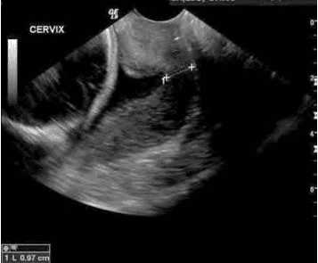
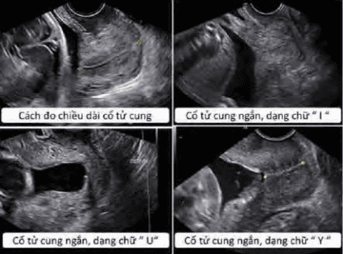
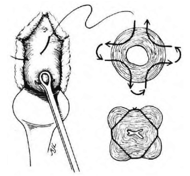
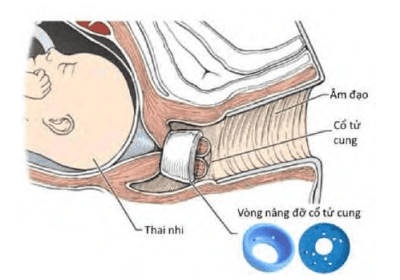
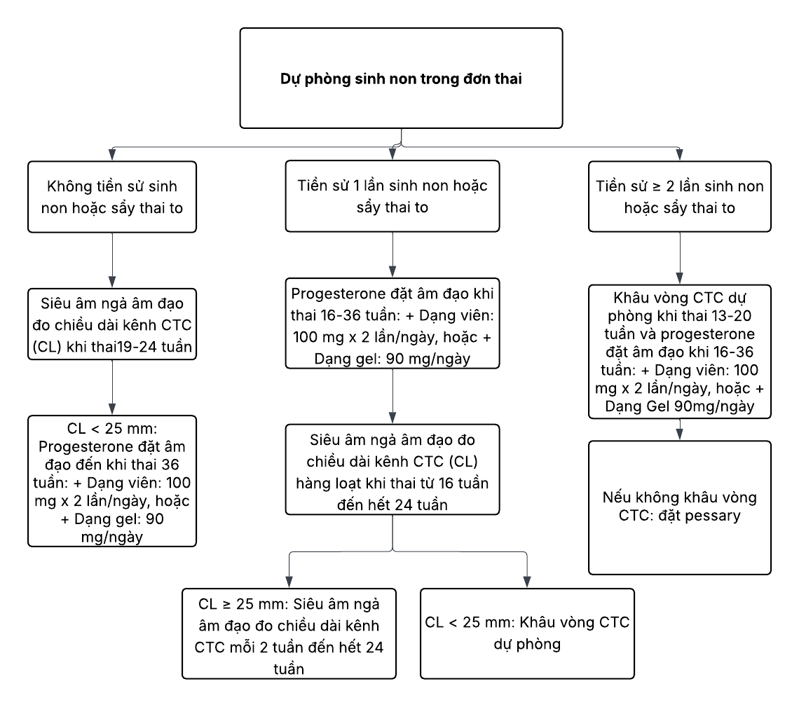

Đẻ non (sinh non) là hiện tượng trẻ được sinh ra khi tuổi thai **dưới 37 tuần**, tính từ ngày đầu kỳ kinh cuối cùng. Ngược lại sơ sinh đủ tháng lúc sinh từ 37 đến 42 tuần; thai già tháng > 42 tuần vô kinh.

## Phân loại

Tuổi thai tính theo tuần được chia như sau:

- **Sinh cực non**: < 28 tuần.
- **Sinh rất non**: 28 đến < 32 tuần.
- **Sinh non vừa**: 32 đến < 34 tuần.
- **Sinh non muộn**: 34 đến < 37 tuần.
- **Gần đủ tháng**: 37 đến < 39 tuần.
- **Đủ tháng**: 39 đến 41 tuần.

## Bệnh học

Nguyên nhân sinh non chia làm hai nhóm chính:

1. **Sinh non chỉ định** (20 %): do các chỉ định y khoa như tiền sản giật, nhau tiền đạo, thai chậm tăng trưởng nặng gây suy thai.
2. **Sinh non tự phát** (80 %): thường do chuyển dạ sinh non hoặc vỡ ối non (PPROM - Preterm Premature Rupture Of Membranes).

Các cơ chế bệnh sinh liên quan:

1. Hoạt hóa trục hạ đồi–tuyến yên–tuyến thượng thận ở mẹ hoặc thai nhi do stress, tăng corticosteroids.
2. Nhiễm trùng màng ối, màng đệm hoặc nhiễm khuẩn âm đạo.
3. Giảm tưới máu màng rụng và xuất huyết tại lớp màng rụng (bong rau).
4. Tử cung căng giãn quá mức do đa thai, đa ối hoặc dị dạng tử cung.

## Yếu tố nguy cơ

### Từ phía mẹ

- Tiền sử sinh non, chuyển dạ sinh non, vỡ ối non.
- Hở eo cổ tử cung, cổ tử cung ngắn (< 25 mm), chấn thương cổ tử cung (khoét chóp).
- Nhiễm trùng tiểu, nhiễm trùng âm đạo, nhiễm trùng ối.
- Dị dạng tử cung, u xơ tử cung, vách ngăn tử cung.
- Bất thường bánh rau: nhau bong non, nhau tiền đạo.
- Khoảng cách giữa hai lần mang thai < 6 tháng.
- Hút thuốc lá, sử dụng chất kích thích.
- Tuổi mẹ < 17 hoặc > 35 tuổi.
- Kinh tế xã hội thấp, dinh dưỡng kém, cân nặng trước mang thai < 50 kg.
- Lao động nặng, stress kéo dài.

### Từ phía thai và phần phụ

- Thai đa.
- Đa ối hoặc thiểu ối.
- Thai dị tật.
- Vỡ ối non.

## Dự báo

### Nguyên tắc đánh giá

- Xác định tuổi thai từ đầu thai kỳ.
- Khám cổ tử cung bằng mỏ vịt, siêu âm hoặc qua tay (chú ý nguy cơ tách màng ối khi khám tay).
- Siêu âm đánh giá độ mở, chiều dài kênh cổ tử cung, ngôi thai, lượng ối, vị trí bánh rau, dị tật thai.
- Monitor sản khoa theo dõi tần số và cường độ cơn gò.
- Theo dõi xuất huyết sản phụ (rau bong non, nhau tiền đạo).

:::caution[Lưu ý]  
Khám bằng tay có thể vô tình làm tăng nguy cơ sinh non do tách màng ối.  
:::

### Chiều dài cổ tử cung

- Đo siêu âm ngả âm đạo, từ lỗ ngoài đến lỗ trong cổ tử cung.

  

  _Chiều dài cổ tử cung._

- Tuần 19–23 + 6: nên khảo sát định kỳ.
- Tuần 24, nếu không triệu chứng mà cổ tử cung < 25 mm → nguy cơ sinh non tăng.
- Cơn gò xuất hiện mà cổ còn dài > 30 mm → nguy cơ sinh non trong 7 ngày chỉ 1 %.

### Hình dạng lỗ tử cung

- Cổ tử cung dạng U, Y: nguy cơ cao.
- Dạng I (hình phễu nhẹ): tiên lượng tốt hơn.

  

  _Hình dạng lỗ tử cung._

### Xét nghiệm sinh hóa

- **Fetal Fibronectin (fFN)**: giá trị dự báo âm quan trọng, dự báo dương giới hạn.
- **PAMG-1 (Placental α-microglobulin-1)**: tương tự fFN, nhưng khi (+) cho khả năng chuyển dạ gấp 4 lần so với fFN.

## Chẩn đoán

### Lâm sàng

**Đơn thai**: co tử cung đều đặn (≥ 4 cơn/20 phút hoặc ≥ 8 cơn/60 phút) và:

- Cổ tử cung mở ≥ 3 cm.
- Hoặc chiều dài cổ tử cung < 20 mm.
- Hoặc chiều dài 20–< 30 mm kèm fFN (+).

**Song thai**: co tử cung đều đặn (như trên) và:

- Cổ tử cung mở ≥ 3 cm.
- Hoặc chiều dài cổ tử cung < 25 mm.
- Hoặc chiều dài 25–< 35 mm kèm fFN (+).

Biểu hiện kèm: ra dịch hồng, nhầy cổ tử cung, đau lưng, nặng bụng, có thể vỡ ối non.

### Cận lâm sàng

- Monitor cơn co tử cung.
- Siêu âm ngả âm đạo đo cổ tử cung.
- fFN, PAMG-1 (Partosure).

## Điều trị

### Nguyên tắc

- Tránh lao động nặng, kiêng giao hợp, không kích thích đầu vú.
- Nghỉ ngơi hợp lý (không bắt buộc nằm giường tuyệt đối).
- Dinh dưỡng đủ năng lượng, protein, vitamin, tránh táo bón.
- Liệu pháp corticosteroids trước sinh.
- Thuốc cắt cơn ngắn hạn để hoàn thành corticosteroids.
- MgSO₄ bảo vệ não thai.
- Kháng sinh dự phòng GBS nếu cần.
- Phối hợp bác sĩ sơ sinh.

### Thuốc cắt cơn (tocolytics)

| Nhóm thuốc                       | Tác động                                                                                                | Tác dụng phụ                                                                                                                                                                      | Lưu ý                                                                                                                            |
| -------------------------------- | ------------------------------------------------------------------------------------------------------- | --------------------------------------------------------------------------------------------------------------------------------------------------------------------------------- | -------------------------------------------------------------------------------------------------------------------------------- |
| **Đối vận với thụ thể oxytocin** | Đối vận với thụ thể của oxytocin trên cơ tử cung, ngăn cản tác dụng co cơ tử cung của oxytocin nội sinh | Hiện không có tác dụng phụ quan trọng được ghi nhận                                                                                                                               | Là thuốc duy nhất được dán nhãn (_labelled_) cho điều trị sinh non                                                               |
| **Ức chế kênh calcium**          | Ngăn chặn Ca²⁺ đi vào tế bào                                                                            | Hạ huyết áp và nhức đầu; có thể làm giảm lưu lượng máu nhau-tử cung, giảm oxygen và tăng CO₂ ở thai nhi                                                                           | - Có thể làm nặng thêm tác dụng phụ của MgSO₄ - Không được dán nhãn cho điều trị sinh non - Thường ít dùng do tác dụng phụ |
| **Đồng vận β-adrenergic**        | Tăng nồng độ cAMP (_cyclic adenosine MonoPhosphate_) trong tế bào, làm giảm nồng độ calcium             | - Hạ huyết áp, nhịp tim nhanh, nặng ngực/đau ngực, thay đổi ECG - Có thể gây phù phổi (đặc biệt khi quá tải tuần hoàn) - Chống chỉ định tương đối: bệnh mạch vành, suy thận | - Salbutamol không được dán nhãn cho điều trị sinh non - Dùng kéo dài không được xem là an toàn cho thai nhi                  |

:::caution[Lưu ý]  
Không dùng thuốc cắt cơn kéo dài, phối hợp đồng thời nhiều loại, hoặc sau 34 tuần.  
:::

#### Chống chỉ định tuyệt đối

- Thai chết lưu, dị tật nặng, suy cấp.
- Tiền sản giật nặng, nhiễm trùng ối.
- Chảy máu nhiều, rối loạn huyết động.
- Bệnh tim mạch nặng, suy thận, cường giáp, tăng Calci máu, đái tháo đường toan, glaucoma.

#### Chống chỉ định tương đối

- Thai suy dinh dưỡng, đái tháo đường cần insulin (có Antosiban).
- Đa thai (uống nifedipine cẩn trọng, ưu tiên Antosiban).
- Ối vỡ non, rối loạn nhịp, tăng huyết áp, nhược cơ, rau bong non, giảm kali máu, dị ứng.

#### Ức đối vận với oxytocin

- Antosiban (Tractocile) có cấu trúc mô phỏng peptide 9 của oxytocin. Đây là peptide tổng hợp có tác dụng đối kháng cạnh tranh với oxytocin, làm giảm tần số cơn gò và trương lực cơ tử cung, đồng thời gắn kết với các thụ thể vasopressin.
- **Chống chỉ định**:

  - Mẹ bị dị ứng với thuốc.
  - Ối vỡ non thai từ 30 tuần.
  - Thai chậm phát triển trong tử cung.
  - Nhau tiền đạo.

- **Liều dùng**:

  - **Bước 1**: Liều tấn công lọ 1 (37.5 mg/5 mL): lấy 6.75 mg (0.9 mL) pha vào 10 mL Ringer lactate, tiêm tĩnh mạch chậm > 1 phút (còn 4.1 mL).
  - **Bước 2**: Liều duy trì với lọ 1 còn 30.75 mg (4.1 mL) pha 36.9 mL Ringer lactate, truyền bơm tiêm điện 24 mL/h. Sau đó pha tiếp lọ 2 (37.5 mg/5 mL) trong 45 mL Ringer lactate, truyền 24 mL/h trong 3 giờ đầu.
  - **Bước 3**: Phần còn lại ở bước 2 (19 mL) truyền 8 mL/h. Sau đó pha lọ 3 (37.5 mg/5 mL) thành 50 mL Ringer lactate, truyền 8 mL/h. Thời gian dùng tối đa 45 giờ.

- **Tác dụng phụ** thường nhẹ: buồn nôn, nhức đầu, chóng mặt, bừng nóng, nôn, nhịp tim nhanh, dị ứng thuốc.
- **Theo dõi tim thai và cơn gò** trên monitor trong 1 giờ đầu điều trị.

#### Ức chế calcium

- Nifedipine ức chế kênh calci type II, có nhiều ở mạch máu, tử cung và bàng quang. Gây dãn cơ trơn, giảm lượng calci vào tế bào. Hoạt động trên cơ trơn mạch gấp 18 lần so với cơ tim, ảnh hưởng huyết động, giảm huyết áp động mạch và tăng nhịp tim.
- **Chống chỉ định**:

  - Huyết áp mẹ < 90/50 mmHg hoặc có bệnh tim mạch nặng.
  - Rối loạn chức năng gan hoặc thận.
  - Đang dùng thuốc hạ áp khác.
  - Đa thai.
  - Mẫn cảm với nifedipine, nicardipine.

- **Liều dùng**:

  - Liều tấn công 20–30 mg viên tác dụng nhanh, hiệu quả sau 20–30 phút.
  - Tiếp tục 10–20 mg mỗi 3–8 giờ, tối đa 48 giờ, liều tối đa 180 mg/ngày.

- **Tác dụng phụ**:

  - Đau đầu.
  - Nổi mẩn.
  - Hạ huyết áp, đặc biệt gây thiếu oxy thai.
  - Nhịp tim nhanh, đánh trống ngực.
  - Nóng bừng mặt, chóng mặt.
  - Buồn nôn.
  - Phù chi dưới.
  - Suy thai.

- **Theo dõi**:

  - Mạch và huyết áp mẹ mỗi 30 phút trong 1 giờ đầu, sau đó 30 phút sau mỗi liều.
  - Monitor tim thai và cơn gò 1 giờ liều đầu và mỗi 6 giờ sau đó.
  - Tránh truyền dịch quá mức.

#### Betamimetics

- Betamimetics (ví dụ Salbutamol) là dẫn xuất catecholamines làm dãn cơ tử cung và cơ trơn khác qua kích thích thụ thể β₂.
- **Chống chỉ định**:

  - Mẹ có bệnh tim mạch.
  - Tăng huyết áp nặng hoặc không kiểm soát.
  - Sản giật hoặc tiền sản giật.
  - Đái tháo đường đang điều trị insulin.
  - Bệnh tuyến giáp hoặc dị ứng với thuốc.
  - Đa thai.

- **Liều dùng**:

  - Hạn chế dịch truyền nhất ở song thai hoặc đang dùng corticosteroids.
  - Pha 5 mg Salbutamol/5 mL trong 95 mL NaCl 0.9 %; truyền 12 mL/h (10 µg/phút), tăng 4 mL/h mỗi 30 phút đến khi cắt cơn hoặc mẹ đạt nhịp tim ≥ 120 lần/phút hoặc tối đa 36 mL/h.
  - Có thể truyền tĩnh mạch pha 5 mg Salbutamol/5 mL trong dung dịch glucose 5 % (10 µg/mL), tốc độ 60 mL/h (10 µg/phút), tăng 20 mL/h mỗi 30 phút đến khi cắt cơn hoặc nhịp tim mẹ ≥ 120 lần/phút hoặc tối đa 180 mL/h.

- **Thời gian điều trị**:

  - Đường tĩnh mạch: 24–48 giờ.
  - Duy trì uống/đặt:
    - Ventolin 2 viên × 4–6 viên/ngày.
    - Salbutamol 1 viên × 1–3 viên/ngày (đặt hậu môn).

- **Theo dõi**:

  - Mạch và huyết áp mẹ mỗi 15 phút trong 1 giờ đầu, sau đó mỗi 4 giờ.
  - Theo dõi lượng nước tiểu (thiểu niệu là dấu hiệu ngộ độc).
  - Xét nghiệm ure, điện giải, Hct mỗi 24 giờ; đo đường huyết mỗi 4 giờ.
  - Monitor tim thai và cơn gò 1 giờ liều đầu và mỗi 6 giờ liều duy trì.

### Liệu pháp corticosteroids

- Dự phòng hội chứng suy hô hấp cấp ở sơ sinh.
- **Chỉ định**: sinh non dự kiến 24–34 tuần, có nguy cơ trong 7 ngày.
- **Liều dùng**:
  - Betamethasone 12 mg bắp × 2 liều cách 24 giờ.
  - Hoặc dexamethasone 6 mg bắp × 4 liều cách 12 giờ.
  - Xem xét lặp lại sau 7–14 ngày nếu còn nguy cơ và < 34 tuần.

### Bảo vệ thần kinh thai bằng MgSO₄

- MgSO₄ bảo vệ thần kinh cho trẻ rất non (< 32 tuần).
- **Chỉ định**:

  - Thai 24–31 + 6 tuần có nguy cơ sinh non trong 24 giờ.
  - Dùng lý tưởng 4 giờ trước sinh khi có chỉ định chấm dứt thai kỳ.

- **Liều**:

  - MgSO₄ 4.5 g truyền tĩnh mạch chậm 20–30 phút.
  - Giảm liều nếu thiểu niệu hoặc suy thận.
  - Không phối hợp với thuốc cắt cơn.

- **Chống chỉ định**: mẹ bị nhược cơ.
- **Thận trọng**: mẹ có bệnh cơ tim hoặc rối loạn dẫn truyền nhịp.

## Dự phòng

- Xác định nhóm nguy cơ cao, tầm soát định kỳ.
- Dinh dưỡng, tập luyện nhẹ, tránh stress.
- Điều trị nhiễm trùng sinh dục trước và trong thai kỳ.
- Giảm số phôi chuyển IVF để hạn chế đa thai.
- **Ba biện pháp chính**:
  1. Progesterone.
  2. Khâu vòng cổ tử cung.
  3. Pessary (vòng nâng cổ tử cung).

### Progesterone

- Dùng cho thai phụ có cổ tử cung < 25 mm hoặc tiền sử sinh non.

- **Tác dụng phụ**: mẹ có thể bị ứ mật trong thai kỳ.

### Khâu vòng cổ tử cung

- Cho trường hợp hở eo tử cung, kênh cổ ngắn < 25 mm.
- Không lợi ở cổ ngắn không có tiền sử sinh non, có nguy cơ ở song thai.

  

  _Khâu vòng cổ tử cung._

### Pessary

- Giảm tỷ lệ sinh non < 34 và < 37 tuần.
- Gây tiết dịch âm đạo, cần theo dõi viêm.
- Đặt 14–32 tuần hoặc 2 tuần trước mốc sinh non trước đó.
- Theo dõi định kỳ, lấy ra sau 37 tuần hoặc khi chuyển dạ.

  

  _Vòng nâng cổ tử cung._

_Lưu đồ dự phòng sinh non đơn thai – Bệnh viện Từ Dũ._

## Nguồn tham khảo

- Trường ĐH Y Dược TP. HCM (2020) – _Team-based Learning_
- Bệnh viện Từ Dũ (2022) – _Phác đồ điều trị Sản Phụ khoa_
- PGS.TS. Trần Thị Lợi & GS.TS. Nguyễn Duy Tài – _Thực hành Sản phụ khoa_
