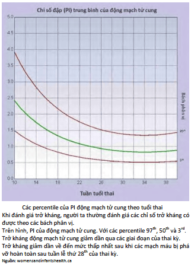
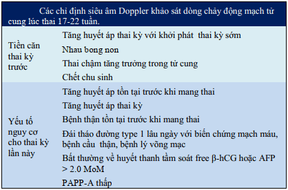
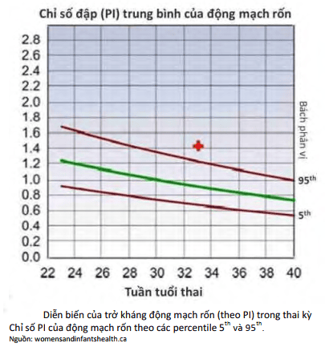
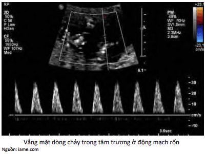
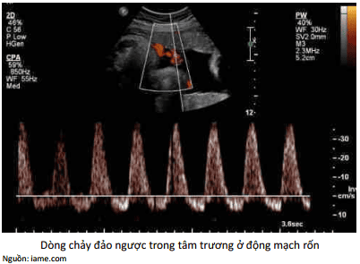

Trong sản khoa, khảo sát động học dòng chảy trong các mạch máu cho phép có ý niệm về trở kháng của các mạch máu được khảo sát, thông qua việc khảo sát tốc độ dòng chảy.

Các trở kháng được thể hiện bằng nhiều cách. Phổ biến nhất là thể hiện bằng chỉ số kháng trở hoặc chỉ số Pourcelot.

Nhưng khi đánh giá trở kháng, người ta thường đánh giá các chỉ số trở kháng có được theo các bách phân vị và phải so sánh với các trở kháng của các mạch máu khác. Các chỉ số thông dụng:

- S: Peak systolic velocity, đỉnh tâm thu.
- D: End diastolic velocity, vận tốc cuối tâm trương.
- RI: Resistance Index, chỉ số kháng. RI = (S-D)/S.
- PI: Pulsatility Index, chỉ số đập, PI = (S-D)/A. (A=Vm Mean velocity, vận tốc trung bình).

## Phổ Doppler động mạch tử cung

Siêu âm khảo sát động học dòng chảy động mạch tử cung bằng Doppler là phương pháp không xâm lấn đánh giá trở kháng của những mạch máu cung cấp cho bánh rau.

Trong thai kỳ bình thường, động mạch tử cung có trở kháng thấp. Tăng vận tốc của dòng chảy và giảm trở kháng của hệ thống động mạch tử cung là đặc điểm phổ Doppler bình thường. _bánh rau phát triển sâu vào màng rụng của tử cung. Các nguyên bào nuôi xâm nhập, tấn công các động mạch xoắn, và biến những mạch máu này thành những shunt. Sự hiện diện các shunt tiểu động mạch-tiểu tĩnh mạch tại các hồ máu đã triệt tiêu trở kháng của hệ thống động mạch tử cung. Hình thành các shunt là điều kiện tiên quyết cho tưới máu nuôi dưỡng bào thai. Thai kỳ càng tiến triển, các xâm nhập của tế bào nuôi càng mãnh liệt. Trở kháng động mạch tử cung giảm dần, do các cấu trúc cơ thành tiểu động mạch bị phá hủy. Tăng vận tốc của dòng chảy và giảm trở kháng của hệ thống động mạch._

Trong thai kỳ bệnh lý, động mạch tử cung có trở kháng cao với tồn tại của khuyết đầu tâm trương (notch). _Trong các thai kỳ với bệnh lý trong đó có sự xâm nhập không hoàn toàn của tế bào nuôi vào hệ thống mạch máu màng rụng (tăng huyết áp, thai chậm tăng trưởng trong tử cung), các mạch máu không bị phá hủy hoàn toàn, vẫn còn giữ khẩu kính rất hẹp, làm cho trở kháng của toàn hệ thống động mạch tử cung không giảm._

Khảo sát động học dòng chảy bằng Doppler là khảo sát có giá trị dự báo cao khi được thực hiện trên dân số có nguy cơ cao của biến chứng liên quan đến suy yếu bánh rau (như tăng huyết áp mãn tính, thai chậm tăng trưởng trong buồng tử cung). Thời điểm thực hiện khảo sát vào khoảng 17-22 tuần tuổi thai, cùng với siêu âm hình thái. Khi tầm soát bằng Doppler bất thường thì nên khảo sát thêm alpha feto-protein và free β-hCG ở thời điểm thai dưới 18 tuần, trong khuôn khổ của triple test. Cũng nên thực hiện lại Doppler động mạch tử cung lúc thai 24-26 tuần. Khi khảo sát lần thứ 2 vẫn cho thấy bất thường thì việc quản lý thai kỳ tiếp theo nên được diễn ra ở các trung tâm chăm sóc chuyên biệt. Nếu thực hiện khảo sát dòng chảy bằng Doppler phát hiện thấy trở kháng động mạch tử cung cao bất thường và/hoặc có ngấn tiền tâm trương sau 26 tuần, thì khả năng có tăng huyết áp thai kỳ, thai chậm tăng trưởng trong tử cung sẽ tăng cao hơn gấp 4 đến 8 lần.

Các chỉ định siêu âm Doppler khảo sát dòng chảy động mạch tử cung lúc thai 17-22 tuần.

Tầm soát bằng phổ Doppler động mạch tử cung được xem là bất thường khi chỉ số kháng (RI) >0.57, chỉ số đập (PI) >95th percentile và/hoặc hiện diện notch ở động mạch tử cung.

## Phổ Doppler động mạch rốn

Trong thai kỳ bình thường, động mạch tử rốn có trở kháng thấp và giảm dần thêm về cuối thai kỳ.

Trong thai kỳ bình thường, lưu thông máu qua động mạch rốn thai nhi được đặc trưng bằng dòng chảy với trở kháng thấp, liên tục về phía bánh rau. Trên phổ Doppler, tỷ lệ giữa vận tốc tâm thu và vận tốc tâm trương (S/D) cũng sẽ giảm dần về cuối thai kỳ. _Động mạch rốn có đích đến tận cùng là các vi nhung mao của rau. Hệ thống này phát triển tăng dần theo tuổi thai. Tuổi thai càng lớn, các cấu trúc mạch máu trong bánh rau càng phát triển, chia nhánh nhỏ dần làm giảm trở kháng của giường rau (placenta bed)._

Không nên tầm soát thường quy bằng Doppler động mạch rốn ở những thai kỳ khỏe mạnh, phát triển bình thường. Do chưa chứng minh được lợi ích và ngược lại gây nhiễm cho đối tượng được tầm soát.

Các bệnh lý như tăng huyết áp thai kỳ, thai chậm tăng trưởng trong tử cung sẽ gây nên sự suy thoái chức năng
tuần hoàn rau thai do hậu quả của kết tập tiểu cầu, lắng đọng fibrin hay xơ hóa bánh rau. Bệnh lý trên của các đơn vị mạch máu trong bánh rau sẽ được biểu hiện bằng sự tăng trở kháng dòng chảy của tuần hoàn rốn. Các chỉ số đo được trên phổ Doppler sẽ bất thường như tăng tỷ lệ vận tốc giữa tâm thu và tâm trương (S/D), chỉ số kháng (RI) hoặc chỉ số đập (PI) cao hơn bách phân vị 95th.

Nên sử dụng khảo sát dòng chảy động mạch rốn bằng Doppler để đánh giá chức năng tuần hoàn rau thai ở những thai kỳ nghi ngờ có sự suy yếu chức năng bánh rau (tăng huyết áp, thai chậm tăng trưởng trong buồng tử cung).

Trở kháng động mạch rốn tăng cao, cuối cùng dẫn đến tình trạng rất nặng là hiện tượng mất dòng chảy cuối tâm trương hoặc đảo ngược dòng chảy cuối tâm trương. Khi xuất hiện sự giảm, mất hoặc đảo ngược dòng chảy cuối tâm trương trên Doppler động mạch rốn cần xem xét cụ thể các yếu tố còn lại trên lâm sàng để quyết định chấm dứt thai kỳ hay tiếp tục theo dõi đánh giá thai kỳ chặt chẽ.

## Phổ Doppler động mạch não giữa

Ở thai kỳ bình thường trở kháng của động mạch não giữa cao hơn trở kháng động mạch rốn.

Trong trường hợp thiếu oxy trường diễn, với hiện tượng giãn mạch não, thì chỉ số trở kháng này sẽ đảo ngược.

Đỉnh tâm thu của động mạch não giữa có liên quan chặt chẽ với tình trạng thiếu máu nặng của bào thai (độ nhạy lên đến gần 100%). Khi tình trạng thiếu máu bào thai ở mức độ trung bình hoặc nhẹ thì mức độ dương giả cũng tăng lên dần.

## Nguồn tham khảo

- Trường Đại học Y Dược Thành phố Hồ Chí Minh (2020) - TEAM-BASED LEARNING.
