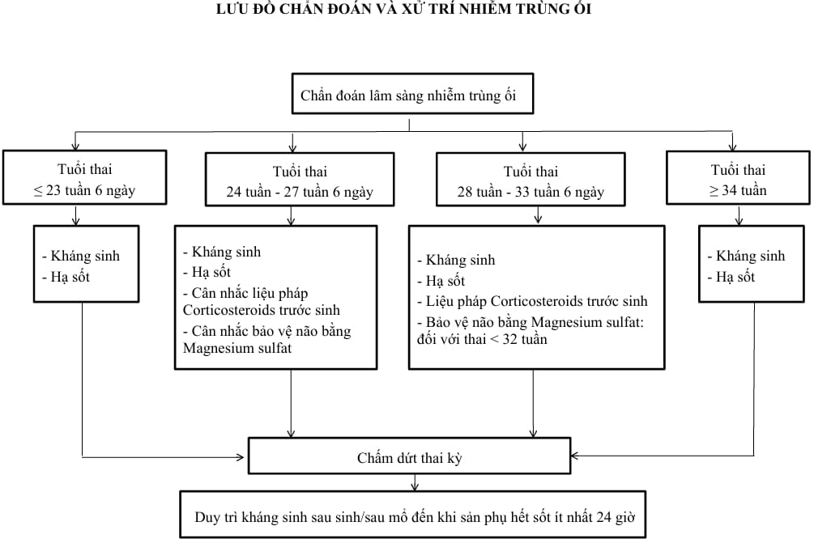

Nhiễm trùng ối (intra-amniotic infection - IAI) được xác định khi nhiễm trùng 1 trong các yếu tố dịch ối, thai, dây rốn, bánh rau, màng ối, màng đệm.

## Nguyên nhân và yếu tố nguy cơ

### Nguyên nhân

Do vi khuẩn gồm vi khuẩn kị khí và hiếu khí, thường do hệ vi khuẩn âm đạo và đường sinh dục dưới đi lên buồng ối.

Có thể gặp khi làm thủ thuật xâm lấn (chọc ối hoặc sinh thiết gai rau, nội soi bào thai) hoặc nhiễm trùng thứ phát từ đường máu (thường là Listeria monocytogenes).

Các tác nhân thường gặp: Ureaplasma urealyticum, vi khuẩn Gram âm, Mycoplasma hominis, Bacteroids bivius, Gardnerella vaginalis, Liên cần khuẩn nhóm B (GBS),..

### Yếu tố nguy cơ

Ối vỡ non.

Chuyển dạ kéo dài, ối vỡ lâu, con so.

Các trường hợp ối vỡ được thăm khám âm đạo nhiều lần, nhiễm phân su trong nước ối.

Hở eo tử cung.

Nhiễm khuẩn đường sinh dục như GBS, bệnh lây qua đường tình dục.

Hút thuốc lá, rượu.

Tiền căn nhiễm trùng ối.

## Chẩn đoán

:::note[Chẩn đoán nhiễm trùng ối]
|Chẩn đoán|Đặc điểm|
|---|---|
|Mẹ sốt đơn thuần|Nhiệt độ mẹ sốt từ 38°C - 38.9°C không có nguyên nhân khác, tình trạng sốt có thể kéo dài hoặc không.|
|Nghi ngờ nhiễm trùng ối|Sốt không có nguyên nhân cụ thể, kết hợp 1 hoặc các yếu tố sau: 1. Tim thai cơ bản >160 lần/phút trong ≥10 phút. 2. Bạch cầu máu mẹ >15 000/mm³, không điều trị corticosteroids, công thức bạch cầu chuyển trái (trường hợp dùng corticosteroids liều cao có thể xét nghiệm lại 48h sau liều cuối cùng). 3. Dịch đục chảy ra từ lỗ ngoài cổ tử cung qua đặt mỏ vịt.|
|Xác định nhiễm trùng ối|Dấu hiệu nghi ngờ nhiễm trùng ối kết hợp với 1 hoặc nhiều kết quả xét nghiệm dịch ối sau: 1. Nhuộm Gram dịch ối có vi khuẩn. 2. Giảm nồng độ glucose ≤14mg/dL. 3. Tăng bạch cầu dịch ối > 30 tế bào/mm³ (không lẫn máu).|
:::

:::caution[Lưu ý]
Chẩn đoán nhiễm trùng ối chủ yếu dựa vào lâm sàng để xử trí tích cực, tiêu chuẩn chọc ối/giải phẫu bệnh chỉ có giá trị nghiên cứu và không giúp cải thiện xử trí trong và sau sinh.
:::

## Biến chứng

### Mẹ

Làm tăng nguy cơ chuyển dạ bất thường, tỷ lệ mổ lấy thai, đờ tử cung, băng huyết sau sinh, cần truyền máu.

Nhiễm trùng tại chỗ, tăng nguy cơ viêm nội mạc tử cung, nhiễm khuẩn vùng chậu, nhiễm trùng vết mổ.

Nhiễm khuẩn huyết, rối loạn đông máu, hội chứng suy hô hấp, tử vong.

### Con

Cấp: Viêm phổi sơ sinh, viêm màng não, nhiễm khuẩn huyết, tử vong.

Lâu dài: Loạn sản phế quản phổi, bại não.

:::caution[Lưu ý]
Cần thảo luận với bác sĩ sơ sinh đánh giá và điều trị trẻ sơ sinh khi chẩn đoán nghi ngờ/xác định nhiễm trùng ối.
:::

## Xử trí

### Nguyên tắc

Sử dụng kháng sinh khi mẹ chẩn đoán số đơn thuần trong chuyển dạ và không tìm được nguyên nhân khác.

Điều trị kháng sinh khi có nghi ngờ hoặc xác định nhiễm trùng ối với 3 nguyên tắc:

- Kháng sinh phổ rộng và sử dụng đường tĩnh mạch chỉ định ngay khi có chẩn đoán.
- Kháng sinh phải có hoạt tính với GBS và E. Coli.
- Điều trị ngay trong quá trình mang thai không chờ sau sinh.

Chấm dứt thai kỳ khi có chẩn đoán nghi ngờ hoặc xác định nhiễm trùng ối, ưu tiên sinh đường âm đạo.

Khởi phát chuyển dạ hoặc can thiệp để rút ngắn thời gian chuyển dạ (từ lúc nghi ngờ hoặc xác định đến lúc sinh không kéo dài quá 12h).

Mổ lấy thai khi có chỉ định. Mổ lấy thai làm tăng nguy cơ nhiễm trùng vết thường, viêm nội mạc tử cung, huyết khối mạch máu…

Duy trì kháng sinh sau sinh/sau mô đến khi hết sốt ít nhất 24h.

Xác định nhiễm trùng lan rộng bao gồm nhiễm trùng vùng chậu, nhiễm trùng huyết, nhiễm trùng toàn thân… Khi có nhiễm trùng lan rộng cần điều trị tích cực theo mức độ nhiễm trùng.

### Kháng sinh

#### Lựa chọn 1

Chọn 1 trong các kháng sinh sau đây:

- Ampicillin 2g tiêm tĩnh mạch mỗi 6h + Gentamicin 5mg/kg truyền tĩnh mạch mỗi 24h (sau mổ lấy thai, thêm Clindamycin 900mg hoặc Metronidazole 500mg truyền tĩnh mạch mỗi 8h), hoặc
- Ampicillin - sulbactam 3g tiêm tĩnh mạch mỗi 6h, hoặc
- Cefoxitin 2g tiêm tĩnh mạch mỗi 8h, hoặc
- Cefotetan 2g tiêm tĩnh mạch mỗi 12h, hoặc
- Mezlocillin 4g tiêm tĩnh mạch mỗi 6h.

#### Lựa chọn 2: Nếu dị ứng nhẹ với Penicillin

Cefazolin 2g tiêm tĩnh mạch mỗi 8h + Gentamicin 5mg/kg truyền tĩnh mạch mỗi 24h (sau mổ lấy thai, thêm Clindamycin 900mg hoặc Metronidazole 500mg truyền tĩnh mạch mỗi 8h).

#### Lựa chọn 3: Nếu dị ứng nặng với Penicillin

Clindamycin 900mg truyền tĩnh mạch 8h hoặc Vancomycin 1g truyền tĩnh mạch mỗi 12h và Gentamicin truyền tĩnh mạch 5mg/kg truyền tĩnh mạch mỗi 24h.

:::caution[Lưu ý]
Vancomycin chỉ nên sử dụng trong trường hợp:

- Người bệnh nhiễm GBS và đề kháng với Clindamycin hoặc Erythromycin, hoặc
- Người bệnh nhiễm GBS và không có kết quả kháng sinh đồ.
:::

#### Nếu không đáp ứng với kháng sinh trên

Piperacillin - Tazobactam 4.5g truyền tĩnh mạch mỗi 8h, hoặc

Ertapenem 1g truyền tĩnh mạch mỗi 24h.

### Hạ sốt

Dùng theo chỉ định

_Lưu đồ xử trí nhiễm trùng ối._

## Nguồn tham khảo

- Trường Đại học Y Dược TP. HCM (2020) – _TEAM-BASED LEARNING_
- Bệnh viện Từ Dũ (2022) - _PHÁC ĐỒ ĐIỀU TRỊ SẢN PHỤ KHOA_
