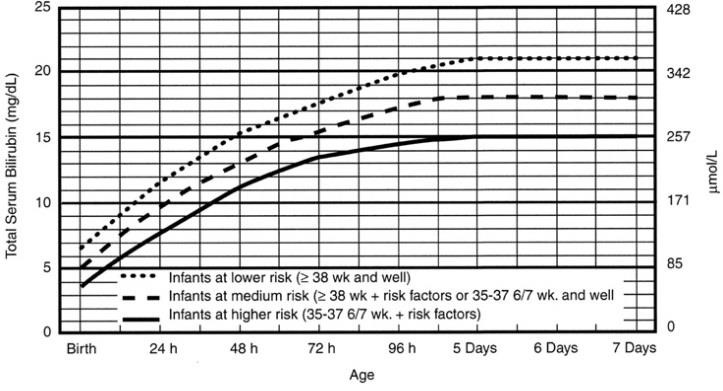

Vàng da sơ sinh là tình trạng da và niêm mạc của trẻ sơ sinh có màu vàng do tăng bilirubin tự do trong máu. Đây là một triệu chứng thường gặp, xuất hiện ở khoảng 60% trẻ đủ tháng và 80% trẻ non tháng.

_Bảng "Đặc điểm vàng da sơ sinh"_.

| Đặc điểm phân biệt           | Vàng da sinh lý                                                      | Vàng da bệnh lý                                                                                                |
| ---------------------------- | -------------------------------------------------------------------- | -------------------------------------------------------------------------------------------------------------- |
| **Thời điểm xuất hiện**      | Sau **24 giờ** sau sinh (thường ngày 2-3)                            | Trong **24 giờ đầu** sau sinh                                                                                  |
| **Mức độ vàng da**           | Nhẹ đến vừa, bilirubin tăng chậm                                     | Nặng, bilirubin tăng nhanh                                                                                     |
| **Tốc độ tăng bilirubin**    | < **5 mg/dL/ngày**                                                   | ≥**5 mg/dL/ngày**                                                                                              |
| **Giá trị bilirubin tối đa** | < **12 mg/dL** (trẻ đủ tháng)   < **14–15 mg/dL** (trẻ non tháng) | > **12–15 mg/dL** (đủ tháng)   > **10 mg/dL** (non tháng)                                                   |
| **Thời gian kéo dài**        | < **7 ngày** (trẻ đủ tháng)   < **10–14 ngày** (trẻ non tháng)    | > **7 ngày** (đủ tháng)   > **14 ngày** (non tháng)                                                         |
| **Bilirubin trực tiếp**      | Bình thường (< 2 mg/dL, < 20% tổng bilirubin)                        | > 2 mg/dL hoặc > 20% tổng bilirubin                                                                            |
| **Triệu chứng đi kèm**       | Trẻ bú tốt, tỉnh táo, tăng cân                                       | Trẻ bú kém, lừ đừ, sốt, thiếu máu, gan lách to, dấu hiệu thần kinh                                             |
| **Nguyên nhân**              | Sinh lý: Gan chưa hoàn thiện, tăng hồng cầu, chu trình ruột–gan      | Trẻ non tháng, bất đồng nhóm máu mẹ-con (ABO, Rh), tan huyết, nhiễm trùng, teo đường mật, mẹ đái tháo đường... |
| **Tiên lượng**               | Tự hết, không di chứng                                               | Nguy cơ **vàng da nhân não**, di chứng thần kinh nếu không điều trị kịp                                        |

## Chẩn đoán

### Lâm sàng

**Thời điểm xuất hiện vàng da, mức độ và diễn tiến của vàng da:**

- Vàng da xuất hiện sớm (trước 36 giờ tuổi) hay vàng da xuất hiện muộn (sau 36 giờ tuổi).
- Nếu muộn, cần xác định là ngày thứ mấy.

**Màu sắc của vàng da thay đổi theo loại bilirubin:**

- Màu vàng sáng, tươi, vàng nghệ liên quan đến tăng bilirubin gián tiếp.
- Màu da vàng xạm, không tươi, vàng chanh liên quan đến tăng bilirubin trực tiếp.

**Vị trí:** Từ mặt, đến trên rốn, đến đùi, đến cẳng chân cẳng tay, đến bàn chân-bàn tay.

**Mức độ:** Từ nhẹ, vừa đến rõ đậm.

**Thời gian kéo dài:** Kể từ sau sinh bao nhiêu ngày.

**Diễn tiến của vàng da tăng với tốc độ nhanh hay chậm, vàng da giảm như thế nào.**

**Màu nước tiểu trẻ:**

- Nước tiểu sẽ không vàng trong tăng bilirubin gián tiếp.
- Ngược lại nước tiểu sẽ có màu vàng đậm trong tăng bilirubin trực tiếp.

**Phân của trẻ vàng da:**

- Phân sẽ vàng trong tăng bilirubin gián tiếp.
- Phân sẽ nhạt màu trong tăng bilirubin trực tiếp .

**Các dấu hiệu khác kèm theo vàng da** có ý nghĩa chỉ báo mức độ nặng cũng như nguyên nhân của vàng da. Vàng da bệnh lý khi kèm bất kỳ dấu hiệu bất thường như: Nôn; Bú kém, bụng chướng; Gan to, lách to; Ngưng thở; Nhịp thở nhanh; Nhịp tim chậm; Hạ thân nhiệt; Sụt cân; Xanh tái, ban xuất huyết; Dấu thần kinh: Ngủ lịm, li bì, kích thích, giảm hoặc tăng trương lực cơ, co giật, hôn mê.

Ngoài ra kèm các triệu chứng biểu hiện riêng biệt của những bệnh lý nguyên nhân.

### Cận lâm sàng

**Định lượng bilirubin toàn phần và trực tiếp trong máu.**

**Công thức máu, hồng cầu lưới:** Đánh giá thiếu máu, tán huyết.

**Xét nghiệm nhóm máu mẹ - con, test Coombs.**

**Protein máu toàn phần và albumin máu.**

**Siêu âm gan mật** nếu nghi ngờ tắc mật, teo đường mật.

**Xét nghiệm trong nhiễm trùng, chuyển hóa hay nội tiết, định lượng các men.**

## Vàng da nhân

**Bệnh não bilirubin hay vàng da nhân:**

- Bilirubin tự do **không kết hợp albumin là độc, sẽ tẩm nhuận dễ dàng vào các nhân xám của não.**
- Xảy ra khi **bilirubin > 20 mg/dL (> 340 µmol/L), nhất là trong 15 ngày đầu sau sinh.** Ngưỡng bilirubin gây độc có thể thay đổi thấp hơn khi có mặt các yếu tố nguy cơ: Đẻ non, tăng thẩm thấu, co giật, tăng CO₂ máu, tăng huyết áp, viêm mạch, viêm màng não, bệnh não thiếu máu cục bộ, xuất huyết trong não thất.
- Có thể làm cho trẻ bị hôn mê, co giật, dẫn đến tử vong hoặc để lại di chứng về tâm thần vận động vĩnh viễn.

Trải qua **4 giai đoạn:**

- Giai đoạn 1: Phản xạ nguyên thủy giảm hoặc mất, bỏ bú, li bì, nôn, giảm trương lực cơ, khóc thét.
- Giai đoạn 2: Kích thích thần kinh, cổ ngửa, co cứng người, đi dần đến hôn mê và tử vong trong cơn ngừng thở.
- Giai đoạn 3: Co cứng giảm dần trong khoảng 1 tuần.
- Giai đoạn 4: Để lại di chứng tinh thần và vận động: co cứng, điếc, liệt, chậm phát triển tinh thần, nói khó...

## Điều trị

### Nguyên tắc

- Phát hiện sớm, phân biệt vàng da sinh lý và bệnh lý.
- Can thiệp kịp thời để phòng ngừa tổn thương thần kinh trung ương (kernicterus).
- Điều trị nguyên nhân kết hợp với kiểm soát bilirubin máu.

### Chiếu đèn

**Mục đích:** Chuyển bilirubin tự do thành bilirubin tan trong nước và được thải ra ngoài.

**Chỉ định** được căn cứ vào toán đồ:

**Ánh sáng xanh với bước sóng 420-490 nm**, có thể là đèn huỳnh quang hoặc LED, khoảng cách đến bệnh nhi không quá 50 cm, nhưng không gần hơn 10 cm. Bệnh nhi được **cởi trần và phải che mắt**, nhiều nơi khuyến cáo vẫn thực hiện mặc tã khi chiếu đèn. Trường hợp vàng da không nặng, chiếu liên tục hay cách quãng (12 giờ chiếu-12 giờ nghỉ) không khác biệt về hiệu quả. Khi chiếu đèn, cần đảm bảo chiếu trên diện rộng, vì thế cần **thay đổi tư thế mỗi 2 giờ.**

**Ngưng chiếu** khi nồng độ bilirubin đã ở dưới ngưỡng chỉ định chiếu 25-50 µmol/L (1.5-3 mg/dL). Không ngưng chiếu đột ngột vì nguy cơ dội lại.

**Một số biến chứng** có thể có với quang liệu pháp như đỏ da, tiêu chảy phân xanh, mất nước khoảng 1-1.5 mL/kg/giờ, tăng thân nhiệt, hội chứng da đồng, hủy DNA, giảm Riboflavin.

**Chống chỉ định:**

- Khi can thiệp có thể không có hiệu quả.
- Bilirubin trực tiếp > 20% Bilirubin toàn phần.
- Hội chứng mật đặc.

### Thay máu

Thay máu là **điều trị hàng thứ hai.**

**Mục đích:** Nhanh chóng đưa bớt bilirubin tự do ra ngoài cơ thể và ngoài ra còn để loại bớt kháng thể kháng hồng cầu con trong trường hợp có bất đồng nhóm máu.

**Chỉ định:**

- Bilirubin máu dây rốn > 4.5 mg/dL (> 75 µmol/L) và Hb < 11g%.
- Bilirubin tăng > 1 mg/dL/giờ (> 17 µmol/L/giờ) dù đã chiếu đèn và Hb 11-13g%.
- Bilirubin tăng > 20 mg/dL (> 340 µmol/L) và vẫn tiếp tục tăng cao sau 24 giờ điều trị dự phòng và nhất là ở trẻ đẻ non có nguy cơ.

**Tai biến:** Ngưng tim do bơm nhanh, rối loạn nhịp tim, tắc mạch, sốc, rối loạn điện giải, xuất huyết giảm tiểu cầu, rối loạn đông máu, nhiễm trùng máu, viêm gan, sốt rét, cytomegalovirus, HIV, tắc ống thông.

### Hỗ trợ khác

**Nuôi dưỡng sớm:** Cho bú sữa sớm sau sinh.

**Tránh vàng da do nuôi con bằng sữa mẹ sai cách.**

**Điều trị nguyên nhân:**

- Điều trị đặc hiệu bằng thuốc (như Intravenous immune globulin - IVIG, kháng sinh trong vàng da nhiễm khuẩn...)
- Phẫu thuật (tắc mật bẩm sinh).

## Tài liệu tham khảo

- Trần Thị Lợi - _Nhi khoa - Bài giảng vàng da sơ sinh_
- Cloherty JP, Eichenwald EC, Hansen AR, Stark AR - _Manual of Neonatal Care_. Wolters Kluwer
- American Academy of Pediatrics (AAP) - _Management of Hyperbilirubinemia in the Newborn Infant 35 or More Weeks of Gestation_
