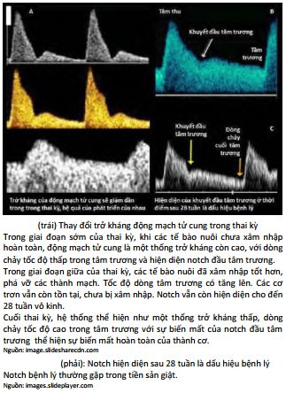
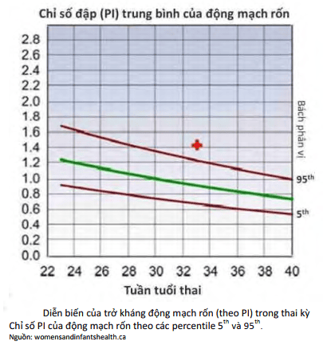

Trong sản khoa, khảo sát động học dòng chảy trong các mạch máu cho phép có ý niệm về trở kháng của các mạch máu được khảo sát, thông qua việc khảo sát tốc độ dòng chảy. Các trở kháng được thể hiện bằng nhiều cách. Phổ biến nhất là thể hiện bằng chỉ số kháng trở hoặc chỉ số Pourcelot. Khi đánh giá trở kháng, người ta thường dựa vào các chỉ số trở kháng được xác định theo các bách phân vị và so sánh với trở kháng của các mạch máu tương ứng khác. Các chỉ số thông dụng gồm:

- **S:** Peak systolic velocity, đỉnh tâm thu.
- **D:** End diastolic velocity, vận tốc cuối tâm trương.
- **RI:** Resistance Index, chỉ số kháng trở. RI = (S-D)/S.
- **PI:** Pulsatility Index, chỉ số đập. PI = (S-D)/A (với A = Vm, vận tốc trung bình).

## Doppler động mạch tử cung (UtA)

Siêu âm khảo sát động học dòng chảy động mạch tử cung (Uterine artery - UtA) bằng Doppler là phương pháp không xâm lấn đánh giá trở kháng của các mạch máu cung cấp cho bánh rau. Trong thai kỳ bình thường, động mạch tử cung có trở kháng thấp. Tăng vận tốc dòng chảy và giảm trở kháng của hệ thống động mạch tử cung là đặc điểm phổ Doppler bình thường.

Bánh rau phát triển sâu vào màng rụng của tử cung. Các nguyên bào nuôi xâm nhập, tấn công các động mạch xoắn, và biến những mạch máu này thành những shunt (cầu nối giữa tiểu động mạch và tiểu tĩnh mạch). Sự hiện diện các shunt tại các hồ máu đã triệt tiêu trở kháng của hệ thống động mạch tử cung. Hình thành các shunt là điều kiện tiên quyết cho tưới máu nuôi dưỡng bào thai. Thai kỳ càng tiến triển, sự xâm nhập của tế bào nuôi càng mãnh liệt, dẫn đến trở kháng động mạch tử cung giảm dần do cấu trúc cơ thành tiểu động mạch bị phá hủy.

Trong thai kỳ bệnh lý, động mạch tử cung có trở kháng cao với sự tồn tại của khuyết đầu tâm trương (notch). Trong các thai kỳ có bệnh lý, như tăng huyết áp hay thai chậm tăng trưởng trong tử cung, tế bào nuôi không xâm nhập hoàn toàn vào hệ thống mạch máu màng rụng. Các mạch máu không bị phá hủy hoàn toàn, giữ khẩu kính rất hẹp, làm cho trở kháng động mạch tử cung không giảm.

_Hình ảnh "Thay đổi của Doppler động mạch tử cung"_.

Khảo sát động học dòng chảy bằng Doppler có giá trị dự báo cao khi thực hiện trên dân số nguy cơ cao với biến chứng liên quan đến suy yếu bánh rau (như tăng huyết áp mãn tính, thai chậm tăng trưởng). Thời điểm khảo sát là khoảng 17-22 tuần tuổi thai, đồng thời với siêu âm hình thái. Nếu Doppler bất thường, nên thực hiện thêm xét nghiệm alpha-fetoprotein và free β-hCG ở thời điểm thai dưới 18 tuần trong khuôn khổ triple test. Doppler động mạch tử cung nên được lặp lại ở tuần 24-26. Nếu bất thường tiếp tục tồn tại, quản lý thai kỳ nên được chuyển về các trung tâm chăm sóc chuyên biệt. Nếu trở kháng động mạch tử cung cao bất thường và/hoặc có ngấn tiền tâm trương sau 26 tuần, nguy cơ tăng huyết áp thai kỳ và thai chậm tăng trưởng tăng cao gấp 4 đến 8 lần.

_Hình ảnh "PI trung bình của động mạch tử cung"_.

_Bảng "Chỉ định Doppler động mạch tử cung tuần 17-22"_.

| Chỉ định Doppler động mạch tử cung tuần 17-22 | Các chỉ định siêu âm Doppler khảo sát dòng chảy động mạch tử cung lúc thai 17-22 tuần                                                                                                                                        |
| --------------------------------------------- | ---------------------------------------------------------------------------------------------------------------------------------------------------------------------------------------------------------------------------- |
| **Tiền căn thai kỳ trước**                    | - Tăng huyết áp thai kỳ với khởi phát thai kỳ sớm - Nhau bong non - Thai chậm tăng trưởng trong tử cung - Chết chu sinh - Tăng huyết áp tồn tại trước khi mang thai - Tăng huyết áp thai kỳ                   |
| **Yếu tố nguy cơ cho thai kỳ lần này**        | - Bệnh thận tồn tại trước khi mang thai - Đái tháo đường type 1 lâu ngày với biến chứng mạch máu, bệnh cầu thận, bệnh lý võng mạc - Bất thường về huyết thanh tầm soát free β-hCG hoặc AFP > 2.0 MoM  - PAPP-A thấp |

Tầm soát bằng phổ Doppler động mạch tử cung được xem là bất thường khi chỉ số kháng trở (RI) > 0.57, chỉ số đập (PI) > bách phân vị 95th và/hoặc hiện diện notch ở động mạch tử cung.

## Doppler động mạch rốn (UmA)

Trong thai kỳ bình thường, động mạch rốn (Umbilical artery - UmA) có trở kháng thấp và giảm dần về cuối thai kỳ.

Lưu thông máu qua động mạch rốn thai nhi đặc trưng bởi dòng chảy với trở kháng thấp, liên tục về phía bánh rau. Trên phổ Doppler, tỷ lệ vận tốc tâm thu và tâm trương (S/D) giảm dần theo tuổi thai. Động mạch rốn đổ vào các vi nhung mao của rau, hệ thống phát triển tăng dần theo tuổi thai. Tuổi thai càng lớn, các cấu trúc mạch máu trong bánh rau càng phân nhánh nhỏ dần làm giảm trở kháng của giường rau (placenta bed).

Không nên tầm soát thường quy bằng Doppler động mạch rốn ở thai kỳ khỏe mạnh, phát triển bình thường, do chưa chứng minh được lợi ích và có thể gây ảnh hưởng không mong muốn. Các bệnh lý như tăng huyết áp thai kỳ, thai chậm tăng trưởng trong tử cung dẫn đến suy thoái chức năng tuần hoàn rau thai, do kết tập tiểu cầu, lắng đọng fibrin và xơ hóa bánh rau. Điều này làm tăng trở kháng dòng chảy của tuần hoàn rốn. Các chỉ số Doppler bất thường như tăng tỷ lệ S/D, RI hoặc PI cao hơn bách phân vị 95th.

_Hình ảnh "PI trung bình của động mạch rốn"_.

Khảo sát dòng chảy động mạch rốn bằng Doppler nên được dùng để đánh giá chức năng tuần hoàn rau thai ở thai kỳ nghi ngờ suy yếu chức năng bánh rau (tăng huyết áp, thai chậm tăng trưởng).

Trở kháng động mạch rốn tăng cao có thể dẫn đến mất dòng chảy cuối tâm trương hoặc đảo ngược dòng chảy cuối tâm trương. Khi xuất hiện giảm, mất hoặc đảo ngược dòng chảy cuối tâm trương trên Doppler động mạch rốn, cần đánh giá kỹ lâm sàng để quyết định chấm dứt thai kỳ hoặc theo dõi chặt chẽ.

_Hỉnh ảnh "Vắng mặt dòng chảy trong tâm trương động mạch rốn"_.

_Hỉnh ảnh "Đảo ngược dòng chảy trong tâm trương động mạch rốn"_.

## Doppler động mạch não giữa (MCA)

Ở thai kỳ bình thường, trở kháng của động mạch não giữa (Middle Cerebral Artery - MCA) cao hơn động mạch rốn. Trong trường hợp thiếu O₂ trường diễn, hiện tượng giãn mạch não xảy ra, làm chỉ số trở kháng này đảo ngược.

Đỉnh tâm thu của động mạch não giữa liên quan chặt chẽ đến tình trạng thiếu máu nặng của bào thai (độ nhạy gần 100%). Khi thiếu máu mức độ trung bình hoặc nhẹ, độ dương giả sẽ tăng dần.

## Tài liệu tham khảo

- Trường ĐH Y Dược TP. HCM (2020) - _Team-based learning_
