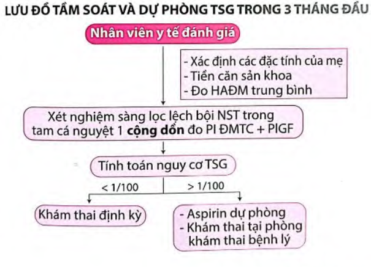

Thai kỳ với tăng huyết áp là 1 nhóm lớn các bệnh lý với bệnh sinh không thuần nhất, đòi hỏi các kế hoạch quản lý khác nhau.

## Cơ chế bệnh sinh

Giả thiết do nhiều nguyên nhân phối hợp dẫn tới tổn thương não, gan, thận và hệ thống mạch máu (tim, mắt):

1. Làm tổ bánh nhau với sự xâm nhập bất thường của các nguyên bào nuôi vào động mạch xoắn.
2. Sự không tương hợp giữa mẹ, bố (bánh nhau) và mô thai, Cơ thể mẹ thích nghi kém với những thay đổi về tim mạch và đáp ứng viêm trong thai kỳ.
3. Các yếu tố về di truyền.
4. Giả thuyết được chấp nhận nhiều nhất hiện nay là làm tổ bánh nhau với sự xâm nhập bất thường của các nguyên bào nuôi vào động mạch xoắn.

Bánh nhau đóng vai trò then chốt trong sự phát triển và thoái lui của tiền sản giật. Bánh nhau, không phải thai, là điều kiện cần trong sự phát triển tiền sản giật.

Mất cân bằng giữa yếu tố tân tạo và kháng tạo mạch giữ vai trò then chốt trong cơ chế bệnh sinh của tiền sản giật. Do đó khảo sát sFlt-1 và PlGF có thể giúp tiên đoán tiền sản giật. Khoảng 5 tuần trước khi tiền sản giật xuất hiện trên lâm sàng, tỷ số sFlt-1/PlGF tăng cao ở nhóm sau này bị tiền sản giật.

Nguồn gốc xuất hiện tiền sản giật bắt đầu từ bánh nhau nhưng cơ quan đích là các tế bào nội mô của mẹ dẫn đến:

- Huyết áp: Co mạch làm tăng huyết áp.
- Mạch máu: Tổn thương nội mô gây thoát quản các thành phần huyết tương và huyết cầu:
  - Cô đặc máu, tăng Hematocrit do mất đạm, giảm áp lực keo, nặng có thể gây sốc tim.
  - Tiêu thụ tiểu cầu ngoài lòng mạch.
- Gan: nhồi máu, hoại tử và xuất huyết trong nhu mô, gây rối loạn chức năng tế bào gan và làm tiến triển thêm các rối loạn đông máu.
- Thận: Tổn thương tế bào nội mô của thận làm tổn hại nghiêm trong chức năng lọc vi cầu thận. Độ lọc cầu thận giảm tới 40% so với bình thường, hệ quả là gây tăng creatinin máu, tăng acid uric máu và xuất hiện đạm niệu.
- Não: Tổn thương nội mô ở não gây các triệu chứng thần kinh, phù não và xuất huyết trong nhu mô não.

## Yếu tố nguy cơ

1 số yếu tố nguy cơ tăng huyết áp trong thai kỳ:

- Con so.
- Béo phì.
- Đa thai.
- Mẹ lớn tuổi (&gt; 35 tuổi).
- Tiền căn từng bị tiền sản giật trong lần mang thai trước.
- Tăng huyết áp mạn, đái tháo đường, bệnh thận, Lupus.
- Tiền sử gia đình có mẹ hoặc chị em gái bị tiền sản giật.

## Phân loại tăng huyết áp thai kỳ

:::caution[Tăng huyết áp trong thai kỳ phân thành 4 loại:]

1. Hội chứng tiền sản giật-sản giật = Tăng huyết áp + Đạm niệu + Từ tuần thứ 20 của thai kỳ.
2. Tăng huyết áp thai kỳ = Tăng huyết áp + Không đạm niệu + Từ tuần thứ 20 của thai kỳ và huyết áp trở về bình thường sau sinh.
3. Tăng huyết áp mạn (do bất cứ nguyên nhân nào) = Tăng huyết áp + Trước tuần thứ 20 của thai kỳ và kéo dài 12 tuần hậu sản.
4. Tiền sản giật ghép trên tăng huyết áp mạn = Tăng huyết áp mạn không đạm niệu + Từ tuần thứ 20 của thai kỳ có đạm niệu = Tăng huyết áp mạn có đạm niệu + Từ tuần thứ 20 có dấu hiệu tăng nặng (tăng thuốc điều trị, tăng men gan, giảm tiểu cầu, đau vụng vùng hạ sườn phải, phù phổi).

:::

## Chẩn đoán

:::note[Tiêu chuẩn chẩn đoán]

:::

### Phân loại tiền sản giật

Tiền sản giật được phân loại thành tiền sản giật không có dấu hiệu nặng và tiền sản giật có dấu hiệu nặng.

:::caution[Dấu hiệu nặng của tiền sản giật (bất kỳ dấu hiệu nào):]

1. Huyết áp tâm thu &ge; 160 mmHg hoặc huyết áp tâm trương &ge; 110 mmHg qua 2 lần đo cách nhau ít nhất 4 giờ khi sản phụ đã nghỉ ngơi (trừ trường hợp thuốc hạ áp đã được sử dụng trước đó).
2. Giảm tiểu cầu: tiểu cầu <100,000/µL.
3. Suy giảm chức năng gan: men gan tăng (gấp đôi so với bình thường), đau nhiều ở hạ sườn phải hoặc đau thượng vị không đáp ứng với thuốc và không có nguyên nhân khác.
4. Suy thận tiến triển (creatinin huyết thanh > 1.1 mg/dL hoặc gấp đôi nồng độ creatinin huyết thanh bình thường mà không do bệnh lý thận khác).
5. Phù phổi.
6. Các triệu chứng của não và thị giác: rối loạn thị giác (hoa mắt, ám điểm, mù vỏ não, co thắt mạch máu võng mạc); nhức đầu nhiều, nhức đầu dai dẳng, tăng lên, không đáp ứng thuốc giảm đau, thay đổi tri giác.

:::

### Tiên lượng tiền sản giật

Mốc 34 tuần để tiên lượng tiền sản giật. Tiền sản giật trước tuần 34 có tiên lượng xấu tăng tỷ lệ chết sơ sinh, chu sinh, phù phổi, sản giật, v.v.

### Sản giật

Sản giật là biến chứng nặng có thể sảy ra trước sinh, trong khi chuyển dạ và sau sinh 48-72 giờ.

Chẩn đoán sản giật đòi hỏi phải có sự hiện diện của **3 yếu tố (1) những cơn co giật và (2) hôn mê (3) xảy ra trên 1 sản phụ có hội chứng tiền sản giật.**

Sản giật có thể có dấu hiệu kích thích não như đau đầu nhiều, mờ tầm nhìn, sợ ánh sáng, thay đổi tâm trạng. Tuy nhiên cũng có trường hợp không có dấu hiệu báo trước (20-38%).

## Hội chứng HELLP

### Định nghĩa

Hội chứng HELLP là 1 biến chứng nặng của tiền sản giật và sản giật, thể hiện mọi đặc điểm của tổn thương nội mô đa cơ quan, đặc trưng bởi:

1. Tán huyết (Hemolysis).
2. Tăng men gan (Elevated Liver Enzyme).
3. Giảm tiểu cầu (Low Platelet Count).

Hội chứng HELLP không điển hình khi có 1 hoặc 2 triệu chứng trên.

### Chẩn đoán

:::note[Tiêu chuẩn chẩn đoán]
Lâm sàng:

- Xuất huyết dưới da, niêm mạc.
- Đau hạ sườn phải.

Cận lâm sàng:

- LDH > 600 IU/L.
- Bilirubin toàn phần > 12 mg/dL.
- AST > 70 IU/L.
- Giảm Haptoglobin.
  :::

## Biến chứng tăng huyết áp thai kỳ

Về phía mẹ:

- Sản giật.
- Hoại tử tế bào gan.
- Hội chứng HELLP.
- Suy thận.
- Phù não, xuất huyết não.
- Phù phổi cấp.
- Rau bong nong.
- Băng huyết sau sinh.

Về phía con:

- Tử vong chu sinh.
- Đẻ non.
- Thai chậm tăng trưởng trong buồng tử cung.

## Tầm soát và dự phòng tiền sản giật trong 3 tháng đầu

### Tầm soát

Tầm soát từ tuổi thai 11 tuần đến 13 tuần 6 ngày kết hợp với các yếu tố nguy cơ về nội khoa, miễn dịch, tiền căn sản khoa, sinh hóa, sinh lý, siêu âm Doppler động mạch tử cung.

- Dấu ấn sinh hóa sử dụng gồm PAPP-A, PIGF.
- Xác định đặc tính của mẹ:
  - Tuổi mẹ.
  - Chiều cao, cân nặng, BMI.
  - Chủng tộc.
  - Các thức thụ thai: Tự nhiên, dùng thuốc kích trứng, thụ tinh trong ống nghiệm.
  - Hút thuốc lá.
  - Mẹ thai phụ có tăng huyết áp.
- Tiền căn nội khoa:
  - Tăng huyết áp mạn.
  - Đái tháo đường type 1 hoặc type 2.
  - Lupus ban đỏ hệ thống.
  - Hội chứng kháng phospholipid.
- Tiền căn sản khoa: Con so (không có lần nào sinh con tuổi thai > 24 tuần), hoặc con rạ (ít nhất 1 lần sinh con tuổi thai > 24 tuần).
- Đo các chỉ số thai: Tuổi thai 11 tuần - 13 tuần 6 ngày (chiều dài đầu mông từ 45-84mm).
- Đo huyết áp động mạch trung bình: $HADMTT= \frac{HAtthu + 2 x HAttr}{3}$
- Tính nguy cơ tiền sản giật [dùng thuật toán của FMF (The Fetal Medicine Foundation)](https://fetalmedicine.org/research/assess/preeclampsia/first-trimester). Nguy cơ cao khi thuật toán xác định > 1/100.

### Dự phòng

WHO khuyến cáo dùng Aspirin liều thấp 81-162 mg/ngày, từ 1-2 viên (hàm lượng 81 mg) hoặc 1.5 gói hàm lượng 100 mg (uống trước khi đi ngủ, sau ăn 15-30 phút) để dự phòng tiền sản giật ở các phụ nữ có nguy cơ cao. Bắt đầu điều trị khi tính nguy cơ theo FMF > 1/100.

Theo ACOG, Aspirin nên được khởi động từ 12-28 tuần (tốt nhất trước 16 tuần) cho đến khi sinh.

Thời điểm ngừng sử dụng Aspirin là thai 36 tuần.

## Xử trí tiền sản giật và sản giật

Theo dõi huyết áp đến 72 giờ sau sinh cho tất cả các trường hợp và theo dõi huyết áp 7-10 ngày sau sinh tại địa phương.

### Tiền sản giật không có dấu hiệu nặng

Có thể theo dõi ngoại trú.

Không sử dụng thuốc chống tăng huyết áp, lợi tiểu hoặc thuốc an thần.

Nhập viện và chấm dứt thai kỳ khi:

- Thai &gt; 37 tuần, hoặc
- Nghi ngờ rau bong non, hoặc
- Thai &gt; 34 tuần và có bất kỳ triệu chứng sau:
  - Chuyển dạ hoặc vỡ ối.
  - Siêu âm ước lượng trọng lượng thai nhỏ hơn bách phân vị thứ 5.
  - Thiểu ối AFI < 5 cm ở 2 lần siêu âm liên tiếp cách nhau 24 giờ.

Nếu chưa có chỉ định chấm dứt thai kỳ có thể theo dõi nội trú hoặc ngoại trú:

- Thai:
  - Đếm cử động thai.
  - Siêu âm Doppler đánh giá tăng trưởng thai và lượng ối 1 lần/tuần.
  - Non-stress test (NST): 1 lần/tuần nếu mẹ bị tăng huyết áp, 2 lần/tuần nếu mẹ bị tiền sản giật.
- Mẹ:
  - Theo dõi huyết áp 2 lần/tuần.
  - Xét nghiệm công thức máu, Creatinin huyết thanh, LDH, AST, ALT 1-2 lần/tuần. Nếu tăng huyết áp thai kỳ cần xét nghiệm thêm đạm niệu.
- Chế độ ăn hợp lý: nhiều đạm, rau xanh, trái cây.
- Tư vấn các dấu hiệu nặng như nhìn mờ, đau đầu nhiều, đau thượng vị,...

### Tiền sản giật có dấu hiệu nặng

Sinh là biện pháp duy nhất để chấm dứt tình trạng tiền sản giật.

Chấm dứt thai kỳ khi tiền sản giật nặng xuất hiện trước 25 tuần hoặc bất cứ tuổi thai nào khi có:

- Phù phổi.
- Suy thận.
- Rau bong non.
- Giảm tiểu cầu.
- Đông máu nội mạch lan tỏa.
- Các triệu chứng dai dẳng.
- Non-stress test không đáp ứng (2 lần liên tiếp cách 4-6 giờ ở tuổi thai 28-32 tuần).
- Siêu âm Doppler động mạch rốn: mất hoặc đảo ngược sóng tâm trương.
- Thai lưu.

Điều trị mong đợi với thai < 34 tuần với tình trạng mẹ và thai ổn định, có thể tiếp tục theo dõi.

Liệu pháp Corticosteroids trước sinh khi thai &lt; 34 tuần. Tuy nhiên không đợi đủ thời gian mà chấm dứt thai kỳ ngay khi:

- Tăng huyết áp không kiểm soát được.
- Sản giật.
- Phù phổi.
- Rau bong non.
- Đông máu nội mạch lan tỏa.
- NST không đáp ứng.
- Hội chứng HELLP.
- Thai lưu.

Nếu tình trạng mẹ - thai ổn định, trong vòng 48 giờ chấm dứt thai kỳ khi có bất kỳ dấu hiệu sau:

- Vỡ ối.
- Chuyển dạ.
- Tiểu cầu < 100 G/L.
- Men gan tăng kéo dài (&gt; 2 lần bình thường).
- Thai chậm tăng trưởng trong tử cung (cân nặng nhỏ hơn bách phân vị thứ 5).
- Thiểu ối (AFI < 5 cm) (siêu âm 2 lần cách nhau 24 giờ).
- Bắt đầu suy thận hoặc suy thận nặng thêm.

:::caution[Lưu ý]

- Quyết định chấm dứt thai kỳ không dựa vào yếu tố đạm niệu.
- Chỉ định dùng thuốc chống tăng huyết áp khi HA tâm thu &gt; 150 mmHg hoặc HA tâm trương &gt; 100 mmHg.
- Mẹ:
  - Sinh hiệu mỗi giờ/lần.
  - Bilan dịch vào và ra mỗi 8 giờ/lần.
  - Dấu hiệu chuyển dạ.
  - Xét nghiệm bilan tiền sản giật 1-2 ngày hoặc sớm hơn tùy diễn biến nặng của tiền sản giật.
- Thai:
  - Đếm cử động thai mỗi ngày, NST 3 ngày/lần.
  - Theo dõi cân nặng và Doppler não/rốn mỗi tuần.
  - Phương pháp chấm dứt thai kỳ tùy thuộc tuổi thai, ngôi thai, cổ tử cung, tình trạng mẹ - thai.

:::

##### Khi xảy ra tình trạng nặng và tuổi thai dưới 23 tuần

Tính mạng của mẹ là quan trọng, tình trạng thai là không có hy vọng. Xử lý hợp lý nhất là chấm dứt thai kỳ để cứu mẹ. Do thai nhi (1) hầu như không có triển vọng sống, (2) thời gian chờ đợi đến khi có khả năng sống quá dài, (3) nếu sống cũng có khả năng khuyết tật cao, và (4) tình trạng mẹ không cho phép chờ đợi, nên xử lý hợp lý nhất là chấm dứt thai kỳ để cứu mẹ.

Chuyển dạ được khởi phát bằng prostaglandin E2 (PGE2) đặt âm đạo, theo sau bằng Oxytocin.

Trong trường đặc biệt là sản phụ không muốn chấm dứt thai, muốn giữ thai bằng mọi giá, thì có thể chấp nhận theo dõi tiếp nhưng phải tư vấn 1 cách chi tiết về nguy cơ rất cao của mẹ, dự hậu rất xấu của thai và tương lai bất định của trẻ.

##### Khi tuổi thai không quá non, từ 23-32 tuần 6 ngày

Trong giai đoạn này, mẹ vẫn ưu tiên hơn con.

Nếu quyết định kéo dài thai kỳ được đặt ra thì có thể cân nhắc Corticosteroid liệu pháp dự phòng suy hô hấp cấp và $MgSO_4$ liệu pháp dự phòng tổn thương não.

##### Khi tuổi thai từ 33-34 tuần 6 ngày

Cần cân nhắc tình trạng mẹ có cho phép kéo dài thêm 48 giờ cho Corticosteroid liệu pháp dự phòng suy hô hấp cấp hay không?

2 điều kiện tiên quyết để thực hiện Corticosteroids liệu pháp là (1) tình trạng mẹ phải đảm bảo cho việc kéo dài thai kỳ thêm 48 giờ mà không ảnh hưởng xấu đến mẹ, và (2) tình trạng tuần hoàn tử cung-nhau và dự trữ kiềm của con phải đảm bảo chịu đựng cuộc sống trong tử cung thêm 48 giờ.

##### Khi thai trên 34 tuần

Việc kéo dài thêm thai kỳ hoàn toàn không có lợi, mà chỉ dẫn đến làm tăng nguy cơ cho mẹ và con. Ở tuổi thai này, có thể chấm dứt thai kỳ vô điều kiện.

Thông thường, người ta cố gắng khởi phát chuyển dạ để chấm dứt thai kỳ. Chỉ nên mổ lấy thai trong trường hợp khởi phát chuyển dạ thất bại hoặc trong các trường hợp mà tính mạng mẹ hoặc thai đang nguy kịch, cần chấm dứt ngay. Thai phụ này có nguy cơ cao băng huyết sau sinh, và cũng dung nạp rất kém băng huyết sau sinh do không có sự tăng thỏa đáng của dự trữ thể tích máu trong thai kỳ, hậu quả của thoát mạch và cô đặc máu.

### Các trường hợp không mong đợi điều trị

Mẹ:

- THA nặng không kiểm soát được (HA tâm thu không đạt mục tiêu điều trị kéo dài, không đáp ứng với thuốc chống THA).
- Đau đầu dai dẳng, không đáp ứng thuốc giảm đau.
- Đau thượng vị hoặc hạ sườn (P) không đáp ứng thuốc giảm đau.
- Rối loạn thị giác, suy giảm vận động hoặc thay đổi cảm giác.
- Đột quỵ.
- Nhồi máu cơ tim.
- Hội chứng HELLP.
- Suy giảm chức năng thận mới khởi phát hoặc trầm trọng hơn (nồng độ Creatinine/huyết thanh > 1.1 mg/dL hoặc tăng gấp đôi nồng độ Creatinine huyết thanh).
- Phù phổi.
- Sản giật.
- Nghi ngờ rau bong non hoặc huyết âm đạo nhiều ở những trường hợp có rau tiền đạo.

Thai:

- Đánh giá sức khỏe thai bất thường.
- Thai lưu.
- Thai không có khả năng sống khi chẩn đoán tiền sản giật (dị tật, thai cực non,...)
- Đảo ngược sóng tâm trương động mạch rốn kéo dài.

Có thể ứng dụng tỷ số sFlt-1/PIGF trong tiền sản giật.

### Sản giật

Nguyên tắc:

- Phòng ngừa thiếu oxy và chấn thương (té ngã, cắn lưỡi).
- Điều trị tăng huyết áp và tiền sản giật.
- Phòng co giật tái phát.
- Cân nhắc các phương pháp chấm dứt thai kỳ.

#### Dự phòng co giật

Sử dụng $MgSO_4$ để dự phòng cơn giật. Liều tấn công 4-6 g $MgSO_4$ tiêm tĩnh mạch chậm. Duy trì 1-2 g $MgSO_4$ mỗi giờ trong chuyển dạ và sau sinh 12-24 giờ. Ngưng $MgSO_4$ sau sinh 24 giờ, hoặc trong trường hợp có biểu hiện ngộ độc $MgSO_4$. Chỉ dùng $MgSO_4$ cho tiền sản giật có biệu hiện nặng, [chi tiết tại đây](#magnesium-sulfate).

Trong tiền sản giật, không dùng Diazepam hay Pheyltoin. Khi được dùng trong tiền sản giật, chúng có hiệu quả kém, do sản giật là 1 bệnh lý mà cơ chế sinh co giật hoàn toàn khác với động kinh. Hơn nữa, chúng có thể có ảnh hưởng xấu trên thai nhi.

#### Khi có cơn sản giật

Đảm bảo đường thở và cung cấp dưỡng khí là hành động trước tiên:

- Trước tiên đặt cây ngáng lưỡi, hút đàm rãi, bảo đảm thông đường thở. Đặt sản phụ nằm đầu nghiêng, thở oxy 6-8 L/phút.
- Nên đo khí máu động mạch, điều chỉnh cân bằng kiềm toan, để theo dõi hiệu quả của tình trạng thông khí sau co giật.
- Cần mở đường truyền tĩnh mạch.

Co giật thường tự giới hạn. Không cần phải dùng đến các thuốc chống co giật:

- Dùng các thuốc chống co giật như Barbiturate hay các Zepam là không cần thiết, có thể gây khó khăn cho theo dõi sau sản giật.
- Chỉ có $MgSO_4$ là cần thiết trong trường hợp có sản giật.

Mục tiêu của điều trị $MgSO_4$ là để phòng ngừa các cơn co giật có khả năng sẽ xảy ra sau đó. Nếu sản phụ bị sản giật dù đang được truyền $MgSO_4$, cần tiêm tĩnh mạch chậm thêm 2-4 g $MgSO_4$ nữa, sau đó định lượng ion $Mg^{2+}$ trong máu. Nếu không đáp ứng với $MgSO_4$ (co giật sau 20 phút sau tiêm liều tải $MgSO_4$, sản giật tái phát &gt; 2 lần), có thể sử dụng Midazolam 1-2 mg (tĩnh mạch chậm) hoặc Lorazepan 4 mg (tĩnh mạch chậm), đặt nội khí quản và hỗ trợ thông khí. Trong trường hợp co giật không đáp ứng với $MgSO_4$, cân nhắc chụp CT hoặc MRI não vì đa số có bất thường hình ảnh não.

Cần đặt ống thông Foley để theo dõi chính xác lượng nuớc tiểu và đồng thời để giúp quyết định điều trị với $MgSO_4$. Nếu có thiểu niệu, cần truyền nhanh 1 L dung dịch Glucose 5% trong 30 phút. Cảnh giác với phù phổi khi truyền nhanh. Nếu bài niệu vẫn không cải thiện, có thể đã có hoại tử ống thận cấp. Trong trường hợp này, cần phải được chăm sóc tại chuyên khoa hồi sức tích cực nội khoa.

#### Sau cơn sản giật

Nếu mẹ có tăng huyết áp nhiều, thiểu niệu, dấu hiệu rối loạn về tim mạch thì nên cân nhắc đặt Catheter tĩnh mạch trung tâm.

Theo dõi liên tục điện tim bằng monitor. Sản giật thường làm nhịp tim thai thay đổi thoáng qua, thường tự giới hạn trong vòng 15 phút. Dấu hiệu lo ngại là khi biến động tim thai kéo dài hơn 20 phút mà chưa hồi phục. Điều này thể hiện hệ đệm của thai đã cạn kiệt, không còn đủ khả năng đệm khi đã xảy ra toan hô hấp. Nhịp tim thai chậm kéo dài 3-5 phút thường trong và sau cơn giật, nếu kéo dài > 5 phút cần mổ lấy thai cấp cứu.

Sản giật không phải chỉ định mổ lấy thai tuyệt đối, phương thức chấm dứt thai kỳ phụ thuộc vào tuổi thai, kiểu thế, tình trạng cổ tử cung, chỉ số Bishop,... Chỉ định chấm dứt thai kỳ thường phải được thực hiện trong vòng 12 giờ sau khi kiểm soát được sản giật. Khởi phát chuyển dạ bằng Oxytocin nếu tình trạng cổ tử cung thuận lợi. Mổ lấy thai là biện pháp thích hợp, do tránh được stress do qua trình chuyển dạ và rút ngắn được thời gian nguy cơ xảy ra các cơn giật kế tiếp. Khi mổ có thể gây mê toàn thân hoặc gây tê ngoài màng cứng với điều kiện là không có rối loạn đông máu. Không được dùng Ergot Alkaloids (Ergometrin) để dự phòng hay điều trị băng huyết sau sinh trong tiền sản giật vì chúng làm tăng nguy cơ co giật và tai biến mạch máu não.

### Hội chứng HELLP

Chấm dứt thai kỳ khi có chẩn đoán mà không đợi tác dụng của liệu pháp Corticosteroids.

## Thuốc điều trị

### Magnesium sulfate

$MgSO_4$ được dùng để phòng ngừa co giật. $MgSO_4$ làm cho co giật không thể xảy ra chứ không điều trị bệnh sinh của tiền sản giật. Tại các bản đệm thần kinh-cơ, ion $Mg^{2+}$ trong $MgSO_4$ cạnh tranh với ion $Ca^{2+}$, do đó ngăn cản co giật xuất hiện. $MgSO_4$ còn kích hoạt giãn mạch máu não, làm giảm thiếu máu cục bộ bởi sự co thắt mạch máu não trong cơn sản giật.

Chỉ định: Dự phòng và chống co giật trong tiền sản giật, hội chứng HELLP, sản giật.

Cách dùng: Truyền tĩnh mạch, tiêm tĩnh mạch hoặc tiêm bắp (ít dùng). Hiếm khi dùng $MgSO_4$ qua đường tiêm bắp do đau và có thể gây áp xe vùng chích.

Liều dùng:

- Liều tấn công: 4.5 g (4-6 g) $MgSO_4$ 15%/50 mL tiêm tĩnh mạch chậm.
- Liều duy trì 1g/giờ (1-2 g/giờ) truyền tĩnh mạch:
  - Pha 6 g $MgSO_4$ 15% vào chai Glucose 5% 500 mL truyền tĩnh mạch XXX giọt/phút hoặc
  - Bơm tiêm điện pha 6 g $MgSO_4$ 15% bơm tiêm điện 6.7 mL/giờ.

:::caution[Lưu ý]

- Luôn chú ý đến dấu ngộ độc $MgSO_4$ khi dùng. Trong điều trị, phải duy trì nồng độ ion $Mg^{2+}$ đạt ngưỡng điều trị, nhưng thấp hơn ngưỡng ngộ độc.
  
- Theo dõi phản xạ gân xương, nhịp thở (> 16 lần/phút), nước tiểu (> 100 mL/4 giờ). Khi nồng độ $Mg^{2+}$ bắt đầu vượt ngưỡng điều trị, dấu hiệu mất phản xạ gân xương bánh chè sẽ là dấu hiệu sớm nhất. Vì thế, cần theo dõi phản xạ gân xương bánh chè như 1 chỉ báo là nồng độ $Mg^{2+}$ đã vượt ngưỡng điều trị và cần phải ngưng ngay việc dùng thêm $MgSO_4$.
- Đo nồng độ $MgSO_4$ huyết thanh khi cần thiết và điều chỉnh giữ nồng độ $MgSO_4$ 4-7 mEg/L (5-9 mg/dL; 2-3.5 mmol/L).
- Người bệnh suy thận mức độ trung bình (Creatinine 1-1.5 mg/dL) hoặc thiểu niệu (< 30 mL nước tiểu/giờ trong 4 giờ) sau khi dùng liều tấn công cần duy trì liều thấp 1 g/giờ.
- Người suy thận cần định lượng $MgSO_4$ huyết thanh mỗi 4 giờ, nếu $MgSO_4$ huyết thanh > 9.6 mg/dL (8 mEg/L) cần ngưng truyền và định lượng $MgSO_4$ mỗi 2 giờ, tái dùng khi $MgSO_4$ < 8.4 mg/dL (7 mEq/L).
- Khi có chỉ định $MgSO_4$ cần dùng trước, trong và duy trì tối thiểu 24 giờ sau sinh/mổ, nếu chỉ định mổ lấy thai cần duy trì $MgSO_4$ trong lúc mổ.
- Nguy cơ băng huyết sau sinh, giảm dao động nội tại tim thai.
- Xử trí ngộ độc $MgSO_4$:
  - Ngừng truyền $MgSO_4$.
  - Dùng Calcium Gluconate 10% 10 mL, tiêm tĩnh mạch 1 g trong 10 phút.
  - Cân nhắc dùng Furosemide 80 mg để tăng đào thải $MgSO_4$.
  - Đặt nội khí quản và thông khí nếu có suy hô hấp, ngừng thở.

:::

### Thuốc chống tăng huyết áp

Mục tiêu: Giữ cho huyết áp ổn định ở mức 140-150/90-100 mmHg chứ không phải đưa huyết áp trở về bình thường vì việc đó sẽ dẫn tới giảm tưới máu tử cung-nhau, ảnh hưởng đến thai.

Chỉ định:

- Huyết áp tâm thu &ge; 150 mmHg
- hoặc Huyết áp tâm trương &ge; 100 mmHg

Huyết áp đạt sau điều trị:

- HA trung bình sau 2 giờ không giảm quá 25% so với ban đầu.
- HA tâm thu ở mức 130-150 mmHg.
- HA tâm trường ở mức 80-100 mmHg.

Chống chỉ định:

- Nitroprusside.
- Thuốc ức chế men chuyển.

Thuốc được sử dụng trong thai kỳ:

- Labetalol.
- Hydralazine.
- Ức chế Calcium như Nifedipine, Nicardipine.
- Methyldopa.

Nếu tăng huyết áp nặng dùng đường tiêm tĩnh mạch sau chuyển sang dạng uống.

#### Lợi tiểu và ức chế men chuyển

Thuốc lợi tiểu và thuốc ức chế men chuyển không được dùng để kiểm soát huyết áp trong điều trị tiền sản giật:

- Thuốc lợi tiểu làm giảm $Na^+$ và thể tích dịch lưu hành, dẫn đến suy giảm tuần hoàn tử cung-nhau. Nó chỉ được dùng khi có chỉ đặc biệt như suy thận-vô niệu trong sản giật hay hội chứng HELLP.
- Không dùng thuốc ức chế men chuyển do nguy cơ gây dị tật thai nhi.

#### Lợi tiểu quai Henlé: Furosemide

Thuốc lợi tiểu được dùng trong trường hợp tiền sản giật rất nặng với thiểu niệu/vô niệu/suy thận/phù phổi cấp, để cứu mẹ.

Sử dụng thuốc lợi tiểu được đặt ra trong trường hợp thiểu niệu hoặc vô niệu (nước tiểu 24 giờ < 800 mL, đặc biệt trong trường hợp nước tiểu 24 giờ < 400 mL), đe dọa phù phổi cấp, phù não, v.v.

Liều và cách dùng: Furosemid 20 mg x 8 ống, tiêm tĩnh mạch chậm.

Trong các trường hợp tiền sản giật rất nặng này, thai phụ thường có biểu hiện suy thận kèm Ure và Creatinin tăng và độ thanh thải của thận giảm. Khi đó, tính mạng của mẹ là ưu tiên và phải dùng thuốc để cứu thai phụ.

#### Thuốc hủy giao cảm: α-Methyldopa

α-Methyldopa là thuốc được xem là an toàn nhất trong suốt thai kỳ.

Cơ chế tác dụng của α-Methyldopa chưa được hiểu thấu đáo. Do thuốc ức chế dẫn truyền dopaminergic, nên gây ra tê liệt dẫn truyền thần kinh ngoại vi điều hòa giao cảm. Thuốc còn có tác dụng trung ương. Không hiệu quả trong các trường hợp cần hạ áp cấp cứu.

Liều lượng và cách dùng α-Methyldopa: Viên 250 mg khởi đầu 1-3 viên mỗi ngày, liều tối đa 8 viên mỗi ngày.

Tác dụng phụ: Trầm cảm, buồn ngủ, chóng mặt, thay đổi chức năng gan.

Chống chỉ định: Viêm gan cấp tính, mạn tính hoặc xơ gan, tiền sử viêm gan do thuốc, thiếu máu tán huyết, trầm cảm trầm trọng.

#### Thuốc tác dụng trực tiếp trên cơ trơn thành mạch: Hydralazin

Hydralazin thường là thuốc chống tăng huyết áp được lựa chọn đầu tay do đánh trực tiếp vào cơ chế bệnh sinh.

Cơ chế thuốc gây giãn mạch trực tiếp, tác động trên các tiểu động mạch ngoại vi, là xuất phát điểm của bệnh sinh của tiền sản giật. Tác dụng của Hydralazin nhanh và ngắn, huyết áp sẽ hạ sau 10-30 phút và kéo dài trong 2-4 giờ. Tác dụng ngoại ý khác là nhịp tim nhanh, đánh trống ngực, đau thắt ngực, bồn chồn, khó ngủ, tiêu chảy, táo bón, buồn nôn, nhức đầu, rối loạn tạo máu, nổi mẫn, ớn lạnh, v.v. Kết hợp Hydralazin và Labetalol là 1 kết hợp có thể khắc phục được các nhược điểm của Hydralazin.

Liều lượng và cách dùng: Hydralazin được dùng đường tiêm tĩnh mạch chậm với liều đầu 5 mg trong 1-2 phút, nếu sau 15-20 phút không đạt được hạ áp, cho 5-10 mg tĩnh mạch chậm tiếp. Nếu sau tổng liều 25 mg mà vẫn không kiểm soát được huyết áp thì nên dùng thuốc khác. Như vậy tổng liều tối đa không quá 25 mg.

Tác dụng không mong muốn: Quan trọng nhất là hạ huyết áp đột ngột có thể gây suy thai, hạ áp mẹ, đau đầu.

Chống chỉ định: Trong các trường hợp quá mẫn với Hydralazin, cũng như các bệnh lý mà thay đổi huyết động đột ngột có thể gây nguy hiểm như bệnh động mạch vành, van 2 lá do thấp, phình động mạch chủ cấp. Không dùng Hydralazin trong trường hợp có lupus ban đỏ.

#### Thuốc phong tỏa α, β Adrenergic: Labetalol

Thường được dùng chung với Hydralazin để bù trừ lại những tác dụng không mong muốn do giãn mạch nhanh và mạnh của Hydralazin.

Cơ chế của thuốc là ức chế thụ thể β giao cảm ở tim và mạch máu ngoại vi, do đó làm chậm nhịp tim và hạ huyết áp. Cơ chế này làm cho thuốc thường được dùng chung với Hydralazin. Thuốc bắt đầu tác dụng sau tiêm tĩnh mạch 5 phút, và mất 1-2 giờ để đạt nồng độ đỉnh trong máu. Labetalol có khởi phát tác dụng nhanh hơn và giảm nguy cơ bị nhịp nhanh so với Hydralazin.

Liều lượng và cách dùng: Liều boluses 10-20 mg sau đó 20-80 mg mỗi 10-30 phút (tối đa 300 mg), sau đó duy trì bằng đường uống 200 mg x 3 lần mỗi ngày, tối đa 800 mg trong 8 giờ. Sau 2-3 ngày điều trị, điều chỉnh tùy vào từng sản phụ, thường là 200-400 mg mỗi ngày.

Ít gây mạch nhanh, ít tác dụng phụ.

Chống chỉ định: Ở sản phụ suy tim sung huyết, hen suyễn và nhịp chậm xoang, block.

#### Thuốc ức chế kênh Calcium: Nifedipin và Nicardipin

Các chất chẹn kênh Calcium là thuốc dùng trong những trường hợp tăng huyết áp nặng.

##### Nifedipin

Cơ chế ức chế kênh Calcium loại 2, tức là ức chế chọn lọc dòng Calci đi vào trong cơ trơn mạch máu dẫn đến giãn mạch và hạ huyết áp. Nifedipin tác động trên cả các mạch máu trung bình, nên nó khởi phát tác dụng nhanh hơn Hydralazin.

Liều lượng và cách dùng: Liều điều trị của Nifedipin là 10-20 mg/20-30 phút (viên uống tác dụng nhanh), tối đa 50 mg. Sau đó 10-20 mg/2-6 giờ (tối đa không quá 180 mg mỗi ngày) để duy trì huyết áp ở mức mong muốn. Thời gian tác dụng sau 5-10 phút. Có thể dùng Nifedipin viên uống tác dụng kéo dài với liều 30-120 mg/ngày, khởi đầu với liều 30-60 mg x 01 lần/ngày, không dùng ngậm dưới lưỡi, tránh dùng khi có nhịp tim nhanh.

Tác dụng không mong muốn: Gồm tim đập nhanh, nhức đầu và hồi hộp.

Ion $Mg^{2+}$ có khả năng cạnh tranh với ion $Ca^{2+}$ nên phối hợp Nifedipin và $MgSO_4$ có thể dẫn đến tụt huyết áp.

##### Nicardipin

Cơ chế tác dụng của Nicardipin tương đối giống với Nifedipin như đã nói ở trên. Tác dụng chọn lọc lên mạch máu, đồng thời ít tác dụng lên co bóp tim, nên ít làm tăng nhịp tim phản xạ. Nicardipin có thời gian bắt đầu tác dụng khoảng 10 phút. Đạt nồng độ đỉnh sau 30-120 phút, tác dụng kéo dài 8 giờ.

Liều lượng và cách dùng: Uống 20 mg x 3 lần mỗi ngày. Hoặc truyền tĩnh mạch với liều bolus 0.5-1 mg, sau đó duy trì 1-3 mg/giờ (pha 1 ống Nicardipin 10 mL trong 40 mL dung dịch Glucose 5%, dùng bơm tiêm điện truyền với tốc độ 5-15 mL/giờ), chỉnh liều theo huyết áp sản phụ.

Tác dụng phụ: Đau đầu, chóng mặt, buồn nôn, nôn, đau dạ dày. Nicardipin ít qua sữa mẹ.

Chống chỉ định: của Nicardipin gồm cơn đau thắt ngực không ổn định hoặc cấp tính, sốc tim, hẹp van động mạch chủ giai đoạn muộn, thận trọng khi dùng trong 2 tam cá nguyệt đầu, có thể dùng trong tam cá nguyệt 3.

## Theo dõi sau sinh

Sau khi đã chấm dứt thai kỳ, nguy cơ xảy ra sản giật và hội chứng HELLP vẫn còn.

Nếu sản phụ đang dùng $MgSO_4$ thì điều trị này phải được tiếp tục kéo dài 12-24 giờ sau sinh.

Không nên kê toa thuốc kháng viêm không steroid để giảm đau hậu sản đối với sản phụ tiền sản giật nặng.

Tại thời điểm xuất viện, đa số sản phụ có huyết áp trở về trị số bình thường. Nếu huyết áp vẫn còn cao, cần duy trì thuốc chống tăng huyết áp, và đánh giá lại sau 1 tuần.

Theo dõi huyết áp ít nhất 12 tuần sau sinh, tư vấn nguy cơ tiền sản giật cho các lần có thai sau, cảnh báo nguy cơ tăng huyết áp mạn, bệnh tim mạch trong tương lai.

## Nguồn tham khảo

- TEAM-BASED LEARNING - Trường Đại học Y Dược Thành phố Hồ Chí Minh 2020.
- PHÁC ĐỒ ĐIỀU TRỊ SẢN PHỤ KHOA 2022 - Bệnh viện Từ Dũ.
