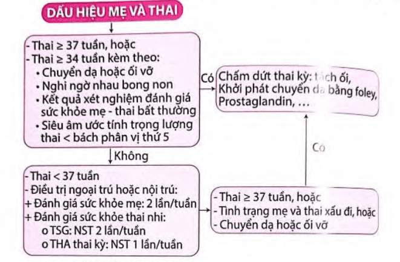
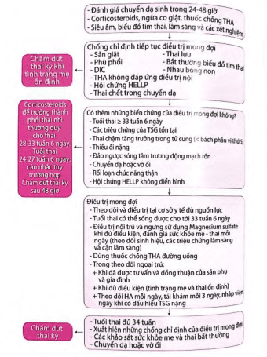

Thai kỳ với tăng huyết áp là nhóm lớn các bệnh lý với bệnh sinh không thuần nhất, đòi hỏi các kế hoạch quản lý khác nhau.

## Cơ chế bệnh sinh

Giả thiết do nhiều nguyên nhân phối hợp dẫn tới tổn thương não, gan, thận và hệ thống mạch máu (tim, mắt):

1. Làm tổ bánh rau với sự xâm nhập bất thường của các nguyên bào nuôi vào động mạch xoắn.
2. Sự không tương hợp giữa mẹ, bố (bánh rau) và mô thai. Cơ thể mẹ thích nghi kém với những thay đổi về tim mạch và đáp ứng viêm trong thai kỳ.
3. Các yếu tố di truyền.

> **Giả thuyết được chấp nhận nhiều nhất hiện nay:** Làm tổ bánh rau với sự xâm nhập bất thường của các nguyên bào nuôi vào động mạch xoắn.

Bánh rau đóng vai trò then chốt trong sự phát triển và thoái lui của tiền sản giật. **Bánh rau**, không phải thai, là điều kiện cần trong sự phát triển tiền sản giật.

Mất cân bằng giữa yếu tố tân tạo và kháng tạo mạch giữ vai trò then chốt trong cơ chế bệnh sinh của tiền sản giật. Do đó, khảo sát **sFlt-1** và **PlGF** có thể giúp tiên đoán tiền sản giật. Khoảng 5 tuần trước khi tiền sản giật xuất hiện trên lâm sàng, tỷ số **sFlt-1/PlGF** tăng cao ở nhóm sau này bị tiền sản giật.

> **Nguồn gốc** xuất hiện tiền sản giật bắt đầu từ **bánh rau**, nhưng **cơ quan đích** là các tế bào nội mô của mẹ dẫn đến:

- **Huyết áp:** Co mạch làm tăng huyết áp.
- **Mạch máu:** Tổn thương nội mô gây thoát quản các thành phần huyết tương và huyết cầu:
  - Cô đặc máu, tăng Hematocrit do mất đạm, giảm áp lực keo, nặng có thể gây sốc tim.
  - Tiêu thụ tiểu cầu ngoài lòng mạch.
- **Gan:** Nhồi máu, hoại tử và xuất huyết trong nhu mô, gây rối loạn chức năng tế bào gan và làm tiến triển thêm các rối loạn đông máu.
- **Thận:** Tổn thương tế bào nội mô của thận làm tổn hại nghiêm trọng chức năng lọc vi cầu thận. Độ lọc cầu thận giảm tới 40% so với bình thường, gây tăng creatinine máu, tăng acid uric máu và xuất hiện đạm niệu.
- **Não:** Tổn thương nội mô ở não gây các triệu chứng thần kinh, phù não và xuất huyết trong nhu mô não.

## Yếu tố nguy cơ

- Con so.
- Béo phì.
- Đa thai.
- Mẹ lớn tuổi (≥ 35 tuổi).
- Tiền căn từng bị tiền sản giật.
- Tăng huyết áp mạn, đái tháo đường, bệnh thận, Lupus.
- Tiền sử gia đình có mẹ hoặc chị em gái bị tiền sản giật.

## Phân loại tăng huyết áp thai kỳ

1. **Tiền sản giật – sản giật:** Tăng huyết áp + Đạm niệu + Từ tuần thứ 20 của thai kỳ.
2. **Tăng huyết áp thai kỳ:** Tăng huyết áp + Không đạm niệu + Từ tuần thứ 20 của thai kỳ và huyết áp trở về bình thường sau sinh.
3. **Tăng huyết áp mạn:** Trước tuần thứ 20 của thai kỳ và kéo dài 12 tuần hậu sản.
4. **Tiền sản giật ghép trên tăng huyết áp mạn:**
   - Tăng huyết áp mạn không đạm niệu + đạm niệu từ tuần thứ 20.
   - Hoặc tăng huyết áp mạn có đạm niệu + dấu hiệu nặng.

## Chẩn đoán

:::note[Tiêu chuẩn chẩn đoán tiền sản giật (ACOG Task Force 2013)]
| Tiêu chí | Chi tiết |
|---------------------|-------------------------------------------------------------------------------------------------------------------------------------------------------------------------------------------------------------|
| Huyết áp | - Huyết áp tâm thu ≥ 140 mmHg **HOẶC** huyết áp tâm trương ≥ 90 mmHg qua 2 lần đo cách nhau ít nhất 4 giờ, xuất hiện sau tuần thứ 20 của thai kỳ ở phụ nữ có huyết áp bình thường trước đó - Huyết áp tâm thu ≥ 160 mmHg **HOẶC** huyết áp tâm trương ≥ 110 mmHg (xác định trong khoảng thời gian ngắn và cần điều trị hạ áp ngay) |
| và | |
| Đạm niệu | - ≥ 300 mg/24 giờ (hoặc suy ra từ thời gian thu thập nước tiểu tương ứng) - Tỷ số Protein/creatinin ≥ 0.3 - Dip-Stick ≥ 1+ (chỉ dùng khi không có phương pháp định lượng khác) |

**Hoặc** trong trường hợp **không có đạm niệu**, tăng huyết áp mới xuất hiện kèm **ít nhất 1 trong các dấu hiệu sau**:

- **Giảm tiểu cầu**: Tiểu cầu < 100.000 /µL.
- **Suy thận**: Creatinin huyết thanh > 1.1 mg/dL hoặc gấp đôi nồng độ bình thường (không do bệnh lý thận khác).
- **Suy tế bào gan**: Men gan tăng gấp 2 lần bình thường.
- **Phù phổi**.
- **Triệu chứng não/thị giác**: Đau đầu dữ dội, rối loạn thị giác, co giật.
  :::

### Phân loại tiền sản giật

- **Không có dấu hiệu nặng.**
- **Có dấu hiệu nặng:** (chỉ cần một trong các dấu hiệu dưới đây)

  1. Huyết áp tâm thu ≥ 160 mmHg hoặc tâm trương ≥ 110 mmHg (đo 2 lần cách nhau ≥ 4h).
  2. Tiểu cầu < 100.000 /µL.
  3. Men gan tăng > 2 lần bình thường, đau hạ sườn phải/thượng vị không đáp ứng thuốc.
  4. Creatinine > 1.1 mg/dL hoặc tăng gấp đôi không do bệnh lý thận khác.
  5. Phù phổi.
  6. Triệu chứng thần kinh, thị giác: nhức đầu, mờ mắt, ám điểm, co thắt mạch máu võng mạc, thay đổi tri giác.

### Tiên lượng tiền sản giật

- **Trước 34 tuần:** tiên lượng xấu hơn — tử vong sơ sinh, phù phổi, sản giật…

### Sản giật

- Là biến chứng nặng có thể xảy ra **trước, trong khi chuyển dạ, hoặc 48–72 giờ sau sinh**
- Chẩn đoán:
  - Cơn **co giật** + **hôn mê**.
  - Xảy ra trên nền tiền sản giật.
- Có thể có dấu hiệu tiền triệu: đau đầu, mờ mắt, sợ ánh sáng, thay đổi cảm xúc.
- 20–38% không có dấu hiệu báo trước.

## Hội chứng HELLP

### Định nghĩa

Biến chứng nặng của tiền sản giật/sản giật, tổn thương nội mô đa cơ quan với:

1. Tán huyết (Hemolysis).
2. Tăng men gan (Elevated Liver Enzyme).
3. Giảm tiểu cầu (Low Platelet Count).

> HELLP không điển hình khi chỉ có 1–2 tiêu chí trên.

### Chẩn đoán

:::note[Tiêu chuẩn chẩn đoán hội chứng HELLP]
**Lâm sàng:**

- Xuất huyết dưới da, niêm mạc.
- Đau hạ sườn phải.

**Cận lâm sàng:**

- LDH > 600 IU/L.
- Bilirubin toàn phần > 12 mg/dL.
- AST > 70 IU/L.
- Giảm Haptoglobin.
  :::

## Biến chứng tăng huyết áp thai kỳ

**Mẹ:**

- Sản giật.
- Hoại tử tế bào gan.
- HELLP.
- Suy thận.
- Phù não, xuất huyết não.
- Phù phổi cấp.
- Rau bong non.
- Băng huyết sau sinh.

**Con:**

- Tử vong chu sinh.
- Đẻ non.
- Thai chậm tăng trưởng trong buồng tử cung.

## Xử trí tiền sản giật và sản giật

Theo dõi huyết áp đến 72 giờ sau sinh và tiếp tục theo dõi tại địa phương 7–10 ngày sau sinh.

### Tiền sản giật không có dấu hiệu nặng

- **Theo dõi ngoại trú.**
- Không dùng thuốc hạ áp, lợi tiểu hay an thần.
- **Nhập viện và chấm dứt thai kỳ nếu:**
  - Thai ≥ 37 tuần.
  - Nghi ngờ rau bong non.
  - Thai ≥ 34 tuần + 1 trong các yếu tố:
    - Chuyển dạ/vỡ ối.
    - Trọng lượng thai < bách phân vị 5.
    - Thiểu ối (AFI < 5 cm, 2 lần cách nhau 24 giờ).

:::note[Lưu đồ xử trí]

:::

### Tiền sản giật có dấu hiệu nặng

> **Sinh là biện pháp duy nhất để chấm dứt tiền sản giật.**

Chỉ định chấm dứt thai kỳ **bất kể tuổi thai** nếu:

- Phù phổi.
- Sản giật.
- HELLP.
- NST không đáp ứng.
- Thai lưu.
- Suy thận, giảm tiểu cầu, rau bong non…

> Có thể trì hoãn nếu thai < 34 tuần và mẹ - thai ổn định để sử dụng corticosteroids.

:::note[Lưu đồ xử trí]

:::

### Các trường hợp không mong đợi điều trị

**Mẹ:**

- THA nặng không kiểm soát.
- Đau đầu/thượng vị không đáp ứng.
- Rối loạn thị giác, đột quỵ, nhồi máu cơ tim.
- HELLP.
- Suy thận mới khởi phát.
- Sản giật.
- Phù phổi.
- Nghi ngờ rau bong non.

**Thai:**

- Đánh giá sức khỏe bất thường.
- Thai lưu.
- Thai không khả năng sống.
- Đảo ngược sóng tâm trương ĐM rốn.

## Sản giật

### Nguyên tắc

- Phòng ngừa thiếu oxy, chấn thương.
- Điều trị tăng huyết áp, phòng co giật.
- Xem xét chấm dứt thai kỳ.

### Dự phòng co giật

- **Magnesium sulfate (MgSO₄):**
  - Tấn công: 4–6 g TM chậm.
  - Duy trì: 1–2 g/h đến 24 giờ sau sinh
  - Ngưng khi có dấu hiệu ngộ độc.

> Không dùng Diazepam/Phenytoin vì không hiệu quả, có thể gây hại thai.

### Xử trí khi có cơn sản giật

1. **Bảo đảm đường thở, hô hấp**

   - Ngáng lưỡi để tránh tắc nghẽn.
   - Hút đàm nhớt nếu cần thiết.
   - Đặt bệnh nhân nằm nghiêng sang 1 bên.
   - Cho thở oxy 6–8 L/phút qua mặt nạ.

2. **Đặt đường truyền tĩnh mạch**

3. **Sử dụng Magnesium sulfate (MgSO₄)**

   - Thuốc chống co giật hiệu quả nhất, đồng thời giúp hạ huyết áp nhẹ.
   - **Liều dùng:**

     - **Liều tấn công:** 4–6 g tiêm tĩnh mạch chậm (trong 15–20 phút).
     - **Liều duy trì:** 1–2 g/giờ truyền tĩnh mạch liên tục.
     - Tiếp tục truyền tối thiểu 24 giờ sau cơn sản giật cuối cùng hoặc sau sinh.

   - **Theo dõi dấu hiệu ngộ độc Magnesium sulfate:**

     - Giảm phản xạ gân xương.
     - Suy hô hấp, nhịp thở < 12 lần/phút.
     - Giảm ý thức.
     - Nồng độ magie huyết > 8 mg/dL.

   - Nếu có dấu hiệu ngộ độc:
     - Ngừng truyền MgSO₄ ngay.
     - Truyền chậm **calcium gluconate** 10 mL 10% TM trong 10 phút để giải độc.

4. **Điều trị tăng huyết áp**

   - Mục tiêu giữ huyết áp tâm thu 140–155 mmHg, tâm trương 90–105 mmHg.
   - Thuốc thường dùng:
     - Methyldopa.
     - Nifedipin.
     - Labetalol (nếu có).

5. **Chấm dứt thai kỳ**

   - Sau khi ổn định mẹ, tiến hành sinh nhanh.
   - Phương pháp sinh tùy theo tình trạng mẹ và thai (thường là mổ lấy thai).

## Tóm tắt

| Chủ đề                       | Nội dung chính                                                              |
| ---------------------------- | --------------------------------------------------------------------------- |
| Cơ chế bệnh sinh             | Tổn thương bánh rau, mất cân bằng yếu tố tân tạo – kháng tạo mạch           |
| Phân loại tăng huyết áp      | Tăng huyết áp mạn, tăng huyết áp thai kỳ, tiền sản giật, sản giật           |
| Chẩn đoán tiền sản giật      | Huyết áp ≥ 140/90 mmHg, đạm niệu ≥ 300 mg/24 giờ hoặc 1+ trên que nước tiểu |
| Dấu hiệu nặng tiền sản giật  | Huyết áp ≥ 160/110 mmHg, giảm tiểu cầu, suy gan/thận, triệu chứng thần kinh |
| Hội chứng HELLP              | Hemolysis, tăng men gan, giảm tiểu cầu                                      |
| Xử trí tiền sản giật         | Theo dõi, chỉ định sinh khi có dấu hiệu nặng hoặc thai đủ tuổi              |
| Dự phòng & điều trị sản giật | Magnesium sulfate, kiểm soát huyết áp, bảo vệ mẹ và thai                    |

## Nguồn tham khảo

- Trường Đại học Y Dược TP. HCM (2020) – _Team-based learning_
- Bệnh viện Từ Dũ (2022) – _Phác đồ điều trị Sản Phụ khoa_
