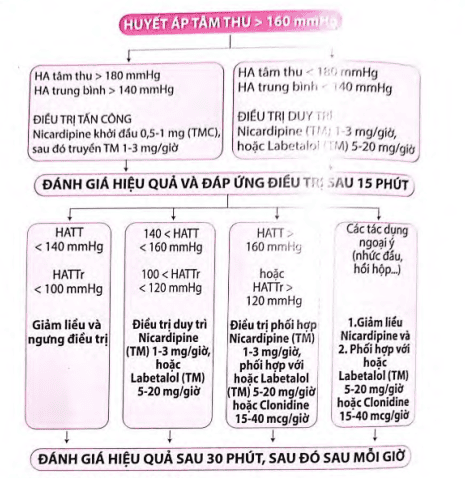

## Thuốc điều trị

### Magnesium sulfate

$MgSO_4$ được dùng để phòng ngừa co giật. $MgSO_4$ làm cho co giật không thể xảy ra chứ không điều trị bệnh sinh của tiền sản giật. Tại các bản đệm thần kinh-cơ, ion $Mg^{2+}$ trong $MgSO_4$ cạnh tranh với ion $Ca^{2+}$, do đó ngăn cản co giật xuất hiện. $MgSO_4$ còn kích hoạt giãn mạch máu não, làm giảm thiếu máu cục bộ bởi sự co thắt mạch máu não trong cơn sản giật.

Chỉ định: Dự phòng và chống co giật trong tiền sản giật, hội chứng HELLP, sản giật.

Cách dùng: Truyền tĩnh mạch, tiêm tĩnh mạch hoặc tiêm bắp (ít dùng). Hiếm khi dùng $MgSO_4$ qua đường tiêm bắp do đau và có thể gây áp xe vùng chích.

Liều dùng:

- Liều tấn công: 4.5g (4-6 g) $MgSO_4$ 15%/50mL tiêm tĩnh mạch chậm.
- Liều duy trì 1g/h (1-2g/h) truyền tĩnh mạch:
- Liều duy trì 1g/h (1-2g/h) truyền tĩnh mạch:
  - Pha 6g $MgSO_4$ 15% vào chai Glucose 5% 500mL truyền tĩnh mạch XXX giọt/phút hoặc
  - Bơm tiêm điện pha 6g $MgSO_4$ 15% bơm tiêm điện 6.7mL/h.
  - Bơm tiêm điện pha 6g $MgSO_4$ 15% bơm tiêm điện 6.7mL/h.

:::caution[Lưu ý]

- Luôn chú ý đến dấu ngộ độc $MgSO_4$ khi dùng. Trong điều trị, phải duy trì nồng độ ion $Mg^{2+}$ đạt ngưỡng điều trị, nhưng thấp hơn ngưỡng ngộ độc.
  
- Theo dõi phản xạ gân xương, nhịp thở (> 16 lần/phút), nước tiểu (> 100mL/4h). Khi nồng độ $Mg^{2+}$ bắt đầu vượt ngưỡng điều trị, dấu hiệu mất phản xạ gân xương bánh chè sẽ là dấu hiệu sớm nhất. Vì thế, cần theo dõi phản xạ gân xương bánh chè như chỉ báo là nồng độ $Mg^{2+}$ đã vượt ngưỡng điều trị và cần phải ngưng ngay việc dùng thêm $MgSO_4$.
- Đo nồng độ $MgSO_4$ huyết thanh khi cần thiết và điều chỉnh giữ nồng độ $MgSO_4$ 4-7 mEg/L (5-9mg/dL; 2-3.5mmol/L).
- Người bệnh suy thận mức độ trung bình (Creatinine 1-1.5mg/dL) hoặc thiểu niệu (< 30mL nước tiểu/h trong 4h) sau khi dùng liều tấn công cần duy trì liều thấp 1g/h.
- Người suy thận cần định lượng $MgSO_4$ huyết thanh mỗi 4h, nếu $MgSO_4$ huyết thanh >9.6mg/dL (8 mEg/L) cần ngưng truyền và định lượng $MgSO_4$ mỗi 2h, tái dùng khi $MgSO_4$ <8.4mg/dL (7 mEq/L).
- Khi có chỉ định $MgSO_4$ cần dùng trước, trong và duy trì tối thiểu 24h sau sinh/mổ, nếu chỉ định mổ lấy thai cần duy trì $MgSO_4$ trong lúc mổ.
- Người bệnh suy thận mức độ trung bình (Creatinine 1-1.5mg/dL) hoặc thiểu niệu (< 30mL nước tiểu/h trong 4h) sau khi dùng liều tấn công cần duy trì liều thấp 1g/h.
- Người suy thận cần định lượng $MgSO_4$ huyết thanh mỗi 4h, nếu $MgSO_4$ huyết thanh >9.6mg/dL (8 mEg/L) cần ngưng truyền và định lượng $MgSO_4$ mỗi 2h, tái dùng khi $MgSO_4$ <8.4mg/dL (7 mEq/L).
- Khi có chỉ định $MgSO_4$ cần dùng trước, trong và duy trì tối thiểu 24h sau sinh/mổ, nếu chỉ định mổ lấy thai cần duy trì $MgSO_4$ trong lúc mổ.
- Nguy cơ băng huyết sau sinh, giảm dao động nội tại tim thai.
- Xử trí ngộ độc $MgSO_4$:
  - Ngừng truyền $MgSO_4$.
  - Dùng Calcium Gluconate 10% 10mL, tiêm tĩnh mạch 1g trong 10 phút.
  - Cân nhắc dùng Furosemide 80mg để tăng đào thải $MgSO_4$.
  - Đặt nội khí quản và thông khí nếu có suy hô hấp, ngừng thở.

:::

### Thuốc chống tăng huyết áp

Mục tiêu: Giữ cho huyết áp ổn định ở mức 140-150/90-100mmHg chứ không phải đưa huyết áp trở về bình thường vì việc đó sẽ dẫn tới giảm tưới máu tử cung-rau, ảnh hưởng đến thai.

Chỉ định:

- Huyết áp tâm thu ≥150mmHg
- hoặc Huyết áp tâm trương ≥100mmHg
- Huyết áp tâm thu ≥150mmHg
- hoặc Huyết áp tâm trương ≥100mmHg

Huyết áp đạt sau điều trị:

- HA trung bình sau 2h không giảm quá 25% so với ban đầu.
- HA trung bình sau 2h không giảm quá 25% so với ban đầu.
- HA tâm thu ở mức 130-150mmHg.
- HA tâm trường ở mức 80-100mmHg.

Chống chỉ định:

- Nitroprusside.
- Thuốc ức chế men chuyển.

Thuốc được sử dụng trong thai kỳ:

- Labetalol.
- Hydralazine.
- Ức chế Calcium như Nifedipine, Nicardipine.
- Methyldopa.

Nếu tăng huyết áp nặng dùng đường tiêm tĩnh mạch sau chuyển sang dạng uống.

#### Lợi tiểu và ức chế men chuyển

Thuốc lợi tiểu và thuốc ức chế men chuyển không được dùng để kiểm soát huyết áp trong điều trị tiền sản giật:

- Thuốc lợi tiểu làm giảm $Na^+$ và thể tích dịch lưu hành, dẫn đến suy giảm tuần hoàn tử cung-rau. Nó chỉ được dùng khi có chỉ đặc biệt như suy thận-vô niệu trong sản giật hay hội chứng HELLP.
- Không dùng thuốc ức chế men chuyển do nguy cơ gây dị tật thai nhi.

#### Lợi tiểu quai Henlé: Furosemide

Thuốc lợi tiểu được dùng trong trường hợp tiền sản giật rất nặng với thiểu niệu/vô niệu/suy thận/phù phổi cấp, để cứu mẹ.

Sử dụng thuốc lợi tiểu được đặt ra trong trường hợp thiểu niệu hoặc vô niệu (nước tiểu 24h <800mL, đặc biệt trong trường hợp nước tiểu 24h <400mL), đe dọa phù phổi cấp, phù não, v.v.
Sử dụng thuốc lợi tiểu được đặt ra trong trường hợp thiểu niệu hoặc vô niệu (nước tiểu 24h <800mL, đặc biệt trong trường hợp nước tiểu 24h <400mL), đe dọa phù phổi cấp, phù não, v.v.

Liều và cách dùng: Furosemide 20mg x 8 ống, tiêm tĩnh mạch chậm.

Trong các trường hợp tiền sản giật rất nặng này, thai phụ thường có biểu hiện suy thận kèm Ure và Creatinine tăng và độ thanh thải của thận giảm. Khi đó, tính mạng của mẹ là ưu tiên và phải dùng thuốc để cứu thai phụ.

#### Thuốc hủy giao cảm: α-Methyldopa

α-Methyldopa là thuốc được xem là an toàn nhất trong suốt thai kỳ.

Cơ chế tác dụng của α-Methyldopa chưa được hiểu thấu đáo. Do thuốc ức chế dẫn truyền dopaminergic, nên gây ra tê liệt dẫn truyền thần kinh ngoại vi điều hòa giao cảm. Thuốc còn có tác dụng trung ương. Không hiệu quả trong các trường hợp cần hạ áp cấp cứu.

Liều lượng và cách dùng α-Methyldopa: Viên 250mg khởi đầu 1-3 viên mỗi ngày, liều tối đa 8 viên mỗi ngày.

Tác dụng phụ: Trầm cảm, buồn ngủ, chóng mặt, thay đổi chức năng gan.

Chống chỉ định: Viêm gan cấp tính, mạn tính hoặc xơ gan, tiền sử viêm gan do thuốc, thiếu máu tán huyết, trầm cảm trầm trọng.

#### Thuốc tác dụng trực tiếp trên cơ trơn thành mạch: Hydralazine

Hydralazine thường là thuốc chống tăng huyết áp được lựa chọn đầu tay do đánh trực tiếp vào cơ chế bệnh sinh.

Cơ chế thuốc gây giãn mạch trực tiếp, tác động trên các tiểu động mạch ngoại vi, là xuất phát điểm của bệnh sinh của tiền sản giật. Tác dụng của Hydralazine nhanh và ngắn, huyết áp sẽ hạ sau 10-30 phút và kéo dài trong 2-4h. Tác dụng ngoại ý khác là nhịp tim nhanh, đánh trống ngực, đau thắt ngực, bồn chồn, khó ngủ, tiêu chảy, táo bón, buồn nôn, nhức đầu, rối loạn tạo máu, nổi mẫn, ớn lạnh, v.v. Kết hợp Hydralazine và Labetalol là kết hợp có thể khắc phục được các nhược điểm của Hydralazine.

Liều lượng và cách dùng: Hydralazine được dùng đường tiêm tĩnh mạch chậm với liều đầu 5mg trong 1-2 phút, nếu sau 15-20 phút không đạt được hạ áp, cho 5-10mg tĩnh mạch chậm tiếp. Nếu sau tổng liều 25mg mà vẫn không kiểm soát được huyết áp thì nên dùng thuốc khác. Như vậy tổng liều tối đa không quá 25mg.

Tác dụng không mong muốn: Quan trọng nhất là hạ huyết áp đột ngột có thể gây suy thai, hạ áp mẹ, đau đầu.

Chống chỉ định: Trong các trường hợp quá mẫn với Hydralazine, cũng như các bệnh lý mà thay đổi huyết động đột ngột có thể gây nguy hiểm như bệnh động mạch vành, van 2 lá do thấp, phình động mạch chủ cấp. Không dùng Hydralazine trong trường hợp có lupus ban đỏ.

#### Thuốc phong tỏa α, β Adrenergic: Labetalol

Thường được dùng chung với Hydralazine để bù trừ lại những tác dụng không mong muốn do giãn mạch nhanh và mạnh của Hydralazine.

Cơ chế của thuốc là ức chế thụ thể β giao cảm ở tim và mạch máu ngoại vi, do đó làm chậm nhịp tim và hạ huyết áp. Cơ chế này làm cho thuốc thường được dùng chung với Hydralazine. Thuốc bắt đầu tác dụng sau tiêm tĩnh mạch 5 phút, và mất 1-2h để đạt nồng độ đỉnh trong máu. Labetalol có khởi phát tác dụng nhanh hơn và giảm nguy cơ bị nhịp nhanh so với Hydralazine.
Cơ chế của thuốc là ức chế thụ thể β giao cảm ở tim và mạch máu ngoại vi, do đó làm chậm nhịp tim và hạ huyết áp. Cơ chế này làm cho thuốc thường được dùng chung với Hydralazine. Thuốc bắt đầu tác dụng sau tiêm tĩnh mạch 5 phút, và mất 1-2h để đạt nồng độ đỉnh trong máu. Labetalol có khởi phát tác dụng nhanh hơn và giảm nguy cơ bị nhịp nhanh so với Hydralazine.

Liều lượng và cách dùng: Liều boluses 10-20mg sau đó 20-80mg mỗi 10-30 phút (tối đa 300mg), sau đó duy trì bằng đường uống 200mg x 3 lần mỗi ngày, tối đa 800mg trong 8h. Sau 2-3 ngày điều trị, điều chỉnh tùy vào từng sản phụ, thường là 200-400mg mỗi ngày.
Liều lượng và cách dùng: Liều boluses 10-20mg sau đó 20-80mg mỗi 10-30 phút (tối đa 300mg), sau đó duy trì bằng đường uống 200mg x 3 lần mỗi ngày, tối đa 800mg trong 8h. Sau 2-3 ngày điều trị, điều chỉnh tùy vào từng sản phụ, thường là 200-400mg mỗi ngày.

Ít gây mạch nhanh, ít tác dụng phụ.

Chống chỉ định: Ở sản phụ suy tim sung huyết, hen suyễn và nhịp chậm xoang, block.

#### Thuốc ức chế kênh Calcium: Nifedipine và Nicardipine

Các chất chẹn kênh Calcium là thuốc dùng trong những trường hợp tăng huyết áp nặng.

Nifedipine

Cơ chế ức chế kênh Calcium loại 2, tức là ức chế chọn lọc dòng Calcium đi vào trong cơ trơn mạch máu dẫn đến giãn mạch và hạ huyết áp. Nifedipine tác động trên cả các mạch máu trung bình, nên nó khởi phát tác dụng nhanh hơn Hydralazine.

Liều lượng và cách dùng: Liều điều trị của Nifedipine là 10-20mg/20-30 phút (viên uống tác dụng nhanh), tối đa 50mg. Sau đó 10-20mg/2-6h (tối đa không quá 180mg mỗi ngày) để duy trì huyết áp ở mức mong muốn. Thời gian tác dụng sau 5-10 phút. Có thể dùng Nifedipine viên uống tác dụng kéo dài với liều 30-120mg/ngày, khởi đầu với liều 30-60mg x 01 lần/ngày, không dùng ngậm dưới lưỡi, tránh dùng khi có nhịp tim nhanh.
Liều lượng và cách dùng: Liều điều trị của Nifedipine là 10-20mg/20-30 phút (viên uống tác dụng nhanh), tối đa 50mg. Sau đó 10-20mg/2-6h (tối đa không quá 180mg mỗi ngày) để duy trì huyết áp ở mức mong muốn. Thời gian tác dụng sau 5-10 phút. Có thể dùng Nifedipine viên uống tác dụng kéo dài với liều 30-120mg/ngày, khởi đầu với liều 30-60mg x 01 lần/ngày, không dùng ngậm dưới lưỡi, tránh dùng khi có nhịp tim nhanh.

Tác dụng không mong muốn: Gồm tim đập nhanh, nhức đầu và hồi hộp.

Ion $Mg^{2+}$ có khả năng cạnh tranh với ion $Ca^{2+}$ nên phối hợp Nifedipine và $MgSO_4$ có thể dẫn đến tụt huyết áp.

Nicardipine

Cơ chế tác dụng của Nicardipine tương đối giống với Nifedipine như đã nói ở trên. Tác dụng chọn lọc lên mạch máu, đồng thời ít tác dụng lên co bóp tim, nên ít làm tăng nhịp tim phản xạ. Nicardipine có thời gian bắt đầu tác dụng khoảng 10 phút. Đạt nồng độ đỉnh sau 30-120 phút, tác dụng kéo dài 8h.
Cơ chế tác dụng của Nicardipine tương đối giống với Nifedipine như đã nói ở trên. Tác dụng chọn lọc lên mạch máu, đồng thời ít tác dụng lên co bóp tim, nên ít làm tăng nhịp tim phản xạ. Nicardipine có thời gian bắt đầu tác dụng khoảng 10 phút. Đạt nồng độ đỉnh sau 30-120 phút, tác dụng kéo dài 8h.

Liều lượng và cách dùng: Uống 20mg x 3 lần mỗi ngày. Hoặc truyền tĩnh mạch với liều bolus 0.5-1mg, sau đó duy trì 1-3mg/h (pha 1 ống Nicardipine 10mL trong 40mL dung dịch Glucose 5%, dùng bơm tiêm điện truyền với tốc độ 5-15mL/h), chỉnh liều theo huyết áp sản phụ.
Liều lượng và cách dùng: Uống 20mg x 3 lần mỗi ngày. Hoặc truyền tĩnh mạch với liều bolus 0.5-1mg, sau đó duy trì 1-3mg/h (pha 1 ống Nicardipine 10mL trong 40mL dung dịch Glucose 5%, dùng bơm tiêm điện truyền với tốc độ 5-15mL/h), chỉnh liều theo huyết áp sản phụ.

Tác dụng phụ: Đau đầu, chóng mặt, buồn nôn, nôn, đau dạ dày. Nicardipine ít qua sữa mẹ.

Chống chỉ định: của Nicardipine gồm cơn đau thắt ngực không ổn định hoặc cấp tính, sốc tim, hẹp van động mạch chủ giai đoạn muộn, thận trọng khi dùng trong 2 tam cá nguyệt đầu, có thể dùng trong tam cá nguyệt 3.

## Nguồn tham khảo

- Trường Đại học Y Dược TP. HCM (2020) – _TEAM-BASED LEARNING_
- Bệnh viện Từ Dũ (2022) - _PHÁC ĐỒ ĐIỀU TRỊ SẢN PHỤ KHOA_
