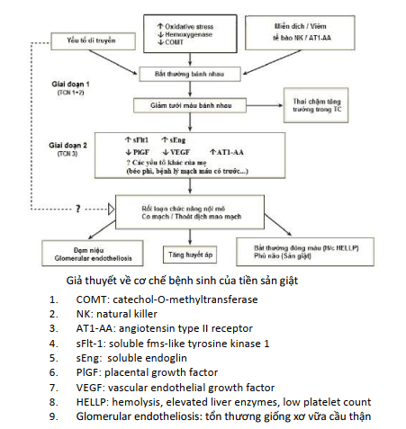

Thai kỳ với tăng huyết áp là nhóm lớn các bệnh lý với bệnh sinh không thuần nhất, đòi hỏi các kế hoạch quản lý khác nhau.

## Bệnh sinh

Giả thiết do nhiều nguyên nhân phối hợp dẫn tới tổn thương não, gan, thận và hệ thống mạch máu (tim, mắt):

- Làm tổ bánh rau với sự xâm nhập bất thường của các nguyên bào nuôi vào động mạch xoắn. **Giả thuyết này được chấp nhận nhiều nhất hiện nay.**
- Sự không tương hợp giữa mẹ, bố (bánh rau) và mô thai. Cơ thể mẹ thích nghi kém với những thay đổi về tim mạch và đáp ứng viêm trong thai kỳ.
- Các yếu tố di truyền.

Bánh rau đóng vai trò then chốt trong sự phát triển và thoái lui của tiền sản giật. **Bánh rau**, không phải thai, là điều kiện cần trong sự phát triển tiền sản giật.

_Hình ảnh "Sơ đồ cơ chế tăng huyết áp thai kỳ"_.

Mất cân bằng giữa yếu tố tân tạo và kháng tạo mạch giữ vai trò then chốt trong cơ chế bệnh sinh của tiền sản giật. Do đó, khảo sát **sFlt-1** và **PlGF** có thể giúp tiên đoán tiền sản giật. Khoảng 5 tuần trước khi tiền sản giật xuất hiện trên lâm sàng, tỷ số **sFlt-1/PlGF** tăng cao ở nhóm sau này bị tiền sản giật.

**Nguồn gốc** xuất hiện tiền sản giật bắt đầu từ **bánh rau**, nhưng **cơ quan đích** là các tế bào nội mô của mẹ dẫn đến:

- **Huyết áp:** Co mạch làm tăng huyết áp.
- **Mạch máu:** Tổn thương nội mô gây thoát quản các thành phần huyết tương và huyết cầu như cô đặc máu, tăng Hematocrit do mất đạm, giảm áp lực keo, nặng có thể gây sốc tim; Tiêu thụ tiểu cầu ngoài lòng mạch.
- **Gan:** Nhồi máu, hoại tử và xuất huyết trong nhu mô, gây rối loạn chức năng tế bào gan và làm tiến triển thêm các rối loạn đông máu.
- **Thận:** Tổn thương tế bào nội mô của thận làm tổn hại nghiêm trọng chức năng lọc vi cầu thận. Độ lọc cầu thận giảm tới 40% so với bình thường, gây tăng creatinine máu, tăng acid uric máu và xuất hiện đạm niệu.
- **Não:** Tổn thương nội mô ở não gây các triệu chứng thần kinh, phù não và xuất huyết trong nhu mô não.

## Yếu tố nguy cơ

- Con so.
- Béo phì.
- Đa thai.
- Mẹ lớn tuổi (≥ 35 tuổi).
- Tiền căn từng bị tiền sản giật.
- Tăng huyết áp mạn, đái tháo đường, bệnh thận, Lupus.
- Tiền sử gia đình có mẹ hoặc chị em gái bị tiền sản giật.

## Phân loại

1. **Tiền sản giật - sản giật:** Tăng huyết áp + Đạm niệu + Từ tuần thứ 20 của thai kỳ.
2. **Tăng huyết áp thai kỳ:** Tăng huyết áp + Không đạm niệu + Từ tuần thứ 20 của thai kỳ và huyết áp trở về bình thường sau sinh.
3. **Tăng huyết áp mạn:** Trước tuần thứ 20 của thai kỳ và kéo dài 12 tuần hậu sản.
4. **Tiền sản giật ghép trên tăng huyết áp mạn:** Tăng huyết áp mạn không đạm niệu + đạm niệu từ tuần thứ 20 hoặc Tăng huyết áp mạn có đạm niệu + dấu hiệu nặng.

## Tài liệu tham khảo

- Trường ĐH Y Dược TP. HCM (2020) - _Team-based learning_
- Bệnh viện Từ Dũ (2022) - _Phác đồ điều trị Sản Phụ khoa_
