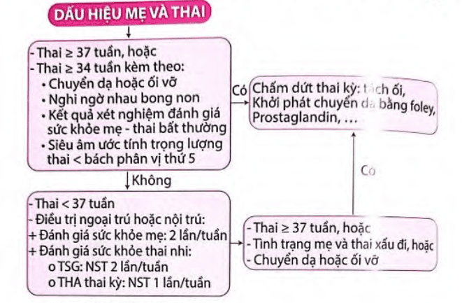

Tiền sản giật (Preeclampsia) là một rối loạn đặc trưng bởi tăng huyết áp và tổn thương các cơ quan (thường là thận) xuất hiện sau tuần thai thứ 20. Đây là một trong những biến chứng sản khoa nghiêm trọng, có thể ảnh hưởng cả mẹ và thai nhi nếu không được phát hiện, theo dõi và xử trí kịp thời.

## Chẩn đoán

:::note[Tiêu chuẩn chẩn đoán tiền sản giật]
Theo ACOG Task Force 2013, chẩn đoán tiền sản giật khi:

| Tiêu chí     | Chi tiết                                                                                                                                                                                                                                                                                                                              |
| ------------ | ------------------------------------------------------------------------------------------------------------------------------------------------------------------------------------------------------------------------------------------------------------------------------------------------------------------------------------- |
| **Huyết áp** | - Huyết áp tâm thu ≥ 140 mmHg **HOẶC** huyết áp tâm trương ≥ 90 mmHg qua 2 lần đo cách nhau ít nhất 4 giờ, xuất hiện sau tuần thứ 20 của thai kỳ ở phụ nữ có huyết áp bình thường trước đó - Huyết áp tâm thu ≥ 160 mmHg **HOẶC** huyết áp tâm trương ≥ 110 mmHg (xác định trong khoảng thời gian ngắn và cần điều trị hạ áp ngay) |
| và           |                                                                                                                                                                                                                                                                                                                                       |
| **Đạm niệu** | - ≥ 300 mg/24 giờ (hoặc suy ra từ thời gian thu thập nước tiểu tương ứng) - Tỷ số Protein/creatinin ≥ 0.3 - Dip-Stick ≥ 1+ (chỉ dùng khi không có phương pháp định lượng khác)                                                                                                                                                  |

**Hoặc** trong trường hợp **không có đạm niệu**, tăng huyết áp mới xuất hiện kèm **ít nhất 1 trong các dấu hiệu sau**:

- **Giảm tiểu cầu**: Tiểu cầu < 100,000 /µL.
- **Suy thận**: Creatinin huyết thanh > 1.1 mg/dL hoặc gấp đôi nồng độ bình thường (không do bệnh lý thận khác).
- **Suy tế bào gan**: Men gan tăng gấp 2 lần bình thường.
- **Phù phổi**.
- **Triệu chứng não/thị giác**: Đau đầu dữ dội, rối loạn thị giác, co giật.
  :::

## Phân loại

- **Không có dấu hiệu nặng.**
- **Có dấu hiệu nặng** (chỉ cần một trong các dấu hiệu dưới đây):
  1. Huyết áp tâm thu ≥ 160 mmHg hoặc tâm trương ≥ 110 mmHg (đo 2 lần cách nhau ≥ 4h).
  2. Tiểu cầu < 100,000 /µL.
  3. Men gan tăng > 2 lần bình thường, đau hạ sườn phải/thượng vị không đáp ứng thuốc.
  4. Creatinine > 1.1 mg/dL hoặc tăng gấp đôi không do bệnh lý thận khác.
  5. Phù phổi.
  6. Triệu chứng thần kinh, thị giác: Nhức đầu, mờ mắt, ám điểm, co thắt mạch máu võng mạc, thay đổi tri giác.

## Tiên lượng

- **Trước 34 tuần**: Tiên lượng xấu hơn — tử vong sơ sinh, phù phổi, sản giật...

## Biến chứng

### Với mẹ

- Sản giật.
- Hoại tử tế bào gan.
- HELLP.
- Suy thận.
- Phù não, xuất huyết não.
- Phù phổi cấp.
- Rau bong non.
- Băng huyết sau sinh.

### Với thai

- Tử vong chu sinh.
- Đẻ non.
- Thai chậm tăng trưởng trong buồng tử cung.

## Điều trị

- **Sinh là biện pháp duy nhất để chấm dứt tiền sản giật.**

### Không có dấu hiệu nặng

- **Theo dõi ngoại trú.**
- Không dùng thuốc hạ áp, lợi tiểu hay an thần.
- **Nhập viện và chấm dứt thai kỳ nếu**:
  - Thai ≥ 37 tuần.
  - Nghi ngờ rau bong non.
  - Thai ≥ 34 tuần + 1 trong các yếu tố:
    - Chuyển dạ/vỡ ối.
    - Trọng lượng thai < bách phân vị 5.
    - Thiểu ối (AFI < 5 cm, 2 lần cách nhau 24 giờ).

_Lưu đồ xử trí tiền sản giật không dấu hiệu nặng – Bệnh viện Từ Dũ._

### Có dấu hiệu nặng

Chỉ định chấm dứt thai kỳ **bất kể tuổi thai** nếu:

- Phù phổi.
- Sản giật.
- HELLP.
- NST không đáp ứng.
- Thai lưu.
- Suy thận, giảm tiểu cầu, rau bong non...

Có thể trì hoãn nếu thai < 34 tuần và mẹ - thai ổn định để sử dụng corticosteroids.

_Lưu đồ xử trí tiền sản giật có dấu hiệu nặng – Bệnh viện Từ Dũ._

Theo dõi huyết áp đến 72 giờ sau sinh và tiếp tục theo dõi tại địa phương 7–10 ngày sau sinh.

### Không chờ đợi điều trị

- **Với mẹ**:
  - THA nặng không kiểm soát.
  - Đau đầu/thượng vị không đáp ứng.
  - Rối loạn thị giác, đột quỵ, nhồi máu cơ tim.
  - HELLP.
  - Suy thận mới khởi phát.
  - Sản giật.
  - Phù phổi.
  - Nghi ngờ rau bong non.
- **Với thai**:
  - Đánh giá sức khỏe bất thường.
  - Thai lưu.
  - Thai không khả năng sống.
  - Đảo ngược sóng tâm trương ĐM rốn.

### Chống co giật (MgSO₄)

- **Cơ chế**:
  - Mg²⁺ cạnh tranh với Ca²⁺ tại bản đệm thần kinh–cơ, ngăn co giật.
  - Giãn mạch não, giảm thiếu máu cục bộ trong cơn sản giật.
- **Chỉ định**: Dự phòng/chống co giật trong tiền sản giật, hội chứng HELLP, sản giật.
- **Liều dùng**:
  - **Tấn công**: 4–6 g MgSO₄ 15% (50 mL) TM chậm (15–20 phút).
  - **Duy trì**: 1–2 g/giờ TM liên tục (pha 6 g MgSO₄ 15% vào 500 mL glucose 5% hoặc bơm tiêm điện 6.7 mL/h).
  - Tiếp tục ít nhất 24 giờ sau cơn cuối hoặc sau sinh.
- **Theo dõi**:

  - Theo dõi phản xạ gân xương (mất dấu hiệu sớm nhất), nhịp thở (> 16 lần/phút), nước tiểu (> 100 mL/4h).
  - Định lượng Mg²⁺ huyết thanh khi cần, giữ 4–7 mEq/L (5–9 mg/dL; 2–3.5 mmol/L).

    | Nồng độ Mg²⁺ trong máu (mEq/dL) | Biểu hiện lâm sàng                                                 |
    | ------------------------------- | ------------------------------------------------------------------ |
    | **1.5 - 3**                     | Nồng độ sinh lý bình thường                                        |
    | **4 - 6**                       | Ngưỡng điều trị (phòng ngừa/điều trị sản giật)                     |
    | **5 - 10**                      | Thay đổi trên điện tâm đồ (ECG): Kéo dài khoảng PR, QT, dẹt sóng T |
    | **8 - 12**                      | Mất phản xạ gân xương (phản xạ xương bánh chè)                     |
    | **10 - 12**                     | Rối loạn ý thức: Lơ mơ, nói lảm nhảm                               |
    | **15 - 17**                     | Liệt cơ hô hấp, suy hô hấp                                         |
    | **≥ 30**                        | Ngừng tim, tử vong                                                 |

    _Mối tương quan giữa nồng độ Magnesium máu và biểu hiện lâm sàng._

  - Suy thận (Creatinine 1–1.5 mg/dL) hoặc thiểu niệu (< 30 mL/h) → duy trì 1 g/h.
  - Ngộ độc (Mg > 8 mEq/L):
    1. Ngừng MgSO₄.
    2. 10 mL Calcium gluconate 10% TM trong 10 phút.
    3. Có thể cho Furosemide 80 mg.
    4. Hỗ trợ hô hấp, đặt NKQ nếu suy hô hấp.

### Chống tăng huyết áp

- **Mục tiêu**: HA duy trì 140–150/90–100 mmHg (không hạ quá nhanh để tránh giảm tưới máu tử cung–rau).
- **Chỉ định**:
  - HA tâm thu ≥ 150 mmHg.
  - HA tâm trương ≥ 100 mmHg.
- **Theo dõi điều trị sau 2 giờ**:
  - HA trung bình không giảm > 25%.
  - HA tâm thu 130–150 mmHg, tâm trương 80–100 mmHg.
- **Thuốc sử dụng**:

  - **Labetalol**.
  - **Hydralazine**.
  - **Chẹn kênh canxi**: Nifedipine, nicardipine.
  - **Methyldopa**.

- **Thuốc không được sử dụng**: Nitroprusside, thuốc ức chế men chuyển.

| Thuốc                | Cơ chế tác dụng                 | Ảnh hưởng                                                                                                                                                                                           |
| -------------------- | ------------------------------- | --------------------------------------------------------------------------------------------------------------------------------------------------------------------------------------------------- |
| **Alpha methyldopa** | Ức chế thụ thể Alpha trung ương | **Trên mẹ**: - Cung lượng tim và lưu lượng máu thận không thay đổi - Tác dụng phụ: Sốt, lơ mơ, viêm gan, thiếu máu tán huyết **Trên thai**: - An toàn tương đối, không ảnh hưởng rõ rệt |
| **Hydralazin**       | Giảm trở kháng mạch ngoại vi    | **Trên mẹ**: - Tăng cung lượng tim, đau đầu, nhịp tim nhanh, hội chứng giống Lupus **Trên thai**: - Lưu lượng máu thận không đổi hoặc tăng                                                 |
| **Propranolol**      | Ức chế thụ thể Beta             | **Trên mẹ**: - Giảm cung lượng tim, tăng co bóp tử cung **Trên thai**: - Giảm tưới máu nhau thai, nguy cơ suy hô hấp sơ sinh.                                                              |
| **Labetalol**        | Ức chế thụ thể Alpha và Beta    | **Trên mẹ**: - Run cơ, đau đầu - Chống chỉ định: Hen suyễn, suy tim **Trên thai**: - Nguy cơ suy hô hấp sơ sinh                                                                         |
| **Nifedipine**       | Ức chế kênh Canxi               | **Trên mẹ**: - Hạ huyết áp tư thế, đau đầu **Trên thai**: - Chưa ghi nhận tác dụng rõ rệt                                                                                                  |

_Phân loại thuốc chống tăng huyết áp trong thai kỳ._

#### α-Methyldopa

- **An toàn nhất** trong thai kỳ.
- **Liều dùng**: 250 mg x 1–3 lần/ngày; tối đa 2 g/ngày.
- **Tác dụng phụ**: Trầm cảm, buồn ngủ, chóng mặt, rối loạn gan.
- **Chống chỉ định**: Viêm/xơ gan, thiếu máu tán huyết, trầm cảm nặng.

#### Hydralazine

- **Cơ chế**: Giãn tiểu động mạch ngoại vi nhanh, hạ áp sau 10–30 phút, tác dụng kéo dài 2–4 giờ.
- **Liều dùng**: 5 mg (1–2 phút) TM chậm; nếu cần, 5–10 mg sau 15–20 phút; tối đa 25 mg.
- **Tác dụng phụ**: Nhịp nhanh, đánh trống ngực, đau đầu, hạ áp đột ngột → suy thai.
- **Chống chỉ định:** mẫn cảm, bệnh động mạch vành nặng, van 2 lá, lupus hoạt động.

#### Labetalol

- **Cơ chế**: Chẹn α, β giao cảm → chậm nhịp, hạ áp.
- **Liều dùng**:
  - Bolus TM 10–20 mg; nếu cần, 20–80 mg mỗi 10–30 phút (tối đa 300 mg).
  - **Duy trì uống**: 200 mg x 3 lần/ngày (tối đa 800 mg/8 h), điều chỉnh 200–400 mg/ngày.
- **Tác dụng phụ**: Ít nhịp nhanh phản xạ.
- **Chống chỉ định**: Suy tim, hen, block tim.

#### Nifedipine

- **Cơ chế**: Chẹn kênh Ca²⁺ loại L → giãn mạch nhanh hơn Hydralazine.
- **Liều dùng**:
  - Uống tác dụng nhanh 10–20 mg cách 20–30 phút (tối đa 50 mg).
  - **Duy trì**: 10–20 mg mỗi 2–6 h (tối đa 180 mg/ngày) hoặc viên tác dụng kéo dài 30–120 mg/ngày.
- **Tác dụng phụ**:
  - Nhịp nhanh, đau đầu, hồi hộp.
  - Phối hợp MgSO₄ có thể hạ áp quá mức.

#### Nicardipine

- **Cơ chế**: Tác dụng giống nifedipine, ít ảnh hưởng tim; bắt đầu sau 10 phút, đỉnh 30–120 phút, kéo dài 8 giờ.
- **Liều dùng**:
  - Uống 20 mg x 3 lần/ngày.
  - **TM**: Bolus 0.5–1 mg, duy trì 1–3 mg/h (pha 10 mL nicardipine vào 40 mL Glucose 5%, truyền 5–15 mL/h).
- **Tác dụng phụ**: đau đầu, chóng mặt, buồn nôn.
- **Chống chỉ định**: đau thắt ngực không ổn định, sốc tim, hẹp van ĐMC nặng; thận trọng 3 tháng đầu.

#### Lợi tiểu

- **Furosemide**: Chỉ dùng khi thiểu/vô niệu, phù phổi cấp; liều 20 mg TM chậm.
- **Không dùng lợi tiểu** thông thường do giảm tưới máu tử cung.
- **Dùng khi thiểu niệu** (< 800 mL/24 h, đặc biệt < 400 mL). Liều 20 mg TM chậm, có thể lặp lại theo đáp ứng.

#### Ức chế men chuyển

- **Không dùng ức chế men chuyển** do nguy cơ dị tật.

## Nguồn tham khảo

- Trường ĐH Y Dược TP. HCM (2020) – _Team-based learning_
- Bệnh viện Từ Dũ (2022) – _Phác đồ điều trị Sản Phụ khoa_
