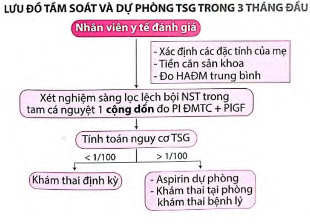

Việc tầm soát và dự phòng tiền sản giật là quan trọng để đảm bảo an toàn cho mẹ và thai nhi, vì tiền sản giật thường khởi phát âm thầm, nhưng có thể diễn tiến nhanh và gây hậu quả nghiêm trọng nếu không phát hiện sớm. Tầm soát tiền sản giật là quá trình xác định sớm nguy cơ từ tam cá nguyệt đầu tiên (trước 13 tuần) để có biện pháp can thiệp kịp thời.

**Tính nguy cơ** theo [thuật toán của FMF (The Fetal Medicine Foundation)](https://fetalmedicine.org/research/assess/preeclampsia/first-trimester). Nguy cơ cao khi > 1/100.

## Đánh giá nguy cơ

_Bảng "Đánh giá lâm sàng nguy cơ tiền sản giật"_.

| Đánh giá lâm sàng nguy cơ tiền sản giật | Yếu tố nguy cơ                                                                                                                                                                                                                                                               | Khuyến cáo                                                                  |
| --------------------------------------- | ---------------------------------------------------------------------------------------------------------------------------------------------------------------------------------------------------------------------------------------------------------------------------- | --------------------------------------------------------------------------- |
| **Cao**                                 | - Tiền sử tiền sản giật (đặc biệt kèm kết cục xấu) - Đa thai - Tăng huyết áp mạn tính - Đái tháo đường type 1/type 2 - Bệnh thận - Bệnh lý tự miễn (Lupus ban đỏ, hội chứng kháng Phospholipid)                                                               | **Khuyến cáo dùng aspirin liều thấp** khi có ≥ 1 yếu tố nguy cơ cao.        |
| **Trung bình**                          | - Con so - Béo phì (BMI > 30) - Tiền sử gia đình tiền sản giật (mẹ/chị em gái) - Kinh tế-xã hội thấp/người Mỹ gốc Phi - Sinh con nhẹ cân, thai tăng trưởng hạn chế trong tử cung - Kết cục xấu ở thai kỳ trước - Khoảng cách giữa 2 lần mang thai > 10 năm | **Khuyến cáo dùng aspirin liều thấp** khi có ≥ 2 yếu tố nguy cơ trung bình. |
| **Thấp**                                | - Thai kỳ trước đủ tháng không biến chứng                                                                                                                                                                                                                                    | **Không khuyến cáo dùng aspirin liều thấp.**                                |

## Dự phòng

**Aspirin liều thấp** (WHO khuyến cáo):

- 81-162 mg/ngày (1-2 viên 81 mg), uống buổi tối sau ăn 15-30 phút.
- Khởi trị khi nguy cơ FMF > 1/100.
- Tiếp tục đến tuần 36.

**Theo ACOG:**

- Khởi aspirin từ tuần 12-16, tối đa không muộn hơn 28 tuần.
- Dừng vào tuần 36.

_Lưu đồ tầm soát tiền sản giật 3 tháng đầu - Bệnh viện Từ Dũ_.

## Tài liệu tham khảo

- Trường ĐH Y Dược TP. HCM (2020) - _Team-based learning_
- Bệnh viện Từ Dũ (2022) - _Phác đồ điều trị Sản Phụ khoa_
