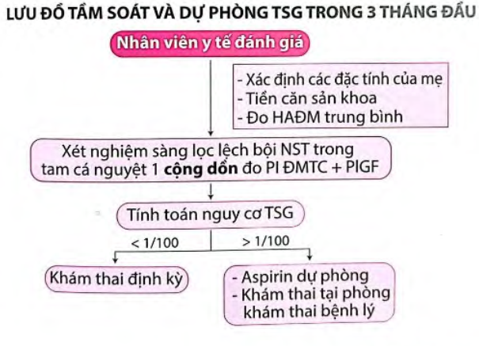

Việc tầm soát và dự phòng tiền sản giật là quan trọng để đảm bảo an toàn cho mẹ và thai nhi, vì tiền sản giật thường khởi phát âm thầm, nhưng có thể diễn tiến nhanh và gây hậu quả nghiêm trọng nếu không phát hiện sớm.

## Ý nghĩa của tầm soát

- **Phát hiện sớm nhóm nguy cơ cao:** Cho phép can thiệp kịp thời bằng Aspirin liều thấp trước 16 tuần, giúp giảm đến 70-80% nguy cơ tiền sản giật sớm (trước 34 tuần).
- **Phân loại quản lý:** Giúp bác sĩ có kế hoạch theo dõi sát sao hơn cho những sản phụ có nguy cơ.
- **Dự báo ngắn hạn:** Ở giai đoạn muộn (quý 2, quý 3), tầm soát giúp dự báo khả năng xuất hiện tiền sản giật trong vòng 1-4 tuần tới, từ đó có kế hoạch nhập viện hoặc chấm dứt thai kỳ an toàn.
- **Giảm biến chứng:** Giảm tỷ lệ tử vong và bệnh tật cho cả mẹ (sản giật, HELLP, suy thận) và thai (thai chậm tăng trưởng, sinh non).

## Tầm soát quý 1 (11 tuần – 13 tuần 6 ngày)

Đây là thời điểm **vàng** để tầm soát nhằm mục đích dự phòng.

**Phương pháp:** Tầm soát kết hợp theo [thuật toán của FMF (The Fetal Medicine Foundation)](https://fetalmedicine.org/research/assess/preeclampsia/first-trimester). Nguy cơ cao khi **> 1/100**.

Các yếu tố đánh giá bao gồm:

1.  **Yếu tố mẹ:** Tuổi, chiều cao, cân nặng, chủng tộc, tiền căn bản thân và gia đình, phương pháp thụ thai (IVF).
2.  **Huyết áp động mạch trung bình (MAP):** Đo ở cả hai tay theo quy trình chuẩn.
3.  **Chỉ số xung động mạch tử cung (UtPI):** Thực hiện qua siêu âm.
4.  **Dấu ấn sinh học:** Nồng độ **PlGF** (Placental Growth Factor) trong máu mẹ.

### Đánh giá nguy cơ theo lâm sàng

_Bảng "Đánh giá lâm sàng nguy cơ tiền sản giật"_.

| Nguy cơ        | Yếu tố nguy cơ                                                                                                                                                                                                    | Khuyến cáo                               |
| :------------- | :---------------------------------------------------------------------------------------------------------------------------------------------------------------------------------------------------------------- | :--------------------------------------- |
| **Cao**        | - Tiền sử tiền sản giật (đặc biệt kèm kết cục xấu) - Đa thai - Tăng huyết áp mạn tính - Đái tháo đường type 1/type 2 - Bệnh thận - Bệnh lý tự miễn (Lupus, hội chứng kháng Phospholipid)           | **Aspirin liều thấp** khi có ≥ 1 yếu tố. |
| **Trung bình** | - Con so - Béo phì (BMI > 30) - Tiền sử gia đình (mẹ/chị em gái bị TSG) - Kinh tế-xã hội thấp - Sinh con nhẹ cân/SGA thai kỳ trước - Kết cục xấu thai kỳ trước - Khoảng cách mang thai > 10 năm | **Aspirin liều thấp** khi có ≥ 2 yếu tố. |
| **Thấp**       | - Thai kỳ trước đủ tháng không biến chứng                                                                                                                                                                         | Không khuyến cáo Aspirin.                |

## Tầm soát quý 2 và quý 3 (Từ 20 tuần)

Ở giai đoạn này, mục tiêu chính là **tiên đoán và chẩn đoán phân biệt** hơn là dự phòng.

**Dấu ấn sử dụng:** Tỷ số **sFlt-1/PlGF** (Yếu tố kháng tạo mạch/Yếu tố tân tạo mạch).

| Tỷ số sFlt-1/PlGF                                             | Ý nghĩa và xử trí                                                                                                                              |
| :------------------------------------------------------------ | :--------------------------------------------------------------------------------------------------------------------------------------------- |
| **< 38**                                                      | **Nguy cơ thấp:** Loại trừ khả năng xuất hiện tiền sản giật trong vòng **1 tuần** tới (giá trị tiên đoán âm > 99%). Có thể theo dõi ngoại trú. |
| **38 - 85** (thai < 34 tuần) **38 - 110** (thai ≥ 34 tuần) | **Nguy cơ trung bình:** Theo dõi sát lâm sàng và xét nghiệm. Có khả năng xuất hiện tiền sản giật trong vòng 4 tuần.                            |
| **> 85** (thai < 34 tuần) **> 110** (thai ≥ 34 tuần)       | **Nguy cơ cao:** Khả năng cao đang có tiền sản giật hoặc sẽ xuất hiện rất sớm. Cần nhập viện theo dõi chặt chẽ.                                |

## Dự phòng

**Aspirin liều thấp:**

- **Liều lượng:** 81 - 150 mg/ngày (thường dùng 100mg hoặc 150mg tùy phác đồ).
- **Thời điểm uống:** Buổi tối trước khi đi ngủ (giúp hạ áp hiệu quả hơn).
- **Thời gian bắt đầu:** Tốt nhất là tuần **12 - 16**, muộn nhất là trước 28 tuần. Tuy nhiên, hiệu quả nhất là bắt đầu **trước 16 tuần**.
- **Thời gian dừng:** Tuần 36 của thai kỳ.

**Bổ sung Canxi:** 1.5 - 2g/ngày cho những sản phụ có chế độ ăn thiếu Canxi (giúp giảm nguy cơ tiền sản giật).

_Hình ảnh "Lưu đồ tầm soát tiền sản giật 3 tháng đầu - Bệnh viện Từ Dũ"_.

## Tài liệu tham khảo

- Trường ĐH Y Dược TP. HCM (2020) - _Team-based learning_
- Bệnh viện Từ Dũ (2022) - _Phác đồ điều trị Sản Phụ khoa_
- Fetal Medicine Foundation (FMF)
