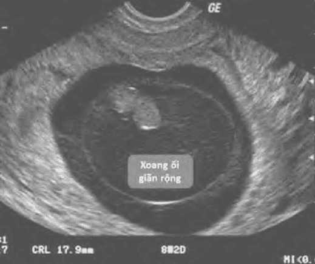

Thai nghén thất bại sớm (Early Pregnancy Failure) (EPL) thường được biết dưới dạng thức trứng trống, hay thai ngưng phát triển.

## Khái niệm cơ bản

Khái niệm thai sinh hóa (biochemical pregnancy) dùng để chỉ các tình trạng có hiện diện đơn độc β-hCG trong huyết thanh, mà không kèm theo bất cứ dấu hiệu chắc chắn nào khác nào khác của có thai. Trong thai sinh hóa, trứng thụ tinh đã hoàn tất các giai đoạn sớm của tiến trình làm tổ, gồm xâm nhập màng rụng, tiếp cận mạch máu màng rụng, phá vỡ các cấu trúc mạch máu màng rụng, thiết lập các cấu trúc hồ máu sơ khai. Thai sinh hóa là phạm trù liên quan đến làm tổ.

Khái niệm thai lâm sàng (clinical pregnancy) dùng để chỉ các thai kỳ được nhận diện qua khám lâm sàng hay qua khảo sát hình ảnh. Thai sinh hóa có thể tiếp tục phát triển bình thường và trở thành thai lâm sàng. Thai lâm sàng có thể tiếp tục tiến triển thành công và kết cục bằng trẻ sinh sống (live birth). Hoặc thai lâm sàng có thể gặp thất bại trong việc tiếp tục tiến triển, được gọi là thai nghén thất bại sớm. Thai lâm sàng liên quan đến phát triển phôi sau làm tổ.

Khái niệm trứng trống (blighted ovum), còn gọi là trứng không phôi, chỉ sự hiện diện của túi thai nhưng bên trong túi thai này không chứa phôi thai.

Khái niệm thai ngưng phát triển sớm chỉ sự hiện diện của túi thai với phôi thai nhìn thấy trên hình ảnh, nhưng không có biểu hiện của sinh tồn trứng (vitality), tức không có tim thai.

Khái niệm thai nghén thất bại sớm này không bao gồm tình trạng thai sinh hóa.

## Chẩn đoán

Triệu chứng lâm sàng nói chung của thai nghén thất bại sớm thường là ra huyết âm đạo và đau bụng âm ỉ.

:::note[Tiêu chuẩn chẩn đoán thai nghén thất bại sớm theo The Society of Radiologists in Ultrasound Multispecialty Panel]
Khuyến cáo các phát hiện chẩn đoán thai kỳ thất bại khi siêu âm qua đường âm đạo bao ít nhất 1 trong các tiêu chuẩn sau:

1. Chiều dài từ đỉnh đầu đến mông (CRL) ≥7mm mà không có tim thai.
2. Đường kính túi trung bình (MSD) ≥25mm mà không có phôi.
3. Không có phôi có nhịp tim ≥14 ngày sau khi siêu âm cho thấy túi thai không có túi noãn hoàng (york-sac).
4. Không có phôi có nhịp tim ≥11 ngày sau khi siêu âm cho thấy túi thai có túi noãn hoàng.

:::

Tiêu chuẩn rõ ràng nhất là CRL ≥7mm và không thấy hoạt động tim thai. Không được kết luận thai nghén thất bại sớm khi
không thấy hoạt động tim thai nhưng CRL chưa đủ 7mm.

_Thai ngưng phát triển được xác định khi siêu âm có hình ảnh túi thai, bên trong có phôi thai với CRL ≥7mm không hoạt động tim phôi. Hoạt động tim thai phải được xác nhận bằng phổ Doppler (phía dưới)._

So với tiêu chuẩn theo CRL, thì tiêu chuẩn dùng để xác định trứng trống là kém rõ ràng hơn. Trong thai kỳ bình thường, chỉ quan sát thấy hình ảnh của yolk-sac và của phôi vài ngày sau khi thấy hình ảnh túi thai. Do đó, hiện diện của túi thai chưa có yolk-sac hay phôi là chưa đủ mạnh để xác lập chẩn đoán trứng trống. Phải có thêm các tiêu chuẩn để hạn chế sai sót trong chẩn đoán trứng không phôi. Không được kết luận trứng trống khi không thấy hiện diện của cả yolk-sac lẫn phôi thai nhưng MSD chưa đủ 25mm.

_Trứng trống (trứng không phôi) (blighted ovum). Chẩn đoán trứng trống được xác lập khi không thấy hiện diện của cả yolk-sac lẫn phôi thai khi MSD đã đạt được kích thước ≥25mm._

Các tình huống khác nhau có thể thấy:

1. Có phôi thai CRL <7mm, không hoạt động tim phôi.
2. MSD 16-24mm và không có phôi thai.
3. Không thấy phôi thai với hoạt động tim phôi trong vòng 7-10 ngày, được tính từ thời điểm có siêu âm xác nhận đã có túi thai và có yolk-sac.
4. Không có hình ảnh của phôi thai sau 6 tuần hoặc hơn, kể từ ngày kinh cuối.
5. Không có màng ối.
6. Yolk-sac giãn rộng >7mm.
7. Túi thai nhỏ so với CRL (hiệu MSD và CRL <5mm).

Khi đó, chỉ được phép nghi ngờ khả năng xảy ra tình trạng này, và phải chờ xác nhận ở các lần kiểm tra sau.

The National Institute for Health and Clinical Excellence khuyến cáo "Nếu nghi ngờ thai kỳ thất bại, hãy thực hiện siêu âm lần thứ hai tối thiểu 7 ngày sau lần siêu âm đầu tiên trước khi đưa ra chẩn đoán".

## Các dạng thai nghén thất bại sớm

Thai nghén thất bại sớm có thể được phân ra:

- Thai chết lưu (missed miscarriage).
- Dọa sẩy thai lưu (threatened miscarriage).
- Sẩy thai khó tránh (inevitable miscarriage).
- Sẩy thai không trọn (incomplete miscarriage).
- Sẩy thai trọn (complete miscarriage).

### Thai lưu

Thuật ngữ thai lưu là thuật ngữ thể hiện sự lưu lại trong buồng tử cung của thai đã được xác định rằng đã ngừng phát triển.

:::note[Tiêu chuẩn chẩn đoán thai lưu]

Siêu âm xác nhận thai lưu khi:

1. CRL ≥7mm và không thấy hoạt động tim thai.
2. MSD ≥25mm và không thấy phôi thai.
3. Không thấy phôi sau 14 ngày mà trước đó đã được siêu âm xác nhận đã có túi thai không có yolk-sac.
4. Xác nhận tình trạng không có hoạt động tim thai sau loạt siêu âm (ít nhất 2 lần, cách nhau 7-10 ngày).

:::

Các dấu hiệu bất thường kèm theo gồm có vùng tăng âm bất thường trong buồng tử cung và túi thai có bờ không căng đều. Tuy nhiên các dấu chứng này không cho phép xác nhận chẩn đoán thai lưu.

Khảo sát định lượng β-hCG trong chẩn đoán thai lưu có tính giá trị rất thấp. β-hCG là sản phẩm của lá nuôi. Nồng độ và biến thiên nồng độ của β-hCG thể hiện hoạt năng của lá nuôi. β-hCG không phải là sản phẩm của phôi thai. Nồng độ và biến thiên nồng độ của β-hCG không thể hiện được tính sinh tồn của phôi. Vì thế, không dùng khảo sát định lượng β-hCG cho mục đích tiếp cận chẩn đoán thai lưu. Trong 1 số cực kỳ hãn hữu các trường hợp, có thể dựa vào mức độ hay diễn tiến của nồng độ β-hCG như dữ kiện bổ sung, mang tính chất tham khảo, cung cấp ý niệm bổ túc nhất định về hoạt năng của lá nuôi.

Khi đã xác định thai lưu, đồng nghĩa với việc phải chấm dứt thai kỳ.

### Dọa sẩy thai lưu

Thuật ngữ dọa sẩy thai lưu nói chung khá mơ hồ, thể hiện tình trạng dự báo rằng sẽ xảy ra sẩy thai trên thai đã ngưng phát triển hay có khả năng gần như chắc chắn sẽ ngưng phát triển.

Triệu chứng lâm sàng khá nghèo nàn, thường là ra máu, đau bụng và khám thấy cổ tử cung đóng. Khi có dọa sẩy thai lưu, hầu như không có biện pháp can thiệp nào có thể ngăn cản tiến trình. Hơn nữa, đa số tình trạng này có nguyên nhân là lệch bội hay bất thường nhiễm sắc thể. Vì thế, việc cố gắng kéo dài sẽ dẫn đến việc duy trì sự tồn tại của thai mà khả năng có bất thường là rất cao.

Dấu hiệu siêu âm có giá trị dự báo cao tình trạng thai nghén có nhiều khả năng sẽ thất bại sớm nhưng không cho phép kết luận thai nghén thất bại sớm:

1. Không thấy phôi thai sau 6 tuần vô kinh.
2. Yolk-sac dãn rộng >7mm.
3. Túi thai nhỏ và phôi thai nhỏ <5mm.
4. Túi thai nhỏ, không tròn, không căng, hiệu số của MSD-CRL <5mm.
5. Tim thai chậm <80-90 nhịp/phút.
6. Xuất huyết rộng dưới màng nuôi.
7. Xoang ối dãn rộng (expanded amnion sign).

_Doạ sẩy thai lưu: túi thai rất nhỏ, hiệu (MSD-CRL) <5mm. Túi thai rất nhỏ, (MSD-CRL) <5mm, có tụ máu dưới màng đệm._

_Doạ sẩy thai lưu: xoang ối giãn rộng, không tương xứng với phôi rất nhỏ bên trong. Tiên lượng xấu nhưng không cho phép kết luận thai nghén thất bại sớm._

### Sảy thai khó tránh

Sẩy thai khó tránh thể hiện tình trạng trong đó sẽ xảy ra việc tống xuất khỏi buồng tử cung thai kỳ còn sống hay đã ngưng phát triển.

Triệu chứng của sẩy thai khó tránh gồm ra máu trong 3 tháng đầu của thai kỳ kèm theo sự mở cổ tử cung, khi khối thai vẫn hiện diện trong tử cung tại thời điểm khám và vẫn chưa bị tống xuất ra khỏi cổ tử cung. Thông thường, dọa sẩy thai lưu sẽ tiến triển thành sẩy thai lưu khó tránh nếu sự mở cổ tử cung xảy ra.

Khi mô thai qua lỗ cổ tử cung, gọi là sẩy thai lưu không hoàn toàn và tiếp theo gọi là sẩy thai hoàn toàn.

Cần chẩn đoán phân biệt sẩy thai khó tránh với thai ngoài tử cung ở cổ tử cung. Trong trường hợp này, cần định lượng β-hCG và siêu âm định kỳ để xác định chẩn đoán. Đây là tình trạng hiếm hoi mà định lượng β-hCG có thể giúp phân định chẩn đoán.

_Trong sẩy thai khó tránh, khối thai vẫn chưa bị tống xuất ra khỏi cổ tử cung và vẫn hiện diện trong cổ tử cung tại thời điểm khám._

### Sảy thai không trọn

Bệnh cảnh của sẩy thai không trọn xảy ra khi quá trình sẩy thai xảy ra nhưng sự ra thai không hoàn toàn và vẫn còn phần mô nằm trong lòng tử cung.

Thai phụ than phiền về tình trạng ra huyết rỉ rả kéo dài và thình thoảng có những cơn đau quặn bụng. Chẩn đoán được đặt ra khi khám lâm sàng phát hiện cổ tử cung hé mở và ra huyết âm đạo rỉ rả từ lòng tử cung. Siêu âm cho thấy hình ảnh khối echo hỗn hợp lòng tử cung. Cấu trúc này gồm các mảnh vụn của sản phẩm thụ thai và máu. Hoạt động chế tiết β-hCG của các thành phần này rất thay đổi. Định lượng hCG hầu như không có giá trị chẩn đoán.

_Cấu trúc phản âm hỗn hợp, không định dạng trong buồng tử cung._

### Sảy thai trọn

Thuật ngữ sẩy thai trọn thể hiện sự tống xuất các vật phẩm của thụ thai ra khỏi buồng tử cung hoàn toàn.

Thai phụ có bệnh sử ra huyết nhiều và nhận thấy có khối mô được tống xuất khỏi tử cung. Khám lâm sàng phát hiện âm đạo có thể vẫn còn ra huyết rỉ rả, cổ tử cung đóng. Siêu âm không thấy khối mô lòng tử cung hoặc chỉ thấy ít dịch lòng tử cung.

_Lòng tử cung trống hoàn toàn sau sẩy thai._

## Điều trị

Có 3 lựa chọn xử trí:

1. Theo dõi diễn tiến.
2. Điều trị nội khoa bằng misoprostol.
3. Hút lòng tử cung.

### Theo dõi diễn tiến

Theo dõi diễn tiến (wait and see) thường được áp dụng cho dạng sẩy thai không trọn với hy vọng phần còn lại của mô thai sẽ tự sảy ra hoàn toàn mà không cần can thiệp gì.

Việc theo dõi chủ yếu là bằng siêu âm. Đối với sẩy thai không trọn, chọn lựa theo dõi diễn tiến có tỷ lệ thành công 90%, dù thời gian theo dõi có thể kéo dài. Trong tiến trình thực hiện việc theo dõi, cần thực hiện siêu âm lặp lại để đánh giá sự tống xuất của mô thai.

Định lượng β-hCG có thể có ích, nhằm tìm sự giảm đến 80% nồng độ trong 1 tuần sau khi khối được tống xuất ở lần đầu. Lưu ý không cần chờ giảm đến 0.

Khi quyết định điều trị theo cách theo dõi diễn tiến, phải thông tin trước cho bệnh nhân về khả năng phải điều trị nội khoa hoặc hút lòng tử cung.

### Điều trị nội khoa bằng misoprostol

Điều trị nội khoa bằng misoprostol thường được lựa chọn cho thai lưu hoặc trứng trống.

Misoprostol là prostaglandin E1 có khả năng gây co bóp tử cung mạnh. Trong điều trị sẩy thai lưu, misoprostol có thể được dùng với liều 400 µg hoặc 800 µg. Nghiên cứu ngẫu nhiên được thực hiện gần đây so sánh dùng misoprostol 400 µg với 800 µg đường đặt âm đạo cho thấy: tuy rằng (1) liều cao rút ngắn thời gian hoàn tất và giảm sử dụng liều thứ nhì, nhưng (2) tỉ lệ thành công là tương đương (83.2% so với 87.8%), và (3) liều thấp gây ít tác dụng phụ hơn. Đa số các nghiên cứu đều chỉ ra rằng (1) liều cao hiệu quả hơn liều thấp, (2) đường đặt âm đạo hoặc đường ngậm dưới lưỡi hiệu quả hơn đường uống. Đường ngậm dưới lưỡi có thể gây tiêu chảy. Do đó, khuyến cáo mới nhất cho điều trị thai nghén thất bại sớm là sử dụng 800 µg misoprostol đường đặt âm đạo khởi đầu, và có thể lặp lại nếu cần thiết.

Không khuyến cáo dùng phối hợp Selective Progesterone Receptor Modulator (SPRM) với misoprostol trong điều trị thai nghén thất bại sớm vì hiệu quả không rõ ràng, và tăng chi phí điều trị. Trong tuyệt đại đa số các trường hợp, có thể đạt được kết quả tống xuất mong muốn mà không cần phải phối hợp với SPRM.

Xử lý thai nghén thất bại sớm bằng nội khoa giúp gây sẩy thai nhanh hơn chọn lựa theo dõi. Chảy máu và đau bụng có thể xuất hiện trong vòng 2-6h sau khi bắt đầu dùng thuốc, nhưng triệu chứng này sẽ tự ổn định sau 3-5h.

### Hút lòng tử cung

Điều trị hút lòng tử cung là thủ thuật ngoại khoa, cũng có thể được lựa chọn cho thai lưu hoặc trứng trống.

Ưu điểm của phương pháp này là thực hiện nhanh chóng, rút ngắn theo dõi sau đó, ít mất máu.

Nhược điểm của hút lòng tử cung là khả năng có thể có nhiễm trùng hay thủng tử cung.

Tuy nhiên, cần lưu ý rằng thai phụ chọn lựa phương pháp này phải được cung cấp thông tin đầy đủ về các biến chứng của thủ thuật như thủng tử cung, nhiễm trùng có thể xảy ra.

## Nguồn tham khảo

- Trường Đại học Y Dược Thành phố Hồ Chí Minh (2020) - _TEAM-BASED LEARNING._
- Perinatology - [_Beta hCG Doubling Time Calculator._](https://perinatology.com/calculators/betahCG.htm).
